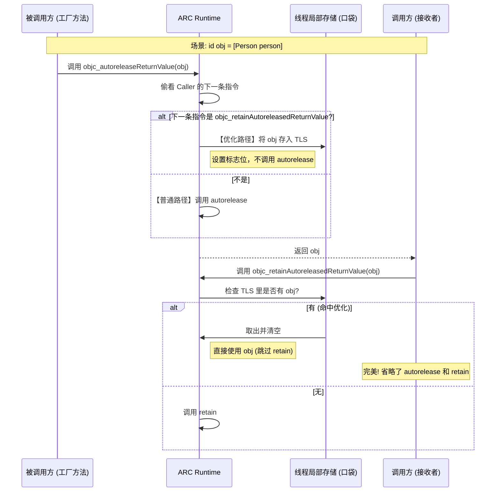

## 1. 核心概念：ARC 到底是什么？

**一句话定义：** ARC 是编译器（Clang）与运行时（Runtime）协作的结果。编译器在**编译阶段**通过静态分析代码上下文，自动在合适的位置插入引用计数管理代码（retain/release 等），并依靠 Runtime 进行部分动态优化。

> **🛑 面试避坑：** 不要说 ARC 是“垃圾回收（GC）”。GC 是运行时定时扫描内存，ARC 是编译时写死代码，更像是一个“自动写代码的机器人”。

***

## 2. 基础逻辑：\_\_strong 与作用域

这是 ARC 最基础的“肌肉记忆”。

### 编译器逻辑

- **对象创建/赋值：** 只要对象被赋值给 \_\_strong 变量（默认），编译器立即插入 objc\_retain。

- **变量覆盖：** 如果该变量被重新赋值，编译器先 retain 新值，再 release 旧值。

- **离开作用域：** 在大括号 } 结束前，编译器倒序对该作用域内的强引用变量插入 objc\_release。

### 🧠 辅助记忆：遛狗理论

- **Strong 变量** = **牵狗绳**。

- **对象** = **狗**。

- **逻辑**：

  - 你拿起绳子（赋值），必须抓紧（Retain）。

  - 你换一条狗牵（重新赋值），必须先抓紧新绳子，再松开旧绳子（Retain New -> Release Old）。

  - 你回家了（离开作用域），必须松开所有绳子（Release），狗跑了（Dealloc）。

***

## 3. 命名规则：Method Family (方法族)

编译器如何知道一个方法返回的对象需不需要它来释放？全看**名字**。

### 编译器逻辑

- **Own Group (拥有权组)**：方法名以 alloc, new, copy, mutableCopy 开头。

  - **逻辑**：编译器认为返回的对象引用计数已经是 +1。

  - **插入**：调用者**不**插入 retain，但在使用完后插入 release。
- **Non-Own Group (非拥有权组)**：其他普通方法（如 \[NSMutableArray array], \[person name]）。

  - **逻辑**：编译器认为返回的是“别人借给你的”（通常是 autoreleased）。

  - **插入**：调用者会先 objc\_retainAutoreleasedReturnValue（强引用住），用完后 release。

### 🧠 辅助记忆：CAMN 原则

记住四个单词的首字母：**C.A.M.N.** (Camel)

- **C**opy

- **A**lloc

- **M**utableCopy

- **N**ew

- **口诀**：**"骆驼（CAMN）带回来的东西归你管，其他的都是借的。"**

***

## 4. 核心优化：返回值优化 (RVO)

这是面试中的**加分项**，展示你懂 Runtime 优化。

### 传统痛点

方法 A 返回对象给 方法 B。

- A 内部：autorelease (为了防止返回后立即销毁)。

- B 接收：retain (为了持有它)。

- **结果**：多了一次无意义的 autorelease + retain，且增加了 AutoreleasePool 的负担。

### ARC 编译器逻辑 (TLS 优化)

利用 **TLS (Thread Local Storage)** 线程局部存储，建立“快速通道”。

- **被调用方 (Callee)**：

  - 不直接调 autorelease，而是调 objc\_autoreleaseReturnValue。

  - **检测**：它偷看一眼代码，如果发现调用方紧接着会 retain 这个对象，它就**不注册**到 Pool，而是把对象存入 TLS，并设置一个标志位。
- **调用方 (Caller)**：

  - 调用 objc\_retainAutoreleasedReturnValue。

  - **检测**：检查 TLS 里有没有那个对象。如果有，直接拿来用（引用计数不变），**跳过 Retain**。





### 🧠 辅助记忆：接力棒传递

- **普通模式**：你要把接力棒给队友，你先把棒子扔地上（AutoreleasePool），队友再捡起来（Retain）。效率低。

- **RVO 模式**：你直接把棒子塞到队友手里（TLS）。手递手，零落地。

### 补充部分:
####  4.1. 什么是 RVO (Return Value Optimization)?

在 C++ 中，RVO 指的是“返回值优化”，目的是减少对象拷贝。\
在 **Objective-C ARC** 的语境下，它特指 **Autorelease Elision（自动释放消除）**。

**它的核心目的只有一个：**\
免去“被调用方”做 autorelease 和“调用方”做 retain 这两个多余的动作，直接把对象的**所有权（Reference Count +1 的状态）**“手递手”交给对方。

***

####  4.2. 什么是 TLS (Thread Local Storage)?

**TLS (线程局部存储)** 可以理解为**每个线程私有的“小口袋”**。

- 全局变量是大家共享的，读写要加锁，慢。

- TLS 是线程自己的，只有当前线程能看到，存取非常快，不需要锁。

ARC 利用这个“小口袋”在两个方法之间**传递暗号**。

***

####  4.3. 全流程图解：它是如何工作的？

假设场景：方法 A (调用者 Caller) 调用了 \[Person person] 工厂方法 (被调用者 Callee)。

#### 没有优化的笨办法（慢）

- **工厂方法**：创建对象(alloc+1)，想返回，但怕没没人接手会泄漏，所以放入**自动释放池** (autorelease)。

- **调用者**：拿到对象，为了占为己有，赶紧**引用计数+1** (retain)。

- **结果**：池子要忙活，引用计数变来变去，最后结果其实没变（还是+1）。

#### ARC 的 RVO 优化（快）

ARC 编译器非常聪明，它生成代码时会加入特殊的 Runtime 函数。

**步骤一：被调用方 (工厂方法) 的“偷窥”**\
当 \[Person person] 准备返回对象时，它不直接调 autorelease，而是调 objc\_autoreleaseReturnValue(obj)。\
这个函数会**检查调用栈**（汇编层面的 Check）：

- “喂，我看一眼，调用我的那行代码后面，是不是紧接着写了 objc\_retainAutoreleasedReturnValue？”

**步骤二：传递暗号 (TLS)**

- **如果不是**：那就走老路，乖乖 autorelease。

- **如果是**：

  - **不注册**到自动释放池（省了耗时操作）。

  - **存入 TLS**：把它要返回的那个对象地址，塞进当前线程的 TLS 特定槽位里。

  - **返回对象**。

**步骤三：调用方的“接收”**\
调用方接收到对象后，编译器生成的代码是 objc\_retainAutoreleasedReturnValue(obj)。

- 它先检查 TLS：“口袋里有没有那个对象？”

- **如果有**：说明工厂方法已经把“+1 的所有权”留给我了。**我就不 Retain 了**（省了一次原子操作）。同时把 TLS 清空。

- **如果没有**：说明对方真的扔进池子了，那我就必须 Retain。

#### 辅助记忆：最生动的例子 —— “地下党接头”

为了方便记忆，你可以把这个过程想象成**特务传递情报**。

- **对象** = **情报文件**。

- **AutoreleasePool** = **公共信箱**（谁都能看，处理慢，还得去邮局）。

- **TLS** = **秘密死信箱**（比如公园长椅下面，只有你俩知道）。

**场景还原：**

- **特务 A (被调用者)** 拿到了情报。他准备把情报给 **特务 B (调用者)**。

- **特务 A 先观察 (Lookahead)**：他看了一眼接头地点，发现特务 B 就在门口等着拿情报 (代码里紧接着有 retain)。

- **特务 A 的决定**：

  - 既然 B 就在门口，我何必把情报扔进**公共信箱 (Autorelease)** 让他再去取呢？

  - 我直接把情报贴在**长椅下面 (TLS)**，然后给 B 使个眼色。

- **特务 B 的行动**：

  - 他收到信号，直接伸手去**长椅下面 (TLS)** 一摸。

  - 摸到了！他直接揣怀里带走。

  - **结果**：情报没有经过邮局（Pool），B 也没有去邮局填单子（Retain）。**无缝交接。**

***

## 5. 弱引用：\_\_weak 的实现

编译器本身不做引用计数操作，而是插入 Runtime 函数。

### 编译器逻辑

- **初始化**：id \_\_weak obj = target; -> 插入 objc\_initWeak(\&obj, target)。

- **销毁**：作用域结束 -> 插入 objc\_destroyWeak(\&obj)。

- **底层**：Runtime 维护一张全局 Hash 表（SideTable），以对象的地址为 Key，weak 指针列表为 Value。对象 dealloc 时，查表将所有 weak 指针置为 nil。

***

## 6. Block 的自动 Copy

ARC 对 Block 的态度非常“积极”。

### 编译器逻辑

- **现象**：只要 Block 被赋值给强引用变量或作为返回值。

- **插入**：编译器自动插入 \_Block\_copy（将 Block 从**栈**移到**堆**）。

- **捕获变量**：

  - 如果 Block 捕获了外部 \_\_strong 对象，Block 在堆上的结构体里会自动持有该对象。

  - 这解释了为什么 Block 容易产生循环引用（Block 持有 Self，Self 持有 Block）。

### 🧠 辅助记忆：拍立得照片

- Block 在栈上就像**取景框**里的画面，稍纵即逝。

- ARC 帮你按下**快门**（Copy），洗出一张**照片**（堆上的 Block），这样你就可以随身携带了。同时，照片里的人（捕获的对象）也被定格在里面了（被 Retain）。

***

## 7. 属性合成 (Property Synthesis)

当你写 @property 时，编译器为你生成了什么 Setter？

### 编译器逻辑 (Setter 方法)

对于 strong 属性：


```objc
- (void)setObj:(id)newObj {
    // 1. 并没有简单的 retain/release，而是调用优化函数
    objc_storeStrong(&_obj, newObj);
}
```

objc\_storeStrong 的内部逻辑极其严谨，防止多线程下的野指针和自我赋值：

- Retain 新值。

- 获取旧值。

- 存储新值。

- Release 旧值。

***

## 8. 桥接转换 (Toll-Free Bridging)

Core Foundation (CF) 与 Objective-C (OC) 的边界。

### 编译器逻辑

- \_\_bridge：**只给看不给摸**。不修改引用计数。

- \_\_bridge\_retained (或 CFBridgingRetain)：**送给你**。编译器插入 retain，OC 对象所有权转入 CF 侧，你需要手动 CFRelease。

- \_\_bridge\_transfer (或 CFBridgingRelease)：**拿回来**。编译器插入 release 抵消 CF 的引用，同时 ARC 接管并负责后续生命周期。

***

## 总结：面试“作弊”小抄

如果面试官问：“OC 的 ARC 编译器逻辑是什么？”，请按这个顺序回答，由浅入深：

- **总述**：是编译器静态分析 + Runtime 动态优化的结合。

- **基本原则**：根据 \_\_strong 修饰符，在对象生命周期开始和结束处自动插入 retain/release。

- **命名规范 (CAMN)**：依靠方法名（Alloc/New/Copy/MutableCopy）判断是否拥有对象，决定是否需要额外 Retain。

- **黑科技 (RVO)**：重点提到 objc\_autoreleaseReturnValue 和 TLS 优化，避免多余的 autorelease/retain 也就是“手递手传递”。

- **Block**：提到自动将栈 Block 拷贝到堆，以及对捕获变量的内存管理。

- **Dealloc**：编译器自动协助释放 Ivars 和调用 \[super dealloc]。