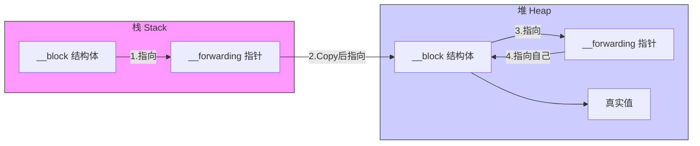

# 🚀 iOS 面试重难点：Block 底层全景与进阶指南 

## 1. 本质与定义：Block 是什么？

**核心定义：** Block 是一个 **OC 对象**，它封装了 **函数调用 (invoke)** 以及 **调用环境（捕获的上下文变量）**。

- **与函数指针的区别**：

  - **函数指针**：只是一串代码的内存地址。它是“裸奔”的逻辑，没有任何状态。

  - **Block**：是**闭包**。它不仅有代码，还带着“家当”（捕获的变量）。它有 isa 指针，遵循 Retain/Release 机制。

> 🍱 **辅助记忆：便当盒理论**
>
> - **函数指针**是餐馆菜单上的**菜名**（比如“宫保鸡丁”），谁点都一样，也没法带走。
>
> - **Block** 是一个**便当盒**。
>
>   - **饭菜** = invoke 函数指针（逻辑）。
>
>   - **配菜/餐具** = 捕获的变量（环境）。
>
>   - **便当盒本身** = 对象（有 isa，可以被传递、复制）。

***

## 2. 内存管理：ARC 与 MRC 的“代沟”

这是面试中展示你懂技术演进的关键点。

|   |   |   |
|---|---|---|
|特性|MRC (手动管理)|ARC (自动管理)|
|**栈 Block**|默认都在栈上。**极其危险**，作用域结束即销毁。|极少见。编译器会“拼命”把它搬到堆上。|
|**堆 Block**|必须显式调用 Block_copy 才能存活。|**自动触发 Copy**：1.赋值给 strong 变量; 2.作为返回值; 3.GCD/系统API参数。|
|**捕获对象**|栈 Block **不** Retain 对象。堆 Block **会** Retain。|只要 Block 被 Copy 到堆上，就会 Retain 捕获的对象。|
|**__block**|__block 对象**不会**被 Retain (类似于 weak)。|__block 对象**会**被 Retain (强引用，需注意循环引用)。|

***

## 3. 核心机制：捕获与修改 (Variable Capture)

### A. 捕获规则表

|   |   |   |
|---|---|---|
|变量类型|捕获方式|读写权限|底层逻辑|
|**局部变量 (auto)**|**值拷贝**|只读|存入 Block 结构体，是一份快照 (Snapshot)。|
|**静态变量 (static)**|**指针拷贝**|读写|存入变量地址，直接操作原内存。|
|**全局变量**|**不捕获**|读写|全局作用域，直接访问。|
|**__block 变量**|**引用拷贝**|读写|生成 byref 结构体，指针转发。|

### B. \_\_block 的魔法：Forwarding 指针

为什么 \_\_block 变量能跨栈/堆修改？\
编译器将变量包装成了 struct \_\_Block\_byref\_val\_0。




> 🥷 **辅助记忆：影分身之术**
>
> - \_\_block 变量就像鸣人。
>
> - Block copy 到堆上时，鸣人使出**影分身**（在堆上创建一个一模一样的结构体）。
>
> - 栈上的本体留下一张纸条（\_\_forwarding）：**“后续所有操作，请找我的分身。”**
>
> - 因此，无论你操作本体还是分身，最终都指向堆上的那个最新值。

***

## 4. 硬核底层：Block 的真实结构

这是**高级工程师**必须掌握的细节。


```objc
struct Block_layout {
    void *isa;  // _NSConcreteStackBlock / _NSConcreteMallocBlock
    int flags;  // 关键标识：是否有 copy/dispose helper? 是否有签名?
    int reserved;
    void (*invoke)(void *, ...); // 核心：代码实现的函数指针
    
    struct Block_descriptor {
        unsigned long int reserved;
        unsigned long int size;
        
        // 🌟 只有当 Block 捕获对象时，下面两个才存在
        void (*copy_helper)(void *dst, void *src);
        void (*dispose_helper)(void *src);
        
        const char *signature; // 方法签名 (用于 @encode)
    } *descriptor;
    
    // ⬇️ 捕获的变量追加在结构体末尾
    // int captured_a;
    // NSObject *captured_obj;
};
```

### 核心机制：Block 的四种“捕获”模式

首先要明确一个概念：**“捕获”的本质，就是 Block 这个小本本里，到底记下了外部变量的什么东西？** 是值？是地址？还是别的？

我们将四种变量类型比喻为四种不同的\*\*“物品传递方式”\*\*。

#### 4.1. 局部变量 (Local Auto Variable)

这是最常见的 int a = 10;。

- **现象**：Block 内部**只读**，且值是**定义时的快照**。

- **底层**：**值拷贝 (Pass by Value)**。

- **场景比喻：【拍照片】**

  - 你有一个苹果（变量 a）。

  - Block 像是一台**照相机**。定义 Block 的瞬间，它对着苹果拍了一张**照片**（存入 Block 结构体）。

  - **修改**：之后你把苹果咬了一口（a 变了），或者换成了梨。

  - **结果**：照片里的苹果还是完好无损的那个。而且你无法通过涂改照片来改变真实的苹果。


```objc
int a = 10;
void (^block)(void) = ^{
    // a = 20; // ❌ 报错！照片不能吃。
    NSLog(@"照片里是: %d", a);
};
a = 99; // 真实的 a 变了
block(); // 输出 10 (还是照片里的样子)
```

#### 4.2. 静态变量 (Static Variable)

带有 static 关键字的变量，如 static int b = 10;。

- **现象**：Block 内部**可读可写**，且修改会同步。

- **底层**：**指针拷贝 (Pass by Pointer)**。Block 存的是变量的**内存地址**。

- **场景比喻：【备用钥匙】**

  - 你有一间屋子（变量 b），里面放着钱。

  - Block 并没有把屋子搬走，而是拿了一把**备用钥匙**（地址指针）。

  - **修改**：你在 Block 里面用钥匙开门进去，把钱拿走了。

  - **结果**：外面的人再进屋，发现钱没了。


```objc
static int b = 10;
void (^block)(void) = ^{
    b = 20; // ✅ 可以改！我有钥匙。
    NSLog(@"屋子里是: %d", b);
};
b = 99; // 外部改了
block(); // 输出 20 (Block 进去改成了 20)
// 再次打印外部的 b，也是 20。
```

#### 4. 3. 全局变量 (Global Variable)

定义在函数外面的变量。

- **现象**：**可读可写**。

- **底层**：**不捕获**。直接访问。

- **场景比喻：【路灯】**

  - 全局变量就像路边的**路灯**。

  - 它就在那里，公共场所，谁都能看到，谁都能摸到。

  - Block 不需要把它装进包里，也不需要钥匙，直接抬头看就行。

***

#### 4.4. \_\_block 修饰的变量 (重点难点)

这是面试的大杀器。为什么加个 \_\_block 就能修改局部变量了？

- **现象**：**可读可写**，且能跨越堆栈限制。

- **底层**：**对象化（结构体化） + 引用转发**。

- **场景比喻：【影分身与传送门】**

这个机制比较复杂，我们分三步走来记忆：

### 第一步：变身（对象化）

当你写下 \_\_block int a = 10; 时，编译器在背后偷偷干了坏事。\
它不再把 a 当作一个简单的整数，而是生成了一个**结构体（对象）**。


```c
struct Block_byref_a {
    void *isa;
    struct Block_byref_a *forwarding; // 关键！
    int flags;
    int size;
    int a; // 真正的数值藏在这里
};
```

就像把一张轻飘飘的纸（int），装进了一个\*\*保险箱（结构体）\*\*里。

### 第二步：搬家（Copy 到堆）

Block 本身从栈 copy 到堆时，它会把这个“保险箱”也一起搬到堆上。

- **普通局部变量**：Block 只是拍了照片，原来的变量销毁了就销毁了，和照片无关。

- **\_\_block 变量**：为了让 Block 执行时还能找到这个变量，必须把这个变量从“临时区（栈）”搬到“永久区（堆）”。

### 第三步：传送门（Forwarding 指针）

这是最天才的设计。

- **问题**：搬家后，栈上有一个旧保险箱，堆上有一个新保险箱。如果你在 Block 外面改 a（改栈上的），Block 里面怎么知道？

- **解决**：**forwarding 指针**。

  - 起初（栈上）：保险箱的 forwarding 指向**自己**。

  - 搬家后（堆上）：

    - 堆上的新保险箱，forwarding 指向**自己**。

    - **重点来了**：栈上的旧保险箱，把 forwarding 指针修改了，指向**堆上的新保险箱**。

  - **结果**：无论你操作旧箱子还是新箱子，它们都会顺着 forwarding 指针，最终找到堆上那个唯一的真身进行修改。


```objc
__block int a = 10; 
// 此时 a 已经是个保险箱了，forwarding 指向自己

void (^block)(void) = ^{
    a = 20; // 顺着 forwarding 找到堆上的箱子，修改里面的数值
};
// Block copy 到了堆上，a 也搬到了堆上
// 栈上旧 a 的 forwarding 指向了 堆上新 a

a = 30; 
// 哪怕在 Block 外面改，也会顺着 forwarding 找到堆上的箱子修改
```

***

## 记忆总结表 (考前看一眼)

|   |   |   |   |
|---|---|---|---|
|变量类型|比喻|能否修改？|为什么？|
|**局部变量**|**照片**|❌ 否|只是瞬间的快照 (值拷贝)|
|**静态变量**|**备用钥匙**|✅ 能|拿着地址去原处改 (指针拷贝)|
|**全局变量**|**路灯**|✅ 能|大家都看得到 (不捕获)|
|**__block**|**传送门**|✅ 能|变成了结构体，利用 forwarding 指针始终指向堆上的真身|

### 为什么静态变量用指针，而局部变量要用 \_\_block 搞这么复杂？

这也是个好问题！

- **静态变量**存在“静态数据区”，程序结束才释放，所以 Block 只要拿个地址，随时去访问都安全。

- **局部变量**存在“栈”上，出了作用域就销毁了。如果 Block 只是拿个地址（指针），等 Block 真正执行时，那个栈地址里的数据早就没了（变成野指针）。所以必须把局部变量\*\*“升维”\*\*成对象，搬到堆上去养着。

### 关键字段解析 (加分项)

- **copy\_helper** (搬运工):

  - 当 Block 从栈 Copy 到堆时调用。

  - **作用**：它负责对捕获的外部对象进行 retain 操作（或者 Block\_copy 捕获的 Block）。
- **dispose\_helper** (清洁工):

  - 当堆上的 Block 引用计数归零要销毁时调用。

  - **作用**：它负责对捕获的对象进行 release。
- **signature**:

  - 存储方法的类型签名。系统利用它来实现 NSInvocation 调用 Block。

***

## 5. 循环引用与破局 (Retain Cycle)

### 经典场景

Self -> Block -> Self。

### 解决方案：Strong-Weak Dance


```objc
__weak typeof(self) weakSelf = self; // 1. 弱引用打破闭环
self.block = ^{
    __strong typeof(weakSelf) strongSelf = weakSelf; // 2. 强引用保活
    if (!strongSelf) return; // 3. 判空
    
    [strongSelf doSomething]; 
};
```

### 深度追问

- **问：为什么要内部 strongSelf？**

  - **答**：weakSelf 并不持有对象。如果在 Block 执行期间（特别是多线程或耗时操作），外部对象被释放了，weakSelf 会瞬间变成 nil，导致逻辑中断甚至 Crash。strongSelf 保证了**在 Block 运行的这几毫秒内，对象必须活着**。
- **问：捕获 \_\_unsafe\_unretained 会怎样？**

  - **答**：**极度危险**。它不 Retain 也不自动置 nil。对象释放后，它变成**野指针**，访问即 Crash。仅用于极高性能要求且确信对象不会释放的场景。

***

## 6. 进阶：Block 性能优化与特殊场景

### A. 性能优化 (Performance)

- **减少捕获**：

  - Block 捕获的变量越多，结构体越大，Copy 时的开销越大。

  - **策略**：能用全局变量、静态变量解决的，就不要捕获局部变量。
- **避免频繁 Copy**：

  - 虽然 ARC 自动 Copy 很方便，但在高频调用的循环中，尽量复用 Block，不要每次都创建新的 Block 对象。

### B. GCD 与 Block

- GCD 的 API（如 dispatch\_async）会自动将传入的 Block 执行 Copy 操作，确保 Block 在后台线程执行时不会因为栈帧销毁而消失。

- **注意**：GCD 内部持有 Block，Block 持有 Self。如果 Self 持有 GCD 队列，依然会循环引用！

### C. Block 释放时机

- **常规**：Block 引用计数为 0 时销毁。

- **Autorelease**：如果 Block 内部创建了 autoreleased 对象，这些对象取决于当前线程的 RunLoop 或最近的 @autoreleasepool。在 GCD 异步队列中，建议手动包裹 @autoreleasepool 以降低内存峰值。

***

## 7. 面试“必杀技”总结 (Cheat Sheet)

如果面试官问：“请谈谈你对 Block 的理解”，按这个剧本走：

- **定义**：它是封装了函数调用和环境的 OC 对象。

- **类型**：重点讲**栈**到**堆**的变迁，以及 ARC 是如何自动帮你 Copy 的。

- **捕获机制**：

  - 普通变量是值拷贝（快照）。

  - \_\_block 是引用拷贝（Forwarding 指针实现栈堆同步）。

- **底层原理 (亮点)**：

  - 提到 Block\_layout 结构体。

  - 重点提到 copy\_helper 和 dispose\_helper，说明你懂 Block 是如何管理捕获对象的内存的（Copy 时 Retain，Dispose 时 Release）。

- **循环引用**：

  - 解释 weak-strong dance 的必要性（打破闭环 + 执行期保活）。

- **差异**：

  - 提一句 MRC 下 \_\_block 不 retain 对象，而 ARC 下会，体现你对历史包袱的了解。