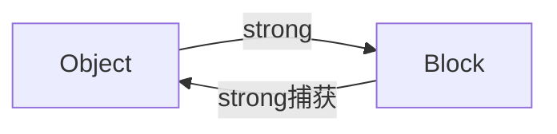

## 1. Block 的本质

Block 本质上是一个 **Objective-C 对象**，它内部也有 `isa` 指针。
编译器会将 Block 语法转化为 `__main_block_impl_0` 结构体。

```c
struct __block_impl {
    void *isa;
    int Flags;
    int Reserved;
    void *FuncPtr; // 指向 Block 内部逻辑的代码块地址
};

struct __main_block_impl_0 {
    struct __block_impl impl;
    struct __main_block_desc_0* Desc;
    // captured variables... (捕获的变量紧跟其后)
};
```


## 2. 变量捕获机制 (Capture)

|   |   |   |
|---|---|---|
|变量类型|捕获方式|访问权限|
|局部变量 (auto)|**值拷贝**|只读|
|局部静态变量 (static)|**指针拷贝**|读写|
|全局变量|**不捕获** (直接访问)|读写|
|__block 变量|**引用拷贝** (详见下文)|读写|

## 3. \_\_block 原理

为什么加了 \_\_block 就能修改局部变量？

### 3.1 结构体包装

编译器会将 \_\_block int a = 10; 包装成一个对象结构体：

```cpp
struct __Block_byref_a_0 {
    void *__isa;
    struct __Block_byref_a_0 *__forwarding; // 关键指针
    int __flags;
    int __size;
    int a; // 真实的值
};
```


### 3.2 forwarding 指针的作用

- **在栈上时**：\_\_forwarding 指向自己。

- **Copy 到堆后**：

  - Block 发生 copy 时，捕获的 \_\_block 变量也会被 copy 到堆上。

  - **栈上**结构体的 \_\_forwarding 指向 **堆上**的结构体。

  - **堆上**结构体的 \_\_forwarding 指向 **自己**。

- **修改值时**：

  - 代码通过 a->\_\_forwarding->a = 20 进行修改。

  - 无论此时通过栈上的指针还是堆上的指针访问，最终修改的都是堆上的那份数据，保证了数据一致性。

## 4. Block 的类型

- **NSGlobalBlock**：没有捕获外部变量（或只捕获全局变量）。位于数据段。

- **NSStackBlock**：捕获了外部变量，但未进行 copy。位于栈内存（iOS ARC 下很少见，编译器通常会自动 copy）。

- **NSMallocBlock**：StackBlock 经过 copy 操作后。位于堆内存，引用计数由 Runtime 管理。


## Block 循环引用：成因与解决方案



- 对象持有 Block 属性（strong）。

- Block 内部使用 self，默认对捕获的对象进行强引用（retain）。

- 双方互相等待对方释放，导致内存泄漏。

## 2. 解决方案：Weak-Strong Dance

### 2.1 标准写法

```Objc
__weak typeof(self) weakSelf = self; // 1. 打破环
self.block = ^{
    __strong typeof(weakSelf) strongSelf = weakSelf; // 2. 延长生命周期
    
    if (!strongSelf) return; // 3. 判空保护
    
    [strongSelf doSomething];
    // strongSelf 在这里出了作用域，自动释放
};
```

### 2.2 为什么需要 \_\_strong？

如果在 Block 执行期间，外部的 self 被释放了（例如多线程环境下），weakSelf 会自动变为 nil。

- 如果没有 strongSelf：代码执行到一半 self 没了，可能导致逻辑错误或 Crash。

- 有了 strongSelf：Block 执行期间强引用 self，保证 Block 执行完之前对象不销毁。Block 执行完后 strongSelf 销毁，引用计数 -1，对象得以正常释放。

## 3. 检测工具

- **静态分析**：Xcode -> Product -> Analyze (Shift+Cmd+B)。

- **运行时检测**：Instruments -> Leaks。

- **可视化工具**：Xcode Memory Graph Debugger。