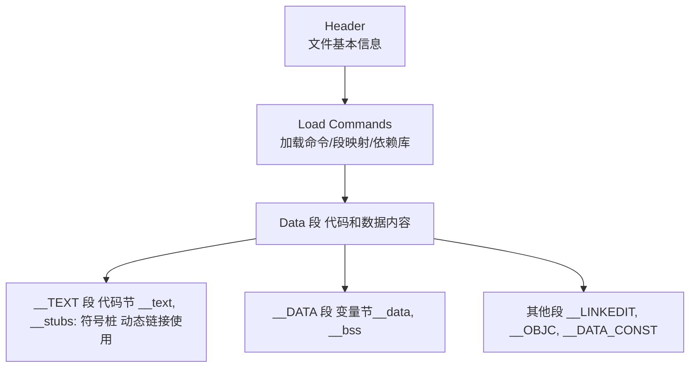
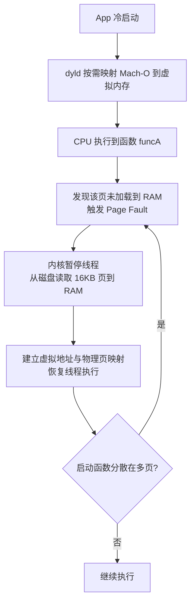
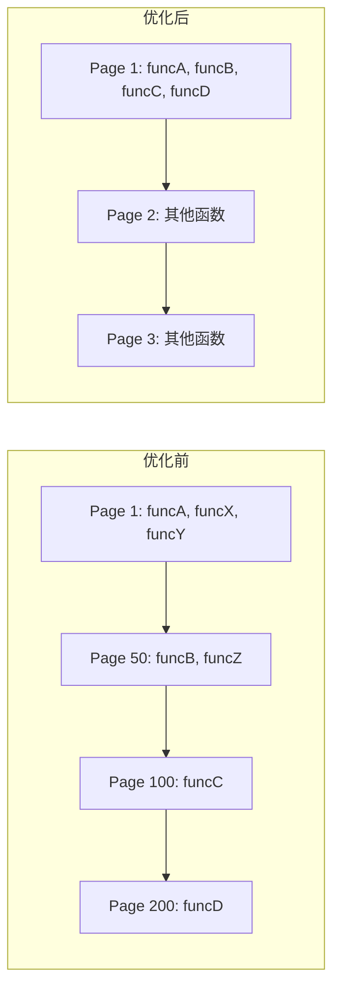
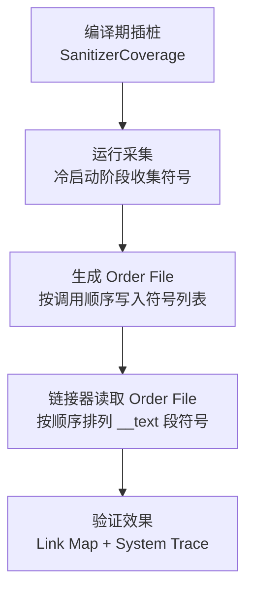

## 1. Mach-O 是什么？

### 1.1 定义

- **Mach-O**（Mach Object）是 macOS 和 iOS 系统上的可执行文件、动态库、目标文件等的二进制格式。
- 你的 Objective-C / Swift / C++ 代码经过编译器编译，最终生成的就是 Mach-O 格式文件。

### 1.2 不只是 App 的可执行文件

Mach-O 格式包含多种类型：

- **Executable**：应用的可执行文件（`.app` 根目录）。
- **Dylib**：动态库（如 `UIKit.framework`）。
- **Bundle**：不可直接链接的动态库（通常存资源）。
- **Object**：`.o` 文件（编译过程中的中间产物）。
- **dSYM**：符号表文件（用于 Crash 分析）。

💡 **面试比喻**：Mach-O 就像一个 **集装箱**，不管里面装的是汽车（App）、配件（Dylib）还是说明书（dSYM），外壳标准都是一样的，方便系统（港口吊车）装卸和运输。

***

## 2. Mach-O 结构（解剖）

Mach-O 文件结构非常像一个“三明治”，主要由三部分组成：

### 2.1 Header（头部）——“身份证”

- 位于文件最开头。
- 作用：告诉系统这个文件的基本属性。
- 包含信息：
  - Magic Number（区分 32/64 位、字节序）。
  - CPU 架构（arm64 / x86\_64）。
  - 文件类型（可执行文件 / 动态库 / 对象文件）。
  - Load Commands 数量。

***

### 2.2 Load Commands（加载命令）——“施工图纸/目录”

- 紧跟在 Header 后面。
- 作用：告诉操作系统如何加载后面的数据。
- 常见命令：
  - `LC_SEGMENT_64`：映射数据段到内存。
  - `LC_LOAD_DYLIB`：加载依赖的动态库。
  - `LC_MAIN`：程序入口地址。
  - `LC_SYMTAB`：符号表位置。
  - `LC_FUNCTION_STARTS`：函数起始地址表。
  - `LC_CODE_SIGNATURE`：代码签名信息。

***

### 2.3 Data（数据段）——“真正的货物”

- 存放具体的代码和数据。
- 划分为多个 Segment（段），每个段包含多个 Section（节）。
- 核心段：
  - `__TEXT` 段（代码段）：
    - 只读、可执行。
    - `__text` 节：机器码。
    - `__stubs` 节：符号桩（动态链接用）。
  - `__DATA` 段（数据段）：
    - 可读写。
    - `__data` 节：初始化的全局变量。
    - `__bss` 节：未初始化的全局变量。
  - 其他段：
    - `__LINKEDIT`：符号表、字符串表、重定位信息。
    - `__OBJC`：Objective-C 运行时元数据。
    - `__DATA_CONST`：只读数据。
    - `__DATA_DIRTY`：可写数据。

***

### 2.4 Mermaid 图示：Mach-O 三大结构关系



## 3. 工具篇：如何查看 Mach-O？

- **MachOView**：可视化工具，查看 Header、Load Commands、Segment/Section。
- **otool**：
  - 查看依赖库：`otool -L MyApp`
  - 查看汇编代码：`otool -tV MyApp`
- **nm**：查看符号表。
- **dyldinfo**：查看动态链接信息。
- **strings**：提取可见字符串。
- **lldb image list**：运行时查看已加载的 Mach-O 文件。
- **objdump**：反汇编 Mach-O。

***

## 4. Mach-O 的优化应用

### 4.1 无侵入组件注册（替代 +load）

利用 Mach-O 的 `__DATA` 段自定义 Section 存储注册信息，启动时直接读取，避免执行耗时代码。
```objc
// 定义宏：写入自定义 Section
#define REGISTER_MODULE(name) \
    char * k##name##_mod __attribute__((used, section("__DATA,MyMods"))) = #name;

// 使用
REGISTER_MODULE(OrderModule)
REGISTER_MODULE(UserModule)

// 运行时读取
void readModules() {
    #include <mach-o/getsect.h>
    #include <mach-o/dyld.h>
    const struct mach_header_64 *mhp = _dyld_get_image_header(0);
    unsigned long size = 0;
    char *ptr = (char *)getsectdatafromheader_64(mhp, "__DATA", "MyMods", &size);
    // 遍历 ptr 获取所有注册模块
}
```

### 4.2 二进制重排（Binary Reordering）

- 调整 `__TEXT,__text` 节内符号顺序，将启动函数紧凑排列，减少 Page Fault。
- 结合 Clang SanitizerCoverage 插桩采集启动函数，生成 `.order` 文件指导链接器重排。

#### Mermaid 图 1：启动时 Page Fault 触发流程


#### Mermaid 图 2：`__TEXT,__text` 段符号布局对比


#### Mermaid 图 3：二进制重排技术流程


***

### 4.3 符号隐藏（Symbol Hiding）

- 使用 `-fvisibility=hidden` 或链接器选项减少符号表大小，提高加载速度。

***

### 4.4 Lazy Binding 优化

- Mach-O 的符号绑定分为 lazy 和 non-lazy。
- 减少非必要的 non-lazy 绑定可加快启动。

***

## 5. 面试话术 + 进阶追问预案

**基础回答**：

> Mach-O 是 iOS/macOS 的二进制文件格式，不仅包括 App 可执行文件，还包括动态库、dSYM 等。 它由 Header（文件信息）、Load Commands（加载命令）、Data 段（代码和数据）组成。 在开发中，我们可以利用 Mach-O 的结构做启动优化，比如自定义 Section 存储组件注册信息，替代 +load 方法，或者通过二进制重排减少启动 Page Fault。

**进阶追问**：

- **多架构支持**：Fat Binary，在文件头包含多个架构的 Mach-O。
- **运行时读取 Section**：`_dyld_get_image_header` + `getsectdatafromheader_64`。
- **符号绑定机制**：`__stubs` 节 + `__la_symbol_ptr` 节，dyld 在运行时解析符号地址。

***

## 6. 常见坑点总结

- **符号名处理**：OC 方法 `_` 前缀、Swift mangling、Block 符号。
- **多架构 Mach-O**：注意 Fat Header。
- **代码签名**：修改 Mach-O 会破坏签名，需重新签名。
- **LTO 优化**：可能导致符号消失，影响二进制重排。

***

✅ 这样升级版的好处：

1. **结构更全**：定义、结构、工具、优化、面试话术、坑点全覆盖。
2. **可视化**：Mermaid 图让结构一目了然。
3. **面试应对**：基础回答 + 进阶追问预案，适应不同深度的面试官。

## 7 辅助记忆

**Mach-O 文件 = 一个刚买回来的“宜家（IKEA）家具包裹”**

App 的运行过程，就是系统（装修师傅）把这个包裹拆开，照着说明书，把你买的“柜子”在房间（内存）里组装起来的过程。

***

### 一、 极速理解：Mach-O 的“三明治”结构

这就是那个包裹里的三样东西，我们一一对应：

#### 1. Header（头部）= 【外包装标签】

- **场景：** 装修师傅（系统）拿到包裹，第一眼看什么？看标签。

- **内容：**

  - 这家具是给谁用的？（CPU 架构：arm64 还是 x86？）

  - 这是个衣柜还是个台灯？（文件类型：是 App 可执行文件，还是 Dylib 动态库？）

- **记忆点：** 如果标签不对（比如架构不匹配），师傅直接把包裹退回，**App 闪退/无法安装**。

#### 2. Load Commands（加载命令）= 【组装说明书】

- **场景：** 师傅确认包裹没拿错后，打开箱子，拿出了一张纸。这张纸**最关键**，它指挥师傅干活。

- **内容：**

  - “请把那块最大的木板（代码段）放在房间的左边（内存地址 A）。”

  - “请去仓库拿一些螺丝钉（依赖的系统库 UIKit）过来。”

  - “组装完后，请从这颗红色按钮开始启动（Main 函数入口）。”

- **记忆点：** 它是**目录和指挥官**，告诉系统怎么把文件映射到内存里。

#### 3. Data（数据段）= 【家具板材和配件】

- **场景：** 说明书看完了，剩下箱子里的一堆实物，就是 Data。这里分两类，非常关键：

  - **`__TEXT` 段（代码段） = 【实木板材】**

    - **特点：** **只读（Read-Only）**。

    - **解释：** 厂家切好的木板，你能把它锯断或者拉长吗？不能。

    - **对应：** 你的代码逻辑（`if/else`）、函数指令。App 运行期间，这些代码是**绝对不能被修改**的。
  - **`__DATA` 段（数据段） = 【抽屉/收纳盒】**

    - **特点：** **可读写（Read-Write）**。

    - **解释：** 柜子装好了，抽屉是空的，你可以往里面放袜子，也可以放书，随你变。

    - **对应：** 全局变量、静态变量。这些数据在 App 运行过程中是**可以发生变化**的。

***

### 二、 为什么这个理解对面试有用？（串联考点）

用这个比喻，你可以轻松回答以下面试难题：

**Q1: 为什么 Mach-O 分为 `__TEXT` 和 `__DATA` 两段？**

> **秒答：** 就像家具，**实木板材（代码）** 是出厂定型的，不能改，改了就坏了（安全保护）；而 **抽屉（数据）** 就是用来存取东西的，必须能读写。系统利用这种权限分离来保证 App 的安全。

**Q2: 那个“无侵入组件注册”（Mach-O 注入）是怎么回事？**

> **秒答：** 就像我在宜家出厂时，偷偷在 **抽屉（`__DATA` 段）** 里塞了一张小纸条（注册信息）。等家具组装好后，我不用把柜子拆了（执行代码），直接拉开抽屉就能看到这张纸条，知道有哪些组件了。

**Q3: 什么是 ASLR（地址空间布局随机化）？**

> **秒答：** 以前说明书说“柜子必须放在房间坐标 (0,0)”。现在的系统为了安全，每次组装时，说明书会说“在 (0,0) 的基础上，随机往右移 500 米”。黑客想攻击你，但找不到你的柜子在哪了。

***

### 三、 面试话术（人话版）

如果面试官让你讲 Mach-O，你不要背定义，直接这样说：

> “我是这样理解 Mach-O 的，它就像一个**App 的安装包结构标准**。
>
> 我们可以把它想象成一个**三明治**：
>
> 1. **最外面是 Header**：像身份证一样，告诉系统这个包是 arm64 的还是 x86 的。
>
> 2. **中间是 Load Commands**：这是**最核心的**，像说明书。它告诉系统怎么把文件里的数据加载到内存里，比如哪里是代码，哪里是数据。
>
> 3. **最里面是 Data**：就是真正的干货。这里面又主要分两块：
>
>    - 一块是 **`__TEXT`**，放代码的，是**只读**的（像写死的书）。
>
>    - 一块是 **`__DATA`**，放全局变量的，是**可读写**的（像草稿纸）。
>
> 我们平时做的**启动优化（二进制重排）**，其实就是调整这个三明治里的肉（代码）的排列顺序；而**组件化注册**，就是往那个草稿纸（`__DATA`）里预先写点东西。”

**LJRouter 的核心黑科技正是利用了我们刚才讲的 Mach-O 原理。**

具体来说，它利用的就是我之前提到的 **“去除 `+load` 方案”** 中的 **Mach-O Section 注入技术**。

为了让你面试时能把这两者**无缝结合**，形成一个高大上的知识闭环，我为你设计了一套\*\*“理论+实战”\*\*的记忆逻辑和描述话术。

***

### 一、 核心连接点：哪里用了 Mach-O？

请把目光锁定在 LJRouter 文档的 **“第 2 点：注册机制”**。

- **理论（之前讲的）：** 我们说要把 `+load` 里的代码去掉，改成在编译期把数据写入 Mach-O 的 `__DATA` 段。

- **实战（LJRouter）：**

  - **怎么写？** 它使用了宏 `LJRouterRegistAction`。这个宏底层就是 `__attribute__((section("__DATA, __LJRouterUseINF")))`。这不就是把路由信息（URL、类名）刻在“砖头”上吗？

  - **怎么读？** 它在启动时使用了 `_dyld_get_image_header` 和 `getsectiondata`。这不就是装修好了直接去读“砖头”上的字吗？

**结论：LJRouter 就是 Mach-O Section 注入技术的最佳教科书级应用。**

***

### 二、 生动记忆法：餐厅的点菜系统 🍽️

为了把 **Mach-O 原理** 和 **LJRouter** 结合记忆，我们用\*\*“餐厅点菜”\*\*来比喻。

#### 1. 传统路由（基于 `+load` 或手动注册）

> **场景：** 餐厅刚开门（App 启动）。 **混乱：** 所有的厨师（业务模块）都冲进大厅，每个人都大喊一声：“我会做宫保鸡丁！”“我会做番茄炒蛋！” **后果：** 大厅吵死了，开门营业非常慢（启动耗时高，执行了大量代码）。

#### 2. LJRouter（基于 Mach-O 注入）

> **场景：** 餐厅还没开门（编译期）。 **写菜单（注入）：** 厨师们不说话，而是把自己的拿手菜默默写在了一本\*\*“秘密菜单”\*\*（Mach-O 的 `__DATA` 段）上。 **开门营业（启动）：** 经理（Router）走进大厅，不用任何人说话，直接拿起这本菜单一看，就知道谁会做什么菜了。 **后果：** 鸦雀无声，极速开业（启动 0 耗时，只读取数据，不执行代码）。

***

### 三、 面试“王炸”描述模板

当面试官问到：**“讲讲你的组件化/路由方案”** 或者 **“有没有做过底层优化？”** 时，你可以直接把这两个知识点串起来，通过 LJRouter 落地 Mach-O 原理。

**请背诵以下逻辑（由浅入深）：**

#### 第一层：抛出方案（LJRouter）

> “我们在项目中使用了自研的 **LJRouter** 进行组件解耦。相比于传统的 URL Router，它最大的特点是利用了 **Mach-O 技术** 实现了**分布式注册**，彻底解决了 `+load` 方法拖慢启动速度的问题。”

#### 第二层：原理解析（Mach-O Section 注入）

> “具体的原理是这样的： 传统路由需要在 `+load` 里执行注册代码，这会消耗 CPU。 而 LJRouter 利用了 **Clang 的 Attributes 特性**。我们在编译时期，直接将路由的 Key 和 Target 信息，写入到 Mach-O 二进制文件的 **`__DATA` 段** 下一个自定义的 Section 里（比如叫 `__LJRouterUseINF`）。 这就像是把路由表‘硬编码’进了二进制文件里。”

#### 第三层：运行时落地（结合 dyld）

> “当 App 启动时，我们不需要运行任何注册代码。Router 单例初始化时，会利用 **dyld** 的接口（如 `getsectiondata`），直接从二进制内存中读取这个 Section 的数据，转换成结构体数组映射到内存里。
>
> 这样做到了**零代码执行注册**，无论模块有多少，启动耗时几乎都是常数级的。这也正是利用了 Mach-O 文件结构特性带来的性能红利。”

#### 第四层：锦上添花（其他亮点）

> “除了这个底层优化，LJRouter 还支持**参数的自动类型转换**和**双中心查找**（Page 和 Action 分离），既保证了类似原生调用的类型安全，又保留了 URL 调用的灵活性。”

| **知识点**                     | **对应关系**                      | **记忆口诀**          |
| --------------------------- | ----------------------------- | ----------------- |
| **LJRouter 注册**             | **Mach-O Section 注入**         | **编译期刻碑，运行时拓印**   |
| **宏定义 `LJRouterRegist...`** | `__attribute__((section...))` | **把名字写进“秘密菜单”**   |
| **启动加载 `loadAndCheck`**     | `getsectiondata`              | **经理直接看菜单，不用厨师喊** |
| **收益**                      | **去除了 `+load`，启动提速**          | **开门时不吵闹，瞬间营业**   |