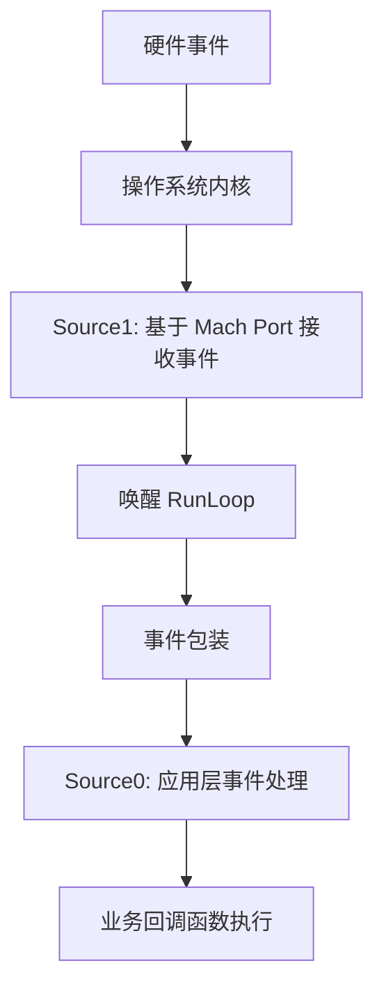
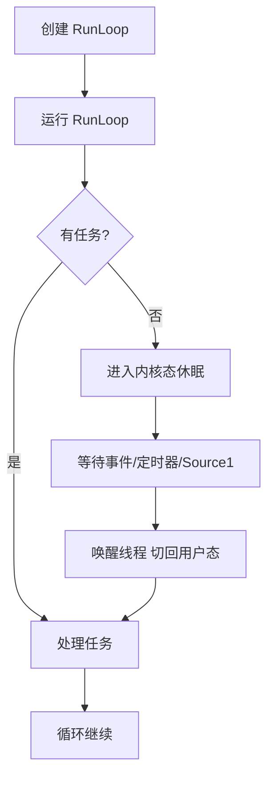
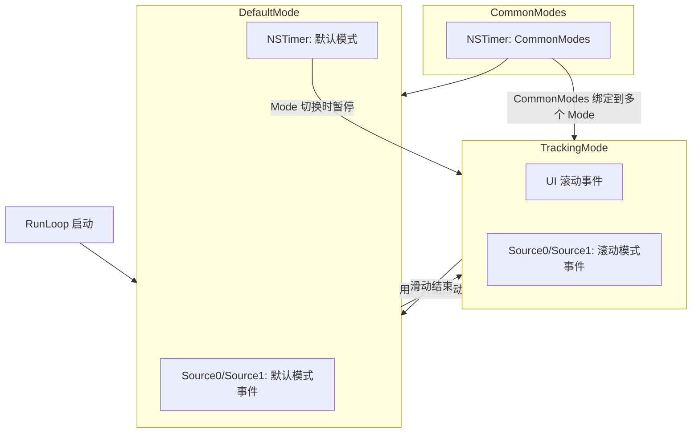
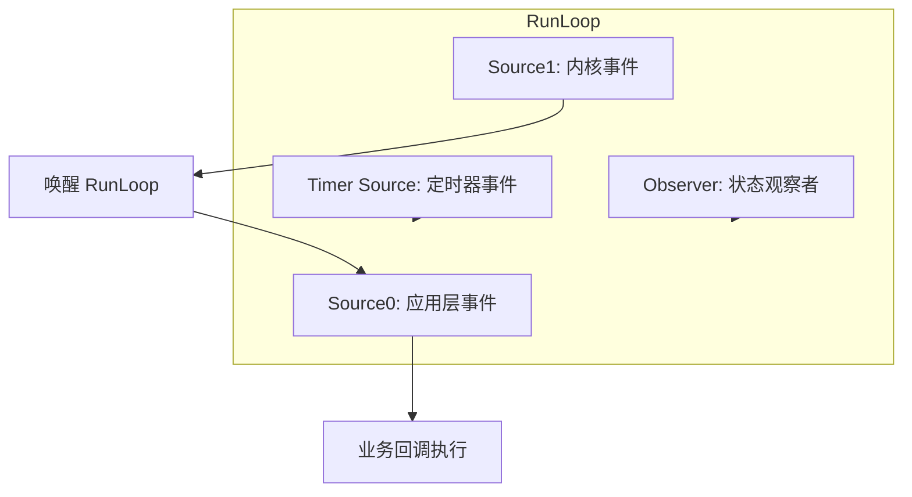

iOS 中 RunLoop 的核心知识点如下：
# 🏭 iOS 内核之心：RunLoop 的终极解密

**—— 从源码架构到生活化隐喻**

在 iOS 面试和底层开发中，RunLoop 往往被视为最抽象的概念之一。很多人知道它是一个“死循环”，但不知道它为什么死而不僵，为什么能闲而不废。

本质上，RunLoop 是操作系统为了让线程 **“有事干活，没事休眠”** 而设计的一套事件驱动机制。

为了彻底读懂它，我们将它想象成一位极度自律、高效的\*\*“私人管家”**（我们叫他 Loop），而你（线程）就是他的**“大老板”\*\*。

***

### 一、 雇佣法则：管家与雇主的关系 (新增核心章节)

**底层对应：** CFDictionary (Global) & TSD (Thread Specific Data)

很多开发者误以为“只要是个线程就有 RunLoop”，这是大错特错的。管家 Loop 与老板 Thread 虽然是 **1对1** 的关系，但他们的雇佣合同非常特殊。

#### 1. 只有 CEO 配备了专职管家

- **主线程 (CEO)**：App 一启动，系统（UIApplicationMain）就会自动为 CEO 聘用并启动一位管家。所以主线程的 RunLoop 天生存在且一直在运行。

- **子线程 (临时工)**：默认情况下，**子线程是没有管家的**。

#### 2. 懒加载：按需聘用

子线程的管家遵循 **“懒加载”** 原则。

- 如果你（子线程）不主动喊一句“给我个管家”（调用 \[NSRunLoop currentRunLoop]），系统绝不会给你分配。

- 一旦你喊了，系统会去全局的 **“花名册”**（全局字典 CFDictionary）里查，查不到就立马造一个给你，并登记在册。

#### 3. 陷阱：僵尸管家

即使你把管家喊来了，如果你不给他安排活（添加 Source/Timer），也不命令他开始工作（调用 run），他会立刻下班（函数返回，线程结束）。\
**正确姿势**：addPort (给个活) -> run (开始干)。

#### 4. 销毁机制：离职清单 (TSD)

这是最底层的秘密：**子线程销毁了，管家去哪了？**\
系统利用了 **TSD (线程私有数据)** 技术，给每个有管家的线程挂了一个“离职钩子”（析构回调）。

- 当子线程执行完任务即将销毁（Thread Exit）时。

- 系统自动触发这个钩子函数（\_\_CFFinalizeRunLoop）。

- 钩子函数会把管家从全局“花名册”中除名，并释放内存。

- **结论**：管家与老板生死与共，老板走人，管家自动解聘，不会内存泄漏。

***

### 二、 静态架构：管家的办公桌

**底层对应：** struct \_\_CFRunLoop & struct \_\_CFRunLoopMode

管家 Loop 并不是把所有活都混在一起干，他有严格的\*\*“车间管理制度”\*\*。

#### 1. 模式 (Mode)：严格隔离的车间

管家 Loop 同一时间只能身处一个车间。这在底层对应 \_currentMode。

- **Default Mode (日常车间)**：这是管家平时待的地方。处理普通的点击、网络回调。

- **Tracking Mode (滑动车间)**：这是专门为“手指滑动屏幕”设计的 VIP 车间。

- **隔离机制**：当管家走进 Tracking 车间 时，物理上根本看不到 Default 车间 里的任务。

  - 这就是为什么你在滑动列表时，普通的 NSTimer 会暂停。因为管家换了车间，听不到那边的闹钟响。

#### 2. CommonModes：VIP 通行证

你可能会问：“我有重要的任务，想让管家在哪个车间都能看见，怎么办？”\
这就是 **CommonModes**。

- 它不是一个具体的车间，而是一张 **“全通告贴纸”**。

- 只要你把任务（比如一个 Timer）标记为 Common，RunLoop 会自动把它复印多份，粘贴到 Default 和 Tracking 等所有“通用车间”里。

***

### 三、 输入源：沟通的艺术

**底层对应：** Source0 vs Source1

这是 RunLoop 接收任务的两种渠道，理解它们的区别是理解 RunLoop 运转的关键。

#### 📝 Source0：写信（被动、应用层）

- **比喻**：“桌子上的便签条”。

- **来源**：App 内部事件（如 UIEvent、performSelector）。

- **流程**：

  - **写信 (Signal)**：你在桌上贴个条子，写着“去刷新一下 UI”。

  - **叫醒 (WakeUp)**：**关键一步！** 如果管家正在睡觉，他看不见桌子上的变化。你必须拍拍他的肩膀（调用 CFRunLoopWakeUp）把他摇醒。

  - **处理**：管家醒来，看到条子，执行任务，撕掉条子。

#### ☎️ Source1：红色电话（主动、内核层）

- **比喻**：“直通内核的红色专线”。

- **来源**：系统内核事件（如屏幕触摸硬件中断、系统锁屏通知）。

- **流程**：

  - **电话响了 (Port Message)**：内核直接拨通了管家桌上的 Mach Port 端口。

  - **自动惊醒**：电话铃声极大，管家不需要别人叫，瞬间就被吓醒了。

  - **接听**：直接处理消息。

***

### 四、 动态逻辑：管家的一天 (The Cycle)

**底层对应：** \_\_CFRunLoopRun 内部循环

这是 RunLoop 最迷人的地方：它如何通过休眠来省电？ 让我们看看管家的日程表：

**✅ 上午：疯狂干活**

- **Notify Observer (Entry)**：广播“我要开工了！”（AutoreleasePool 创建）。

- **Check Source0**：先看桌子上有没有便签条？有就赶紧干掉。

- **Check Source1**：瞥一眼红色电话有没有在响？

  - 如果有：直接去接电话，不睡了。

  - 如果没响：继续往下走。

- **Check Main Queue**：问问 GCD 主队列那边有没有货？

**😴 中午：深度休眠 (关键)**\
5. **Notify Observer (BeforeWaiting)**：广播“没事干了，我睡会儿”。\
\* 此时，AutoreleasePool 会执行 Pop 和 Push，倒掉这一上午制造的内存垃圾。\
6. **Sleep (Trap into Kernel)**：调用 mach\_msg。\
\* **真相**：这不仅仅是闭眼，而是**灵魂出窍**。管家所在的线程被操作系统挂起，CPU 资源完全释放，不再消耗任何电量。\
7. **等待**：只有 ☎️红色电话响了、⏰闹钟响了、或有人拍肩膀 (WakeUp)，他才会醒。

**⚡ 下午：被叫醒**\
8. **Notify Observer (AfterWaiting)**：广播“我醒了！”。\
9. **Handle Events**：看看到底是谁把我叫醒的？\
\* 是闹钟？执行 Timer。\
\* 是电话？处理 Source1。\
\* 是 GCD？执行 Block。\
10. **Loop**：回到第 2 步，开始新的一圈。

***

### 五、 深度考点：实战中的 RunLoop

理解了上述原理，面试中的难题将迎刃而解。

**1. 为什么滑动列表时 Timer 会停？**

- **原因**：滑动时，RunLoop 切换到了 TrackingMode 车间。你的 Timer 留在了 DefaultMode 车间，管家看不见。

- **解法**：把 Timer 加入 NSRunLoopCommonModes，让管家把 Timer 复印一份贴到 TrackingMode 车间里。

**2. 为什么在 viewDidLoad 里做大循环要手动加 AutoreleasePool？**

- **原因**：viewDidLoad 只是 RunLoop 一圈中的一个小环节（通常是 Source0 处理的一部分）。

- **后果**：如果不手动加，循环中产生的数万个临时对象，必须等到 RunLoop 这一整圈跑完、准备睡觉（BeforeWaiting）时，才会统一销毁。内存峰值会瞬间飙升。

**3. GCD 也是 Source 吗？**

- **真相**：子线程的 GCD 不依赖 RunLoop。但 **Main Queue（主队列）** 是特例。

- RunLoop 在睡觉前，专门有一个“后门”去检查主队列的任务（\_dispatch\_main\_queue\_callback\_4CF）。这也是为什么主线程的任务能被 RunLoop 调度的原因。

***

### 六、 总结

RunLoop 并不是一段简单的 while(true) 代码，它是 iOS 系统用户态与内核态协作的艺术。

- **关系上**：利用 **TSD** 实现了与线程的生死绑定和自动清理。

- **结构上**：利用 **Mode** 实现了任务的隔离与分级。

- **输入上**：区分了主动的 **Source1**（电话）和被动的 **Source0**（写信）。

- **能效上**：利用 **mach\_msg** 实现了真正的闲时休眠，这是移动设备省电的基石。

## 一、基本概念

- **定义**：RunLoop 是一个事件处理循环，用于持续接收和处理事件（输入源和定时器）
- **作用**：保持线程存活、管理事件处理、节省 CPU 资源（没有事件时休眠）
- **线程关系**：每个线程都有对应的 RunLoop，但默认只有主线程的 RunLoop 自动创建和运行

## 二、RunLoop 类型

- **NSRunLoop**：Foundation 框架的封装（OC API）
- **CFRunLoopRef**：Core Foundation 框架的实现（C API，底层实现）
- 两者可以互相转换，NSRunLoop 是对 CFRunLoopRef 的封装

## 三、RunLoop Mode（运行模式）

- **NSDefaultRunLoop**：默认模式，大部分操作都在此模式下
- **UITrackingRunLoopMode**：界面跟踪模式（如滚动 ScrollView）
- **NSRunLoopCommonModes**：伪模式，是一个标记集合，包含多个模式
- **UIInitializationRunLoopMode**：启动时的模式
- **GSEventReceiveRunLoopMode**：接收系统事件的内部模式
- Mode 特性：一次只能运行在一个 Mode 下，切换 Mode 需要退出当前 Loop

## 四、RunLoop 输入源

### 1. Source0（非基于 Port）

- 触摸事件
- performSelector:onThread:

### 2. Source1（基于 Port，mach\_port）

- 系统事件捕捉
- 进程间通信

### 3. Timer（定时器源）

- NSTimer
- performSelector:withObject:afterDelay:

### 4. Observer（观察者）

- 监听 RunLoop 状态变化
- 六种状态：Entry、BeforeTimers、BeforeSources、BeforeWaiting、AfterWaiting、Exit

## 五、RunLoop 运行流程

1. 通知 Observer 进入 Loop
2. 通知 Observer 即将处理 Timer
3. 通知 Observer 即将处理 Source0
4. 处理 Source0
5. 如果有 Source1，跳转到第 9 步
6. 通知 Observer 即将休眠
7. 休眠等待唤醒（mach\_msg）
8. 通知 Observer 已唤醒
9. 处理唤醒时收到的消息
10. 处理完毕，回到第 2 步或退出

## 六、应用场景

- **常驻线程**：保持子线程持续运行
- **解决 NSTimer 在滚动时失效**：添加到 NSRunLoopCommonModes
- **监控卡顿**：通过 Observer 监听主线程 RunLoop 状态
- **自动释放池**：RunLoop 内部管理 AutoreleasePool 的创建和释放
- **事件响应**：触摸事件、手势识别
- **界面更新**：CADisplayLink、UI 刷新
- **PerformSelector**：延迟执行、指定线程执行
- **GCD 与 RunLoop**：dispatch\_async 到主队列会唤醒主线程 RunLoop

## 七、相关 API

```objective-c
// 获取 RunLoop
[NSRunLoop currentRunLoop]
[NSRunLoop mainRunLoop]
CFRunLoopGetCurrent()
CFRunLoopGetMain()

// 运行 RunLoop
- (void)run
- (void)runUntilDate:(NSDate *)limitDate
- (BOOL)runMode:(NSString *)mode beforeDate:(NSDate *)limitDate

// 添加/移除输入源
- (void)addTimer:forMode:
- (void)addPort:forMode:
- (void)removePort:forMode:

// Observer 相关
CFRunLoopAddObserver()
CFRunLoopRemoveObserver()
```

## 八、注意事项

- 子线程 RunLoop 需要手动创建和运行
- RunLoop 启动前必须至少有一个 Source/Timer/Observer
- Timer 精度问题：不是绝对准时
- Mode 切换会导致某些事件暂停（如 NSTimer）
- 避免在 RunLoop 中执行耗时操作，会阻塞线程
- 内存管理：注意循环引用问题

## 九、底层实现

- 基于 mach\_msg() 进行消息传递
- 使用 mach\_port 进行线程间通信
- 休眠时使用内核态的等待，不占用 CPU
- 开源实现可查看 CF 源码

## 十、与其他机制的关系

- **GCD**：主队列依赖主线程 RunLoop
- **AutoreleasePool**：由 RunLoop 管理创建和释放时机
- **事件响应链**：通过 RunLoop 分发事件
- **CADisplayLink**：依赖 RunLoop 进行屏幕刷新同步
- **网络请求**：NSURLConnection 依赖 RunLoop（NSURLSession 不依赖）

这些是 iOS RunLoop 的主要知识点，涵盖了概念、原理、应用和实现细节。


## 第一层：基础与 Mode（应用层）

这层主要考察你对 RunLoop 运行模式的理解，最经典的问题是 **“滑动列表时 Timer 停止”**。

### 1. RunLoop 与线程的关系

- **一一对应**：RunLoop 和线程是 1 对 1 的关系，关系保存在一个全局的 Dictionary 里。
- **主线程**：系统自动创建并启动（`main()` 函数里）。
- **子线程**：默认没有 RunLoop，也不会自动启动。你需要手动获取（`[NSRunLoop currentRunLoop]`）它才会创建，并且需要手动 `run`。

**考点**：为什么我在子线程 `performSelector:afterDelay:` 失效了？\
答：因为子线程 RunLoop 没启动。

***

### 2. Mode（模式）的切换

- RunLoop 同一时间只能运行在一种 Mode 下。
- 常见 Mode：
  - `kCFRunLoopDefaultMode`：默认模式，空闲状态。
  - `UITrackingRunLoopMode`：滑动模式，优先保障滑动流畅，暂停其他任务。
  - `NSRunLoopCommonModes`：Mode 集合标签，不是真正的 Mode。
  - `UIInitializationRunLoopMode`：App 启动初始化时的模式（很少用，但面试官可能会问）。

**经典面试题**：为什么 NSTimer 在 TableView 滑动时会停止？\
答：因为 Timer 默认加在 DefaultMode，滑动时 RunLoop 切到 TrackingMode，Timer 就不执行了。\
**解决**：把 Timer 加入 `NSRunLoopCommonModes`，这样它在 Default 和 Tracking 下都能运行。

**补充**：Mode 切换的代价是当前 Mode 下的 Source/Timer 会暂停，这也是 UI 流畅优先时会暂停其他任务的原因。

***

## 第二层：事件源（机制层）

RunLoop 能处理的事件源不仅仅是 **Source0** 和 **Source1**，实际上有四类：

### 1. Source0（非基于 Port，应用层事件）

- **特征**：需要手动唤醒 RunLoop 才会执行。
- **常见例子**：
  - `performSelector:onThread:`
  - `CFRunLoopPerformBlock`
- **作用**：处理应用层的自定义事件。

***

### 2. Source1（基于 Port，系统内核事件）

- **特征**：基于 Mach Port，内核自动唤醒 RunLoop。
- **常见例子**：
  - 触摸事件底层接收。
  - 系统事件（锁屏、摇晃）。
  - 线程间通信（部分 GCD）。
  - `CFMachPort`
- **作用**：连接内核和用户态的桥梁。

***

### 3. Timer Source（定时事件源）

- **特征**：时间驱动的事件源。
- **常见例子**：
  - `NSTimer`
  - `CFRunLoopTimer`
- **注意**：Timer 会受 Mode 影响，在 DefaultMode 下的 Timer 在 TrackingMode 时会暂停。

***

### 4. Observer（状态观察者）

- **特征**：监听 RunLoop 状态变化。
- **常见状态**：
  - `kCFRunLoopEntry`：RunLoop 即将进入循环。
  - `kCFRunLoopBeforeTimers`：即将处理 Timer。
  - `kCFRunLoopBeforeSources`：即将处理 Source。
  - `kCFRunLoopBeforeWaiting`：即将休眠。
  - `kCFRunLoopAfterWaiting`：刚被唤醒。
  - `kCFRunLoopExit`：RunLoop 即将退出。
- **常见用途**：
  - **卡顿监测**：监听 `BeforeSources` 和 `BeforeWaiting`，计算耗时。
  - **AutoreleasePool 管理**：系统在 `Entry` 和 `BeforeWaiting` 时创建/释放 AutoreleasePool。

***

### 四类事件源总结表

| 类型           | 说明             | 触发方式         | 常见例子                                             |
| ------------ | -------------- | ------------ | ------------------------------------------------ |
| Source0      | 非基于 Port，应用层事件 | 手动唤醒         | performSelector:onThread:, CFRunLoopPerformBlock |
| Source1      | 基于 Port，内核事件   | 内核自动唤醒       | 触摸事件、CFMachPort、线程通信                             |
| Timer Source | 定时事件源          | 时间到达         | NSTimer, CFRunLoopTimer                          |
| Observer     | 状态观察者          | RunLoop 状态变化 | CFRunLoopObserver, AutoreleasePool 管理, 卡顿监测      |

***

**面试话术**：

> 一次点击事件，先由 Source1（基于 Mach Port）感知到系统内核的硬件信号，然后 Source1 唤醒 RunLoop，将事件包装后分发给 Source0，最后执行我们在 Source0 里的 Touch 回调代码。

***

## 第三层：底层原理与黑科技（专家层）

### 1. RunLoop 是怎么“睡觉”的？（用户态/内核态）

- **误区**：RunLoop 是一个 `while(true)` 死循环。
- **纠正**：是循环，但不是一直空转（Busy Waiting）。
- **真相**：利用 `mach_msg()` 系统调用。
  - **没任务时**：RunLoop 调用 `mach_msg` 阻塞，线程进入内核态休眠（不占 CPU）。
  - **有任务时**：外部（Source1/Timer）发消息给内核端口，内核唤醒线程，切回用户态处理任务。

***

### 2. 线程保活 (Thread Keep-alive)

- **场景**：后台线程永远活着，随时处理耗时任务（如早期 AFNetworking 2.0）。
- **做法**：
  1. 创建线程。
  2. 启动 RunLoop。
  3. 必须向 RunLoop 添加一个 Source（通常是空的 `NSMachPort`）。
- **原因**：如果不加 Source，RunLoop 启动后发现没事干，会立刻退出，线程销毁。

***

### 3. 卡顿监测 (Main Thread Lag Detection)

- **原理**：利用 RunLoop 的 Observer。
- **逻辑**：
  1. 监听 `kCFRunLoopBeforeSources`（准备处理事件）和 `kCFRunLoopBeforeWaiting`（准备休眠）。
  2. 记录这两个状态之间的时间差。
  3. 如果时间差超过阈值（如 200ms），说明主线程在处理某个 Source0 或 Timer 时卡住。
  4. 抓取堆栈信息定位卡顿代码。

***

### 4. RunLoop 与 AutoreleasePool

- 主线程的 RunLoop 在每次循环开始时创建 AutoreleasePool，在循环结束时释放。
- 临时对象会在一次循环结束后释放，这也是内存管理的关键机制之一。

***

### 5. RunLoop 与 GCD

- 主线程的 GCD block 会在 RunLoop 的 Source0 阶段执行。

***

### 6. RunLoop 与 NSTimer

- Timer 本质上是一个基于时间的 Source，RunLoop 会在合适的时间点触发它。

***

## 面试回答策略图谱

**顺序**：

1. **先定性**：RunLoop 是一个管理事件和消息的循环机制，让线程“有事做时忙，没事做时睡”，省电且流畅。
2. **切入 Mode**：举例 TableView 滑动导致 Timer 失效，引出 Mode 切换和 CommonModes。
3. **深入 Source**：解释点击事件流程（Source1 → Source0）。
4. **杀手锏**：
   - AutoreleasePool 创建/销毁时机。
   - 卡顿监测原理。
   - 用户态/内核态切换。

***

## Mermaid 图 1：RunLoop 事件流转图



***

## Mermaid 图 2：RunLoop 生命周期图










### 一、RunLoop 的本质结构（源码级数据结构）

RunLoop 在底层是一个 C 语言的结构体 \_\_CFRunLoop。理解它的内存布局是理解一切机制的前提。

#### 1. 核心结构体

codeC

```
struct __CFRunLoop {
    CFRuntimeBase _base;
    pthread_mutex_t _lock;  // 锁，保证线程安全
    __CFPort _wakeUpPort;   // 用于手动唤醒 RunLoop 的端口（Source0 唤醒时用到）
    pthread_t _pthread;     // 对应的线程
    CFMutableSetRef _commonModes;    // 存储的是字符串（Mode Name），如 Default, Tracking
    CFMutableSetRef _commonModeItems;// 存储的是 Source/Observer/Timer 对象
    CFRunLoopModeRef _currentMode;   // 当前运行的 Mode
    CFMutableSetRef _modes;          // 所有注册的 Mode（Set）
};
```

#### 2. Mode 的结构 (\_\_CFRunLoopMode)

codeC

```
struct __CFRunLoopMode {
    CFStringRef _name;
    CFMutableSetRef _sources0;
    CFMutableSetRef _sources1;
    CFMutableArrayRef _observers;
    CFMutableArrayRef _timers;
    __CFPort _port; // 该 Mode 对应的 Mach Port，用于接收系统消息
};
```

**🔥 深度考点：CommonModes 到底是什么？**

- **没有 CommonMode 这个实体**：它不是一个 struct \_\_CFRunLoopMode。

- **本质是同步机制**：

  - RunLoop 结构体里有两个 Set：\_commonModes（存 Mode 名字）和 \_commonModeItems（存输入源）。

  - 当你调用 addTimer:forMode:NSRunLoopCommonModes 时，系统会将这个 Timer **自动添加**到 \_commonModes 集合里包含的所有 Mode 中（默认是 Default 和 Tracking）。

  - **动态同步**：如果你后续注册了一个新的 Mode 并将其标记为 Common，RunLoop 会自动把 \_commonModeItems 里的东西同步过去。

***

### 二、Source0 与 Source1 的底层区别（内核视角）

这是面试中最容易被问倒的细节。

#### 1. Source0 (User Triggered)

- **结构**：CFRunLoopSourceContext。

- **底层**：它包含一个函数指针（回调）和一个 Signaled 标记位。

- **工作流**：

  - 业务代码调用 CFRunLoopSourceSignal(source) -> 将 Signaled 标记置为 true。

  - **关键点**：仅仅 Signal 是不够的，RunLoop 此时可能在睡觉。

  - 业务代码必须显式调用 CFRunLoopWakeUp(runloop)。

  - WakeUp 会往 RunLoop 的 \_wakeUpPort 发送一条消息，强制唤醒休眠的 RunLoop。

  - RunLoop 醒来，遍历 Source0 列表，发现哪个被 Signal 了，就执行哪个。

#### 2. Source1 (Kernel Triggered)

- **结构**：CFRunLoopSourceContext1。

- **底层**：它持有一个 mach\_port\_t（Mach 端口）。

- **工作流**：

  - Source1 直接与内核端口绑定。

  - 当系统（内核）产生事件（如触摸硬件中断），内核将消息发送到该端口。

  - RunLoop 正在 mach\_msg 处阻塞监听这个端口。

  - 收到消息，RunLoop **自动唤醒**，不需要应用层去 WakeUp。

  - RunLoop 解析消息，执行回调。

**📢 辅助记忆**：

- **Source0** 像是**写信**。你写好了信（Signal），还得自己去敲邮局的门（WakeUp）叫醒邮差。

- **Source1** 像是**电话**。电话响了（Port 消息），你也自然就醒了，不需要别人特意叫你。

***

### 三、休眠的真相：User Mode vs Kernel Mode

RunLoop 的“休眠”绝对不是 while(1) { sleep() }。

#### 1. 核心函数：mach\_msg()

RunLoop 的核心逻辑在 \_\_CFRunLoopRun 函数中，最终会调用：


```c
mach_msg(msg, MACH_RCV_MSG, ..., timeout, ...);
```

#### 2. 状态切换（Trap 陷阱）

- **用户态 (User Mode)**：App 运行在这里。

- **调用 mach\_msg**：程序发起系统调用。

- **内核态 (Kernel Mode)**：

  - CPU 切换到内核态，操作系统移除该线程的执行权限。

  - 线程被挂起（Blocked），**不占用 CPU 时间片**。

  - 操作系统将该线程放入“等待队列”。

- **唤醒**：

  - 当端口收到消息（Timer 到期、Source1 消息、Source0 的 WakeUp），内核产生中断。

  - 操作系统将线程从“等待队列”移回“就绪队列”。

  - CPU 切回用户态，mach\_msg 函数返回，代码继续往下执行。

**🔥 深度考点：为什么 RunLoop 省电？**\
因为它利用了内核的调度机制。没事做的时候，硬件层面 CPU 甚至可以降频或进入低功耗模式，因为没有指令需要执行。

***

### 四、GCD 与 RunLoop 的协作为什么特殊？

面试常问：GCD 也是 Source 吗？

**真相**：

- GCD 的 dispatch\_async(main\_queue) **不完全** 走标准的 Source0/Source1 机制。

- RunLoop 启动时，会注册一个特殊的 **Common Mode Item**。

- 这个 Item 是 Core Foundation 内部专门为 GCD 主队列定制的。

- 当主队列有 Block 提交时，libdispatch 会通过 \_dispatch\_main\_queue\_callback\_4CF 这个函数回调告诉 RunLoop。

- RunLoop 在 Check 阶段（BeforeWaiting 之前）会专门检查 dispatch\_main\_queue 是否有任务。

- **注意**：只有 **Main Queue** 依赖 RunLoop。子线程的 GCD 队列不需要 RunLoop，它们由 Dispatch Worker Threads 直接由内核调度。

***

### 五、NSTimer 的误差来源（底层）

NSTimer 为什么不准？

- **Mode 限制**：如前所述，滑动时 Mode 切换导致 Timer 暂停。

- **RunLoop 拥塞**：

  - RunLoop 处理是一个串行的过程。如果上一个 Source0（比如耗时的图像解压）执行了 50ms。

  - Timer 本该在第 10ms 触发，结果必须等 Source0 处理完（第 50ms）才能轮到检查 Timer。

  - 结果就是延迟了 40ms。

- **时间宽容度 (Tolerance)**：

  - 为了省电，RunLoop 允许 Timer 并不是“严格准时”。

  - 底层会将多个相近的 Timer 合并，在一次唤醒中一起处理（Timer Coalescing），减少 CPU 唤醒次数。

***

### 六、RunLoop 的函数调用栈（Stack Trace）

在崩溃日志或调试中，通过堆栈就能看出 RunLoop 正在干什么。这些符号是**底层知识的证明**。

- \_\_CFRunLoopRun：进入循环。

- \_\_CFRunLoopDoSources0：处理 Source0。

- \_\_CFRunLoopDoObservers：通知观察者。

- \_\_CFRunLoopServiceMachPort：请求系统调用（对应 mach\_msg）。

- **Callout（回调）**：

  - \_\_CFRUNLOOP\_IS\_CALLING\_OUT\_TO\_A\_SOURCE0\_PERFORM\_FUNCTION\_\_ (执行 Source0)

  - \_\_CFRUNLOOP\_IS\_CALLING\_OUT\_TO\_A\_SOURCE1\_PERFORM\_FUNCTION\_\_ (执行 Source1)

  - \_\_CFRUNLOOP\_IS\_CALLING\_OUT\_TO\_AN\_OBSERVER\_CALLBACK\_FUNCTION\_\_ (执行 Observer)

  - \_\_CFRUNLOOP\_IS\_CALLING\_OUT\_TO\_A\_TIMER\_CALLBACK\_FUNCTION\_\_ (执行 Timer)

  - \_\_CFRUNLOOP\_IS\_SERVICING\_THE\_MAIN\_DISPATCH\_QUEUE\_\_ (执行 GCD Main Queue)

***

### 七、AutoReleasePool 的底层钩子

RunLoop 如何管理内存？它注册了两个 Observer，回调优先级（Order）非常关键。

- **Observer A (Order = -2147483647, 最高优先级)**

  - 监听状态：kCFRunLoopEntry (进入)。

  - 动作：objc\_autoreleasePoolPush()。创建第一个池。
- **Observer B (Order = 2147483647, 最低优先级)**

  - 监听状态：kCFRunLoopBeforeWaiting (准备休眠)。

  - 动作：objc\_autoreleasePoolPop() 然后 push()。**这里是内存释放的关键点**。清理上一轮的垃圾，为下一轮醒来做准备。

  - 监听状态：kCFRunLoopExit (退出)。

  - 动作：objc\_autoreleasePoolPop()。

**🔥 深度考点**：为什么在 viewDidLoad 里循环创建临时对象，内存可能会飙升？

- 因为 viewDidLoad 也是在一次 RunLoop 循环中执行的（通常是 Source0 触发）。

- 直到整个 viewDidLoad 执行完，RunLoop 准备休眠之前，AutoreleasePool 才会释放。

- **解法**：在循环内部手动加 @autoreleasepool {}。

***

### 八、总结：如何用底层知识“秒杀”面试官

如果面试官问“讲讲 RunLoop”，你可以这样升华你的回答：

- **不要只说**“它是个循环”。\
  **要说**：它是一个基于 mach\_msg 系统调用的事件处理循环，实现了用户态和内核态的切换，从而达到“闲等待”不占用 CPU 的效果。

- **不要只说**“Source0 是手动，Source1 是系统”。\
  **要说**：Source0 基于应用层回调，需要手动 Signal 和 WakeUp；Source1 基于 Mach Port，由内核发送消息直接唤醒。

- **不要只说**“GCD 用了 RunLoop”。\
  **要说**：只有主队列的 GCD 任务通过特殊的 \_dispatch\_main\_queue\_callback\_4CF 钩子在 RunLoop 中执行。

- **不要只说**“Mode 切换会暂停 Timer”。\
  **要说**：RunLoop 的结构决定了同一时间只能持有一个 currentMode，数据结构上的隔离导致了其他 Mode 的 Item 无法被 DoSources 遍历到。

