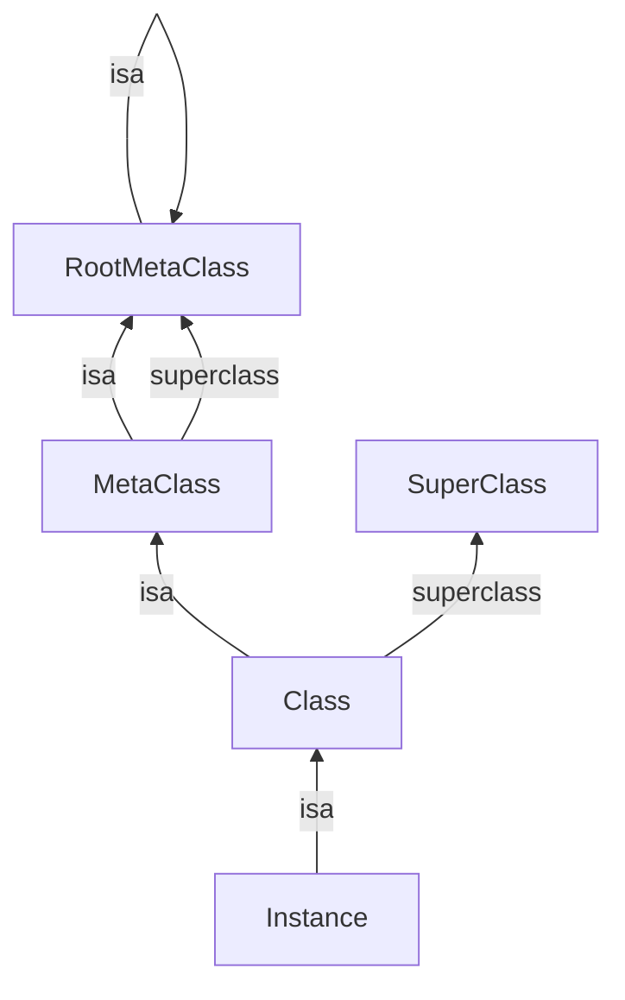

## 1. 类对象模型 (Class Structure)

在 Objective-C 中，类本身也是对象。

### 1.1 ISA 走位图



- **Instance (实例)**：isa 指向 Class。

- **Class (类对象)**：isa 指向 MetaClass（元类），存储实例方法。

- **MetaClass (元类)**：isa 指向 RootMetaClass，存储类方法。

### 1.2 objc\_class 结构体

```C
struct objc_class : objc_object {
    // Class ISA;           // 继承自 objc_object，占 8 字节
    Class superclass;       // 父类指针，占 8 字节
    cache_t cache;          // 方法缓存
    class_data_bits_t bits; // 具体类信息（方法、属性、协议）
};
```

## 2. ISA\_T 位域 (Non-pointer isa)

在 64 位架构下，指针占 64 bit，但存储一个内存地址不需要这么多位。Apple 利用剩余空间存储了大量信息：
```C
union isa_t {
    uintptr_t bits;
    struct {
        uintptr_t nonpointer        : 1;  // 0:纯指针, 1:包含位域信息
        uintptr_t has_assoc         : 1;  // 是否有关联对象
        uintptr_t has_cxx_dtor      : 1;  // 是否有 C++ 析构函数
        uintptr_t shiftcls          : 33; // 真正的类地址 (需 mask)
        uintptr_t magic             : 6;  // 调试用魔数
        uintptr_t weakly_referenced : 1;  // 是否被 weak 指向
        uintptr_t deallocating      : 1;  // 是否正在释放
        uintptr_t has_sidetable_rc  : 1;  // 引用计数是否溢出到 SideTable
        uintptr_t extra_rc          : 19; // 引用计数 (实际值 - 1)
    };
};
```


3\. 方法缓存 (cache\_t)

cache\_t 是提升消息发送性能的关键。

### 3.1 结构设计

- **Buckets**：哈希桶数组，存储 bucket\_t (key, imp)。

- **Mask**：数组容量 - 1，用于计算哈希下标。

- **Occupied**：当前已缓存的方法数量。

### 3.2 扩容规则 (Expansion)

- **触发条件**：当 occupied + 1 > capacity \* 3/4 时触发扩容。

- **扩容倍数**：容量翻倍（例如从 4 -> 8 -> 16）。

- **数据清除**：**重要！** 扩容时会**清空**旧的缓存数据。

  - 原因：扩容后 mask 发生变化，所有 key 的哈希值都需要重新计算。与其遍历旧数组重新哈希，不如直接清空效率高（根据局部性原理，旧方法未必马上再次调用）。

### 3.3 哈希冲突处理

Runtime 使用 **开放寻址法 (Open Addressing)**：

- 计算 index = key & mask。

- 如果 buckets\[index] 被占用且 key 不匹配，则 index = index - 1（向前/向后探测）。

- 如果减到 0，则回绕到数组末尾继续查找。