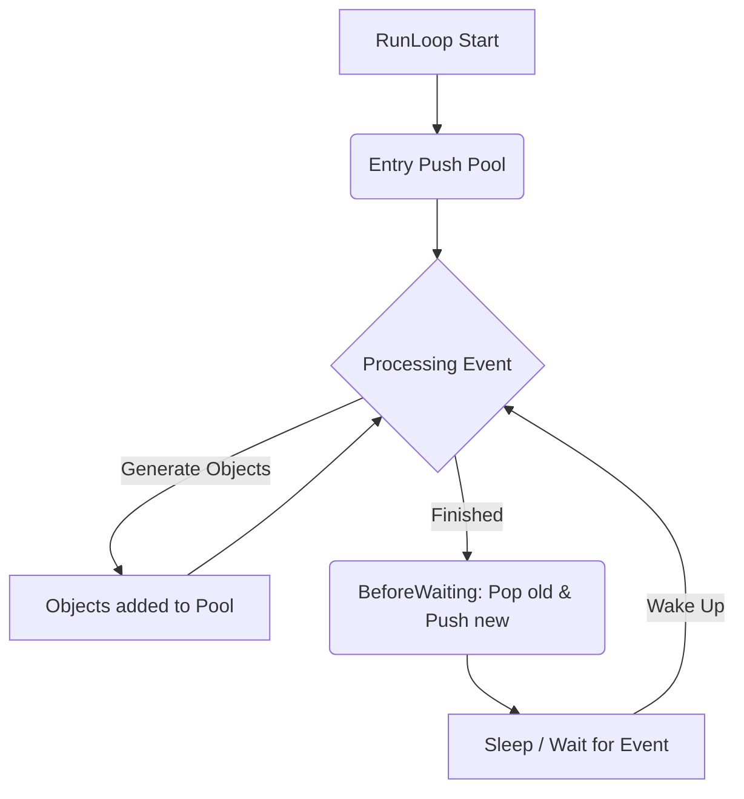

这是一个非常经典且触及 iOS 内存管理核心机制的问题。

简单直接的回答是：**为了在“跨作用域对象生命周期延续”和“性能开销”之间取得最佳平衡。**

如果每次对象创建后立即释放，或者每次方法调用结束立即释放，程序将无法正常运行（无法返回对象）或性能极其低下。RunLoop 提供了一个天然的**“批处理”**节点，使得内存管理既高效又安全。

下面从 **设计逻辑（生命周期）**、**性能考量（开销）** 和 **底层实现（RunLoop 机制）** 三个维度详细解析。

---

### 1. 逻辑层面：解决“跨作用域”的生命周期问题

这是  最本质的存在意义：**延迟释放**。

如果我们在一个方法内部创建对象并希望将其作为返回值给调用方使用：


```objc
- (NSString *)createString {
    NSString *str = [NSString stringWithFormat:@"Hello"];
    return str;
}
```

- **如果立即释放：** `str` 在 `createString` 方法的大括号 `}` 结束时引用计数变为 0 并销毁。调用方拿到的是一个悬垂指针（Dangling Pointer），一用就 Crash。
    
- **如果不释放：** 谁来负责释放？如果由调用方负责，不符合“谁创建谁释放”的原则，且代码会变得极度复杂。
    
- **Autorelease 的方案：** 将 `str` 放入 AutoreleasePool。这相当于给对象贴了个标签：“我现在不杀你，等一会（RunLoop 休眠前）再杀你”。这样对象就能安全地跨越栈帧，“活着”返回给调用方，直到当前事件循环处理完毕。
    

### 2. 性能层面：降低频繁创建/销毁 Pool 的开销

如果在这个极端假设下：**每次** `autorelease` 甚至每个小作用域都进行一次 Pool 的 Push 和 Pop，开销是巨大的。

#### 为什么会有开销？

在底层（ObjC Runtime），`autoreleasepool` 是基于 `AutoreleasePoolPage` 的**双向链表**实现的。

- `objc_autoreleasePoolPush()`：需要查找当前 Page，可能需要开辟新内存页，压入哨兵对象（SENTINEL）。
    
- `objc_autoreleasePoolPop()`：需要遍历链表，向池中所有对象发送 `release` 消息，直到遇到哨兵对象，并回收空页。
    

#### RunLoop 的批处理策略

RunLoop 的一次迭代（Iteration）通常对应一个具体的**事件处理**（如一次点击、一次网络回调、一个 Timer 触发）。 在这个事件处理过程中，可能会产生成百上千个临时的 autoreleased 对象。

- **不合理的做法：** 为这 1000 个对象创建 1000 次 Pool 或执行 1000 次清理逻辑。
    
- **RunLoop 的做法：**
    
    1. 事件开始前：Push 一个 Pool。
        
    2. 处理事件：所有产生的临时对象都扔进这个 Pool（只是简单的指针入栈操作，极快）。
        
    3. 事件处理完（准备休眠）：Pop 这个 Pool，**一次性批量释放**这 1000 个对象。
        

这种**“一帧（一次 Loop）一清”**的策略，极大降低了内存管理的 CPU 占用率。

---

### 3. 底层实现：RunLoop 是如何配合的？

系统在主线程的 RunLoop 中注册了两个关键的 Observer，用来监听 RunLoop 的状态变化，从而控制 AutoreleasePool 的 Push 和 Pop。

我们可以把 RunLoop 的一圈看作以下过程：

1. **监测 Entry (kCFRunLoopEntry):**
    
    - RunLoop 刚进入。
        
    - **操作：** 调用 `_objc_autoreleasePoolPush()`。
        
    - **目的：** 为接下来可能发生的所有事件处理创建一个“兜底”的池子。
        
2. **监测 BeforeWaiting (kCFRunLoopBeforeWaiting):**
    
    - **关键点！** 此时 RunLoop 已经处理完这一轮的所有事件（Source0/Source1/Timer/Block），准备进入休眠（Sleep）等待下一次唤醒。
        
    - **操作：**
        
        1. 调用 `_objc_autoreleasePoolPop()`：释放旧池子，**清理这一轮产生的脏数据（内存）**。
            
        2. 调用 `_objc_autoreleasePoolPush()`：创建一个新池子，为下一次唤醒做准备。
            
3. **监测 Exit (kCFRunLoopExit):**
    
    - RunLoop 退出。
        
    - **操作：** 调用 `_objc_autoreleasePoolPop()`，释放最后的内存。
        

#### 示意图

代码段



---

### 4. 特殊情况：什么时候我们需要手动干预？

既然 RunLoop 会帮我们释放，为什么我们有时候还需要手写 `@autoreleasepool {}`？

答案是：**降低内存峰值 (High Memory Watermark)。**

如果你的代码在一个 RunLoop 循环内（例如一个巨大的 `for` 循环）生成了大量临时对象（比如处理 10,000 张图片），这些对象默认要等到循环彻底结束、RunLoop 准备休眠时才会被释放。

在此期间，内存会持续飙升，可能触发 OOM (Out Of Memory) 崩溃。


```objc
// 错误示范：内存可能瞬间飙升
for (int i = 0; i < 10000; i++) {
    UIImage *image = [UIImage imageNamed:...]; // 产生 autorelease 对象
    [self process:image];
    // image 此时还活着，必须等 RunLoop 转完一圈才死
}

// 正确示范：手动介入
for (int i = 0; i < 10000; i++) {
    @autoreleasepool {
        UIImage *image = [UIImage imageNamed:...];
        [self process:image];
    } // image 在这里立即被释放，内存回落
}
```

### 总结

`autoreleasepool` 选择在 RunLoop 一次迭代结束后释放，而不是每次释放，是因为：

1. **逻辑上：** 必须延迟释放，才能保证对象能跨越栈帧作为返回值被调用方安全使用。
    
2. **性能上：** 利用 RunLoop 的休眠机制进行**批处理**，避免了高频创建/销毁 Pool 的 CPU 开销。