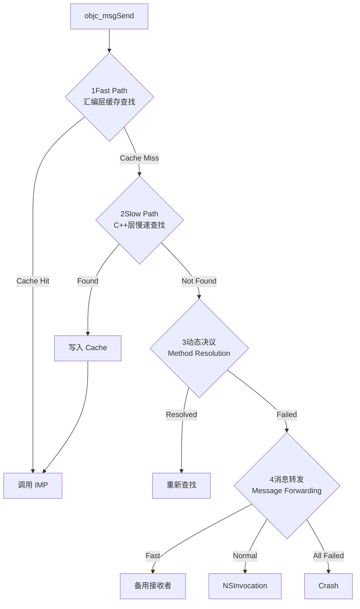

## 1. 核心流程概览

# iOS Runtime 深度剖析：从底层结构到架构设计

在 iOS 高级开发与架构师面试中，Runtime 往往不只是考察 API 的调用，更是考察候选人对**对象模型、内存管理、编译期与运行时的交互**以及**系统性能优化策略**的深度理解。本文将通过底层数据结构、内存布局演进、对象存在形式及消息发送机制四个维度，构建完整的 Runtime 知识体系。

***

## 第一部分：对象的本质与底层结构 (The Anatomy of Objects)

在 Objective-C 中，万物皆对象，而对象的本质是结构体。理解 Runtime 的第一步是解剖 objc\_object。

### 1.1 objc\_object 与 Non-pointer isa

所有对象的核心都是 isa\_t isa。在 64 位架构下，Apple 引入了 **Non-pointer isa** 优化，将 isa 设计为一个 Tagged Union（位域），利用 64 位空间存储更多信息，而不仅仅是一个内存地址。

- **nonpointer**: 0 表示纯指针，1 表示包含额外信息。

- **has\_assoc**: 是否有关联对象。如果有，释放时需清理全局关联对象表。

- **has\_cxx\_dtor**: 是否有 C++ 析构或 ObjC dealloc，决定是否快速释放。

- **shiftcls**: 存储真正的类地址（Class Pointer）。

- **magic**: 调试魔数。

- **weakly\_referenced**: 是否被弱引用指向。释放时需检查 SideTable。

- **deallocating**: 是否正在释放。

**架构思考**：这种设计极大地减少了访问 SideTable（全局辅助表）的频率，提升了内存访问效率。

***

## 第二部分：类的内存模型 (Class Memory Model)

类（objc\_class）本身也是一个对象，它继承自 objc\_object。其内部维护了三个核心结构，决定了 Runtime 的动态能力与性能表现。我们可以将其比喻为\*\*“一家经营了几十年的老字号餐厅”\*\*。

### 2.1 class\_ro\_t：编译期产物 (The Foundation)

- **定义**：Read-Only。这是编译器确定的“死数据”，属于 **Clean Memory**。

- **内容**：类名、**成员变量布局 (Ivar Layout)**、原始方法列表、遵循的协议。

- **比喻**：**餐厅的地基与祖传装修**。

  - 成员变量布局就像餐厅的承重墙和桌椅位置，编译完就定死了。这也是为什么 **Category 不能添加成员变量**的原因——你不能在营业时强行砸墙加座，这会破坏内存对齐（地基坍塌）。

### 2.2 class\_rw\_t：运行时容器 (The Active Menu)

- **定义**：Read-Write。这是 Runtime 在类初始化（Realize）时在堆区生成的 **Dirty Memory**。

- **内容**：方法列表、属性列表、协议列表（二维数组）。

- **Category 原理**：

  - **比喻**：**活页菜单本**。

  - 当加载 Category 时，Runtime 不会修改 ro（祖传菜谱），而是将 Category 的方法列表当作“新的一页”，**插入到 rw 方法列表的最前面**。

  - **“覆盖”假象**：查找方法时，就像翻菜单，最先看到的是插在前面的 Category 方法，找到了就停止，后面的原始方法（在 ro 或 rw 后部）并未被删除，只是被“屏蔽”了。

### 2.3 cache\_t：极速缓存 (The Sticky Notes)

- **定义**：为了解决 rw 列表遍历慢的问题，Runtime 引入的哈希表结构。

- **结构**：buckets (存储 SEL-IMP) + mask (掩码) + occupied (占用数)。

- **比喻**：**大堂经理手腕上的速记条**。

  - 客人点菜（发消息），经理不翻菜单，先看手腕。

  - **扩容策略 (Cache Flush)**：如果手腕写满了（缓存满），Runtime 不会进行复杂的拷贝扩容，而是**直接清空旧缓存，开辟新空间从零开始**。因为消息发送追求极致速度，处理哈希冲突和数据迁移的成本远高于重新缓存。

***

## 第三部分：iOS 14+ 的演进优化 (class\_rw\_ext\_t)

这是区分“熟练工”与“架构师”的关键知识点。Apple 发现很多类在运行时并不会被修改（无 Category，无 Swizzling），为它们分配完整的 class\_rw\_t 拷贝一份 ro 数据是巨大的浪费。

### 3.1 优化机制：Dirty Memory vs Clean Memory

- **Clean Mode (无 Category)**：

  - class\_rw\_t 依然存在，但结构极简。它不包含方法数组，**直接指向** class\_ro\_t 读取数据。

  - **不分配** class\_rw\_ext\_t，节省大量内存。
- **Dirty Mode (有 Category)**：

  - 一旦给类动态添加方法，Runtime 触发 **Copy-on-Write** 机制。

  - 动态申请 **class\_rw\_ext\_t**。

  - 将 ro 的原始数据拷贝到 ext 中，并将 Category 数据拼接进去。rw 指针指向这个 ext。

### 3.2 架构总结

class\_rw\_t 始终存在作为运行时容器，但 class\_rw\_ext\_t 是**按需分配**的。这大幅降低了系统内存占用。

***

## 第四部分：对象类型的存在形式 (The Hierarchy of Truth)

理清 rw / ro 到底存在于哪里，是理解元类的关键。

### 4.1 实例对象 (Instance Object)

- **只有数据**：存储成员变量的具体值（如 \_age = 18）和 isa 指针。

- **没有 rw / ro**：实例对象不存储方法，它通过 isa 找到类对象去获取方法。

### 4.2 类对象 (Class Object)

- **存储元数据**：存储实例方法 (-)、属性、协议。

- **拥有 rw / ro**：当我们调用实例方法 \[obj method] 时，Runtime 在类对象的 rw 中查找。

- **Category 实例方法**：添加进类对象的 rw 中。

### 4.3 元类对象 (Meta-Class Object)

- **存储类的元数据**：存储类方法 (+)。

- **拥有 rw / ro**：当我们调用类方法 \[Class method] 时，Runtime 在元类对象的 rw 中查找。

- **Category 类方法**：添加进元类对象的 rw 中。

***

## 第五部分：消息发送的全流程 (Message Sending Flow)

当调用 \[receiver message] 时，系统转换为 objc\_msgSend(receiver, SEL)，流程如下：

### 5.1 快速查找 (Fast Path - Assembly)

为了极致性能，这部分由汇编编写（objc-msg-arm64.s）。

- **Check Nil**：若 receiver 为 nil，直接返回（防止 Crash）。

- **Get Class**：通过 isa 掩码获取类对象。

- **Cache Lookup**：利用 SEL & mask 哈希算法在 cache\_t 查找。

  - **Hit**：直接调用 IMP。

  - **Miss**：跳转 C++ 慢速查找。

### 5.2 慢速查找 (Slow Path - C++)

进入 lookUpImpOrForward：

- **Realize Class**：检查类是否初始化，若无则初始化（分配 rw 等）。

- **Binary Search**：在当前类 class\_rw\_t 的方法列表中二分查找。

  - 注意：优先找到 Category 方法。

- **SuperClass Loop**：若未找到，沿着 superclass 向上找。

  - 先查父类 Cache。

  - 再查父类 rw 列表。

- **Cache Filling**：找到后，将方法**缓存到 Receiver 的类中**（不是父类），以便下次快速调用。

### 5.3 消息转发 (Forwarding)

若慢速查找也失败，进入三次“急救”：

- **动态决议 (Resolve)**：resolveInstanceMethod。允许动态添加 IMP。

- **快速转发 (Fast Forwarding)**：forwardingTargetForSelector。将消息“甩锅”给其他对象，成本低。

- **常规转发 (Normal Forwarding)**：methodSignatureForSelector + forwardInvocation。创建 NSInvocation 对象，成本高，灵活性最大（可用于 AOP、JSPatch）。

***

## 总结：架构师视角的 Runtime

理解 Runtime 不仅仅是为了会背诵 objc\_msgSend 的流程，而是为了理解以下核心设计哲学：

- **空间换时间**：cache\_t 的设计，以及牺牲内存扩容时丢弃旧缓存的策略，都是为了方法调用的极致速度。

- **动静分离**：class\_ro\_t（静）与 class\_rw\_t（动）的分离，既保证了内存结构的稳定性（Ivar 布局），又提供了强大的动态扩展能力（Category）。

- **懒加载与按需分配**：从 initialize 方法的调用时机，到 iOS 14 的 class\_rw\_ext\_t 优化，系统始终在推迟昂贵操作的执行，直到不得不做。

掌握这些底层原理，能帮助你在设计 APM 监控系统（利用 Forwarding）、无侵入埋点（利用 Method Swizzling）以及优化应用启动时间（理解 load/initialize）时，做出更安全、高效的决策。

### Q1: 请简述一下 objc\_msgSend 的完整执行流程？

**【高分回答逻辑】**： 不要像背书一样只报流程名。要用\*\*“三级火箭”\*\*的模型来描述：

> “`objc_msgSend` 的执行流程本质上是一个为了性能极致优化的**三级查找机制**：
>
> 1. **第一级：汇编快速通道 (Fast Path)**。 这是最高频的路径。利用 CPU 寄存器和缓存机制，在类的 `cache_t` 中查找。为了速度，这部分完全用汇编实现，且**不加锁**。
>
> 2. **第二级：C++ 慢速通道 (Slow Path)**。 如果缓存没命中，就会进入 `lookUpImpOrForward`。这里会加读写锁 (`runtimeLock`)，从当前类开始，沿着继承链（superClass）找 `method_list`。找到后，会把 IMP **回填**到 Cache 中，下次就能走快速通道了。
>
> 3. **第三级：动态救赎通道 (Forwarding)**。 如果继承链走完了都没找到，Runtime 提供了三次自救机会：**动态方法决议**（临时加方法）、**快速转发**（找个替身对象）、**标准转发**（完整的消息重组）。
>
> 只有这三级都失败了，才会抛出 `unrecognized selector` 异常。”

### 一、 为什么寄存器（Registers）不需要加锁？

**核心原因：寄存器是“线程私有”的（Thread Local Context）。**

1. **物理上的独享（时间片轮转）**： 虽然 CPU 只有一套物理寄存器（x0-x29, pc, sp 等），但在任意一个纳秒，**一个 CPU 核心只能运行一个线程**。 当 CPU 在运行线程 A 时，这一整套寄存器都是线程 A 的“私有草稿纸”。线程 B 根本不在这个核上，或者还没轮到它跑，所以根本不存在“竞争”。

2. **上下文切换的保护（Context Switch）**： 当操作系统把线程 A 暂停，切换到线程 B 时（Context Switch），内核会做一件事：

   - 把线程 A 当前所有寄存器的值，**保存**到线程 A 的内存栈里（保护现场）。

   - 把线程 B 之前保存的寄存器值，**恢复**到 CPU 寄存器里（恢复现场）。

**结论**： 对线程来说，它感觉自己一直独占着寄存器。**既然没有两个人同时碰这张纸，自然就不需要锁。**

***

### 二、 为什么 `objc_msgSend` 读缓存（cache\_t）不加锁？

这个问题更复杂。`cache_t` 存放在堆内存的 Class 对象里，是**所有线程共享**的。如果线程 A 在读，线程 B 刚好在扩容（写），按理说是会 Crash 的。

但在 `objc_msgSend` 的**汇编快速路径（Fast Path）**里，确实**没有加锁**。

**原因有三点：**

#### 1. 性能的刚需（Performance is King）

- **锁太慢了**：`objc_msgSend` 是 iOS 整个系统运行的基石，一秒钟可能调用几百万次。

- 即使是最高效的自旋锁（SpinLock），加锁和解锁也需要几十个 CPU 时钟周期。如果每次发消息都加锁，App 的运行速度会慢 10 倍以上。这是不可接受的。

#### 2. 指针读取的原子性（Atomicity）

- 在 64 位架构（arm64）下，读取一个指针（Bucket 指针或 IMP 指针）的操作是**原子**的。

- 也就是说，CPU 读取一个 8 字节的地址，要么读到“旧值”，要么读到“新值”，**绝不会读到“写了一半的值”**（比如前 4 字节是新的，后 4 字节是旧的）。

- 这保证了即使不加锁，读取到的数据在位级上也是完整的。

#### 3. 核心黑科技：内存屏障与垃圾回收（Memory Barrier & Garbage Collection）

那么，怎么解决“线程 A 正在读，线程 B 扩容把旧缓存释放了，线程 A 读到野指针 Crash”的问题？

Runtime 采用了一套巧妙的 **Copy-On-Write + 内存屏障** 机制（这也体现了高 P 的技术深度）：

- **写屏障（Store-Release）**： 当慢速路径需要更新缓存（扩容）时，它不会直接把旧内存 `free` 掉。它会先把新桶（New Buckets）准备好，把指针指向新桶。 **关键点**：Runtime 会保证在这一步操作完成前，所有正在读旧桶的线程都能安全读完。

- **资源延迟释放（延后 free）**： 在旧版本的 Runtime 中，扩容后的旧内存不会立即释放，而是留存一段时间，或者丢到一个垃圾回收链表里。这样即使线程 A 还在读旧表，它读到的也是有效内存，只是数据可能稍微旧一点（Old Cache）。 *注：在最新版 iOS Runtime (objc4-818+) 中，策略更激进，扩容时直接丢弃旧缓存数据，只开辟新空间，利用 `cache_t` 的版本号或标志位来控制，但读取侧依然依靠原子性不加锁。*

- **读到脏数据怎么办？** 如果因为多线程并发，导致线程 A 在缓存里读到了一个“错误”的位置（比如哈希冲突探测时，别的线程改了数据），`objc_msgSend` 的汇编逻辑里有校验机制（对比 `bucket->sel` 和传入的 `sel`）。

  - 如果匹配：说明读对了，放心跑。

  - 如果不匹配：说明可能有并发修改干扰，或者单纯没命中。**只要不匹配，就跳去慢速查找（Slow Path）。**

**慢速查找里是加了锁的 (`runtimeLock`)。**

***

### 三、 面试时的“降维打击”回答

如果面试官问：“CPU 寄存器和缓存为什么不加锁？”

你可以这样回答，体现架构师思维：

> “这里要分两部分看：
>
> 1. **对于寄存器**： 它们不需要锁，因为它们是**硬件级的线程私有资源**。操作系统通过上下文切换（Context Switch）时的‘保存-恢复’机制，保证了每个线程看到的寄存器都是独立的，不存在并发竞争。
>
> 2. **对于软件缓存（cache\_t）**： 它本质上是共享内存，按理说是需要锁的。但 `objc_msgSend` 处于系统调用的最底层，**加锁的性能成本太高**（会造成严重的 CPU 停顿）。 因此，Runtime 选择了\*\*无锁编程（Lock-Free）\*\*策略：
>
>    - 利用 **硬件原子性**：保证指针读取要么是旧值，要么是新值，不会是乱码。
>
>    - 利用 **容错回退机制**：快速路径只负责‘尝试读取’，一旦发现数据不对劲（SEL 不匹配），立即回退到慢速路径。
>
>    - 而在**慢速路径**里，为了保证数据的一致性，是\*\*必须加锁（runtimeLock）\*\*的。
>
> 简而言之：**寄存器是靠隔离来避开锁，缓存是靠原子性和容错机制来省略锁。**”

***

### Q2: (深挖) 快速查找中的 Cache 机制具体是怎么设计的？为什么这么设计？

**【核心考点】**：哈希策略、局部性原理。

> “Runtime 的 Cache 设计非常有意思，它没有使用常见的‘拉链法’来解决哈希冲突，而是使用了**开放寻址法 (Open Addressing)** 中的 **线性探测 (Linear Probing)**。
>
> **具体逻辑是**： 通过 `selector & mask` 算出下标。如果该位置已经存了别的方法（哈希冲突），系统会 `index - 1` 向前查找，直到找到空位或者目标方法。
>
> **设计原因 (The Why)**：
>
> 1. **节省内存**：拉链法需要额外的指针存储链表，而开放寻址法只需要数组。
>
> 2. **缓存局部性 (Cache Locality)**：数组在物理内存上是连续的。线性探测能更好地利用 CPU 的 **L1/L2 Cache Line**，减少 CPU 访问内存的次数。对于 `msgSend` 这种高频调用，哪怕减少几次内存访问，性能提升都是巨大的。”

***

### Q3: (深挖) 慢速查找时的 method\_list 是怎么遍历的？二分还是遍历？

**【核心考点】**：排序优化、Category 的覆盖原理。

> “这取决于方法列表的状态。
>
> 1. **二分查找 (Binary Search)**：如果类的方法列表是 **Sorted (已排序)** 的（通常是编译期生成的 clean memory），Runtime 会直接用二分查找，复杂度是 O(logN)。
>
> 2. **线性遍历 (Linear Search)**：如果类被动态修改过（比如加载了 Category），列表变成了 **Unsorted**，就会退化成线性遍历。
>
> **关于 Category 的覆盖**： Runtime 在加载 Category 时，会把分类的方法列表 **attach** 到主类方法列表的**最前面**。 因为查找是顺序进行的，一旦在前面找到了名字一样的方法，就会直接返回。这就是 Category 方法能‘覆盖’主类方法的本质——主类的方法还在后面，只是访问不到了。”

***

### Q4: (深挖) 为什么 objc\_msgSend 必须用汇编写？用 C 不行吗？

**【核心考点】**：Trampoline、参数转发、ABI。

> “这不仅仅是为了快，更是为了**正确**。核心原因有三点：
>
> 1. **Trampoline (跳板机制)**： `objc_msgSend` 本质上不是一个‘函数调用’，而是一个**跳板**。它的任务是找到 IMP，然后**直接跳转 (Jump)** 过去。 如果用 C 写，编译器会自动生成 **Prologue (开场代码)**，把参数压栈。而 `objc_msgSend` 必须对所有参数（包括未知的变长参数）保持**透明**，原封不动地交给 IMP。只有汇编能控制寄存器不做多余的操作。
>
> 2. **尾调用优化 (Tail Call Optimization)**： 汇编最后使用的是 `br` (Branch) 或 `jmp` 指令，而不是 `call`。 这意味着当 IMP 执行完后，会直接返回给最初的调用者，而不会再回到 `objc_msgSend` 里。这样就少了一层栈帧，效率极高。
>
> 3. **寄存器参数的不确定性**： C 语言无法定义一个‘参数类型和个数都未知’的函数接口，也无法直接把接收到的所有寄存器（x0-x8, q0-q7）直接转发给下一个函数。”

***

### Q5: 在消息转发中，Runtime 是如何防止“动态决议”进入死循环的？

**【核心考点】**：标志位、状态机。

> “防止死循环的关键在于 `triedResolver` 这个布尔标记位。
>
> 当查找失败进入 `resolveInstanceMethod` 时：
>
> 1. Runtime 会先判断 `triedResolver` 是否为 false。
>
> 2. 如果是，将其置为 `true`，然后调用决议方法。
>
> 3. 决议方法执行完后，Runtime 会触发一次 **`retry` (goto 重新查找)**。
>
> 4. 如果这次重试还是没找到 IMP，虽然逻辑上会再次走到决议的入口，但因为 `triedResolver` 已经是 true 了，系统就不会再给机会，而是直接进入下一步（快速转发）。
>
> 这就保证了 `+resolveInstanceMethod:` 在同一次消息发送中只会被调用一次。”

***

## 💡 总结：给面试官的“最后一击”

如果面试官问完以上问题，你可以做一个升华总结：

> “所以总结来说，`objc_msgSend` 的设计哲学就是：**在极高频的路径上（Fast Path）做到极致的无锁和寄存器复用；在低频路径上（Slow Path/Forwarding）保证线程安全和灵活性。** 这是一个非常经典的系统级优化案例。”

Objective-C 的方法调用 `[obj foo]` 在编译阶段会被转化为 C 函数调用：`objc_msgSend(obj, @selector(foo))`。其执行流程可以分为三大阶段：

1.  **快速查找（Fast Path - 汇编层）**：查找 Cache。
2.  **慢速查找（Slow Path - C/C++层）**：查找 method_list。
3.  **动态处理**：动态方法决议 & 消息转发。

## 2. 详细执行步骤

### 2.1 快速路径 (Assembly)
`objc_msgSend` 是用汇编（arm64/x86_64）编写的，逻辑如下：

1.  **判空**：检查 receiver 是否为 `nil`。如果是，直接返回（这就是为什么给 nil 发送消息不会崩溃）。
2.  **获取 Class**：通过 `isa & ISA_MASK` 获取类对象。
3.  **查找 Cache**：
    - 根据 `@selector(foo)` 和掩码计算哈希下标。
    - 访问 `cache_t` 中的 `buckets`。
    - **命中**：直接调用 `imp`。
    - **未命中**：进入 `CheckMiss`，跳转到慢速查找。

### 2.2 慢速路径 (C++)
进入 `lookUpImpOrForward` 函数：

1.  **二分查找**：在当前类的 `bits` -> `methods` (method_list) 中使用二分法查找匹配的方法。
2.  **父类递归**：如果当前类没找到，沿着 `superclass` 指针向上查找，直到 `NSObject`。
3.  **缓存填充**：如果在慢速路径找到方法，会将其插入到 `cache_t` 中，以便下次快速调用。

## 3. 动态方法决议与转发

如果方法列表里找不到 IMP，Runtime 会给你三次 "自救" 的机会：

1.  **动态方法决议 (Method Resolution)**
    - 调用 `+resolveInstanceMethod:` 或 `+resolveClassMethod:`。
    - 开发者可以在此利用 `class_addMethod` 动态添加方法实现。
    - 如果返回 `YES`，重新执行消息查找流程。

2.  **快速转发 (Fast Forwarding)**
    - 调用 `-forwardingTargetForSelector:`。
    - 返回一个可以处理该消息的其他对象。
    - 如果返回非 nil，消息会被重定向到新对象。

3.  **标准转发 (Normal Forwarding)**
    - 调用 `-methodSignatureForSelector:` 获取方法签名。
    - 创建 `NSInvocation` 对象。
    - 调用 `-forwardInvocation:`。开发者可以在此修改调用目标、参数等。

## 🔥 面试深挖：为什么 objc_msgSend 用汇编写？

这是一个经典的 P7+ 面试题，主要基于三个原因：

1.  **性能极致优化 (Performance)**：
    - 方法调用是 iOS App 中最高频的操作。
    - C 语言函数调用会有 **Prolog (开场)** 和 **Epilog (收尾)** 操作（如保存/恢复栈帧、寄存器压栈），而 `objc_msgSend` 实际上是一个 **Jump (跳转)** 指令，不需要建立完整的栈帧。
    - 汇编可以直接操作寄存器，减少内存读写。

2.  **参数不确定性 (Varargs)**：
    - C 语言很难定义一个 "参数个数和类型都未知" 的函数并将其完美转发给另一个函数。
    - 汇编通过寄存器协议（如 ARM64 的 x0-x7 传递参数），可以直接将所有接收到的寄存器状态透传给目标 IMP。

3.  **绕过 ABI 限制**：
    - 能够实现 "Tail Call Optimization"（尾调用优化），直接 `br` (Branch) 到目标函数的地址，让目标函数执行完后直接返回给最初的调用者，而不是返回给 `objc_msgSend`。