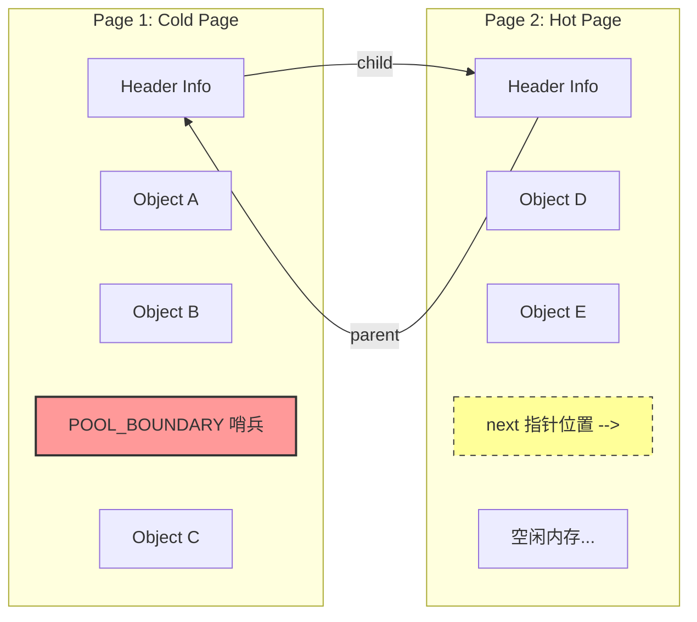
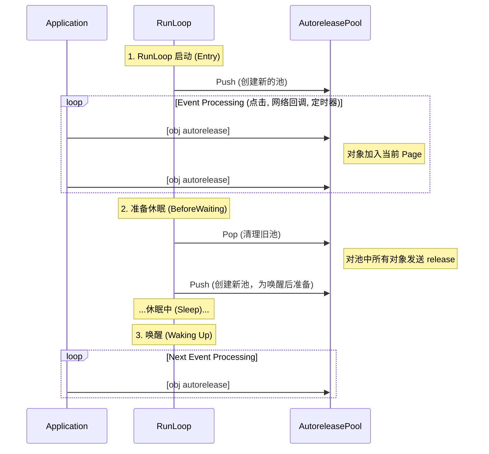
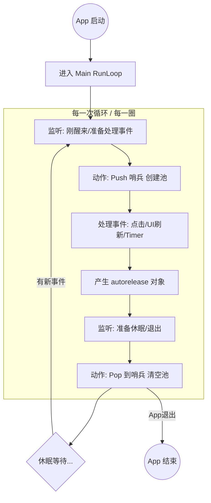
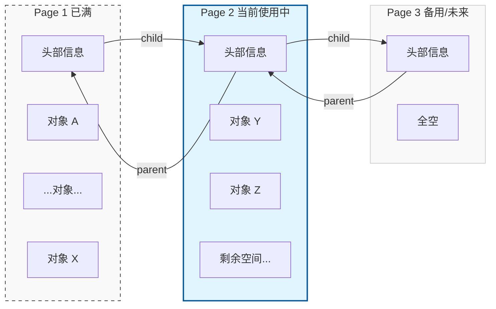
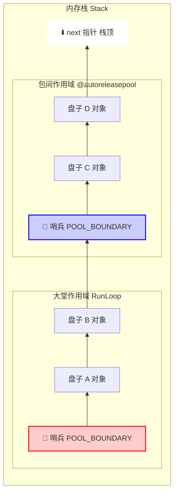

### 第一部分：正统硬核讲解 (Under the Hood)

#### 1. 核心定义

`AutoreleasePool` 是 Objective-C 内存管理机制（引用计数）的一部分。它的核心作用是：**延迟释放**。 当你把一个对象标记为 `autorelease` 时，它的引用计数不会立刻 `-1`，而是被放入一个“池子”里。当这个池子被“排空（Drain/Pop）”时，池子里所有的对象都会收到一次 `release` 消息。

#### 2. 底层数据结构：`AutoreleasePoolPage`

在底层，并没有一个单独名为 `NSAutoreleasePool` 的实体类结构。现在的实现（Apple 的 `libobjc` 源码）是基于 **`AutoreleasePoolPage`** 的 C++ 类来实现的。

它不是一个连续的大数组，而是一个**双向链表**连接起来的**栈**结构。

- **内存大小**：每个 `AutoreleasePoolPage` 占用 **4096 字节**（虚拟内存的一个 Page 大小）。

- **结构组成**：

  ```C++
  class AutoreleasePoolPage {
      magic_t const magic; // 校验数据完整性
      id *next;            // 指针，指向栈顶（下一个可以存放对象地址的位置）
      pthread_t const thread; // 当前线程
      AutoreleasePoolPage * const parent; // 父节点（链表前驱）
      AutoreleasePoolPage *child;         // 子节点（链表后继）
      uint32_t const depth;
      uint32_t hiwat;
      // ... 后面紧接着是存放 autorelease 对象地址的内存区域
  };
  ```

**关键点：** 每个 Page 除了存放上述成员变量（约 56 字节），剩下的空间全部用来按顺序存储被 `autorelease` 的对象的**内存地址**。

#### 3. 核心操作原理

`AutoreleasePool` 的操作主要对应三个 C 函数：

##### A. `objc_autoreleasePoolPush()` —— 压栈

当 `@autoreleasepool {}` 作用域开始时：

1. **插入哨兵**：系统会将一个特殊的 `POOL_BOUNDARY` (以前叫 `POOL_SENTINEL`，实际上就是 `nil`) 压入当前的 `AutoreleasePoolPage`。

2. **返回值**：返回这个 `POOL_BOUNDARY` 的内存地址。这个地址非常重要，它是后续“出栈”的标记点。

##### B. `[obj autorelease]` —— 存入对象

当对象调用 `autorelease` 时：

1. 判断当前 `hotPage` (当前正在使用的 Page) 是否已满。

2. **未满**：将对象的地址存入 `next` 指针指向的位置，`next++`。

3. **已满**：创建一个新的 `AutoreleasePoolPage`，通过双向链表连接，将对象存入新页，并将 `hotPage` 指向新页。

##### C. `objc_autoreleasePoolPop(void *boundary)` —— 出栈

当 `@autoreleasepool {}` 作用域结束时，会传入 Push 阶段返回的 `boundary` 地址：

1. **回溯**：根据 `hotPage` 的 `next` 指针，从栈顶开始往回遍历。

2. **发送 Release**：对遍历到的每一个对象地址，发送 `release` 消息。

3. **停止**：直到遍历遇到刚才传入的那个 `POOL_BOUNDARY` 为止。

4. **内存回收**：如果 Page 空了，会释放掉多余的 Page 内存（通常会保留一个空闲页以备下次使用）。

#### 4. 与 RunLoop 的“共生”关系

你可能会问：*“在主线程中，我并没有一直手动写 `@autoreleasepool`，为什么对象会被自动释放？”*

这是因为 **RunLoop** 替你做了。App 启动时，主线程的 RunLoop 注册了两个 Observer：

1. **Entry (进入循环)**：

   - 调用 `objc_autoreleasePoolPush()`。

   - 创建一个新的池，准备承载这一轮 Loop 产生的临时对象。
2. **BeforeWaiting (准备休眠) & Exit (退出循环)**：

   - 调用 `objc_autoreleasePoolPop()`。

   - 清理掉这一轮 Loop 产生的所有临时对象。

   - 如果是 BeforeWaiting，紧接着会再次 `Push` 一个新池，为醒来后的下一轮做准备。

***

### 第二部分：类比与举例 (Mental Model)

为了方便记忆，我们可以使用 **“自助餐厅的脏盘子策略”** 来类比。

#### 场景设定：

- **内存** = **餐厅的桌子**。

- **对象 (Object)** = **盘子**。

- **使用对象** = **客人在盘子里吃东西**。

- **Release (销毁)** = **洗盘子（把盘子收走）**。

#### 这里的 AutoreleasePool 是什么？

它就是服务员推着的那个 **“收餐车” (Stack)**。

1. **普通的 Release (MRC/ARC 立即释放)**：

   - 客人吃完一口，立马叫服务员：“嘿！把这个盘子拿去洗了！”

   - 效率极低，服务员跑断腿，客人也没法专心吃。
2. **Autorelease (延迟释放)**：

   - 客人吃完一个盘子，不立刻洗，而是说：“我先不用了，但这顿饭还没吃完，先放那辆收餐车上吧。”

   - 服务员把盘子**叠**在车上（压栈）。
3. **AutoreleasePoolPage (分页)**：

   - 一辆收餐车（Page）堆满了怎么办？服务员会拉来第二辆车挂在第一辆后面（双向链表），继续堆。
4. **POOL\_BOUNDARY (哨兵)**：

   - 为了区分哪一堆盘子是哪一桌客人的，服务员在每桌盘子开始叠之前，放了一块**红色的隔板**（哨兵对象）。
5. **Pop (出栈/排空)**：

   - 经理（RunLoop）喊了一声：“这一波客人走了（Sleep/Loop End）！”

   - 服务员推着车去后厨，从最上面的盘子开始拿，一直拿到那块**红色的隔板**为止。

   - 拿下来的所有盘子，统统扔进洗碗机（Release）。

***

### 第三部分：可视化图解

我将用 Mermaid 绘制两个图：一个是**物理内存结构**，一个是**运行时的流程**。

#### 1. 物理结构：AutoreleasePoolPage 的双向链表

代码段



- **Cold Page**: 已经填满的页。

- **Hot Page**: 当前正在写入的页。

- **POOL\_BOUNDARY**: 对应代码中 `@autoreleasepool {` 的开始。

#### 2. RunLoop 与 Autorelease 的协作循环

代码段



***

### 总结与应用建议

#### 核心知识点 (Key Takeaways)

1. **数据结构**：AutoreleasePool 是由 `AutoreleasePoolPage` 构成的双向链表栈。

2. **哨兵机制**：通过 `POOL_BOUNDARY` (nil) 标记作用域边界。

3. **RunLoop 驱动**：主线程的 RunLoop 自动控制池的 Push 和 Pop，保证了内存不会无限增长。

#### 什么时候需要手动写 `@autoreleasepool`？

既然 RunLoop 会帮我们做，为什么还要自己写？

当你在一个循环中生成了**大量**临时对象（尤其是图片、巨大的字符串）时。

Objective-C

```
// 错误示范：内存瞬间飙升
for (int i = 0; i < 1000000; i++) {
    // 这里的 string 对象虽然是临时的，但要等到 RunLoop 这一圈结束才释放
    // 内存峰值会非常高
    NSString *str = [NSString stringWithFormat:@"hello %d", i];
}

// 正确示范：内存平稳
for (int i = 0; i < 1000000; i++) {
    @autoreleasepool {
        // 每次循环结束，立即释放 str，不需要等 RunLoop
        NSString *str = [NSString stringWithFormat:@"hello %d", i];
    }
}
```

### . 释放到哨兵位置停止 = 这一次 RunLoop 停止吗？

**答案是：是的，意味着这一“圈”跑完了，准备休息了。**

RunLoop（运行循环）就像是一个不知疲倦的**跑圈运动员**。

- **一圈（Iteration）**：代表处理一次触摸点击、一次定时器触发、或者一次屏幕刷新。

- **Pop(哨兵)**：代表这一圈跑完后，清理这一圈产生的“汗水”（临时对象）。

具体的**时序逻辑**是这样的（系统通过 `CFRunLoopObserver` 监听状态）：

1. **RunLoop 醒来 (Entry/BeforeWaiting)**:

   - 系统自动帮你 **Push 一个哨兵**。

   - *潜台词：“新的一圈开始了，这圈产生的所有垃圾（autorelease 对象），都记在这个哨兵后面。”*
2. **RunLoop 处理任务 (Processing)**:

   - 执行你的代码（`viewDidLoad`、按钮点击事件等）。

   - 产生的对象（如 `[NSString stringWithFormat:...]`）被扔进池子，压在哨兵上面。
3. **RunLoop 准备休眠 (BeforeWaiting) 或 退出 (Exit)**:

   - 系统执行 **Pop(哨兵)**。

   - *潜台词：“这圈跑完了，没任务了，我要去睡觉了。睡前把这一圈产生的垃圾全倒掉！”*

   - **这就在你说的“拿到棒子停手”的那一刻。**

所以，**清理池子 = 这一圈 RunLoop 工作的尾声。**

### 2. 下一次 RunLoop 再继续执行吗？

**是的。**

RunLoop 的机制是 **“有事做事，没事睡觉”**。

- **Pop 之后**：RunLoop 进入休眠状态（内核态，不占用 CPU）。

- **再次唤醒**：当你再次点击屏幕，或者网络请求回来了，RunLoop 被唤醒。

- **新的一圈**：它会**再次 Push 一个新的哨兵**，开始新的一轮“积累对象 -> 统一清理”的循环。

这就像餐厅（RunLoop）：

- **中午高峰期结束（Pop）**：洗碗工把所有盘子洗完，店里清空（休眠）。

- **晚市开始（Wake Up）**：经理又放了一张新的红纸（Push 哨兵），准备迎接晚上的客人。

### 3. 一个 App 生命周期内会自动释放几次？

**答案是：无数次（Countless）。**

这不是一个固定的数字（比如 5 次或 10 次），而是跟你的 App **“心跳”频率**有关。

只要你的 App 是活着的（在前台运行），RunLoop 就在不断地转圈。每一次转圈，通常都伴随着一次 AutoreleasePool 的 `Push` 和 `Pop`。

- **如果你在疯狂滑动列表（TableView）**：

  - RunLoop 可能一秒钟转 60 圈（为了保证 60fps 刷新）。

  - 那么池子就会在一秒钟内 **自动释放（Pop）60 次**。
- **如果你把手机放在桌上不动**：

  - RunLoop 休眠了，几个小时可能都不转一圈。

  - 池子也就一直没动静。

**总结图谱：**

代码段



***

### 4. 既然系统会自动做，为什么还需要手动写 `@autoreleasepool`？

既然 RunLoop 一圈会清一次，那为什么我们在某些代码里（比如你的“VIP包间”例子）还要自己写 `@autoreleasepool { ... }` 呢？

**场景：在这一圈 RunLoop 结束之前，内存已经爆了。**

比如这一圈任务非常重：你用一个 `for` 循环处理 **100 万张图片**。


```objc
// 都在同一圈 RunLoop 里
for (int i = 0; i < 1000000; i++) {
    // 产生大量临时对象
    NSString *str = [NSString stringWithFormat:@"photo_%d", i]; 
    UIImage *img = [UIImage imageNamed:str]; 
    
    // 如果没有手动池子：
    // 这 100 万个对象都会堆在 RunLoop 的那个“大哨兵”后面。
    // 只有等循环结束，RunLoop 准备休眠时，才会一次性清理。
    // 结果：循环还没跑完，App 就因为内存峰值过高闪退了（OOM）。
}
```

**解决方法（VIP 包间）：**

```objc
for (int i = 0; i < 1000000; i++) {
    @autoreleasepool {
        // Push 临时哨兵
        NSString *str = ...
        UIImage *img = ...
        // Pop 临时哨兵 -> 立即销毁 str 和 img
    }
}
```

这样，内存始终保持在处理 **1 张图片** 的水平，而不是 **100 万张** 的累积。

### 总结回答你的疑惑

1. **释放时机**：释放到哨兵位置，标志着 **当前 RunLoop 迭代（这一圈）即将进入休眠**。

2. **后续动作**：下一次事件到来唤醒 RunLoop 时，会 **重新开始下一轮** Push/Pop 循环。

3. **发生频率**：**非常高**。基本上每一次屏幕刷新、每一次用户交互，都会触发至少一次自动释放。


`AutoreleasePool` **物理存储**的核心了。

你可能会觉得矛盾：“刚才不是说它是\*\*栈（Stack）**结构吗？怎么又变成**双向链表（Doubly Linked List）\*\*了？”

答案是：**它的逻辑是“栈”，但物理实现是“双向链表”。**

简单的说：**因为一个“桶”装不下所有的盘子。**

***

### 1. 为什么要用链表？（容量限制）

在内存管理中，系统不会直接给你一块“无限大”的连续内存去放这个栈。系统是按\*\*页（Page）\*\*来分配内存的。 在 iOS 中，每个 `AutoreleasePoolPage` 的大小是固定的 **4096 字节（4KB）**。

回到“餐厅洗碗”的例子：

- **理想情况（纯栈）**：你有一个深不见底的魔法桶，多少盘子都装得下。

- **现实情况（分页）**：你只有普通的塑料收纳箱（Page）。

  - 一个箱子只能装 100 个盘子。

  - 如果生意太好，来了 200 个盘子，第一个箱子装满了怎么办？

  - 你需要拿**第二个箱子**，把它放在第一个箱子旁边，继续装。

为了让收银员（系统）知道这堆箱子的顺序，你需要把它们连起来。这就是**双向链表**的作用。

### 2. 双向链表的结构

每个 `AutoreleasePoolPage` 对象（也就是那个 4KB 的箱子）都有两个指针，像两只手：

1. **`parent` (左手/上一个)**：指向已经装满了的那个箱子。

2. **`child` (右手/下一个)**：指向为了扩容而新开的那个箱子。

**图解：**

代码段



- **Page 1**：装满了。

- **Page 2**：正在往里放东西（Hot Page）。

- **Page 3**：虽然还没用到，但链表可能已经连好了（或者等 Page 2 满了再创建）。

### 3. 这种结构下的 Push 和 Pop

理解了链表，我们再看那个“哨兵”和“洗碗”的过程，就会发现它是在**跨越箱子**操作。

#### 情况一：Push（添加对象）时跨页

你在 Page 1 里放盘子，放着放着，Page 1 满了（4KB 用完了）。

1. 系统发现 Page 1 满了。

2. 系统创建一个新的 Page 2。

3. 设置 `Page1.child = Page2`；设置 `Page2.parent = Page1`。

4. 把新的盘子（对象）放到 Page 2 里去。

这就是为什么叫“双向链表”：为了让你的“栈”可以无限延伸。

#### 情况二：Pop（清理对象）时跨页

现在要下班了，RunLoop 触发 `pop(哨兵)`。假设**哨兵**在 Page 1 的底部，而当前你已经写到了 Page 2。

1. 系统从 Page 2 的顶部开始往下删（release 对象）。

2. 删光了 Page 2 的对象。

3. 系统通过 `parent` 指针，找到 Page 1。

4. **销毁 Page 2**（为了节省内存，通常会把 Page 2 删掉或者缓存起来供下次用）。

5. 跳回到 Page 1，继续往下删。

6. 直到碰到了 Page 1 底部的那个**哨兵**，停止。

### 4. 源码视角的“真面目”

在 C++ 源码中，`AutoreleasePoolPage` 的长相大概是这样的（简化版）：


```C++
class AutoreleasePoolPage {
    // 1. 双向链表指针
    AutoreleasePoolPage * const parent; // 指向父节点（前一页）
    AutoreleasePoolPage *child;         // 指向子节点（后一页）

    // 2. 线程相关
    pthread_t const thread;             // 绑定当前线程（每个线程有自己的池）

    // 3. 栈指针（控制当前页写到哪了）
    id *next;                           // 指向页内下一个可写入位置
    
    // ... 其他 4096 字节剩下的空间用来存对象地址 ...
};
```

### 总结

- **逻辑上**：它是**一个大栈**（后进先出）。

- **物理上**：它是由**多个小页（Page）通过双向链表**拼起来的。

- **作用**：

  - **`parent`**：方便 Pop 的时候往回找（因为可能要跨页删除）。

  - **`child`**：方便 Push 的时候往后存（一页满了存下一页）。

这就像**老式胶卷**：虽然电影（RunLoop）是连续播放的，但胶卷（内存）是一格一格（Page）连起来的。如果一卷胶卷拍完了，你需要接上下一卷，但它们放映出来的逻辑依然是连贯的。


要理解哨兵，你只需要记住一句话：**它就是一个“分隔符”，告诉系统：“别删了，到此为止！”**

***

### 1. 场景类比：超市收银台的分隔棒

想象你去超市排队结账。传送带（内存栈）是滚动的，大家买的东西（对象）都混在一起。

- **你（当前作用域）**：买了一堆零食。

- **排在你后面的人（嵌套作用域）**：买了一堆蔬菜。

如果不做任何标记，收银员（System）怎么知道哪些是你的，哪些是后面那人的？他可能会把后面人的蔬菜也算在你头上。

**这时候“哨兵”出现了：** 就是那根\*\*“收银台分隔棒（Checkout Divider）”\*\*。

1. **Push (放置哨兵)**： 在你把商品放上去之前，你先放了一根**棒子**在传送带上。这根棒子没有价格，它唯一的用来标记：“从这里开始，是我的东西”。

2. **Add Objects (添加对象)**： 你把薯片、可乐（对象）放在棒子后面。

3. **Pop (结算/清理)**： 收银员开始扫货（Release对象）。他拿走一包薯片、一瓶可乐……直到他的手摸到了那根**棒子**。 他知道：“哦，这单结束了。” 于是他把棒子拿走，停止扫描。

**在这个模型里：**

- **商品** = `autorelease` 的对象。

- **分隔棒** = `POOL_BOUNDARY` (哨兵)。

- **收银员拿到棒子停手** = `pop(boundary)` 的过程。

***

### 2. 进阶类比：餐厅里的“摞盘子”（栈结构）

因为 AutoreleasePool 是**栈**结构（后进先出），我们用“洗碗”的例子会更贴切底层原理。

假设有一个专门用来放**脏盘子**的深桶（Page）。

#### 步骤一：早上开业（主线程 RunLoop 开始）

经理过来说：“早班开始了！” 他在桶的最底部，垫了一张**红色的餐巾纸**（哨兵）。

- **桶的状态**：`[红纸]`

#### 步骤二：正常营业（产生对象）

客人吃完饭，服务员往桶里扔盘子。

- **桶的状态**：`[红纸] - [盘子A] - [盘子B]`

#### 步骤三：突发情况（局部作用域 `@autoreleasepool`）

突然来了个VIP包间，为了不跟大堂的盘子混淆，经理要求：“包间的盘子要单独处理！” 于是，经理在 `[盘子B]` 的上面，又垫了一张**蓝色的餐巾纸**（新的哨兵）。

- **桶的状态**：`[红纸] - [盘子A] - [盘子B] - [蓝纸]`

#### 步骤四：包间营业（局部对象）

包间客人产生的盘子压在蓝纸上。

- **桶的状态**：`[红纸] - [盘子A] - [盘子B] - [蓝纸] - [盘子C] - [盘子D]`

#### 步骤五：包间结束（Pop 局部池）

包间客人走了，要清理包间的盘子。洗碗工开始**从上往下**拿盘子去洗（Release）。

1. 拿走 `盘子D`。

2. 拿走 `盘子C`。

3. **碰到 `蓝纸` 了！**

4. 洗碗工明白：“停！下面的盘子不是包间的，不能动。”

5. 把 `蓝纸` 扔掉。

- **桶的状态**：回到 `[红纸] - [盘子A] - [盘子B]`

#### 步骤六：早班结束（Pop 主池）

早班结束，RunLoop 要休眠了。洗碗工再次清理。

1. 拿走 `盘子B`。

2. 拿走 `盘子A`。

3. **碰到 `红纸` 了！**

4. 把 `红纸` 扔掉。

- **桶的状态**：空桶。

***

### 3. 可视化图解（这一刻的内存）

对应上面的“步骤四”（包间正在营业时），内存里的样子是这样的：



### 1. 什么是 Hot Page 和 Cold Page？

在 `AutoreleasePoolPage` 的链表中，根据使用状态，我们可以把页面分为三类：

- **Hot Page (热页)**：

  - **定义**：当前正在“服役”的那个页面。

  - **特征**：它是当前双向链表中，用来存储新产生的 autorelease 对象的那个页面。

  - **指针**：Runtime 内部有一个 `hotPage` 指针，永远指向它。你 push 进来的新对象，都会往这个页面的栈顶放。

  - *比喻：洗碗工手中正在装盘子的那个箱子。*
- **Cold Page (冷页)**：

  - **定义**：已经装满的页面（位于 Hot Page 之前），或者已经被清空但还没被销毁的页面（位于 Hot Page 之后）。

  - **特征**：它们暂时不需要被操作，只是静静地待在链表里。

  - *比喻：已经装满封箱的箱子（Full），或者放在旁边备用的空箱子（Empty）。*

***

### 2. 系统是如何“抠门”的？（优化机制）

系统的核心策略是：**能不删就不删，能复用就复用。**

这主要体现在两个时刻：**扩容（Push）** 和 **清理（Pop）**。

#### 场景一：扩容时的“未卜先知”

当你当前的 Hot Page 写满了（4096 字节用光了），需要新的空间时，系统不会立刻傻傻地去 `malloc` 一个新页面。

**它的逻辑是：**

1. 先看看当前 Hot Page 还有没有 `child`（下一页）？

2. **如果有（Cold Page 变 Hot）**：太好了，这里有个现成的空箱子（可能是上次用完没扔的）。直接把它变成 Hot Page，继续往里写。

   - *省去了 `malloc` 的开销。*

3. **如果没有**：那没办法，只能向操作系统申请一块新内存创建一个新 Page，挂在 `child` 上。

#### 场景二：清理时的“留一手”策略（Hysteresis）

这是最精彩的优化点。

当 RunLoop 结束或者你手动 `pop`，导致大量的对象被释放，Hot Page 的位置会从后面的页面回退到前面的页面。

假设我们有 3 个页面： `Page A (满)` -> `Page B (满)` -> `Page C (正在用)`

这时候你调用了 `pop`，对象全删光了，Hot Page 回到了 `Page A`。 那 **Page B** 和 **Page C** 怎么办？它们现在空了。

**普通的做法**：全部销毁（free）。 **Runtime 的做法**：**杀掉 Page C，但留着 Page B！**

这就是 **“保留一个空页（One Empty Page Rule）”** 策略。

- **原理**：系统猜测，既然你刚才用到了 Page B 和 Page C，说明你的业务负载比较大。虽然现在空了，但可能下一秒你又要产生一堆对象。

- **动作**：

  - 把链表末尾多余的页面（Page C, D, E...）全部销毁，归还给操作系统。

  - **但是！** 紧挨着当前 Hot Page 的那个 `child` 页面（Page B），会被保留下来，处于“待命”状态。

**图解优化过程：**

1. **满载状态**： `[Page A 满] <-> [Page B 满] <-> [Page C 刚写了一半]` (Hot: C)

2. **Pop 回到 Page A 后**： 系统会销毁 Page C。 **但是保留 Page B。** `[Page A 此时是 Hot] <-> [Page B 全空 (备胎)]`

3. **立刻又来了一波对象（Push）**： 系统发现 Page A 满了，一看 `child` 有个 Page B！ **直接复用 Page B**，不需要 `malloc`。 `[Page A 满] <-> [Page B 正在写] (Hot: B)`

***

### 3. 为什么是“留一个”而不是“全留”？

你可能会问，既然复用好，为什么不把 Page C、D 也留着？

这是一种**权衡（Trade-off）**：

- **留得太少**：如果完全不留，像 RunLoop 这种高频循环，每次都会导致 Page 的反复创建和销毁（Thrashing），CPU 占用率飙升。

- **留得太多**：如果 App 曾经有一个内存峰值（比如处理了一张 80MB 的全景图），申请了 2000 个 Page。处理完后，如果不销毁这些页面，那这 8MB 的内存就一直被 AutoreleasePool 占着，成了“僵尸内存”，导致 App 整体内存占用居高不下。

所以，**“只留一个备胎”** 是在 **时间开销（CPU）** 和 **空间开销（Memory）** 之间找到的最佳平衡点。

### 总结

`AutoreleasePoolPage` 的优化哲学就像是\*\*“勤俭持家的餐厅经理”\*\*：

1. **Hot Page** 是正在盛菜的盘子。

2. **Cold Page** 是备用的空盘子。

3. **Push 时**：先看手边有没有刚洗好的空盘子（child），有就直接用，没有再去买新的（malloc）。

4. **Pop 时**：客人走了，桌子清空了。多余的盘子退给仓库（free），但**一定会在手边留一个空盘子**。因为经理知道，马上就会有下一桌客人（下一个 RunLoop）进门，这时候再跑去仓库拿盘子就来不及了。