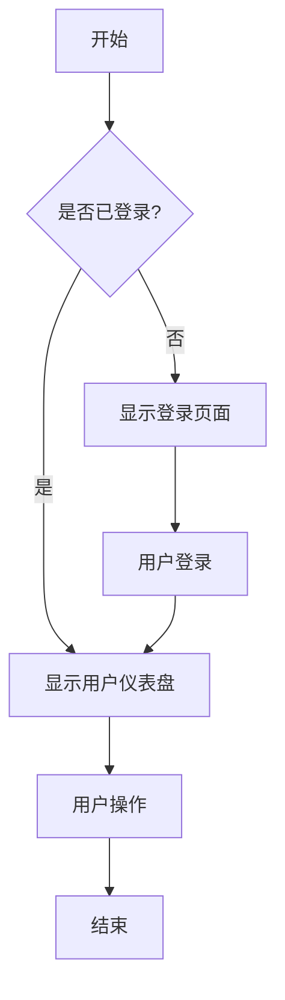
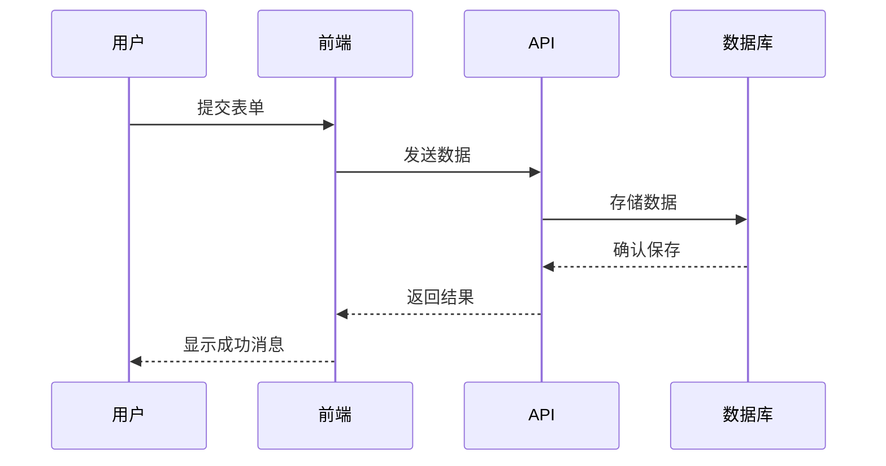
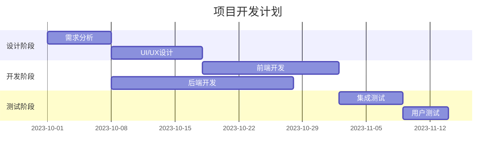
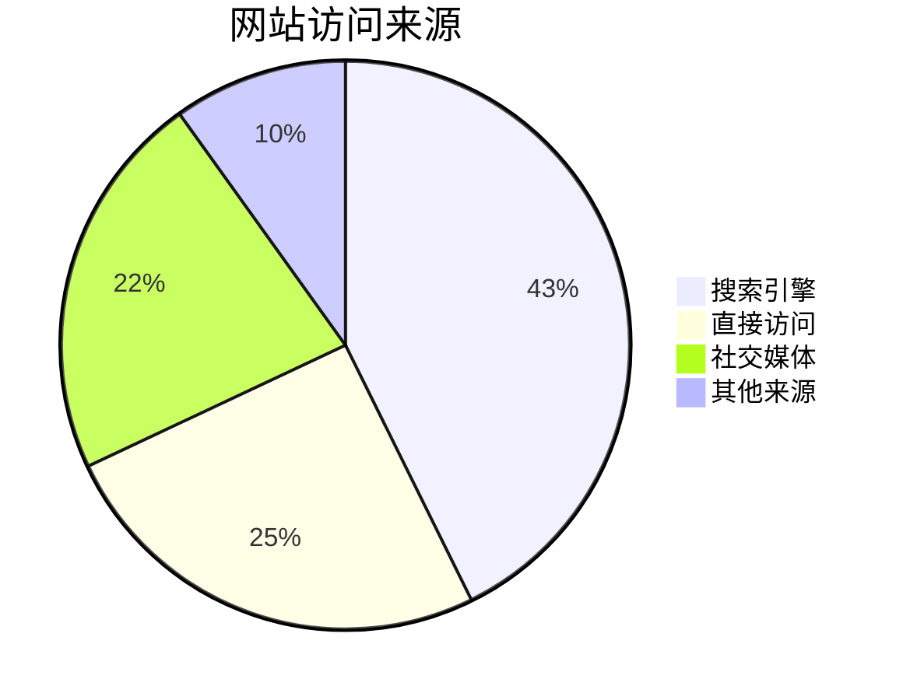
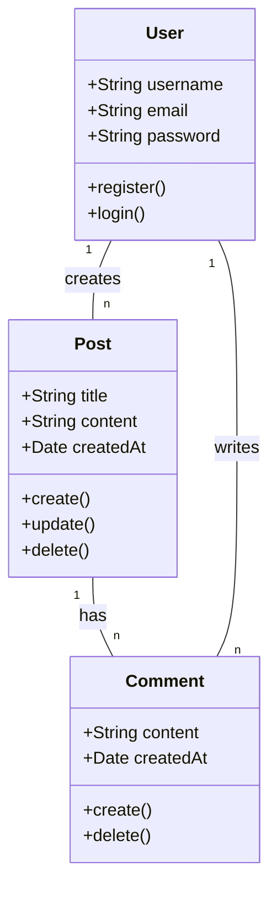

# Mermaid 图表功能测试

这篇文章展示了如何在博客中使用 Mermaid 图表。Mermaid 是一个基于 JavaScript 的图表工具，允许您使用文本创建图表。

## 流程图示例

```mermaid
graph TD
    A[开始] --> B{是否已登录?}
    B -->|是| C[显示用户仪表盘]
    B -->|否| D[显示登录页面]
    C --> E[用户操作]
    D --> F[用户登录]
    F --> C
    E --> G[结束]
```

## 时序图示例

```mermaid
sequenceDiagram
    participant 用户
    participant 前端
    participant API
    participant 数据库

    用户->>前端: 提交表单
    前端->>API: 发送数据
    API->>数据库: 存储数据
    数据库-->>API: 确认保存
    API-->>前端: 返回结果
    前端-->>用户: 显示成功消息
```

## 甘特图示例

```mermaid
gantt
    title 项目开发计划
    dateFormat  YYYY-MM-DD
    
    section 设计阶段
    需求分析          :a1, 2023-10-01, 7d
    UI/UX设计        :a2, after a1, 10d
    
    section 开发阶段
    前端开发          :a3, after a2, 15d
    后端开发          :a4, 2023-10-08, 20d
    
    section 测试阶段
    集成测试          :a5, after a3, 7d
    用户测试          :a6, after a5, 5d
```

## 饼图示例

```mermaid
pie title 网站访问来源
    "搜索引擎" : 42.7
    "直接访问" : 25.3
    "社交媒体" : 22.1
    "其他来源" : 9.9
```

## 类图示例

```mermaid
classDiagram
    class User {
        +String username
        +String email
        +String password
        +register()
        +login()
    }
    
    class Post {
        +String title
        +String content
        +Date createdAt
        +create()
        +update()
        +delete()
    }
    
    class Comment {
        +String content
        +Date createdAt
        +create()
        +delete()
    }
    
    User "1" -- "n" Post : creates
    Post "1" -- "n" Comment : has
    User "1" -- "n" Comment : writes
```

使用 Mermaid 可以轻松创建各种图表，帮助读者更好地理解复杂的概念和流程。 