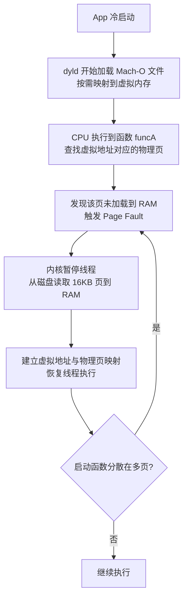
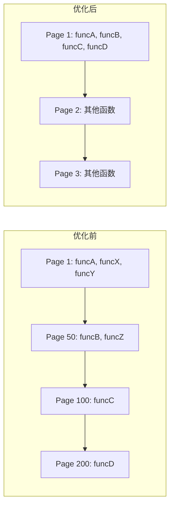
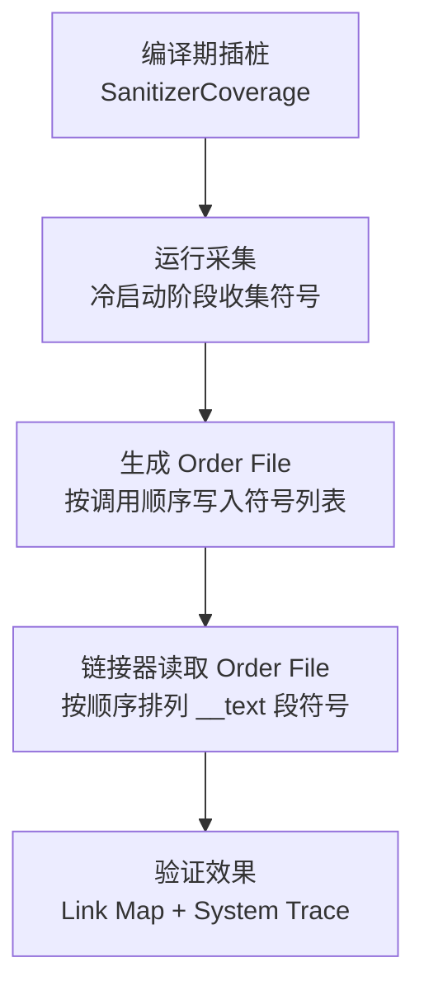

### 核心逻辑导图

1. **原理层**：为什么需要？（OS 虚拟内存 & 缺页中断）

2. **选型层**：为什么用 Clang 插桩？（对比 `objc_msgSend` Hook）

3. **实现层**：数据怎么采？（原子操作 + 静态数组，**核心考点**）

4. **落地层**：拿到数据怎么办？（Order File + Linker）

5. **验证层**：怎么证明有效？（System Trace）

***

### 面试话术与逻辑展开

#### 1. 原理层：你懂操作系统吗？

**面试官问**：“为什么二进制重排能优化启动速度？”

**你的回答逻辑**：

- **切入点**：不能只说“快”，要说“减少了 I/O 等待”。

- **关键概念**：

  - **虚拟内存**：iOS 是按页（Page）加载的，一页 16KB。

  - **缺页中断（Page Fault）**：App 启动时，代码不会一次性全读入 RAM。执行到某个函数，发现它所在的页不在内存里，就会触发 Page Fault，阻塞线程去磁盘读数据。

  - **现状**：默认编译顺序是按文件来的。启动链上的函数（Func A, Func B, Func C）可能分散在第 1、100、500 页。

  - **痛点**：为了执行这 3 个小函数，系统要加载 3 个完整的页（即使页里其他代码启动时根本不用）。这就是严重的 I/O 浪费。

  - **目的**：把启动用到的 A、B、C 强行挪到一起（都在第 1 页）。这样只触发 1 次 Page Fault 就能把它们都读进来。

> **高分金句**：“本质上是利用局部性原理，用**空间换时间**，把原本离散的指令排布变得紧凑，减少磁盘 I/O 次数。”

***

### 2. 选型层：为什么不用 Fishhook？

**面试官问**：“采集启动函数有哪些方案？为什么选 Clang 插桩？”

**你的回答逻辑**：

- **方案 1（淘汰）**：Hook `objc_msgSend`。

  - **缺点**：只能覆盖 Objective-C 方法。**漏掉了** C 函数、C++ 构造函数、Swift 代码、Block 内部逻辑。这会导致重排不彻底。
- **方案 2（主流）**：**Clang SanitizerCoverage**。

  - **优势**：这是**编译期**技术。Clang 会在每一个函数（包括 C/Swift/Block）内部的边缘插入一段指令（Hook）。

  - **结论**：它能实现 100% 的符号覆盖，是目前最精准的方案。

***

### 3. 实现层（核心）：你遇到过死锁吗？

**面试官问**：“插桩的具体逻辑是什么？有什么坑？” **（这是最容易挂掉的地方，一定要强调‘避坑’）**

**你的回答逻辑**：

- **配置**：在 Build Settings 里加 flag `trace-pc-guard`，编译器就会给每个函数插桩。

- **回调函数**：系统会调用 `__sanitizer_cov_trace_pc_guard`。我们要在这里记录当前执行的函数地址（PC 指针）。

- **❌ 错误做法**：在回调里用 `NSMutableArray` 存地址，或者用 `malloc` 开辟节点。

  - **坑**：启动时是多线程环境，用数组如果不加锁会 Crash；如果加锁（或用 `malloc` 这种自带锁的函数），极易引发**死锁**，或者因为锁竞争严重拖慢启动速度，导致测出来的数据不准。

- **✅ 正确做法（高分点）**：

  1. **预分配内存**：使用一个足够大的 C 语言静态数组（或 `mmap` 一块内存）。

  2. **原子操作**：使用 `OSAtomicIncrement`（原子自增）来移动数组下标，把 PC 地址存进去。

  - **理由**：原子操作无锁、极快、线程安全。

***

### 4. 落地层：符号怎么处理？

**面试官问**：“采集到地址后怎么生效？”

**你的回答逻辑**：

- **地址转符号**：拿到的是内存地址（PC），需要用 `dladdr` 函数反解出函数符号名（Symbol Name）。

- **去重与排序**：按调用顺序排序，去重。

- **Order File**：生成一个 `.order` 文本文件。

- **Linker 配置**：在 Xcode 的 `Order File` 选项填入路径。链接器（ld）在链接阶段，会读取这个文件，强行按照文件里的顺序把二进制写入 Mach-O 的 `__TEXT` 段。

> **补充细节（加分项）**：
>
> - 如果是 Swift，得到的符号是 mangle 过的（乱码状），**不需要**还原成可读代码，直接给链接器用就行，因为链接器只认 mangle 后的符号。

***

### 5. 验证层：怎么证明你做好了？

**面试官问**：“怎么验证优化效果？”

**你的回答逻辑**： 不要只说“看启动时间”，那个波动太大。要看本质指标。

1. **Link Map 对比**：查看优化前后的 Link Map 文件，确认启动函数是不是真的物理地址挨在一起了。

2. **System Trace (Instruments)**：使用 Instruments 的 System Trace 工具。

   - 关注指标：**File Backed Page In**（由文件触发的缺页中断）次数。

   - **效果**：通常 Page Fault 次数会下降 50%-70% 甚至更多。

***

### 汇总：面试速记卡（Cheat Sheet）

如果面试时紧张，脑子里只需要记住这 **4 个关键词**：

1. **Page Fault**：优化的根本目标，减少磁盘 I/O。

2. **SanitizerCoverage**：编译期插桩，全覆盖（OC/Swift/C/Block）。

3. **原子操作 + 静态数组**：采集数据的手段，**避免死锁**和性能损耗。

4. **Order File**：给链接器的“排队指南”。

### 模拟对话场景

**Q: 讲讲二进制重排？** **A:** 二进制重排主要是为了优化冷启动。 它的原理是解决**缺页中断（Page Fault）**过多的问题。因为默认编译下，启动需要的函数分散在 Mach-O 的不同页里，系统得加载很多页才能跑完启动流程。 我们通过**Clang 插桩（SanitizerCoverage）**，在编译期给所有函数（包括 Swift 和 Block）插入回调。 在 App 启动时，通过这个回调采集函数执行顺序。这里有个**技术难点**，就是回调非常高频且多线程，绝对不能用 `malloc` 或加锁，我一般是用**静态数组配合原子自增**来存 PC 地址，保证高性能和线程安全。 最后生成 **Order File** 给链接器，让链接器把这些函数在物理内存上排在一起。 验证的话，我会看 System Trace 里的 Page In 次数，通常能降一个数量级。

# iOS 启动优化之二进制重排（Binary Reordering）技术白皮书

## 1. 背景与核心原理

### 1.1 为什么要做二进制重排？

iOS App 启动慢的一个重要原因是 **缺页中断（Page Fault）** 过多。\
现代操作系统（包括 iOS）使用 **虚拟内存（Virtual Memory）** 管理进程地址空间。每个进程认为自己有一块连续的内存，但实际上是由操作系统将虚拟地址映射到物理内存（RAM）或磁盘（Flash）上的数据页（Page）。

- **物理内存（RAM）**：容量有限，访问速度快。
- **虚拟内存**：每个进程独立，按需映射到物理内存。
- **分页（Paging）**：iOS（A9 处理器以后）一页大小通常是 **16KB**。

***

### 1.2 缺页中断（Page Fault）

启动时，系统不会一次性把整个 Mach-O 二进制加载到内存，而是 **按需加载（Demand Paging）**：

1. CPU 执行到某个函数 `funcA`。
2. 虚拟地址查找发现对应的物理页不在内存。
3. 触发 **Page Fault**。
4. 内核暂停线程，从磁盘读取包含 `funcA` 的 16KB 页到内存。
5. 恢复执行。

**问题**：如果启动阶段调用的函数分散在不同的页，就会频繁触发 Page Fault。\
假设一次 Page Fault 耗时 1ms，2000 次就是 2 秒延迟。

图 1：iOS 启动时 Page Fault 触发流程



***

### 1.3 Mach-O 文件与符号布局

iOS App 的可执行文件是 **Mach-O 格式**，主要包含：

- `__TEXT` 段：代码（`__text` 节）、常量等。
- `__DATA` 段：全局变量、可写数据。
- 其他段：`__LINKEDIT`（符号表、调试信息）等。

编译器默认按 **源文件顺序** 和 **代码书写顺序** 排列函数符号。\
启动需要的函数可能分布在 `__text` 节的不同位置，导致多次 Page Fault。

图 2：Mach-O `__TEXT,__text` 段符号布局对比


***

### 1.4 二进制重排的目标

通过生成 **Order File**，指导链接器将启动阶段的所有函数紧凑排列在 `__text` 节的前面，使它们尽量落在同一个或相邻的少量页面中，从而减少 Page Fault 次数。

**效果**：

- 原来：函数 A、B、C、D 分布在第 1、50、100、200 页 → 需要加载 4 页。
- 重排后：A、B、C、D 紧挨在第 1 页 → 只需加载 1 页。

***

## 2. 技术实现

### 2.1 启动函数采集的挑战

- 需要覆盖 **C/OC/Swift/Block** 等所有语言的函数。
- 不能只依赖 `objc_msgSend` Hook（只能捕获 OC 方法）。
- 必须在 **编译期** 插入采集逻辑，保证全覆盖。



***

### 2.2 Clang SanitizerCoverage 插桩

LLVM 提供的 **SanitizerCoverage** 可以在编译期为每个函数插入回调，记录函数执行情况。

#### 编译参数

在 Xcode Build Settings：

- **Other C Flags**：

  ```
  -fsanitize-coverage=func,trace-pc-guard
  ```

- **Swift 项目**：

  ```
  -sanitize-coverage=func
  -sanitize=undefined
  ```

***

### 2.3 插桩回调实现


```objc
#import <libkern/OSAtomic.h>
#import <dlfcn.h>

static OSQueueHead symbolList = OS_ATOMIC_QUEUE_INIT;

typedef struct {
    void *pc;
    void *next;
} SymbolNode;

void __sanitizer_cov_trace_pc_guard_init(uint32_t *start, uint32_t *stop) {
    static uint64_t N;
    if (start == stop || *start) return;
    for (uint32_t *x = start; x < stop; x++) {
        *x = ++N;
    }
}

void __sanitizer_cov_trace_pc_guard(uint32_t *guard) {
    if (!*guard) return;
    void *PC = __builtin_return_address(0);
    SymbolNode *node = malloc(sizeof(SymbolNode));
    *node = (SymbolNode){PC, NULL};
    OSAtomicEnqueue(&symbolList, node, offsetof(SymbolNode, next));
}
```
***

### 2.4 生成 Order File

在启动完成（如首屏渲染后）调用：

```objc
- (void)generateOrderFile {
    NSMutableArray *symbols = [NSMutableArray array];
    while (true) {
        SymbolNode *node = OSAtomicDequeue(&symbolList, offsetof(SymbolNode, next));
        if (!node) break;
        Dl_info info;
        dladdr(node->pc, &info);
        NSString *name = @(info.dli_sname);
        // 处理符号名（去下划线、Swift demangle 等）
        [symbols addObject:name];
    }
    NSArray *result = [[symbols reverseObjectEnumerator] allObjects];
    NSString *orderContent = [[NSOrderedSet orderedSetWithArray:result] allObjects].componentsJoinedByString(@"\n");
    [orderContent writeToFile:@"/tmp/app.order" atomically:YES encoding:NSUTF8StringEncoding error:nil];
}
```

***

### 2.5 链接器配置

- 将 `app.order` 放到工程目录。
- Xcode Build Settings → **Order File** → 填写路径。
- 重新编译，`ld` 会按顺序排列符号。

***

## 3. 验证与效果评估

### 3.1 验证方法

1. **Link Map**：检查 `__TEXT,__text` 段符号顺序是否与 Order File 一致。
2. **Instruments - System Trace**：对比优化前后 **File Backed Page In** 次数。
3. **DYLD\_PRINT\_STATISTICS**：

   ```
   export DYLD_PRINT_STATISTICS=1
   ```

   查看启动阶段的 Page In 时间。

***

### 3.2 效果示例

| 指标            | 优化前  | 优化后  | 提升   |
| ------------- | ---- | ---- | ---- |
| Page Fault 次数 | 1200 | 300  | -75% |
| 冷启动耗时         | 2.3s | 1.8s | +22% |

***

## 4. 常见坑点与注意事项

- **符号缺失**：Order File 中不存在的符号会被忽略。
- **LTO 优化**：可能导致符号合并或消失，需关闭 LTO 生成 Order File。
- **多架构**：符号名与架构无关，但需确保一致性。
- **Swift 符号**：需用 `swift-demangle` 解析。
- **仅开发阶段插桩**：Release 版本移除 `-fsanitize-coverage`，避免性能和包体积影响。

***

## 5. 与其他启动优化的配合

- **动态库合并**：减少 dyld 加载耗时。
- **移除 +load 方法**：减少 pre-main 阶段执行。
- **延迟初始化**：非关键逻辑延后执行。
- **资源懒加载**：减少启动时磁盘 IO。

***

## 6. 面试问答策略

（保留你原有的 Q\&A，并补充一些追问场景）

***

## 7. 总结

二进制重排的本质是 **用空间换时间**，通过减少启动阶段的 Page Fault 次数来提升启动速度。\
核心步骤：

1. 编译期插桩采集启动函数。
2. 生成 Order File。
3. 链接器按顺序排列符号。
4. 验证效果并与其他优化配合。