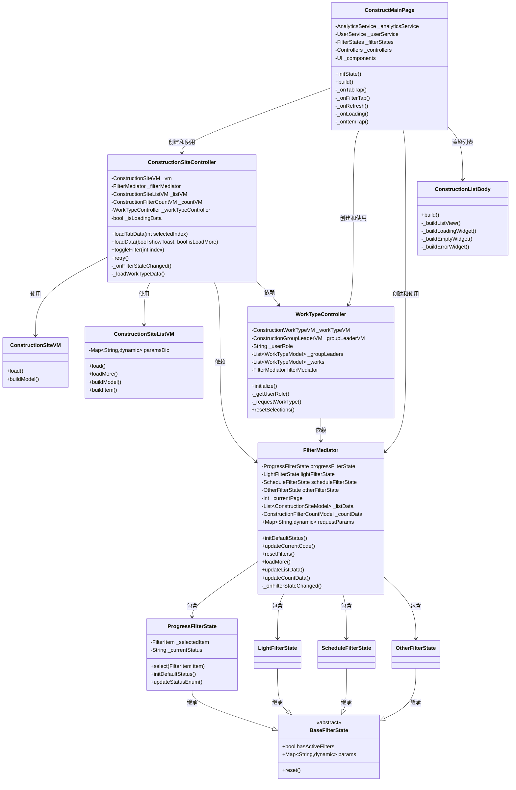
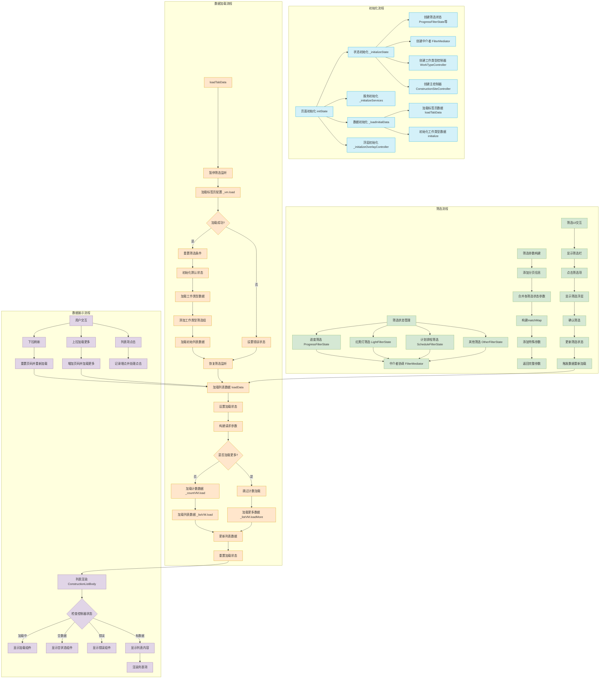

## 1. 概述

本文档详细描述了工地模块（Construction Site）V2 版本的架构设计与实现。新架构采用了 MVVM 模式，结合状态管理和中介者模式，实现了高内聚低耦合的代码结构，提高了代码可维护性和可扩展性，并优化了用户体验。

## 2. 架构设计目标

- 关注点分离：清晰划分视图层、控制器层、状态管理层和数据层

- 状态一致性：确保各组件状态同步，提供一致的用户体验

- 代码复用：抽象共用逻辑，减少代码冗余

- 性能优化：减少不必要的重建和网络请求

- 易于扩展：支持新功能快速集成，无需大规模重构

- 错误处理：提供完善的错误处理机制

## 3. 核心架构组件

### 3.1 架构概览

### 3.2 视图层

视图层主要由以下组件构成：

- ConstructMainPage：主页面，负责整体布局和组件组装

- ConstructionHeader：头部组件，显示标签页和标题

- ConstructionFilterSection：筛选区域组件，显示筛选栏和筛选计数

- ConstructionListBody：列表主体组件，负责显示工地列表

- ConstructionSiteItemWidget：列表项组件，显示单个工地信息

### 3.3 控制器层

控制器层负责业务逻辑处理和状态管理：

- ConstructionSiteController：主控制器，负责协调整体数据流和操作

- WorkTypeController：工作类型控制器，负责处理与工作类型相关的逻辑

- FilterOverlayController：筛选浮层控制器，管理筛选浮层的显示和隐藏

### 3.4 状态管理层

状态管理层负责维护应用状态和状态间的协调：

- FilterMediator：筛选状态中介者，协调不同筛选状态间的交互

- ProgressFilterState：进度筛选状态

- LightFilterState：红黄灯筛选状态

- ScheduleFilterState：计划排程筛选状态

- OtherFilterState：其他筛选状态

### 3.5 数据层

数据层负责数据获取和处理：

- ConstructionSiteVM：获取工地配置数据

- ConstructionSiteListVM：获取工地列表数据

- ConstructionFilterCountVM：获取筛选计数数据

- ConstructionWorkTypeVM：获取工作类型数据

## 4. 数据流程

### 4.1 完整数据流程图

### 4.2 初始化流程

1. 页面初始化：在 ConstructMainPage 的 initState() 中启动整个初始化流程

2. 状态初始化：创建各种筛选状态、中介者和控制器

3. 服务初始化：初始化用户服务和分析服务

4. 数据初始化：加载标签页配置和工作类型数据

5. 浮层初始化：初始化筛选浮层控制器

### 4.3 数据加载流程

1. 标签页数据加载：

- 暂停筛选监听，避免在状态重置期间触发不必要的数据加载

- 加载标签页配置数据

- 重置筛选条件

- 初始化默认状态

- 加载工作类型数据

- 添加工作类型相关的筛选组

- 加载初始列表数据

- 恢复筛选监听

1. 工作类型数据加载：

- 获取用户角色

- 根据角色加载相应的工作类型数据

- 创建工作类型筛选组

- 添加到自定义筛选组

1. 列表数据加载：

- 构建请求参数，包含筛选条件和分页信息

- 加载筛选计数数据（非加载更多时）

- 加载列表数据

- 更新筛选状态和列表数据

### 4.4 筛选流程

1. 筛选状态管理：

- 四种筛选状态作为 ChangeNotifier，当状态变化时通知监听器

- FilterMediator 监听这些状态的变化，并在变化时重置页码并通知自己的监听器

1. 筛选参数构建：

- 包含分页信息

- 合并来自各筛选状态的参数

- 构建 matchMap 用于条件匹配

- 添加特殊参数

1. 筛选UI交互：

- 点击筛选栏项目，显示/隐藏筛选浮层

- 在筛选浮层中选择筛选条件

- 确认筛选，更新筛选状态

- 触发数据重新加载

### 4.5 数据展示流程

1. 列表渲染：

- 根据控制器状态显示不同的UI（加载中/空状态/错误/列表内容）

- 使用 SmartRefresher 支持下拉刷新和上拉加载更多

- 列表项显示工地信息

1. 用户交互处理：

- 下拉刷新：重置页码，重新加载数据

- 上拉加载更多：增加页码，加载更多数据

- 列表项点击：记录埋点，打开相应页面

## 5. 关键设计模式与技术

### 5.1 MVVM 架构模式

- Model：数据模型，如 ConstructionSiteModel、FilterItem 等

- View：视图组件，如 ConstructMainPage、ConstructionListBody 等

- ViewModel：数据处理层，如 ConstructionSiteVM、ConstructionSiteListVM 等

- 控制器：业务逻辑处理，如 ConstructionSiteController、WorkTypeController 等

### 5.2 中介者模式

FilterMediator 作为中介者，协调不同筛选状态间的交互，避免了筛选状态之间的直接耦合，使系统更易于维护和扩展。

### 5.3 状态管理

使用 ChangeNotifier 和 Provider 进行状态管理，实现了状态的集中管理和传递，简化了组件间的通信。

### 5.4 模板方法模式

BaseFilterState 定义了筛选状态的基本接口和行为，各具体筛选状态类实现和扩展了这些行为，实现了代码复用和扩展。

### 5.5 组合模式

组件的层次结构使用了组合模式，大组件由小组件组成，形成树形结构，使得系统更易于理解和维护。

## 6. 性能优化策略

### 6.1 精细化重建控制

- 使用 Consumer 精确控制需要重建的UI部分，避免整个页面重建

- 按需通知监听器，避免不必要的重建

### 6.2 请求优化

- 使用标志位（如 _isLoadingData）避免重复加载

- 实现分页加载，避免一次性加载大量数据

- 优化请求参数构建，减少不必要的参数

### 6.3 状态管理优化

- 暂停/恢复筛选监听机制，避免触发连锁反应

- 实现状态静默更新（silent update）机制，避免不必要的通知

- 精确控制状态更新范围，避免全局状态变化

## 7. 错误处理机制

### 7.1 全面的错误状态管理

- 在数据加载失败时设置错误状态

- 在UI层显示友好的错误提示

- 提供重试功能，允许用户快速恢复

### 7.2 细粒度错误处理

- 区分网络错误和数据解析错误

- 为不同组件提供独立的错误处理

- 错误状态不影响其他功能的正常使用

## 8. 可扩展性设计

### 8.1 模块化设计

- 各组件职责单一，易于替换和升级

- 清晰的接口定义，方便集成新功能

- 分层架构使得修改一层不影响其他层

### 8.2 可配置性

- 筛选条件可通过配置动态加载

- 工作类型筛选组可根据用户角色动态显示

- 列表展示可根据需求灵活配置

## 9. 用户体验优化

### 9.1 状态指示

- 加载状态清晰展示

- 错误状态友好提示

- 空状态适当引导

### 9.2 操作流畅性

- 下拉刷新和上拉加载更多体验流畅

- 筛选操作反馈及时

- 列表滚动性能优化

### 9.3 数据一致性

- 确保各组件状态同步

- 避免数据不一致导致的界面错乱

- 保持用户操作的连贯性

## 10. 未来展望

### 10.1 进一步优化方向

- 引入缓存机制，减少重复请求

- 优化首屏加载速度

- 进一步减少代码耦合

### 10.2 功能扩展方向

- 增强筛选能力，支持更复杂的筛选条件

- 添加数据分析功能，提供更多数据洞察

- 优化离线体验，支持部分离线操作

## 11. 总结

工地模块 V2 版本采用了 MVVM 架构模式，结合状态管理和中介者模式，实现了高内聚低耦合的代码结构。通过清晰的责任划分和数据流程设计，提高了代码可维护性和可扩展性，同时优化了用户体验。该架构为后续功能扩展和性能优化提供了良好的基础，是一次成功的架构升级。