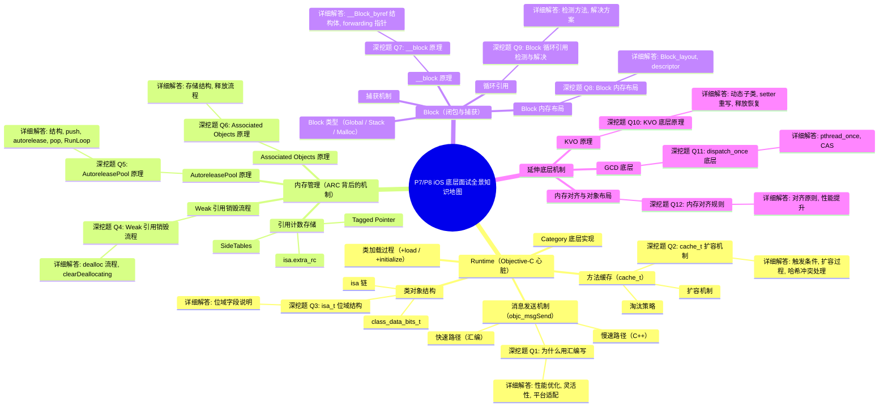
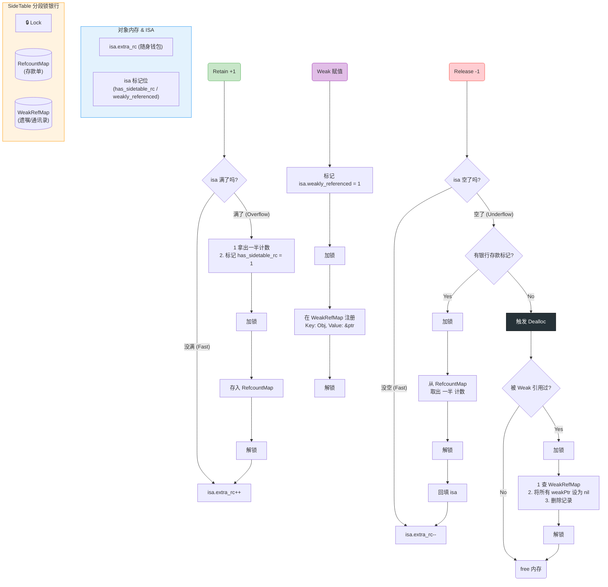

## **1️⃣ Runtime（Objective-C 心脏）**

**核心考点**：消息发送机制、类结构、方法缓存、动态特性

***



### **1.1 消息发送机制（objc\_msgSend）**

- **调用流程**：\
  `[obj foo] → objc_msgSend(obj, @selector(foo))`
- **快速路径（汇编）**：
  1. 检查 obj 是否为 nil（nil 消息安全）。
  2. 通过 `isa` 掩码（ISA\_MASK）找到 Class。
  3. 在 Cache（Buckets）中哈希查找 IMP。
  4. 哈希冲突解决：开放寻址法（向后找，回到头部）。
- **慢速路径（C++）**：
  - `lookUpImpOrForward` → 二分查找 method\_list → 递归查找父类。
  - 动态方法决议：`resolveInstanceMethod`。
  - 消息转发：`forwardingTargetForSelector` → `methodSignatureForSelector` → `forwardInvocation`。

💣 **深挖题 Q1: 为什么 objc\_msgSend 用汇编写？**\
**详细解答**：

1. **性能优化**
   - C 语言函数调用需要建立栈帧，而 `objc_msgSend` 只是查找 IMP 并跳转，不需要额外栈帧。
   - 汇编可直接操作寄存器（ARM64 的 x0, x1, x2...），避免参数搬运到栈上。
   - 消息参数是变长的，C 语言处理变长参数需要额外开销，汇编可直接按寄存器协议传递。
2. **灵活性**
   - 汇编可直接 `jmp` 到 IMP，减少一次函数返回开销。
   - 可内联快速路径，避免函数调用层层嵌套。
3. **平台适配**
   - Apple 为不同架构分别写了高度优化的汇编版本。

***

### **1.2 类对象结构**

- **isa 链**：

  ```
  Instance → Class → MetaClass → RootMetaClass → RootMetaClass（自指）
  ```

- **class\_data\_bits\_t**：
  - 存储 methods、properties、protocols。

- **isa 位域（non-pointer isa）**：
  - 包含引用计数标记、是否有 weak 引用、是否正在析构等信息。

💣 **深挖题 Q3: isa\_t 位域结构？**\
**详细解答**：

```C++
union isa_t {     
    uintptr_t bits;  // 视角 A：原始数据（看作一个 64 位的整数）
    struct {         // 视角 B：精细化数据（看作 64 个独立的开关）
        // ... 里面的位域 ...
    }; 
};
```

- `nonpointer`：是否启用位域优化。
- `shiftcls`：类指针（位移存储）。
- `extra_rc`：引用计数。
- `has_sidetable_rc`：是否有 SideTable 引用计数。
- `weakly_referenced`：是否有 weak 引用。
- `deallocating`：是否正在析构。

- **union (共用体)**：这意味着 bits 和下面的 struct **共用同一块 8 字节（64位）的内存**。

- **互通性**：

  - 当你写 isa.bits = 0x... 时，你是在一次性操作整个 64 位数据。

  - 当你读 isa.extra\_rc 时，你是在精准读取这 64 位中最高的 19 位。

- **uintptr\_t**：在 64 位系统下，等同于 unsigned long long（无符号长整型），占 64 bit。

- **: 1 (位域)**：冒号后面的数字表示该成员**占用几个二进制位 (bit)**。加起来刚好 64 位。


***

### **1.3 方法缓存（cache\_t）**

- **扩容**：占用超过 3/4 → 扩容为原来的 2 倍 → 清空旧缓存。
- **淘汰策略**：无 LRU，冲突时直接覆盖旧值。

💣 **深挖题 Q2: cache\_t 扩容机制？**\
**详细解答**：

1. **触发条件**：缓存占用超过容量的 3/4。
2. **扩容过程**：
   - 新容量 = 原容量 × 2。
   - 清空旧缓存（哈希索引依赖 capacity，扩容后索引全变，重新计算不如清空快）。
3. **哈希冲突处理**：开放寻址法，冲突时向后找空位，末尾回到头部继续找。

***

### **1.4 类加载过程**

- **+load**：
  - 在 image 加载时调用，按依赖顺序，线程安全。
- **+initialize**：
  - 在类第一次接收消息时调用，线程安全，可被继承。

***

### **1.5 Category 底层实现**

- 方法插入到类的 method\_list（优先于原类方法）。
- 不能添加实例变量（内存布局已固定）。

***

## **2️⃣ 内存管理（ARC 背后的机制）**

**核心考点**：引用计数存储、SideTables、Weak 引用、AutoreleasePool

***

### **2.1 引用计数存储**

- **Tagged Pointer**：小对象直接存指针，无引用计数。
- **isa.extra\_rc**：位域存储引用计数，溢出后进入 SideTable。
- **SideTables**：
  - 全局 StripeMap（分段锁哈希表）。
  - 包含 RefcountMap 和 WeakTable。

***

### **2.2 Weak 引用销毁流程**

💣 **深挖题 Q4: Weak 引用销毁流程？**\
**详细解答**：

1. 对象 `dealloc` → `_objc_rootDealloc`。
2. 检查 `isa.weakly_referenced` 位标记。
3. 如果有 weak 引用：
   - 调用 `object_dispose` → `objc_destructInstance` → `clearDeallocating`。
4. `clearDeallocating`：
   - 获取对象地址对应的 SideTable。
   - 在 WeakTable 中查找该对象的 entry。
   - 遍历 entry 中的所有 weak 指针地址，将它们置为 nil。
   - 移除 entry，释放锁。


简单来说，`SideTables` 的数量限制（64 或 8）是 **“锁竞争”** 与 **“内存开销”** 之间的一个**黄金平衡点**。这就是经典的 **分段锁（Lock Striping）** 技术。

以下是适合“高级工程师/架构师”面试的深度回答逻辑：

***

### 1. 核心设计模式：分段锁 (Lock Striping)

**面试官问**：“为什么不直接用一个全局的大表？或者给每个对象配一个表？”

**你的回答**：

- **方案 A：全局一张表 (One Global Table)**

  - 如果有成千上万个对象同时进行 `retain/release` 或 `weak` 操作，所有线程都要抢**同一把锁**。

  - **结果**：严重的锁竞争（Lock Contention），多核 CPU 变成串行执行，性能崩塌。
- **方案 B：每对象一表 (One Table per Object)**

  - 给每个对象分配独立的锁和表。

  - **结果**：内存爆炸。大部分对象可能根本不需要存 weak 指针，这是极大的浪费。
- **方案 C：SideTables (分段锁)**

  - Runtime 选择了折中方案：将所有对象的引用计数表“切分”成固定数量的桶（Buckets）。

  - **64** 个表意味着：理论上支持 **64 个线程同时**并发操作**不同对象**的引用计数，而互不干扰。

***

### 2. 为什么是 64 和 8？(架构差异)

这个数字是在 Runtime 源码的 `StripedMap` 模版中定义的：

- **iPhone (64-bit) / Mac**: **64 个**

  - 现代设备内存充足，且 CPU 核心数较多（6核、8核等）。

  - 64 个槽位足以保证哈希冲突（两个无关对象映射到同一个表）的概率极低，并发性能最优。
- **Legacy iPhone (32-bit)**: **8 个**

  - 老旧设备（如 iPhone 4S/5）内存非常吃紧，CPU 也是双核或单核。

  - 8 个表足以应付当时的并发需求，同时节省内存结构开销。

***

### 3. 🔥 进阶考点：伪共享 (False Sharing) 与 缓存行 (Cache Line)

这是 **P8 / 专家级** 的回答点。

你的回答：

“除了减少锁竞争，选 64 这个数字还可能隐含了对 CPU 缓存行（Cache Line） 的考量。

现代 CPU 的 L1 Cache Line 通常是 64 Bytes。

如果锁的数量太少且内存排列太紧密，可能会发生 **伪共享 (False Sharing)**：

- 核心 A 修改了 `SideTable[0]` 的锁。

- 核心 B 修改了 `SideTable[1]` 的锁。

- 如果这两个锁在同一个 Cache Line 里，CPU 必须通过总线强制同步，导致两个核心互相等待，虽然逻辑上它们锁的是不同的表。

`SideTables` 的结构设计配合 **64** 这个数量，能够让高频访问的锁在内存分布上足够分散，或者配合 Padding（填充），让每个锁独占 Cache Line，从而压榨出最高的硬件性能。”

### SideTable 里存储啥
**`SideTable` 里存储的不仅仅是弱引用对象的地址。它主要存储两个完全不同的东西，它们共用一个锁（这就是为什么分段锁非常关键）：**

1. **外部引用计数 (External Reference Count Map)**

2. **弱引用表 (Weak Reference Map)**

以下是 `SideTable` 的详细构成和每个部分的作用：

***

### 1. 外部引用计数表 (RefcountMap)

这部分通常由 `RefcountMap` 结构体实现，用来存储对象的 **非内嵌** 引用计数。

#### 🔹 作用：解决 `isa` 空间的不足

现代 Objective-C（64 位架构）的内存优化非常激进：

- **内嵌引用计数**：对于大部分对象，它们的 `retain` 计数是直接嵌入在 `isa` 指针中的（有专门的位域存储）。

- **溢出存储**：只有当对象的引用计数超过了 `isa` 能够存储的范围时（比如一个对象被 `retain` 了几千次），或者 `isa` 里的位域被用于其他用途（如 `Tagged Pointer` 标记、锁状态等），Runtime 才会把这个对象的引用计数 **迁移** 到 `SideTable` 的 `RefcountMap` 中。

**结论：** 并非所有对象的引用计数都在 `SideTable` 里，只有那些 **溢出或特殊状态** 的对象才会在此存储。

### 2. 弱引用表 (WeakPointerMap)

这部分通常由 `WeakPointerMap` 结构体实现，用于存储所有指向某个对象的弱引用指针。

#### 🔹 作用：实现弱引用归零 (Zeroing Out)

这是 `SideTable` 存在的另一个主要原因：

1. **存储关系**：它存储了从 **对象地址** 到 **弱引用指针列表** 的映射关系。

   - *Key*：被弱引用的对象的内存地址。

   - *Value*：一个列表，里面存了所有 `__weak` 变量的地址。

2. **对象销毁时**：当对象发生 `dealloc` 时，Runtime 会去它对应的 `SideTable` 中查找 `WeakPointerMap`。

3. **归零**：Runtime 拿到弱引用指针列表后，会遍历这个列表，将所有指向该对象的 `__weak` 变量的值**全部设为 `nil`**，从而避免野指针。

### 3. `SideTable` 的结构模型 (总结)

在 Runtime 源码中，每个 `SideTable` 桶的结构通常包含这三个字段：

| **字段名称**         | **类型**                 | **存储内容**                   | **保护范围**                   |
| ---------------- | ---------------------- | -------------------------- | -------------------------- |
| **`lock`**       | `spinlock_t` 或 `mutex` | 用于保护本 `SideTable` 桶内的数据结构。 | **整个 `SideTable` 桶**       |
| **`refcnts`**    | `RefcountMap`          | 存储**溢出**对象的引用计数。           | `refcnts` (受 `lock` 保护)    |
| **`weak_table`** | `WeakPointerMap`       | 存储弱引用指针的映射关系。              | `weak_table` (受 `lock` 保护) |

### 🔑 架构总结

`SideTable` 的设计体现了 **职责划分** 和 **性能平衡**：

- **分段锁**：`SideTables` 数组（64个）通过分段锁技术，将**引用计数**和**弱引用管理**的压力分散到多个锁上，避免了全局锁的瓶颈。

- **职责合并**：引用计数和弱引用都是对象生命周期管理的一部分，将它们放在同一个 `SideTable` 内的两个 Map 中，可以共用同一把锁，减少了对内存的反复访问，提高了局部性。


***

### 4. 它们是怎么映射的？(哈希算法)

为了证明你看过源码，可以简单提一下映射逻辑：

$Index = (Object\\\_Address >> 4) \\% StripeCount$

- **右移 4 位**：因为对象指针通常是 16 字节对齐的（最后 4 位全是 0）。如果不右移，低位全是 0，会导致哈希分布不均。

- **取模**：均匀分散到 64 个表中。

***

### 总结：面试话术

> “`SideTables` 使用 8 或 64 个表，采用的是\*\*分段锁（Lock Striping）\*\*机制。
>
> 1. **解决并发瓶颈**：如果只有 1 个表，全局锁会卡死所有线程；如果表太多，内存开销大。64 是一个在现代多核 CPU 上，能让**锁竞争几率降到极低**的经验值。
>
> 2. **适配硬件**：32 位系统内存少，所以用 8 个；64 位系统资源足，用 64 个以换取更高并发。
>
> 3. **避免伪共享**：分散的锁布局还能减少 CPU Cache Line 的频繁失效（False Sharing），进一步提升底层效率。”



***

### **2.3 AutoreleasePool 原理**

💣 **深挖题 Q5: AutoreleasePool 原理？**\
**详细解答**：

- **结构**：
  - `AutoreleasePoolPage`：4096 字节，双向链表。
  - 每个 page 存储 autorelease 对象指针。
- **push**：
  - 插入一个 POOL\_BOUNDARY（哨兵对象）。
- **autorelease**：
  - 将对象指针压入当前 page。
  - 如果 page 满，新建 page 链接起来。
- **pop(token)**：
  - 从栈顶开始发送 `release`，直到遇到哨兵。
- **RunLoop 关系**：
  - 在 Entry / BeforeWaiting / Exit 自动 push/pop。

***

### **2.4 Associated Objects 原理**

💣 **深挖题 Q6: Associated Objects 原理？**\
**详细解答**：

- 存储在全局 `AssociationsManager`（哈希表）。
- key：对象地址，value：关联对象列表（map）。
- 释放对象时：
  - `objc_destructInstance` 会调用 `_object_remove_assocations`。
  - 遍历并释放所有关联对象。

***

## **3️⃣ Block（闭包与捕获）**

**核心考点**：类型、捕获机制、\_\_block 原理、循环引用

***

### **3.1 Block 类型**

- **Global**：不捕获变量。
- **Stack**：捕获外部变量，生命周期随栈结束。
- **Malloc**：copy 到堆上，延长生命周期。

***

### **3.2 捕获机制**

- 局部变量：值拷贝。
- 对象：指针拷贝（retain）。
- static 变量：指针传递。
- 全局变量：直接访问。

***

### **3.3 \_\_block 原理**

💣 **深挖题 Q7: \_\_block 原理？**\
**详细解答**：

- 编译器将 \_\_block 变量包装成 `__Block_byref` 结构体：

c

复制

`struct __Block_byref_var {     void *__isa;     struct __Block_byref_var *__forwarding;     int flags;     int size;     int var; };`

- 栈上时 `__forwarding` 指向自己。
- copy 到堆上时：
  - 创建堆副本。
  - 栈上的 `__forwarding` 指向堆副本。
  - 保证 Block 内外访问的是同一个变量。

***

### **3.4 Block 内存布局**

💣 **深挖题 Q8: Block 内存布局？**\
**详细解答**：

c

复制

`struct Block_layout {     void *isa;     int flags;     int reserved;     void (*invoke)(void *, ...);     struct Block_descriptor *descriptor; }; struct Block_descriptor {     unsigned long int reserved;     unsigned long int size;     void (*copy)(void *dst, void *src);     void (*dispose)(void *src); };`

- `invoke`：Block 执行函数指针。
- `descriptor`：包含 size、copy/dispose 函数。
- copy/dispose 用于管理捕获的对象（retain/release）。

***

### **3.5 循环引用**

💣 **深挖题 Q9: Block 循环引用检测与解决？**\
**详细解答**：

- **检测**：
  - Instruments（Leaks）
  - Xcode Memory Graph
  - 静态分析工具
- **解决**：
  - `__weak` 打破环。
  - `__strong` 在 Block 内防止提前释放。

objc

复制

`__weak typeof(self) weakSelf = self; self.block = ^{     __strong typeof(weakSelf) strongSelf = weakSelf;     [strongSelf doSomething]; };`

***

## **4️⃣ 延伸底层机制**

***

### **4.1 KVO 原理**

💣 **深挖题 Q10: KVO 底层原理？**\
**详细解答**：

- 动态生成子类（`NSKVONotifying_Class`）。
- 重写 setter：
  - 调用 `willChangeValueForKey`。
  - 调用原 setter。
  - 调用 `didChangeValueForKey`。
- 释放时恢复原类。

***

### **4.2 GCD 底层**

💣 **深挖题 Q11: dispatch\_once 底层？**\
**详细解答**：

- `dispatch_once` → `pthread_once`。
- 使用静态变量记录是否执行过，CAS 保证线程安全。

***

### **4.3 内存对齐与对象布局**

💣 **深挖题 Q12: 内存对齐规则？**\
**详细解答**：

- 对象内存按最大成员类型对齐。
- 对齐提高 CPU 访问效率，减少跨字节访问。