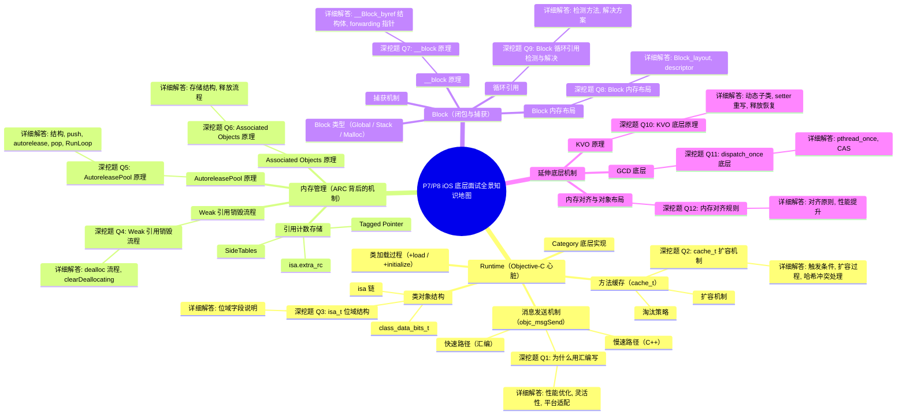

## **1️⃣ Runtime（Objective-C 心脏）**

**核心考点**：消息发送机制、类结构、方法缓存、动态特性

***



### **1.1 消息发送机制（objc\_msgSend）**

- **调用流程**：\
  `[obj foo] → objc_msgSend(obj, @selector(foo))`
- **快速路径（汇编）**：
  1. 检查 obj 是否为 nil（nil 消息安全）。
  2. 通过 `isa` 掩码（ISA\_MASK）找到 Class。
  3. 在 Cache（Buckets）中哈希查找 IMP。
  4. 哈希冲突解决：开放寻址法（向后找，回到头部）。
- **慢速路径（C++）**：
  - `lookUpImpOrForward` → 二分查找 method\_list → 递归查找父类。
  - 动态方法决议：`resolveInstanceMethod`。
  - 消息转发：`forwardingTargetForSelector` → `methodSignatureForSelector` → `forwardInvocation`。

💣 **深挖题 Q1: 为什么 objc\_msgSend 用汇编写？**\
**详细解答**：

1. **性能优化**
   - C 语言函数调用需要建立栈帧，而 `objc_msgSend` 只是查找 IMP 并跳转，不需要额外栈帧。
   - 汇编可直接操作寄存器（ARM64 的 x0, x1, x2...），避免参数搬运到栈上。
   - 消息参数是变长的，C 语言处理变长参数需要额外开销，汇编可直接按寄存器协议传递。
2. **灵活性**
   - 汇编可直接 `jmp` 到 IMP，减少一次函数返回开销。
   - 可内联快速路径，避免函数调用层层嵌套。
3. **平台适配**
   - Apple 为不同架构分别写了高度优化的汇编版本。

***

### **1.2 类对象结构**

- **isa 链**：

  ```
  Instance → Class → MetaClass → RootMetaClass → RootMetaClass（自指）
  ```

- **class\_data\_bits\_t**：
  - 存储 methods、properties、protocols。

- **isa 位域（non-pointer isa）**：
  - 包含引用计数标记、是否有 weak 引用、是否正在析构等信息。

💣 **深挖题 Q3: isa\_t 位域结构？**\
**详细解答**：

c

复制

`union isa_t {     uintptr_t bits;     struct {         uintptr_t nonpointer        : 1;         uintptr_t has_assoc         : 1;         uintptr_t has_cxx_dtor      : 1;         uintptr_t shiftcls          : 33;         uintptr_t magic             : 6;         uintptr_t weakly_referenced : 1;         uintptr_t deallocating      : 1;         uintptr_t has_sidetable_rc  : 1;         uintptr_t extra_rc          : 19;     }; };`

- `nonpointer`：是否启用位域优化。
- `shiftcls`：类指针（位移存储）。
- `extra_rc`：引用计数。
- `has_sidetable_rc`：是否有 SideTable 引用计数。
- `weakly_referenced`：是否有 weak 引用。
- `deallocating`：是否正在析构。

***

### **1.3 方法缓存（cache\_t）**

- **扩容**：占用超过 3/4 → 扩容为原来的 2 倍 → 清空旧缓存。
- **淘汰策略**：无 LRU，冲突时直接覆盖旧值。

💣 **深挖题 Q2: cache\_t 扩容机制？**\
**详细解答**：

1. **触发条件**：缓存占用超过容量的 3/4。
2. **扩容过程**：
   - 新容量 = 原容量 × 2。
   - 清空旧缓存（哈希索引依赖 capacity，扩容后索引全变，重新计算不如清空快）。
3. **哈希冲突处理**：开放寻址法，冲突时向后找空位，末尾回到头部继续找。

***

### **1.4 类加载过程**

- **+load**：
  - 在 image 加载时调用，按依赖顺序，线程安全。
- **+initialize**：
  - 在类第一次接收消息时调用，线程安全，可被继承。

***

### **1.5 Category 底层实现**

- 方法插入到类的 method\_list（优先于原类方法）。
- 不能添加实例变量（内存布局已固定）。

***

## **2️⃣ 内存管理（ARC 背后的机制）**

**核心考点**：引用计数存储、SideTables、Weak 引用、AutoreleasePool

***

### **2.1 引用计数存储**

- **Tagged Pointer**：小对象直接存指针，无引用计数。
- **isa.extra\_rc**：位域存储引用计数，溢出后进入 SideTable。
- **SideTables**：
  - 全局 StripeMap（分段锁哈希表）。
  - 包含 RefcountMap 和 WeakTable。

***

### **2.2 Weak 引用销毁流程**

💣 **深挖题 Q4: Weak 引用销毁流程？**\
**详细解答**：

1. 对象 `dealloc` → `_objc_rootDealloc`。
2. 检查 `isa.weakly_referenced` 位标记。
3. 如果有 weak 引用：
   - 调用 `object_dispose` → `objc_destructInstance` → `clearDeallocating`。
4. `clearDeallocating`：
   - 获取对象地址对应的 SideTable。
   - 在 WeakTable 中查找该对象的 entry。
   - 遍历 entry 中的所有 weak 指针地址，将它们置为 nil。
   - 移除 entry，释放锁。

***

### **2.3 AutoreleasePool 原理**

💣 **深挖题 Q5: AutoreleasePool 原理？**\
**详细解答**：

- **结构**：
  - `AutoreleasePoolPage`：4096 字节，双向链表。
  - 每个 page 存储 autorelease 对象指针。
- **push**：
  - 插入一个 POOL\_BOUNDARY（哨兵对象）。
- **autorelease**：
  - 将对象指针压入当前 page。
  - 如果 page 满，新建 page 链接起来。
- **pop(token)**：
  - 从栈顶开始发送 `release`，直到遇到哨兵。
- **RunLoop 关系**：
  - 在 Entry / BeforeWaiting / Exit 自动 push/pop。

***

### **2.4 Associated Objects 原理**

💣 **深挖题 Q6: Associated Objects 原理？**\
**详细解答**：

- 存储在全局 `AssociationsManager`（哈希表）。
- key：对象地址，value：关联对象列表（map）。
- 释放对象时：
  - `objc_destructInstance` 会调用 `_object_remove_assocations`。
  - 遍历并释放所有关联对象。

***

## **3️⃣ Block（闭包与捕获）**

**核心考点**：类型、捕获机制、\_\_block 原理、循环引用

***

### **3.1 Block 类型**

- **Global**：不捕获变量。
- **Stack**：捕获外部变量，生命周期随栈结束。
- **Malloc**：copy 到堆上，延长生命周期。

***

### **3.2 捕获机制**

- 局部变量：值拷贝。
- 对象：指针拷贝（retain）。
- static 变量：指针传递。
- 全局变量：直接访问。

***

### **3.3 \_\_block 原理**

💣 **深挖题 Q7: \_\_block 原理？**\
**详细解答**：

- 编译器将 \_\_block 变量包装成 `__Block_byref` 结构体：

c

复制

`struct __Block_byref_var {     void *__isa;     struct __Block_byref_var *__forwarding;     int flags;     int size;     int var; };`

- 栈上时 `__forwarding` 指向自己。
- copy 到堆上时：
  - 创建堆副本。
  - 栈上的 `__forwarding` 指向堆副本。
  - 保证 Block 内外访问的是同一个变量。

***

### **3.4 Block 内存布局**

💣 **深挖题 Q8: Block 内存布局？**\
**详细解答**：

c

复制

`struct Block_layout {     void *isa;     int flags;     int reserved;     void (*invoke)(void *, ...);     struct Block_descriptor *descriptor; }; struct Block_descriptor {     unsigned long int reserved;     unsigned long int size;     void (*copy)(void *dst, void *src);     void (*dispose)(void *src); };`

- `invoke`：Block 执行函数指针。
- `descriptor`：包含 size、copy/dispose 函数。
- copy/dispose 用于管理捕获的对象（retain/release）。

***

### **3.5 循环引用**

💣 **深挖题 Q9: Block 循环引用检测与解决？**\
**详细解答**：

- **检测**：
  - Instruments（Leaks）
  - Xcode Memory Graph
  - 静态分析工具
- **解决**：
  - `__weak` 打破环。
  - `__strong` 在 Block 内防止提前释放。

objc

复制

`__weak typeof(self) weakSelf = self; self.block = ^{     __strong typeof(weakSelf) strongSelf = weakSelf;     [strongSelf doSomething]; };`

***

## **4️⃣ 延伸底层机制**

***

### **4.1 KVO 原理**

💣 **深挖题 Q10: KVO 底层原理？**\
**详细解答**：

- 动态生成子类（`NSKVONotifying_Class`）。
- 重写 setter：
  - 调用 `willChangeValueForKey`。
  - 调用原 setter。
  - 调用 `didChangeValueForKey`。
- 释放时恢复原类。

***

### **4.2 GCD 底层**

💣 **深挖题 Q11: dispatch\_once 底层？**\
**详细解答**：

- `dispatch_once` → `pthread_once`。
- 使用静态变量记录是否执行过，CAS 保证线程安全。

***

### **4.3 内存对齐与对象布局**

💣 **深挖题 Q12: 内存对齐规则？**\
**详细解答**：

- 对象内存按最大成员类型对齐。
- 对齐提高 CPU 访问效率，减少跨字节访问。