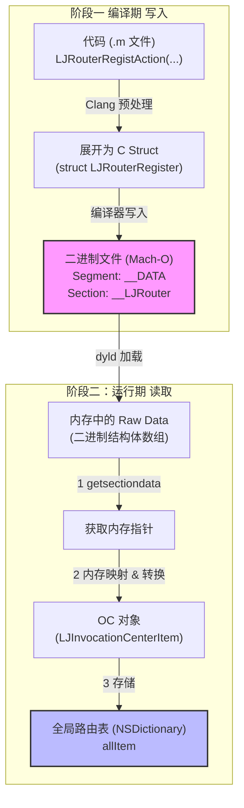
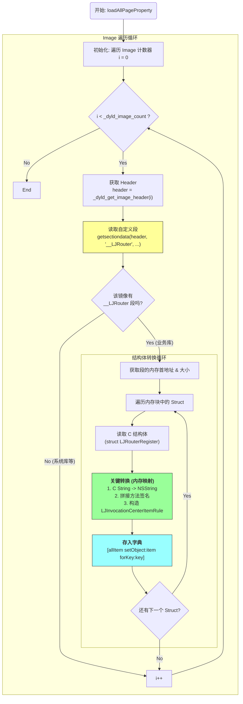
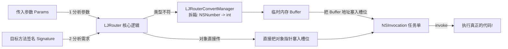
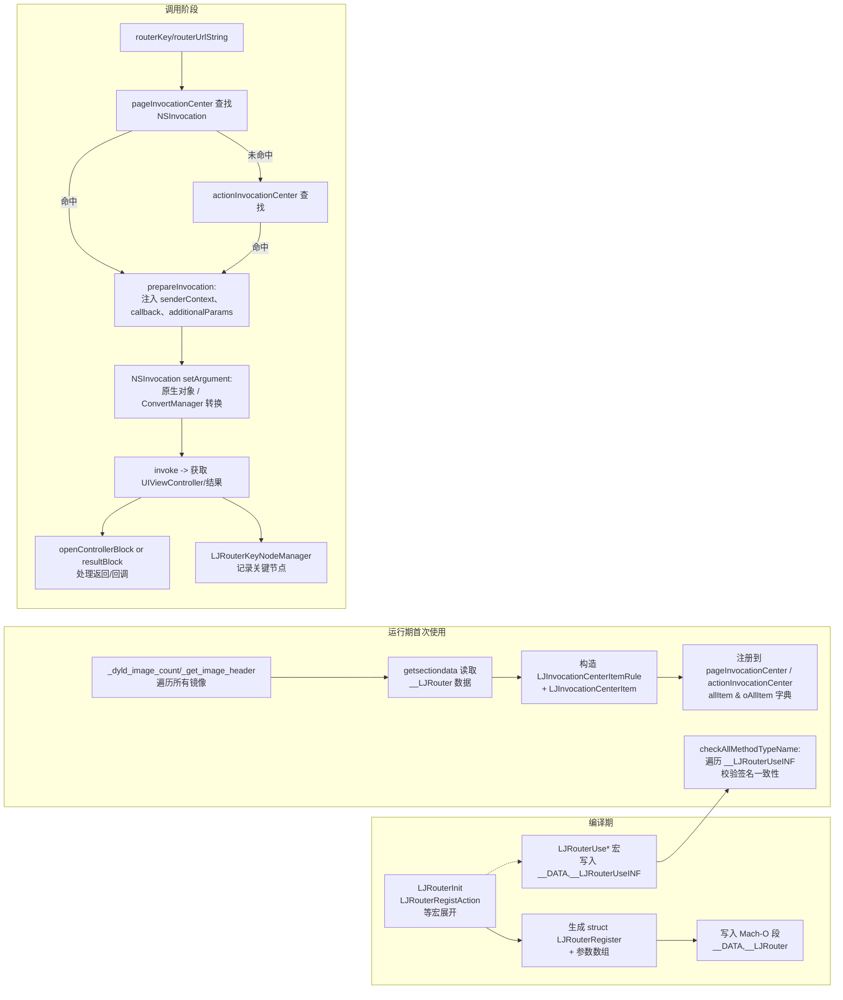
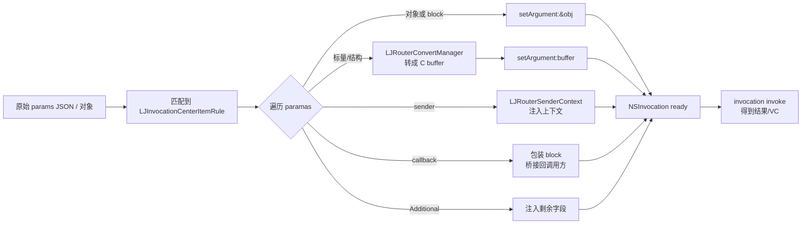
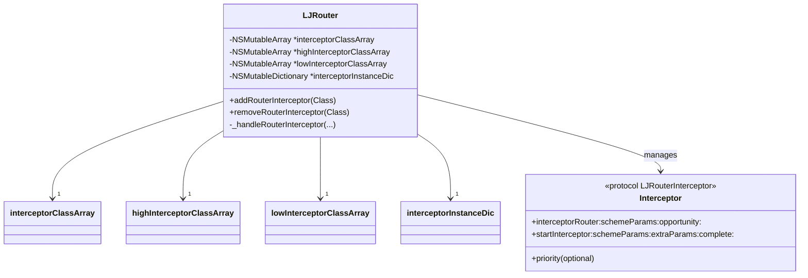
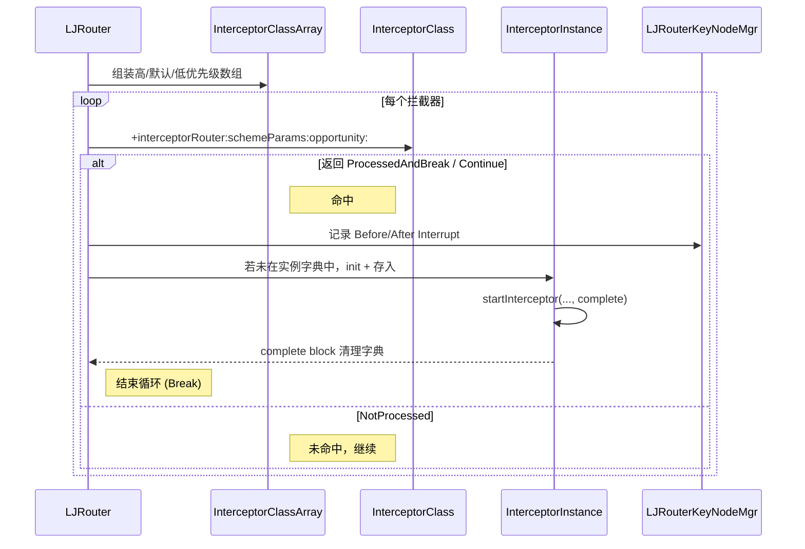
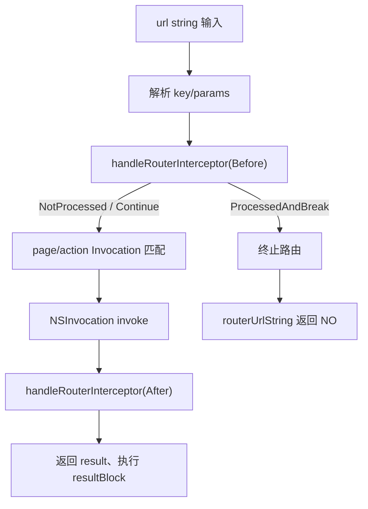

# LJRouter：高性能 iOS 路由框架深度解析

## 1. 概述

**LJRouter** 是一套结合了 **编译期注入**、**运行时动态调用** 和 **智能参数匹配** 的工业级 iOS 路由框架。它旨在解决传统 URL Router 参数类型不安全、硬编码严重的问题，同时比 Protocol Router 具有更高的灵活性。

**核心优势：**

- **去中心化注册**：利用 Mach-O Section 注入，无需手动维护注册表。

- **原生调用性能**：基于 NSInvocation，损耗极小。

- **类型安全**：完备的编译期与运行期类型检查。

- **统一管理**：将“页面跳转”与“功能调用”统一分发。

***

## 2. 核心架构设计

LJRouter 内部通过单例维护核心逻辑，采用**双中心级联查找**机制来分离职责。

### 2.1 核心组件

- **LJRouter (核心单例)**: 对外暴露接口，管理内部组件。

- **LJInvocationCenter (调用中心)**: 存储路由规则 (LJInvocationCenterItem)，执行匹配算法。

- **LJRouterConvertManager (类型转换)**: 负责 JSON/String 到 Native 类型（int, float, NSNumber 等）的自动转换。

- **LJRouterKeyNodeManager (节点监控)**: 负责路由全生命周期的埋点与监控。

### 2.2 双中心查找机制

为了区分页面与服务，LJRouter 维护了两个独立的调用中心：

- **pageInvocationCenter**:

  - **职责**: 专门负责页面路由。

  - **要求**: 目标方法必须返回 UIViewController 实例。

  - **特性**: 自动处理 VC 的 routerCallBack 和 pageFinishedBlock。
- **actionInvocationCenter**:

  - **职责**: 负责通用功能调用（如弹窗、埋点、数据处理）。

  - **要求**: 可返回任意值或 void。

**查找流程 (findInvocation)**:

- **Page 优先**: 收到请求时，优先在 pageInvocationCenter 查找。

- **Action 兜底**: 若未找到，再尝试在 actionInvocationCenter 查找。

***

## 3. 注册机制：Mach-O Section 注入黑科技

LJRouter 摒弃了在 load 方法中手动注册的方式，利用 Clang 属性将注册信息直接写入二进制文件。

### 3.1 宏定义注册

开发者在 .m 文件中使用宏即可完成注册，无需对外暴露头文件。


```objc
// 定义页面路由：参数为 userId (String)
LJRouterDefinePage("name:String,age:int", "user_detail_page", ...)
```

### 3.2 底层存储 (struct LJRouterRegister)

宏在编译预处理阶段展开为静态结构体，并被标记写入 \_\_DATA, \_\_LJRouter 段：


```objc
struct LJRouterRegister {
    char* objcFunctionName; // 注册所在的函数名
    char* filePath;         // 文件路径
    BOOL isAction;          // 是 Page 还是 Action
    NSString *key;          // 路由 Key
    NSString *returnTypeName; // 返回类型
    struct LJRouterRegisterParam *params; // 参数列表
    uint32_t paramscount;   // 参数个数
    NSString *selName;      // 对应的方法名
};
```

### 3.3 启动加载 (loadAllPageProperty)

在 App 启动或首次使用时：

- **遍历 Image**: 使用 \_dyld\_image\_count 和 \_dyld\_get\_image\_header 遍历动态库和主程序。

- **读取 Section**: 使用 getsectiondata 直接读取 \_\_LJRouter 段数据。

- **内存映射**: 将结构体转换为内存对象 LJInvocationCenterItem 并存入字典。

- **优势**: 相比执行成千上万次 registerURL 方法，直接读取二进制段效率极高。
### 宏观数据流向 (从编译到运行)


### 运行时详细执行流程 (loadAllPageProperty)


### 图解说明

- **左侧/上侧（编译期）**：

  - 你写的宏（LJRouterRegistAction）就像是“刻模具”。

  - 编译器把这些模具刻进了二进制文件的一个特定抽屉（\_\_DATA, \_\_LJRouter）里。这一步在 App 还没运行的时候就做完了。
- **右侧/下侧（运行期 - 遍历循环）**：

  - **\_dyld\_image\_count()**：就像知道房间总数。

  - **\_dyld\_get\_image\_header(i)**：就像拿到每个房间的钥匙。

  - **getsectiondata(...)**：拿着钥匙进房间，直奔那个叫 \_\_LJRouter 的抽屉。

    - 注意：系统自带的库（UIKit, Foundation）没有这个抽屉，代码会直接跳过（No 分支），效率很高。

  - **Convert (转换)**：把抽屉里压扁的“纸片”（C Struct）拿出来，吹气膨胀成“立体模型”（Objective-C 对象）。

  - **AddToDict (存表)**：把模型摆到架子上（Dictionary），以后有人要找，直接指架子就行。

这两张图结合起来，就是 LJRouter **“编译期埋雷，运行期扫雷”** 的完整逻辑。

***

## 4. 智能路由匹配与调用

LJRouter 抛弃了简单的 Key-Value 匹配，实现了类似 C++ 的**方法重载 (Overload)** 支持。

### 4.1 评分匹配算法 (nearleastInvocationWithKey)

同一个 Key 可以注册多个不同参数列表的方法。调用时，路由内部会进行评分：

- **遍历规则**: 获取该 Key 下所有注册的 Rule。

- **必选校验**: 检查传入参数是否包含所有 isRequire 的字段。

- **最大匹配原则**: 选择**匹配参数数量最多**的 Rule。

- **次序兜底**: 若匹配数相同，选择定义顺序靠前的（sortIndex）。

### 4.2 参数传递与自动转换

- **原生参数**: 基于 NSInvocation，支持传递复杂对象（Model, UIImage）。

- **自动类型转换**: LJRouterConvertManager 内置了基础类型转换逻辑。若 URL 传入字符串 "123"，目标参数是 int 或 NSNumber，会自动转换。

- **剩余参数 (LJRouterAdditionalParams)**: 未被方法参数消耗的字段，会自动聚合到 LJRouterAdditionalParams 类型的参数中，用于向前兼容。

这段关于 **NSInvocation** 和 **参数传递** 的逻辑确实比较底层，涉及到了 Objective-C 的 runtime 内存模型。为了让你彻底理解，我们把那些复杂的术语先抛开，用\*\*“万能填空题”\*\*的比喻来拆解这个过程。

***

####  4.2.1. 核心道具：NSInvocation 是什么？

想象你平时写代码调用方法 \[userWrapper setAge:18]，就像是**直接说话**，说完就执行了。

而 NSInvocation 就像是一张\*\*“待执行的任务单”\*\*（或者说是“填空题”）。它不会马上执行，而是允许你先把所有条件都填好，最后喊一声“Action”才执行。

这张任务单长这样：

- **目标 (Target)**: userWrapper (那个对象)

- **动作 (Selector)**: setAge: (那个方法)

- **参数 1 (Argument at index 2)**: \_\_\_\_ (待填空的内存槽)

  - (注：index 0 是 self，index 1 是 \_cmd，所以参数从 index 2 开始)

**NSInvocation 的超能力**：它不在乎你填进来的是什么，它只关心**内存地址**。只要你能把数据的内存地址给它，它就能把数据塞进那个方法的参数槽里。

***

####  4.2.2. LJRouter 是如何“填空”的？

当你在 LJRouter 里调用 routerKey:@"..." params:@{...} 时，LJRouter 就在做一个\*\*“匹配 -> 转换 -> 填空”\*\*的过程。

我们分三种情况来看看它是怎么填空的：

#### 情况 A：传递复杂对象（比如 UIImage, User, UIView）

**场景**：

- **目标方法**：- (void)openImage:(UIImage \*)image;

- **传入参数**：params = @{ @"image": myImageObject }

**原理**：\
在 Objective-C 中，所有的对象（Object）其实都是**指针**。\
UIImage \*image 这个变量，本质上存的是**一块内存地址**（比如 0x10086）。

**填空过程**：

- **LJRouter 看一眼方法签名**：发现参数类型是对象 (@)。

- **看一眼传入参数**：发现 myImageObject 也是个对象。

- **直接填入**：LJRouter 直接把 myImageObject 的地址（0x10086）塞进 NSInvocation 的槽里。

**通俗解释**：\
就像方法需要一张“身份证”，你手里正好有一张“身份证”，直接递过去就行了。不需要任何转换，这就是为什么支持传递 Model、View 的原因——**本质上只是传了个地址而已。**

***

#### 情况 B：传递基础类型（比如 int, BOOL）与自动转换

**场景**：

- **目标方法**：- (void)setAge:(int)age;

- **传入参数**：params = @{ @"age": @"18" } (注意这里传的是字符串或者 NSNumber)

**难题**：\
目标方法要的是一个 **Raw Int** (比如占 4 个字节的整数)，但你给的是一个 **OC 对象** (NSString 或 NSNumber)。你不能把一个对象塞进 int 的坑里，会爆炸。

**填空过程（LJRouterConvertManager 出场）**：

- **LJRouter 看一眼方法签名**：发现参数类型是 int (i)。

- **看一眼传入参数**：发现给的是对象 @"18"。类型不匹配！

- **自动转换**：

  - 调用 LJRouterConvertManager。

  - Manager 内部执行逻辑：int value = \[@"18" intValue];

  - Manager 申请一小块临时内存（buffer），把 18 这个整数写进去。

- **填入地址**：把这块**临时内存的地址**塞给 NSInvocation。

- **释放**：用完后，清理这块临时内存。

**通俗解释**：\
方法需要“现金”（int），但你给的是“支票”（NSNumber）。LJRouter 会先去银行把支票兑换成现金，然后再把现金塞进信封里给目标方法。

***

#### 情况 C：剩余参数 (LJRouterAdditionalParams)

**场景**：

- **目标方法**：- (void)updateUser:(NSString \*)name extra:(NSDictionary \*)extra;

- **传入参数**：params = @{ @"name": @"Jack", @"age": 18, @"sex": @"M" }

**填空过程**：

- **匹配 name**：找到 params 里的 name，填入第一个空。

- **发现剩余**：age 和 sex 在目标方法里没有对应的独立参数。

- **打包**：LJRouter 发现目标方法里有一个特殊的参数类型叫 LJRouterAdditionalParams（其实就是 NSDictionary）。

- **注入**：它自动把剩下的 age 和 sex 打包成一个新的字典，填入 extra 这个空里。

**通俗解释**：\
这就是“吃不了兜着走”。方法只吃了“name”，剩下的菜（age, sex），LJRouter 帮你打包进一个袋子（Dictionary）里，一并交给方法。

***

####  4.2.3. 为什么要用 NSInvocation？

你可能会问，为什么不直接用 performSelector？

- performSelector 最多只能传 2 个参数，而且只能传对象。

- NSInvocation 可以传**无限个参数**，而且**不限类型**（int, float, struct, block 都可以）。

####  4.2.4. 总结图解




***
NSInvocation 构建细节

***

## 5. 上下文注入与依赖解耦

解决了“在模块内部如何获取外部环境（如当前 VC）”的痛点。

### 5.1 自动注入 SenderContext

如果在注册方法中声明了 LJRouterSenderContext \* 参数，Router 会自动构建并注入 Context 对象。

- **原理**: 利用 Responder Chain，从调用方传入的 sender（通常是 View）向上查找，获取 contextViewController、rootWindow、appDelegate 等。

### 5.2 回调注入

- **LJRouterCallbackBlock**: 自动将调用方传入的 Block 桥接到目标方法。

- **VC 属性注入**: 若目标 VC 实现了 routerCallBack 属性，Router 创建 VC 后会自动赋值。

### 5.3 页面打开策略

openViewController 方法支持多种策略：

- 优先尝试 openControllerWithContextBlock（带上下文）。

- 检查 VC 是否实现 LJNavigationOpenedByViewController 协议。

- 最后由容器层决定是 Push 还是 Present。

***

## 6. 安全性与监控

### 6.1 类型安全检查 (Type Safety)

动态路由最大的风险是参数错乱导致 Crash。LJRouter 提供了极致的防御：

- **编译/启动自检**:

  - 开发者使用 LJRouterUsePage 宏时，调用签名被写入 \_\_DATA, \_\_LJRouterUseINF。

  - 启动时，checkAllMethodTypeName 对比“注册信息”与“使用信息”。
- **CheckPolicy**: 发现类型不匹配时，可配置策略：

  - **Assert**: 开发环境直接崩溃提醒。

  - **Console**: 控制台报警。

  - **Alert**: 弹窗提示。

### 6.2 拦截器机制 (Interceptor)

  | 模块 | 作用 | 关键代码 |
  | - | - | - |
  | LJRouter+Interceptor 分类 | 提供拦截器增删、执行逻辑；维护优先级队列和实例缓存 | Pods/LJBaseRouter/LJBaseRouter/Classes/LJRouter/LJRouter+Interceptor.m:21 |
  | LJRouterInterceptor 协议 | 规定拦截器三要素：判定方法、真正执行、可选优先级 | Pods/LJBaseRouter/LJBaseRouter/Classes/LJRouter/LJRouter+Interceptor.h:33 |
  | extraParams | 运行期传入的上下文字典，含 VC、sender、pageBlock、callback 等 | Pods/LJBaseRouter/LJBaseRouter/Classes/LJRouter/LJRouter+Interceptor.h:23 |
  | LJRouterKeyNodeManager | 在拦截发生时记录关键节点 BeforeInterrupt / AfterInterrupt | Pods/LJBaseRouter/LJBaseRouter/Classes/LJRouter/LJRouter+Interceptor.m:148 |
  | routerUrlString: / routerKey: | 负责在不同时间点调用 _handleRouterInterceptor | Pods/LJBaseRouter/LJBaseRouter/Classes/LJRouter/LJUrlRouter.m:229、Pods/LJBaseRouter/LJBaseRouter/Classes/LJRouter/LJRouter.m:578
  |


支持 AOP 切面编程，处理路由跳转前后的逻辑（如登录检查）。



 三组数组：highInterceptorClassArray、interceptorClassArray（默认）、lowInterceptorClassArray 存放类对象（Pods/LJBaseRouter/LJBaseRouter/Classes/LJRouter/LJRouter+Interceptor.m:22、35、44）。

  - 实例字典：interceptorInstanceDic 用 URL/路由 key 作为 key，保证同一个 scheme 在未完成前不会重复实例化（Pods/LJBaseRouter/LJBaseRouter/Classes/LJRouter/LJRouter+Interceptor.m:55）。
 
- **生命周期**: BeforeInterrupt (前置拦截) -> 路由执行 -> AfterInterrupt (后置处理)。




判定阶段：调用 +interceptorRouter:schemeParams:opportunity:（类方法，无需实例化），返回三个枚举之一：

      - NotProcessed：未拦截，继续下一个类。

      - ProcessedAndBreak：拦截并阻断后续流程。

      - ProcessedAndContinue：拦截但允许路由继续（Pods/LJBaseRouter/LJBaseRouter/Classes/LJRouter/LJRouter+Interceptor.h:12）。

  - 实例化阶段：若某个类返回 ProcessedAnd\* 并且 interceptorInstanceDic 中不存在该 scheme，立刻 \[\[cls alloc] init]，保存到字典防止同一 scheme 重入（Pods/LJBaseRouter/LJBaseRouter/Classes/LJRouter/

    LJRouter+Interceptor.m:155）。

  - 执行阶段：调用 -startInterceptor:schemeParams:extraParams:complete:，并在 complete 中移除缓存；complete 由拦截器负责调用，允许异步操作（Pods/LJBaseRouter/LJBaseRouter/Classes/LJRouter/

    LJRouter+Interceptor.m:165）。

  - 关键节点：一旦 result = ProcessedAndBreak，立刻通过 LJRouterKeyNodeManager 记录节点，注明拦截器类名与 URL/参数（Pods/LJBaseRouter/LJBaseRouter/Classes/LJRouter/LJRouter+Interceptor.m:148）。

 4. 触发点与时序

  - Before 机会：

      - routerUrlString: 在解析完 URL（\_converturl）后、查找 NSInvocation 之前就调用 handleRouerInterceptor:LJRouterInterceptorOpportunityBefore，传入 result=nil（Pods/LJBaseRouter/LJBaseRouter/Classes/LJRouter/

        LJUrlRouter.m:229）。

      - 旧接口 routerUrlString:pageBlock: 同样在 LJRouter routerKey:... 前调用 \_handleRouterInterceptor（Pods/LJBaseRouter/LJBaseRouter/Classes/LJRouter/LJUrlRouter.m:184）。

  - After 机会：

      - routerKey:url:data: 在成功拿到 VC/结果后，组装 extraParams（包含 kRouterTargetVC、kRouterSender 等）再调用 \_handleRouterInterceptor:url ... opportunity:After（Pods/LJBaseRouter/LJBaseRouter/Classes/

        LJRouter/LJRouter.m:578）。

      - URL 新接口 routerUrlString:sender:callback:resultBlock: 在结果回调后调用 handleRouerInterceptor:After（Pods/LJBaseRouter/LJBaseRouter/Classes/LJRouter/LJUrlRouter.m:265）。

  extraParams 内容

  - kRouterTargetVC：页面路由的 VC。

  - kRouterSender：原始 sender。

  - kRouterPageBlock/kRouterCallbackBlock：调用方的 result/callback block。

  - kRouterCanNotRouterBlock：旧接口的失败回调（Pods/LJBaseRouter/LJBaseRouter/Classes/LJRouter/LJRouter+Interceptor.h:23）。

- **控制权**: 拦截器可返回 ProcessedAndBreak 中断路由。

示例流程:




  判定方法要轻量：+interceptorRouter:schemeParams:opportunity: 是在主线程同步执行的，适合快速判断；任何耗时逻辑应放在实例 startInterceptor 中。

  complete 调用必不可少：忘记调用会导致 interceptorInstanceDic 中残留对象，同一 scheme 再次触发前置拦截时不会创建新实例。

   extraParams 的生命周期：After 阶段可能拿到 nil 的 kRouterTargetVC（Action 路由），拦截器要做好判空。

  关键节点整合：拦截器阻断后会触发 BeforeInterrupt 或 AfterInterrupt 节点，可以结合 LJRouterExportKeyNodeObserver 快速定位是谁拦截了某条路由。

  ———

  综上，LJRouter 的拦截器是针对路由事件的“分层钩子”机制：通过优先级队列 + 类方法判定 + 实例化执行 + 上下文透传，构建出一个高内聚的前/后拦截链路，而无需对任意方法做 swizzling 或切面编程。

---


### 6.3 节点监控 (KeyNode)

LJRouterKeyNodeManager 定义了路由生命周期的关键节点（KeyNode）：

- FindInvocation: 查找开始。

- BeforeInterrupt: 进入拦截器。

- RouterFinished: 路由完成。

- **监控导出**: 配合 LJRouterExportKeyNodeObserver，业务方可轻松接入 APM 系统，监控路由性能和死链。

***

## 7. 总结

**LJRouter** 的设计精髓在于平衡了**灵活性**与**安全性**：

- **底层技术**: 利用 **Mach-O Section** 实现了真正的**分布式注册**，主工程零感知。

- **调用体验**: **NSInvocation** 带来原生级体验，支持**方法重载**和**参数自动补全**。

- **开发效率**: 宏定义简单快捷，配套的**静态分析工具**和**类型检查**杜绝了运行时错误。

- **扩展能力**: 完善的拦截器和节点监控，使其成为一个可治理、可观测的路由系统。


