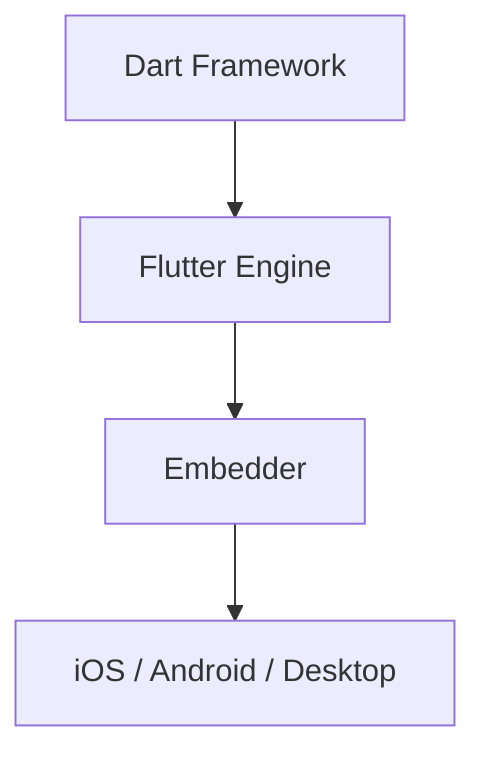

# 面试备战 Flutter 01：架构总纲，Framework、Engine 与 Embedder

Flutter 面试如果只讲 Widget，深度不够。中高级岗位更关心你是否能从 Framework 讲到 Engine，再讲到 iOS Embedder 和混合工程。

Flutter 的核心不是“跨平台 UI 库”，而是：

```text
Dart Framework 描述 UI
-> Engine 自绘渲染
-> Embedder 接入平台窗口、线程、输入、纹理、插件
```

## 1. Flutter 分层架构



### Framework

Dart 层，开发者主要接触：

- Widget。
- Element。
- RenderObject。
- Animation。
- Gesture。
- Painting。
- Material/Cupertino。

它负责 UI 描述、状态更新和渲染树构建。

### Engine

C++ 层，负责：

- Dart Runtime。
- Skia/Impeller。
- 文本布局。
- 图片解码。
- 合成。
- Platform Channel。
- Texture。
- PlatformView。

### Embedder

平台接入层。iOS 上负责：

- 创建 FlutterEngine。
- 创建 FlutterView。
- 接入 UIKit 生命周期。
- 分发触摸事件。
- 管理插件。
- 管理纹理和平台视图。

## 2. Flutter 为什么跨平台？

Flutter 大部分 UI 不使用平台原生控件，而是自绘。

流程：

```text
Widget -> RenderObject -> Layer Tree -> Engine -> Skia/Impeller -> GPU
```

平台提供窗口、输入、线程、系统能力，Flutter 自己控制 UI 绘制。

所以它的优势是 UI 一致性和渲染控制力；代价是平台能力要通过插件/Channel 接入，混合工程要额外治理。

## 3. Flutter 线程模型

常见线程：

- UI Thread：root isolate 在此运行,执行 build/layout/paint。(task runner 是 Engine 的线程抽象,root isolate 绑定到 UI task runner)
- Raster Thread：光栅化 Layer Tree。
- Platform Thread：通常就是宿主平台主线程(iOS/Android main thread),平台消息、插件、Channel、PlatformView 都在它上面调度。
- IO Thread：为 Raster 线程做异步资源准备(如解码后图片的 GPU 纹理上传);图片解码计算本身在 Engine 的 worker 线程池。

卡顿排查必须先判断是哪条线程高。

## 4. Dart isolate 和 Engine

Flutter UI 运行在主 isolate。Dart isolate 之间内存不共享，通过消息通信。

Engine 管理 Dart Runtime 和 isolate，混合开发中 Engine 的创建、销毁、预热、复用都会影响：

- 首帧。
- 内存。
- 页面隔离。
- Channel 上下文。
- 插件生命周期。

## 5. 渲染主线

Flutter 渲染不是直接改屏幕，而是：

```text
Vsync
-> build
-> layout
-> paint
-> layer
-> raster
-> display
```

性能优化要区分：

- rebuild 成本。
- layout 成本。
- paint 成本。
- raster 成本。
- GPU/纹理成本。

## 6. 混合开发主线

iOS + Flutter 面试重点：

- FlutterEngine 策略。
- EngineGroup。
- Native/Flutter 页面栈。
- MethodChannel/EventChannel。
- PlatformView。
- Texture。
- 手势冲突。
- 首帧优化。
- 内存释放。

## 高频追问

### Q1：Flutter 和 RN 本质区别？

Flutter 大部分 UI 自绘，RN 更多桥接原生控件。Flutter 一致性和渲染控制更强，但混合接入和包体/Engine 成本需要治理。

### Q2：Flutter 为什么性能好？

自绘减少平台 View 层级差异，Framework 三棵树复用 Element/RenderObject，Engine 将 Layer Tree 交给高性能渲染后端。但性能好不是自动的，复杂布局、大图、PlatformView 仍会卡。

### Q3：混合工程最难是什么？

Engine 生命周期、页面栈、通信协议、手势、内存和插件多实例治理。


## 深挖追问：Flutter 架构要讲清“谁负责什么”

Flutter 分层不要只背 Framework/Engine/Embedder。要说职责边界：

- Framework：Dart 层 UI 抽象、Widget/Element/RenderObject、动画、手势、语义、调度绑定。
- Engine：C++ 层渲染、文本、图片、Dart VM 集成、平台通道、线程和 raster。
- Embedder：把 Engine 接到具体平台，例如 iOS 的 FlutterViewController、Metal/平台事件、生命周期。

跨平台的本质：

> Flutter 不依赖系统原生控件绘制大部分 UI，而是用自己的渲染管线把 Widget 状态转成 Layer，再交给 Engine/Skia 或 Impeller 绘制。平台只提供窗口、输入、线程、纹理和系统能力接入。

线程模型继续追问：

| 线程 | 责任 |
|---|---|
| UI thread | Dart 代码、build/layout/paint、生成 layer tree |
| Raster thread | 光栅化 layer tree，生成 GPU 命令 |
| Platform thread | 平台消息、插件、iOS 主线程相关任务 |
| IO thread | 图片解码、资源加载等 |

如果 UI thread 不高但仍卡，可能是 raster/GPU/纹理上传瓶颈；如果 Platform thread 被插件阻塞，Channel 和系统事件也会受影响。

和 RN 的本质差异：

- RN 更多是 JS 描述 UI，桥接到原生控件体系。
- Flutter 自绘主 UI，跨平台一致性强，但平台融合和包体有成本。

混合开发最难不是“打开 Flutter 页面”，而是：

- Engine 生命周期。
- 页面栈一致性。
- Channel 协议治理。
- 手势冲突。
- 内存水位。
- Native/Flutter 监控口径统一。

## 一句话总结

Flutter 高阶面试主线是：Framework 负责 UI 和状态，Engine 负责渲染和运行时，Embedder 负责平台接入，混合工程负责把三者长期稳定治理起来。

---

## 🔬 深度扩展：Engine的Dart VM与Skia/Impeller架构

### 扩展1：Flutter三层架构

**Framework（Dart）：**
- Widgets、Elements、RenderObjects
- 手势、动画、路由
- Material/Cupertino组件

**Engine（C++）：**
- Dart VM/Runtime
- Skia/Impeller渲染
- Text布局
- Platform Channels

**Embedder（平台）：**
- iOS：FlutterEngine、FlutterViewController
- Android：FlutterEngine、FlutterActivity
- 生命周期、输入、渲染surface

### 扩展2：Dart VM的两种模式

**JIT（开发模式）：**
```text
优点：
- 热重载
- 快速迭代
- 完整调试信息

缺点：
- 包含VM和编译器
- 包体大
- 启动慢
```

**AOT（发布模式）：**
```text
优点：
- 预编译机器码
- 启动快
- 包体小（相对）

缺点：
- 无法热更新代码
- 编译时间长
```

### 扩展3：Skia vs Impeller

**Skia（旧后端）：**
```text
问题：
- Shader运行时编译（shader jank）
- OpenGL驱动开销大
- 首次动画卡顿

优化：
- SkSL预热（--bundle-sksl-path）
```

**Impeller（新后端）：**
```text
优势：
- Shader离线预编译
- 使用Metal(iOS)/Vulkan(Android)
- 消除shader jank

现状：
- iOS已默认
- Android逐步推广
```

### 扩展4：Platform Channel线程模型

**完整链路：**
```text
Dart (UI Isolate)
  ↓ invokeMethod
Engine (Platform Task Runner)
  ↓ 消息队列
Native (主线程)
  ↓ 执行handler
  ↓ result回调
Engine (Platform Task Runner)
  ↓ 消息队列
Dart (UI Isolate)
  ↓ Future.complete
```

**关键点：**
- Native handler默认主线程
- 耗时操作要手动切后台
- result只能调用一次

### 扩展5：Embedder的生命周期管理

**iOS FlutterEngine：**
```objc
// 创建Engine
FlutterEngine *engine = [[FlutterEngine alloc] initWithName:@"main"];
[engine run];

// 创建ViewController
FlutterViewController *vc = [[FlutterViewController alloc] initWithEngine:engine nibName:nil bundle:nil];

// 展示
[self presentViewController:vc animated:YES completion:nil];

// 销毁时
[engine destroyContext];
```

**多Engine场景：**
- 每个Engine独立Isolate
- 内存占用：首个~20MB，额外~10MB/个
- 共享资源：字体、图片解码器

### 扩展6：混合栈的页面同步

**问题：**
```text
Native Stack: [A, B, C]
Flutter Stack: [D, E]

Native pop B → Flutter不知道
Flutter pop E → Native不知道
```

**解决：**
```dart
// Flutter侧监听
SystemChannels.navigation.setMethodCallHandler((call) {
  if (call.method == 'popRoute') {
    // Native要求Flutter pop
    Navigator.pop(context);
  }
});

// Native侧
[flutterVC popRoute];  // 通知Flutter pop
```

### 扩展7：手势冲突的优先级

**iOS侧滑返回 vs Flutter手势：**
```text
优先级：
1. Native手势识别器（边缘滑动）
2. Flutter Gesture Arena
3. Flutter Widget的手势

冲突：
- Native识别成功 → Flutter收不到完整序列
- Flutter先响应 → Native边缘滑动失效
```

**解决：**
```objc
// 允许Native和Flutter手势共存
flutterVC.view.gestureRecognizers = @[edgeGesture];
edgeGesture.delegate = self;

- (BOOL)gestureRecognizer:(UIGestureRecognizer *)gestureRecognizer
shouldRecognizeSimultaneouslyWithGestureRecognizer:(UIGestureRecognizer *)otherGestureRecognizer {
    return YES;
}
```

### 扩展8：内存水位监控

**Flutter内存组成：**
```text
1. Dart Heap（DevTools可见）
2. Native内存（图片解码、PlatformView）
3. GPU内存（纹理、Layer）
```

**监控方案：**
```dart
// Dart Heap
import 'dart:developer';
final heapUsage = getCurrentRSS();

// 总内存（Native工具）
iOS: Instruments Memory
Android: Android Profiler
```

---

## 补充总结

Flutter架构的深度记忆点：

1. **三层架构**：Framework(Dart) → Engine(C++) → Embedder(平台)
2. **Dart VM**：JIT开发模式、AOT发布模式
3. **Skia vs Impeller**：Shader预编译消除jank
4. **Platform Channel**：Native handler默认主线程
5. **Embedder**：FlutterEngine管理Isolate生命周期
6. **混合栈**：页面栈同步、手势冲突
7. **内存水位**：Dart Heap + Native + GPU

面试追问时要能讲出：
- Flutter三层架构的职责划分
- JIT和AOT的差异（热重载vs预编译）
- Impeller的核心优化（Shader离线编译）
- 混合栈的同步机制（Channel通知）
