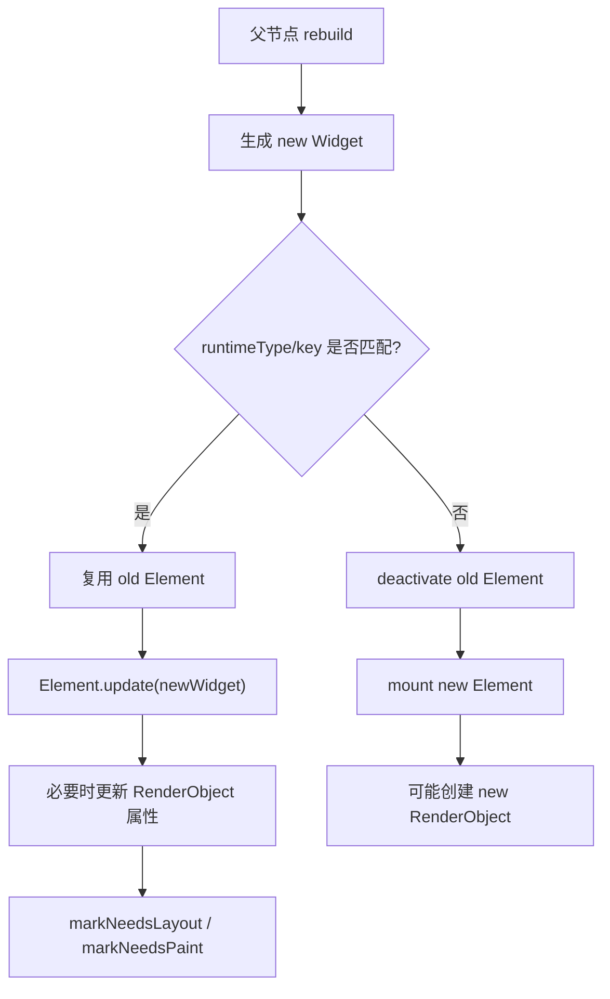

# 面试备战 Flutter 04：三棵树，Widget、Element 与 RenderObject

Flutter 面试里，“三棵树”不是让你背 Widget、Element、RenderObject 三个名词。真正的问题是：

- 为什么 Widget 可以频繁创建？
- State 到底保存在哪里？
- `setState` 为什么不是直接刷新屏幕？
- Key 为什么能决定状态是否保留？
- rebuild、relayout、repaint 为什么不是一回事？

这篇文章要把这条底层链路讲清楚：

```text
Widget 配置变化 -> Element diff/复用 -> State 生命周期 -> RenderObject 更新 -> Layout/Paint
```

## 1. Flutter 为什么需要三棵树？

如果只有一棵 View 树，每次状态变化都直接改真实视图，会遇到两个问题：

1. UI 描述和渲染实现耦合。
2. 更新时很难低成本判断哪些节点要保留，哪些节点要重建。

Flutter 的设计是把 UI 拆成三层：

| 树 | 本质 | 职责 | 成本 |
|---|---|---|---|
| Widget Tree | 不可变配置 | 描述 UI 应该是什么样 | 低 |
| Element Tree | 可变实例 | 管理挂载、复用、State、BuildContext | 中 |
| RenderObject Tree | 渲染对象 | 负责 layout、paint、hitTest | 高 |

核心思想：

> 便宜的 Widget 可以频繁创建，昂贵的 Element 和 RenderObject 尽量复用。

## 2. Widget：它不是 View，而是配置

Widget 是 immutable 的 Dart 对象。

```dart
class Text extends StatelessWidget {
  final String data;
  const Text(this.data, {super.key});
}
```

`Text('A')` 和 `Text('B')` 是两份不同配置。Flutter 不试图修改旧 Widget，而是创建新 Widget，再交给 Element 判断如何更新底层节点。

所以这句话很关键：

> Flutter 不是在修改 Widget，而是在用新的 Widget 配置更新已有 Element。

### 为什么 Widget 频繁创建没那么可怕？

因为 Widget 很轻：

- 只是配置对象。
- 不直接持有渲染资源。
- 不直接持有平台 View。
- 不保存复杂生命周期。

真正昂贵的是：

- Element 的挂载和卸载。
- RenderObject 的创建、layout、paint。
- Layer 和 GPU 资源。

## 3. Element：Flutter 更新算法的核心

Element 是 Widget 的实例化节点，也是 BuildContext 的真实身份。

你写：

```dart
Widget build(BuildContext context) {
  return Container();
}
```

这里的 `context` 本质上就是某个 Element。

Element 负责：

- 持有当前 Widget。
- 持有父子 Element 关系。
- 管理 mount/update/unmount。
- 对 StatefulWidget 关联 State。
- 调用 build。
- 决定子节点能否复用。

## 4. State 保存在哪里？

这是高频问题。

State 不保存在 StatefulWidget 里，而是由 StatefulElement 持有。

简化关系：

```text
StatefulWidget(new config)
        |
        v
StatefulElement  ---->  State(old memory)
        |
        v
child Element
```

当父组件 rebuild，生成一个新的 StatefulWidget：

```dart
Counter(title: 'new')
```

只要 runtimeType 和 key 匹配，原来的 StatefulElement 会复用，State 不销毁，只是 Element 里的 widget 引用更新成新配置，然后触发：

```dart
didUpdateWidget(oldWidget)
build()
```

这解释了为什么 StatefulWidget 是不可变的，但 State 可以持续存在。

## 5. RenderObject：真正干脏活的渲染对象

RenderObject 负责：

- 接收 constraints。
- 计算 size。
- 设置 child offset。
- 生成绘制指令。
- 命中测试。

不是所有 Widget 都创建 RenderObject。

例如：

- `StatelessWidget`：不直接创建 RenderObject，只负责 build。
- `StatefulWidget`：不直接创建 RenderObject，只负责 State。
- `RenderObjectWidget`：会创建 RenderObject。

RenderObjectWidget 的三个抽象基类:

- `LeafRenderObjectWidget`(无子节点,如 `RichText`)。
- `SingleChildRenderObjectWidget`(单子节点,如 `Padding`)。
- `MultiChildRenderObjectWidget`(多子节点,如 `Flex`/`Stack`)。

注意 `Container` 本身是 StatelessWidget,内部组合 `ConstrainedBox`/`Padding`/`DecoratedBox` 等,并不是 RenderObjectWidget。

## 6. Widget 到 RenderObject 的更新链路

简化流程：



这就是 Flutter 性能的关键：绝大多数更新不是“推倒重来”，而是复用 Element 和 RenderObject。

## 7. Element 复用规则：runtimeType + key

Flutter 判断一个旧 Element 能否更新为新 Widget，核心条件：

```text
Widget.canUpdate(old, new):
  old.runtimeType == new.runtimeType && old.key == new.key
```

如果满足，Element 复用。

如果不满足，旧 Element 卸载，新 Element 创建。

这就是 Key 的根本意义：

> Key 不是给 Widget 起名字，而是参与 Element 身份匹配。

## 8. 为什么列表不用 Key 会状态错乱？

假设有列表：

```dart
[
  TodoItem("A", checked: true),
  TodoItem("B", checked: false),
]
```

如果每个 item 是 StatefulWidget，但没有 Key。当你在头部插入一个 C：

```dart
[
  TodoItem("C"),
  TodoItem("A"),
  TodoItem("B"),
]
```

Flutter 的 children diff 会先做头尾同步扫描 + `Widget.canUpdate`(runtimeType + key)匹配。但当所有 item 同类型、且都没有 key 时,`canUpdate` 恒为 true,diff 退化为按位置复用:

```text
位置 0：旧 A 的 Element 复用给新 C
位置 1：旧 B 的 Element 复用给新 A
```

于是 State 跟着位置走而非跟着数据走,状态串位。

正确做法：

```dart
TodoItem(
  key: ValueKey(todo.id),
  todo: todo,
)
```

这样 Flutter 按业务 id 匹配，而不是按位置匹配。

## 9. `setState` 到底标记了谁？

`setState` 并不是让 Widget 重绘。它做的是：

```text
State.setState -> Element.markNeedsBuild -> 下一帧 rebuild
```

被标记 dirty 的是当前 State 对应的 Element。

然后下一帧：

- BuildOwner 收集 dirty elements。
- 按树深度排序。
- 调用 rebuild。
- 生成新 Widget。
- 更新子 Element。

所以 `setState` 的影响范围取决于它所在的 Element 子树。

## 10. rebuild 不等于 relayout，更不等于 repaint

这句话一定要会讲。

### rebuild

Widget/Element 层更新。执行 build，生成新配置。

### relayout

RenderObject 几何信息变化，需要重新计算 constraints 和 size。

### repaint

RenderObject 外观变化，需要重新绘制。

例子：

- Text 内容变化：可能 rebuild + layout + paint。
- 颜色变化：可能 rebuild + paint。
- 父组件 setState 但 const 子树未变：可能只 rebuild 父，不影响子。
- 动画透明度变化：可能不 rebuild 子 Widget，但需要合成或 repaint。

## 11. 高频追问

### Q1：Widget 是不可变的，状态怎么变？

状态在 State 对象中，State 由 StatefulElement 持有。Widget 只是配置，rebuild 时新 Widget 替换旧配置，State 继续复用。

### Q2：BuildContext 是什么？

BuildContext 本质上是 Element 的抽象接口。它代表当前 Widget 在 Element Tree 中的位置。

### Q3：为什么不要跨异步长时间持有 BuildContext？

因为异步回来时 Element 可能已经 unmount。此时再用 context 查 Navigator、Theme 或 setState，可能访问无效节点。

应检查(`BuildContext.mounted` 需 Flutter 3.7+)：

```dart
if (!context.mounted) return;
```

或在 State 中检查：

```dart
if (!mounted) return;
```

### Q4：GlobalKey 为什么贵？

GlobalKey 需要全局唯一注册，支持跨父节点移动并保留 State。这会增加匹配和维护成本，也容易破坏组件封装。

## 12. 工程优化视角

### 控制 rebuild 范围

不要在大页面根节点管理所有状态。把频繁变化的状态下沉到局部组件。

### 正确使用 Key

列表 item 用稳定业务 id，不要用 index，不要滥用 UniqueKey。

### 不在 build 做重活

build 可能频繁执行，不能做：

- JSON 解析。
- IO。
- 大量排序。
- 网络请求。
- 创建复杂 controller。

### 结合 DevTools 看证据

不要凭感觉优化。用 Flutter DevTools 看 rebuild、frame time、raster time。


## 深挖追问：三棵树要讲到 updateChild 和依赖关系

Widget 是配置，Element 是实例和生命周期，RenderObject 是布局绘制实体。面试继续追问时，核心是 `Element.updateChild` 的复用判断：

```text
oldWidget.runtimeType == newWidget.runtimeType
&& oldWidget.key == newWidget.key
  -> 复用 Element，调用 update
否则
  -> 卸载旧 Element，inflate 新 Element
```

这就是 Key 为什么能影响状态保持。Key 不是“保存状态”的容器，它只是参与匹配，让正确的 Element/State 被复用。

InheritedWidget 深挖：

- 子 Element 通过 `dependOnInheritedWidgetOfExactType` 建立依赖。
- InheritedWidget 更新时，会通知依赖它的 Element rebuild。
- `Provider`/`Theme`/`MediaQuery` 都基于这条能力。
- `context.read` 不建立依赖，`context.watch` 建立依赖。

RenderObject 继续追问：

- RenderObject 持有布局尺寸、parentData、paint、hitTest 等能力。
- ParentDataWidget 例如 Positioned/Flexible，会把父布局需要的数据写到 child 的 parentData。
- Widget 重建不一定导致 RenderObject 重建，很多时候只是更新属性。

Sliver 追问：

> ListView 不是一次性创建所有 RenderObject。Sliver 协议让可视区域附近的 child 被按需创建、布局和回收。长列表性能问题往往来自 item build 太重、key 错误、keepAlive 滥用、图片解码和 shrinkWrap。

项目表达：

> 我排查 Flutter 性能时会先判断问题发生在 rebuild、layout、paint 还是 raster。三棵树的价值就是帮助我定位“状态变化到底影响到了哪一层”。

## 一句话总结

Flutter 三棵树的本质是分层复用：Widget 负责低成本描述，Element 负责身份和状态，RenderObject 负责昂贵的布局绘制。

---

## 🔬 深度扩展：Element 复用算法与 Key 的工作原理

三棵树最容易被追问的是"Element 怎么判断能否复用"和"Key 到底怎么工作"。这需要讲清楚 `updateChild` 的完整逻辑。

### 扩展1：updateChild 的完整复用算法

`Element.updateChild` 是 Flutter 更新的核心，源码简化版：

```dart
Element? updateChild(Element? child, Widget? newWidget, dynamic newSlot) {
  // 情况1：新 Widget 为 null
  if (newWidget == null) {
    if (child != null) {
      deactivateChild(child);  // 卸载旧 Element
    }
    return null;
  }
  
  // 情况2：旧 Element 为 null
  if (child == null) {
    return inflateWidget(newWidget, newSlot);  // 创建新 Element
  }
  
  // 情况3：新旧都存在，判断能否复用
  if (child.widget == newWidget) {
    // 同一个 Widget 实例（引用相同），直接复用
    if (child.slot != newSlot) {
      updateSlotForChild(child, newSlot);
    }
    return child;
  }
  
  if (Widget.canUpdate(child.widget, newWidget)) {
    // 可以复用：更新配置
    if (child.slot != newSlot) {
      updateSlotForChild(child, newSlot);
    }
    child.update(newWidget);  // Element 更新为新 Widget
    return child;
  }
  
  // 不能复用：卸载旧的，创建新的
  deactivateChild(child);
  return inflateWidget(newWidget, newSlot);
}
```

**Widget.canUpdate 的判断规则：**

```dart
static bool canUpdate(Widget oldWidget, Widget newWidget) {
  return oldWidget.runtimeType == newWidget.runtimeType
      && oldWidget.key == newWidget.key;
}
```

**决策树：**

```text
newWidget == null
  → 卸载 child
  
child == null
  → 创建新 Element
  
child.widget == newWidget（引用相同）
  → 直接复用，不调用 update
  
runtimeType 不同
  → 不能复用，卸载旧 Element，创建新 Element
  
key 不同
  → 不能复用，卸载旧 Element，创建新 Element
  
runtimeType 相同 && key 相同（或都为 null）
  → 复用 Element，调用 update(newWidget)
```

**关键理解：**

1. **canUpdate 只看类型和 key，不看内容**  
   `Text('A')` 和 `Text('B')` 如果没有 key，`canUpdate` 返回 true。

2. **复用的是 Element，不是 Widget**  
   Widget 是新创建的配置对象，Element 是被复用的实例。

3. **复用时会调用 Element.update**  
   Element 拿到新 Widget，更新内部 RenderObject 的属性。

### 扩展2：列表 diff 的完整算法

单个 child 的 `updateChild` 很简单，但 `MultiChildRenderObjectElement` 的多子节点更新要复杂得多。

**updateChildren 简化流程：**

```dart
List<Element> updateChildren(
  List<Element> oldChildren,
  List<Widget> newWidgets,
  Set<Element> forgottenChildren,
) {
  int oldChildrenTop = 0;
  int newChildrenTop = 0;
  int oldChildrenBottom = oldChildren.length - 1;
  int newChildrenBottom = newWidgets.length - 1;
  
  final List<Element> newChildren = List<Element?>.filled(newWidgets.length, null);
  
  // 第1步：从头开始同步匹配
  while (oldChildrenTop <= oldChildrenBottom && newChildrenTop <= newChildrenBottom) {
    final Element oldChild = oldChildren[oldChildrenTop];
    final Widget newWidget = newWidgets[newChildrenTop];
    
    if (!Widget.canUpdate(oldChild.widget, newWidget)) {
      break;  // 头部不匹配，退出
    }
    
    // 可以复用
    final Element newChild = updateChild(oldChild, newWidget, ...);
    newChildren[newChildrenTop] = newChild;
    oldChildrenTop++;
    newChildrenTop++;
  }
  
  // 第2步：从尾开始同步匹配
  while (oldChildrenTop <= oldChildrenBottom && newChildrenTop <= newChildrenBottom) {
    final Element oldChild = oldChildren[oldChildrenBottom];
    final Widget newWidget = newWidgets[newChildrenBottom];
    
    if (!Widget.canUpdate(oldChild.widget, newWidget)) {
      break;  // 尾部不匹配，退出
    }
    
    final Element newChild = updateChild(oldChild, newWidget, ...);
    newChildren[newChildrenBottom] = newChild;
    oldChildrenBottom--;
    newChildrenBottom--;
  }
  
  // 第3步：处理中间部分（有 key 的情况）
  if (oldChildrenTop <= oldChildrenBottom) {
    // 构建旧 children 的 key map
    final Map<Key, Element> oldKeyedChildren = {};
    
    for (int i = oldChildrenTop; i <= oldChildrenBottom; i++) {
      final Element oldChild = oldChildren[i];
      if (oldChild.widget.key != null) {
        oldKeyedChildren[oldChild.widget.key!] = oldChild;
      }
    }
    
    // 尝试按 key 匹配
    while (newChildrenTop <= newChildrenBottom) {
      final Widget newWidget = newWidgets[newChildrenTop];
      Element? newChild;
      
      if (newWidget.key != null) {
        // 有 key，尝试从 map 中查找
        final Element? oldChild = oldKeyedChildren[newWidget.key];
        if (oldChild != null && Widget.canUpdate(oldChild.widget, newWidget)) {
          newChild = updateChild(oldChild, newWidget, ...);
          oldKeyedChildren.remove(newWidget.key);
        }
      }
      
      if (newChild == null) {
        // 找不到可复用的，创建新 Element
        newChild = inflateWidget(newWidget, ...);
      }
      
      newChildren[newChildrenTop] = newChild;
      newChildrenTop++;
    }
    
    // 卸载未被复用的旧 children
    for (final Element oldChild in oldKeyedChildren.values) {
      deactivateChild(oldChild);
    }
  }
  
  // 第4步：卸载多余的旧 children，创建缺少的新 children
  while (newChildrenTop <= newChildrenBottom) {
    newChildren[newChildrenTop] = inflateWidget(newWidgets[newChildrenTop], ...);
    newChildrenTop++;
  }
  
  return newChildren;
}
```

**算法要点：**

1. **双端同步匹配**  
   先从头尾两端找相同的部分，这些可以直接复用。

2. **中间部分用 key map**  
   对有 key 的 Widget，构建 key → Element 映射，快速查找。

3. **无 key 的中间部分按位置匹配**  
   如果没有 key，只能按位置一一对应，容易状态错乱。

**为什么头部插入会状态错乱（无 key）？**

```dart
// 旧列表
[TodoItem("A", checked: true),   // Element A
 TodoItem("B", checked: false)]  // Element B

// 头部插入 C
[TodoItem("C", checked: false),  // ← 新插入
 TodoItem("A", checked: true),
 TodoItem("B", checked: false)]
```

**无 key 的 diff：**

```text
头部匹配：
  位置0：TodoItem != TodoItem（内容不同，但 runtimeType 相同，key 都是 null）
  → canUpdate 返回 true
  → 复用 Element A，更新为 TodoItem("C")
  → Element A 的 State 保留，但数据变成 C
  
位置1：
  → 复用 Element B，更新为 TodoItem("A")
  → Element B 的 State 保留，但数据变成 A
  
位置2：
  → 创建新 Element 给 TodoItem("B")
```

**结果：**State 跟着位置走，不跟着数据走。

**有 key 的 diff：**

```dart
[TodoItem(key: ValueKey("C"), ...),
 TodoItem(key: ValueKey("A"), ...),
 TodoItem(key: ValueKey("B"), ...)]
```

```text
头部匹配失败（key 不同）
尾部匹配失败（key 不同）
进入中间部分：
  构建 key map：{"A": Element A, "B": Element B}
  
处理位置0，key="C"：
  → map 中找不到，创建新 Element C
  
处理位置1，key="A"：
  → map 中找到 Element A，复用
  
处理位置2，key="B"：
  → map 中找到 Element B，复用
```

**结果：**按 key 匹配，State 正确保留。

### 扩展3：Key 的类型和选择

**Key 的继承关系：**

```dart
abstract class Key {
  const Key(this.value);
  final Object value;
}

// 1. ValueKey：按值比较
class ValueKey<T> extends LocalKey {
  const ValueKey(this.value);
  final T value;
  
  @override
  bool operator ==(Object other) {
    return other is ValueKey<T> && other.value == value;
  }
  
  @override
  int get hashCode => value.hashCode;
}

// 2. ObjectKey：按引用比较
class ObjectKey extends LocalKey {
  const ObjectKey(this.value);
  final Object value;
  
  @override
  bool operator ==(Object other) {
    return other is ObjectKey && identical(other.value, value);
  }
  
  @override
  int get hashCode => identityHashCode(value);
}

// 3. UniqueKey：每次都不同
class UniqueKey extends LocalKey {
  UniqueKey();
  
  @override
  bool operator ==(Object other) => identical(this, other);
  
  @override
  int get hashCode => identityHashCode(this);
}

// 4. GlobalKey：全局唯一，可跨树查找
class GlobalKey<T extends State<StatefulWidget>> extends Key {
  // ...
}
```

**选择规则：**

| 场景 | 推荐 Key | 原因 |
|------|---------|------|
| 列表项有稳定 ID | `ValueKey(item.id)` | 按业务 ID 匹配 |
| 列表项是对象 | `ObjectKey(item)` | 按对象引用匹配 |
| 强制重建 | `UniqueKey()` | 每次都创建新 Element |
| 需要跨 Widget 访问 State | `GlobalKey<MyState>()` | 可以 `key.currentState` |
| 不需要 Key | `null` | 按位置匹配即可 |

**反模式：**

```dart
// ❌ 错误：用 index 做 key
ListView.builder(
  itemBuilder: (context, index) {
    return TodoItem(key: ValueKey(index), ...);  // index 会变，key 失效
  },
);

// ❌ 错误：每次创建新 UniqueKey
Widget build(BuildContext context) {
  return Container(key: UniqueKey());  // 每次 rebuild 都创建新 key，Element 无法复用
}

// ✅ 正确：稳定的业务 ID
ListView.builder(
  itemBuilder: (context, index) {
    final item = items[index];
    return TodoItem(key: ValueKey(item.id), todo: item);
  },
);

// ✅ 正确：在 StatefulWidget 外部保持 key
class Parent extends StatelessWidget {
  final GlobalKey<ChildState> childKey = GlobalKey();
  
  @override
  Widget build(BuildContext context) {
    return Child(key: childKey);
  }
}
```

### 扩展4：GlobalKey 的代价和使用场景

GlobalKey 很特殊，它可以：
- 跨 Widget 树查找 Element/State
- 强制 Element 跨父节点移动时保留状态
- 访问 RenderObject

**实现原理：**

```dart
// 全局注册表
final Map<GlobalKey, Element> _globalKeyRegistry = ;

class GlobalKey<T extends State<StatefulWidget>> extends Key {
  Element? get _currentElement => _globalKeyRegistry[this];
  
  T? get currentState {
    final Element? element = _currentElement;
    if (element is StatefulElement) {
      return element.state as T?;
    }
    return null;
  }
  
  RenderObject? get currentContext => _currentElement;
}
```

**注册流程：**

```dart
void mount(Element parent, dynamic newSlot) {
  if (widget.key is GlobalKey) {
    _globalKeyRegistry[widget.key] = this;  // 全局注册
  }
  // ...
}

void unmount() {
  if (widget.key is GlobalKey) {
    _globalKeyRegistry.remove(widget.key);  // 全局移除
  }
  // ...
}
```

**性能代价：**

1. **全局查找**  
   每次 `currentState` 都要访问全局 map。

2. **唯一性检查**  
   Flutter 会检查同一个 GlobalKey 是否被多个 Widget 使用（debug 模式）。

3. **跨树移动成本**  
   如果 GlobalKey 的 Widget 从一个父节点移到另一个，Element 要保持状态并重新挂载。

**适用场景：**

```dart
// 1. 表单验证
final formKey = GlobalKey<FormState>();

Form(
  key: formKey,
  child: Column(children: [
    TextFormField(validator: ...),
    ElevatedButton(
      onPressed: () {
        if (formKey.currentState!.validate()) {
          // 提交
        }
      },
    ),
  ]),
)

// 2. 访问子组件方法
final childKey = GlobalKey<ChildState>();

Child(key: childKey);
// 在父组件中
childKey.currentState?.publicMethod();

// 3. 获取 RenderObject 尺寸
final boxKey = GlobalKey();

Container(key: boxKey, ...);
// 在布局后
final RenderBox box = boxKey.currentContext!.findRenderObject() as RenderBox;
final Size size = box.size;
final Offset position = box.localToGlobal(Offset.zero);
```

**工程建议：**

- 尽量避免 GlobalKey，用状态管理方案（Provider/Riverpod）代替
- 只在必须访问 Widget 内部状态/RenderObject 时使用
- 不要在列表 item 上用 GlobalKey（成本高）
- 不要滥用 GlobalKey 做组件通信

### 扩展5：ParentData 的作用

某些父 Widget 需要在子 RenderObject 上附加布局信息，例如：
- `Flex` 需要知道子节点的 `flex`
- `Stack` 需要知道子节点的 `top/left`
- `Table` 需要知道子节点的 `rowSpan/columnSpan`

**ParentData 机制：**

```dart
abstract class RenderObject {
  ParentData? parentData;  // 父布局信息附加在这里
}

// Flex 的 ParentData
class FlexParentData extends ContainerBoxParentData<RenderBox> {
  int? flex;
  FlexFit fit = FlexFit.loose;
}

// Stack 的 ParentData
class StackParentData extends ContainerBoxParentData<RenderBox> {
  double? top;
  double? left;
  double? right;
  double? bottom;
  double? width;
  double? height;
}
```

**ParentDataWidget 设置 ParentData：**

```dart
// Flexible 是 ParentDataWidget
class Flexible extends ParentDataWidget<FlexParentData> {
  final int flex;
  final FlexFit fit;
  
  @override
  void applyParentData(RenderObject renderObject) {
    final FlexParentData parentData = renderObject.parentData as FlexParentData;
    if (parentData.flex != flex || parentData.fit != fit) {
      parentData.flex = flex;
      parentData.fit = fit;
      final AbstractNode? targetParent = renderObject.parent;
      if (targetParent is RenderObject) {
        targetParent.markNeedsLayout();  // 通知父节点重新布局
      }
    }
  }
}
```

**使用：**

```dart
Row(
  children: [
    Flexible(flex: 1, child: Container()),  // 设置 flex=1
    Flexible(flex: 2, child: Container()),  // 设置 flex=2
  ],
)
```

**Row 布局时读取 ParentData：**

```dart
void performLayout() {
  int totalFlex = 0;
  for (RenderBox child in children) {
    final FlexParentData childParentData = child.parentData as FlexParentData;
    totalFlex += childParentData.flex ?? 0;
  }
  
  // 根据 flex 分配空间
  // ...
}
```

**关键：**

- ParentData 是父布局和子 RenderObject 之间的数据通道
- ParentDataWidget 只修改 ParentData，不直接参与渲染
- 修改 ParentData 会触发父节点 `markNeedsLayout`

### 扩展6：Sliver 协议和懒加载

普通 Box 布局是"约束向下，尺寸向上"，一次性布局所有子节点。Sliver 协议支持**视口内按需布局**。

**关键概念：**

```dart
abstract class RenderSliver extends RenderObject {
  SliverGeometry? geometry;  // 这个 sliver 占用的几何信息
  
  @override
  void performLayout() {
    // constraints 包含：
    // - scrollOffset：当前滚动偏移
    // - remainingPaintExtent：剩余可绘制区域
    // - viewportMainAxisExtent：视口主轴大小
    
    // 根据 constraints 决定要布局哪些 children
    // 设置 geometry：
    // - scrollExtent：总可滚动长度
    // - paintExtent：当前可见长度
    // - maxPaintExtent：最大绘制长度
    
    geometry = SliverGeometry(
      scrollExtent: 1000,        // 假设列表总高度 1000
      paintExtent: 300,          // 当前视口看到 300
      maxPaintExtent: 1000,
    );
  }
}
```

**ListView 的 SliverList 实现：**

```dart
class RenderSliverList extends RenderSliver {
  @override
  void performLayout() {
    final double scrollOffset = constraints.scrollOffset;
    final double remainingExtent = constraints.remainingPaintExtent;
    
    // 计算第一个可见 child 的 index
    int firstVisibleIndex = (scrollOffset / itemExtent).floor();
    
    // 只布局可见范围 + 缓存区的 children
    for (int i = firstVisibleIndex; i < itemCount; i++) {
      final RenderBox? child = getChildByIndex(i);
      
      if (child == null) {
        // 懒加载：创建 child
        child = createChild(i);
      }
      
      // 布局 child
      child.layout(BoxConstraints.tightFor(width: width, height: itemExtent));
      
      // 累计高度超出视口，停止布局
      if (currentOffset > scrollOffset + remainingExtent + cacheExtent) {
        break;
      }
    }
    
    // 回收不可见的 children
    collectGarbage();
  }
}
```

**为什么 Sliver 比普通 Column 高效？**

```text
Column：
  - 一次性布局所有 children
  - 10000 个 item，全部创建 Widget/Element/RenderObject
  - 内存占用高，首屏慢

SliverList：
  - 只布局可见 + 缓存区的 children
  - 10000 个 item，只创建 ~20 个 RenderObject
  - 滚动时动态创建/回收
  - 内存占用低，首屏快
```

**工程建议：**

- 长列表必须用 `ListView` / `GridView`，不要用 `Column` / `Row`
- `shrinkWrap: true` 会破坏懒加载，谨慎使用
- 列表 item 的 build 要轻量，避免重计算

---

## 补充总结

三棵树的深度记忆点：

1. **updateChild 算法**：runtimeType + key 匹配，决定 Element 复用
2. **列表 diff**：双端同步 + 中间 key map，无 key 按位置匹配
3. **Key 选择**：稳定业务 ID 用 ValueKey，不要用 index
4. **GlobalKey 代价**：全局注册、唯一性检查、跨树移动成本高
5. **ParentData**：父布局向子 RenderObject 附加信息的通道
6. **Sliver 协议**：视口内按需布局，懒加载核心

面试追问时要能讲出：
- `Widget.canUpdate` 的判断规则（类型+key）
- 头部插入为什么状态错乱（无 key 按位置复用）
- ValueKey vs ObjectKey vs UniqueKey 的区别
- GlobalKey 的使用场景和性能代价
- Sliver 如何实现懒加载（只布局可见+缓存区）
