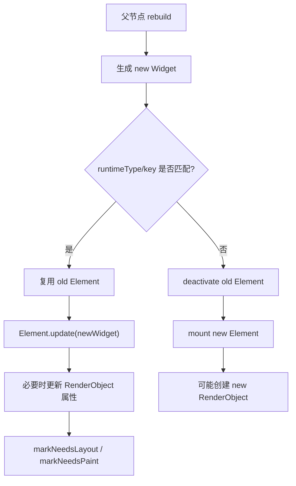

# 面试备战 Flutter 04：三棵树，Widget、Element 与 RenderObject

Flutter 面试里，“三棵树”不是让你背 Widget、Element、RenderObject 三个名词。真正的问题是：

- 为什么 Widget 可以频繁创建？
- State 到底保存在哪里？
- `setState` 为什么不是直接刷新屏幕？
- Key 为什么能决定状态是否保留？
- rebuild、relayout、repaint 为什么不是一回事？

这篇文章要把这条底层链路讲清楚：

```text
Widget 配置变化 -> Element diff/复用 -> State 生命周期 -> RenderObject 更新 -> Layout/Paint
```

## 1. Flutter 为什么需要三棵树？

如果只有一棵 View 树，每次状态变化都直接改真实视图，会遇到两个问题：

1. UI 描述和渲染实现耦合。
2. 更新时很难低成本判断哪些节点要保留，哪些节点要重建。

Flutter 的设计是把 UI 拆成三层：

| 树 | 本质 | 职责 | 成本 |
|---|---|---|---|
| Widget Tree | 不可变配置 | 描述 UI 应该是什么样 | 低 |
| Element Tree | 可变实例 | 管理挂载、复用、State、BuildContext | 中 |
| RenderObject Tree | 渲染对象 | 负责 layout、paint、hitTest | 高 |

核心思想：

> 便宜的 Widget 可以频繁创建，昂贵的 Element 和 RenderObject 尽量复用。

## 2. Widget：它不是 View，而是配置

Widget 是 immutable 的 Dart 对象。

```dart
class Text extends StatelessWidget {
  final String data;
  const Text(this.data, {super.key});
}
```

`Text('A')` 和 `Text('B')` 是两份不同配置。Flutter 不试图修改旧 Widget，而是创建新 Widget，再交给 Element 判断如何更新底层节点。

所以这句话很关键：

> Flutter 不是在修改 Widget，而是在用新的 Widget 配置更新已有 Element。

### 为什么 Widget 频繁创建没那么可怕？

因为 Widget 很轻：

- 只是配置对象。
- 不直接持有渲染资源。
- 不直接持有平台 View。
- 不保存复杂生命周期。

真正昂贵的是：

- Element 的挂载和卸载。
- RenderObject 的创建、layout、paint。
- Layer 和 GPU 资源。

## 3. Element：Flutter 更新算法的核心

Element 是 Widget 的实例化节点，也是 BuildContext 的真实身份。

你写：

```dart
Widget build(BuildContext context) {
  return Container();
}
```

这里的 `context` 本质上就是某个 Element。

Element 负责：

- 持有当前 Widget。
- 持有父子 Element 关系。
- 管理 mount/update/unmount。
- 对 StatefulWidget 关联 State。
- 调用 build。
- 决定子节点能否复用。

## 4. State 保存在哪里？

这是高频问题。

State 不保存在 StatefulWidget 里，而是由 StatefulElement 持有。

简化关系：

```text
StatefulWidget(new config)
        |
        v
StatefulElement  ---->  State(old memory)
        |
        v
child Element
```

当父组件 rebuild，生成一个新的 StatefulWidget：

```dart
Counter(title: 'new')
```

只要 runtimeType 和 key 匹配，原来的 StatefulElement 会复用，State 不销毁，只是 Element 里的 widget 引用更新成新配置，然后触发：

```dart
didUpdateWidget(oldWidget)
build()
```

这解释了为什么 StatefulWidget 是不可变的，但 State 可以持续存在。

## 5. RenderObject：真正干脏活的渲染对象

RenderObject 负责：

- 接收 constraints。
- 计算 size。
- 设置 child offset。
- 生成绘制指令。
- 命中测试。

不是所有 Widget 都创建 RenderObject。

例如：

- `StatelessWidget`：不直接创建 RenderObject，只负责 build。
- `StatefulWidget`：不直接创建 RenderObject，只负责 State。
- `RenderObjectWidget`：会创建 RenderObject。

RenderObjectWidget 的三个抽象基类:

- `LeafRenderObjectWidget`(无子节点,如 `RichText`)。
- `SingleChildRenderObjectWidget`(单子节点,如 `Padding`)。
- `MultiChildRenderObjectWidget`(多子节点,如 `Flex`/`Stack`)。

注意 `Container` 本身是 StatelessWidget,内部组合 `ConstrainedBox`/`Padding`/`DecoratedBox` 等,并不是 RenderObjectWidget。

## 6. Widget 到 RenderObject 的更新链路

简化流程：



这就是 Flutter 性能的关键：绝大多数更新不是“推倒重来”，而是复用 Element 和 RenderObject。

## 7. Element 复用规则：runtimeType + key

Flutter 判断一个旧 Element 能否更新为新 Widget，核心条件：

```text
Widget.canUpdate(old, new):
  old.runtimeType == new.runtimeType && old.key == new.key
```

如果满足，Element 复用。

如果不满足，旧 Element 卸载，新 Element 创建。

这就是 Key 的根本意义：

> Key 不是给 Widget 起名字，而是参与 Element 身份匹配。

## 8. 为什么列表不用 Key 会状态错乱？

假设有列表：

```dart
[
  TodoItem("A", checked: true),
  TodoItem("B", checked: false),
]
```

如果每个 item 是 StatefulWidget，但没有 Key。当你在头部插入一个 C：

```dart
[
  TodoItem("C"),
  TodoItem("A"),
  TodoItem("B"),
]
```

Flutter 的 children diff 会先做头尾同步扫描 + `Widget.canUpdate`(runtimeType + key)匹配。但当所有 item 同类型、且都没有 key 时,`canUpdate` 恒为 true,diff 退化为按位置复用:

```text
位置 0：旧 A 的 Element 复用给新 C
位置 1：旧 B 的 Element 复用给新 A
```

于是 State 跟着位置走而非跟着数据走,状态串位。

正确做法：

```dart
TodoItem(
  key: ValueKey(todo.id),
  todo: todo,
)
```

这样 Flutter 按业务 id 匹配，而不是按位置匹配。

## 9. `setState` 到底标记了谁？

`setState` 并不是让 Widget 重绘。它做的是：

```text
State.setState -> Element.markNeedsBuild -> 下一帧 rebuild
```

被标记 dirty 的是当前 State 对应的 Element。

然后下一帧：

- BuildOwner 收集 dirty elements。
- 按树深度排序。
- 调用 rebuild。
- 生成新 Widget。
- 更新子 Element。

所以 `setState` 的影响范围取决于它所在的 Element 子树。

## 10. rebuild 不等于 relayout，更不等于 repaint

这句话一定要会讲。

### rebuild

Widget/Element 层更新。执行 build，生成新配置。

### relayout

RenderObject 几何信息变化，需要重新计算 constraints 和 size。

### repaint

RenderObject 外观变化，需要重新绘制。

例子：

- Text 内容变化：可能 rebuild + layout + paint。
- 颜色变化：可能 rebuild + paint。
- 父组件 setState 但 const 子树未变：可能只 rebuild 父，不影响子。
- 动画透明度变化：可能不 rebuild 子 Widget，但需要合成或 repaint。

## 11. 高频追问

### Q1：Widget 是不可变的，状态怎么变？

状态在 State 对象中，State 由 StatefulElement 持有。Widget 只是配置，rebuild 时新 Widget 替换旧配置，State 继续复用。

### Q2：BuildContext 是什么？

BuildContext 本质上是 Element 的抽象接口。它代表当前 Widget 在 Element Tree 中的位置。

### Q3：为什么不要跨异步长时间持有 BuildContext？

因为异步回来时 Element 可能已经 unmount。此时再用 context 查 Navigator、Theme 或 setState，可能访问无效节点。

应检查(`BuildContext.mounted` 需 Flutter 3.7+)：

```dart
if (!context.mounted) return;
```

或在 State 中检查：

```dart
if (!mounted) return;
```

### Q4：GlobalKey 为什么贵？

GlobalKey 需要全局唯一注册，支持跨父节点移动并保留 State。这会增加匹配和维护成本，也容易破坏组件封装。

## 12. 工程优化视角

### 控制 rebuild 范围

不要在大页面根节点管理所有状态。把频繁变化的状态下沉到局部组件。

### 正确使用 Key

列表 item 用稳定业务 id，不要用 index，不要滥用 UniqueKey。

### 不在 build 做重活

build 可能频繁执行，不能做：

- JSON 解析。
- IO。
- 大量排序。
- 网络请求。
- 创建复杂 controller。

### 结合 DevTools 看证据

不要凭感觉优化。用 Flutter DevTools 看 rebuild、frame time、raster time。


## 深挖追问：三棵树要讲到 updateChild 和依赖关系

Widget 是配置，Element 是实例和生命周期，RenderObject 是布局绘制实体。面试继续追问时，核心是 `Element.updateChild` 的复用判断：

```text
oldWidget.runtimeType == newWidget.runtimeType
&& oldWidget.key == newWidget.key
  -> 复用 Element，调用 update
否则
  -> 卸载旧 Element，inflate 新 Element
```

这就是 Key 为什么能影响状态保持。Key 不是“保存状态”的容器，它只是参与匹配，让正确的 Element/State 被复用。

InheritedWidget 深挖：

- 子 Element 通过 `dependOnInheritedWidgetOfExactType` 建立依赖。
- InheritedWidget 更新时，会通知依赖它的 Element rebuild。
- `Provider`/`Theme`/`MediaQuery` 都基于这条能力。
- `context.read` 不建立依赖，`context.watch` 建立依赖。

RenderObject 继续追问：

- RenderObject 持有布局尺寸、parentData、paint、hitTest 等能力。
- ParentDataWidget 例如 Positioned/Flexible，会把父布局需要的数据写到 child 的 parentData。
- Widget 重建不一定导致 RenderObject 重建，很多时候只是更新属性。

Sliver 追问：

> ListView 不是一次性创建所有 RenderObject。Sliver 协议让可视区域附近的 child 被按需创建、布局和回收。长列表性能问题往往来自 item build 太重、key 错误、keepAlive 滥用、图片解码和 shrinkWrap。

项目表达：

> 我排查 Flutter 性能时会先判断问题发生在 rebuild、layout、paint 还是 raster。三棵树的价值就是帮助我定位“状态变化到底影响到了哪一层”。

## 一句话总结

Flutter 三棵树的本质是分层复用：Widget 负责低成本描述，Element 负责身份和状态，RenderObject 负责昂贵的布局绘制。
