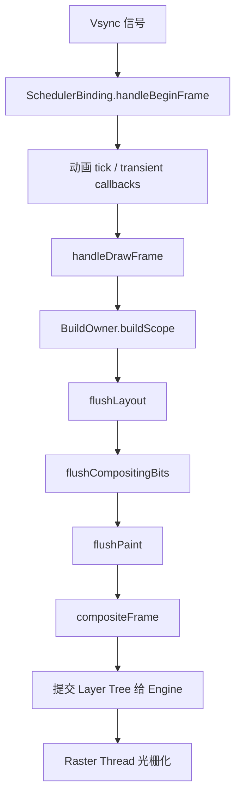

# 面试备战 Flutter 05：Build、Layout、Paint 渲染流水线

Flutter 性能问题不能靠“少 setState、多 const”这种口号解决。真正排查卡顿时，你必须先判断问题发生在哪个阶段：

```text
UI Thread: build / layout / paint
Raster Thread: layer raster / GPU
IO / Platform Thread: 图片、平台视图、插件
```

这篇文章拆一帧的完整链路。

## 1. 一帧从哪里开始？

屏幕刷新由 Vsync 驱动。Flutter 收到 Vsync 后，会调度一帧。

核心参与者：

- `SchedulerBinding`：调度帧。
- `WidgetsBinding`：驱动 Widget 构建。
- `BuildOwner`：管理 dirty Element。
- `PipelineOwner`：管理 layout、paint、semantics。
- `RendererBinding`：连接渲染管线。

简化链路：



其中 `buildScope` 由 `WidgetsBinding.drawFrame` 触发,`flushLayout`/`flushPaint` 由 `RendererBinding`(经 `PipelineOwner`)触发;最后 `compositeFrame` 通过 `SceneBuilder` 把 scene 交给 Engine `render`。

## 2. Build 阶段：更新 Element Tree

Build 阶段处理 dirty Element。

触发来源：

- `setState`
- `markNeedsBuild`
- InheritedWidget 通知。
- Listenable/Stream/状态管理通知。
- 父节点更新。

`setState` 本质上会调用：

```text
Element.markNeedsBuild()
```

然后 Element 进入 dirty list，等待下一帧统一 rebuild。

### Build 阶段为什么要排序？

dirty elements 会按深度排序，父节点先于子节点 rebuild。否则子节点可能刚 rebuild 完，又被父节点更新覆盖，造成重复工作。

## 3. Layout 阶段：约束向下，尺寸向上

Flutter 布局核心规则：

```text
Constraints go down.
Sizes go up.
Parent sets position.
```

父 RenderObject 给子 RenderObject 约束：

```dart
BoxConstraints(
  minWidth: 0,
  maxWidth: 300,
  minHeight: 0,
  maxHeight: double.infinity,
)
```

子节点在约束范围内选择自己的 size，再由父节点决定 child offset。

## 4. Layout 为什么有时很贵？

常见原因：

### 4.1 Intrinsic 测量

Intrinsic 需要问子节点“你理想尺寸是多少”。这可能导致额外 layout pass。

例如：

- `IntrinsicHeight`
- `IntrinsicWidth`
- 某些表格布局。

长列表里使用 Intrinsic 很危险。

### 4.2 shrinkWrap

`ListView(shrinkWrap: true)` 需要根据 children 计算自身大小，可能削弱懒加载优势。

如果列表在滚动容器里嵌套，应该重新审视布局结构，而不是直接 shrinkWrap。

### 4.3 复杂嵌套

过深 Row/Column/Flex、嵌套滚动、动态约束变化，都可能放大 layout 成本。

## 5. Paint 阶段：生成绘制指令，不一定立刻画像素

Paint 阶段由 RenderObject 生成绘制命令，记录到 Layer 中。

注意：

> Paint 不是 GPU 立刻把像素画到屏幕，而是生成一棵 Layer Tree 和绘制指令。

常见昂贵操作：

- saveLayer。
- clipPath。
- 模糊。
- 阴影。
- 透明合成。
- 大面积渐变。
- 复杂 CustomPaint。

## 6. Layer Tree 和 RepaintBoundary

`RepaintBoundary` 会让子树形成独立绘制边界，通常对应独立 Layer。

好处：

- 子树变化不污染父层。
- 父层变化不一定导致子树 repaint。
- 复杂静态内容可以缓存。

代价：

- Layer 数量增加。
- 内存增加。
- 合成成本增加。

所以 RepaintBoundary 不是越多越好。

## 7. Raster 阶段：为什么 UI 线程不高但还是卡？

Flutter 有 UI 线程和 Raster 线程。

UI 线程负责：

- Dart 执行。
- build。
- layout。
- paint。
- 生成 Layer Tree。

Raster 线程负责：

- 光栅化 Layer Tree。
- 执行 Skia/Impeller 绘制。
- 上传纹理。
- 和 GPU 协作。

如果 UI 线程耗时低，但 Raster 线程高，问题可能是：

- 图片太大。
- shader 编译。
- saveLayer 多。
- 图层复杂。
- PlatformView 合成。
- 大面积模糊和裁剪。

## 8. 16.67ms 的真正含义

60Hz 屏幕下一帧预算约 16.67ms。

但这不是说 build 可以用 16ms、raster 再用 16ms。UI 线程和 Raster 线程是**流水线并行**的——第 N 帧在 Raster 线程光栅化时,UI 线程已在算第 N+1 帧。所以两条线程各自都要 < 预算,任何一条超了都可能掉帧。

120Hz 下预算约 8.33ms，更严格。

所以高刷新率设备上，以前“看起来不卡”的页面可能暴露问题。

## 9. markNeedsBuild / markNeedsLayout / markNeedsPaint

### markNeedsBuild

Widget/Element 配置需要更新。

### markNeedsLayout

RenderObject 几何信息需要重新计算。

如果某节点 size 变化，可能影响父节点和兄弟节点。

### markNeedsPaint

RenderObject 外观需要重新绘制，但 layout 不一定变。

### markNeedsCompositingBitsUpdate

图层合成相关状态变化，例如是否需要 compositing。

## 10. 性能排查路径

不要盲目优化，按证据走：

1. 打开 Performance Overlay。
2. 看 UI thread 和 Raster thread 哪个高。
3. 用 DevTools Timeline 找长任务。
4. 如果 UI 高，看 build/layout/paint。
5. 如果 Raster 高，看图片、shader、saveLayer、PlatformView。
6. 用 repaint rainbow 看重绘范围。
7. 用 Widget rebuild stats 看重建范围。

## 11. 高频追问

### Q1：rebuild 一定导致 repaint 吗？

不一定。rebuild 只是 Widget/Element 层更新。如果最终 RenderObject 属性没变，可能不会 layout 或 paint。

### Q2：layout 一定从根节点开始吗？

不一定。RenderObject 有 relayout boundary。某些边界可以阻止 layout dirty 向上传播。

### Q3：RepaintBoundary 为什么能优化？

它隔离绘制脏区，让频繁变化的区域单独 repaint，避免带着大面积静态背景一起重绘。

### Q4：为什么 saveLayer 贵？

saveLayer 可能创建离屏缓冲区，先把内容绘制到中间纹理，再合成回去，增加 GPU 内存和带宽压力。

### Q5：Flutter 卡顿一定是 Dart 代码问题吗？

不是。Raster 线程、图片解码、GPU、PlatformView、Native 插件都可能导致卡顿。

## 12. 工程优化策略

### UI Thread 高

- 缩小 rebuild 范围。
- build 中不做重计算。
- 减少 Intrinsic。
- 避免 shrinkWrap 长列表。
- 使用 Selector/ValueListenableBuilder。
- 复杂计算丢到 isolate。

### Raster Thread 高

- 控制图片尺寸。
- 减少 saveLayer。
- 减少复杂 clip 和 blur。
- 合理使用 RepaintBoundary。
- 预热 shader（仅 Skia 时代需要，见下）。
- 谨慎使用 PlatformView。

> 渲染后端说明：Flutter 在 iOS 上已默认 **Impeller**（取代 Skia），Android 也在新版本逐步默认。Impeller 把 shader 提前离线编译，基本消除了首次动画时的 shader 编译卡顿，所以传统的 SkSL shader 预热（`--bundle-sksl-path`）在 Impeller 下已不再需要。回答渲染相关问题时要区分 Skia / Impeller。

### 混合工程

- Flutter 页面首帧要单独打点。
- Engine 预热和内存要平衡。
- PlatformView 页面要重点看 raster。
- Channel 高频通信可能阻塞 UI isolate。


## 深挖追问：一帧要能从 vsync 讲到 GPU

Flutter 一帧可以这样回答：

```text
Vsync 到来
  -> SchedulerBinding handleBeginFrame
  -> 执行动画/ticker
  -> handleDrawFrame
  -> build dirty elements
  -> layout dirty render objects
  -> paint 生成 display list/layer
  -> composite 生成 layer tree
  -> Engine raster
  -> GPU present
```

Build 阶段继续追问：

- dirty Element 会被收集。
- build scope 中按深度排序，父先于子。
- 同一帧内多次 mark dirty 通常会合并。
- build 里做 I/O、JSON、同步计算会阻塞 UI thread。

Layout 深挖：

> Flutter 约束向下，尺寸向上，父决定约束，子在约束内选择尺寸，父再决定子的位置。Intrinsic 测量贵，是因为它可能要求子在正式 layout 前回答“理想尺寸”，导致额外遍历。

Paint/Raster 深挖：

- Paint 只是记录绘制指令，不一定立即变成像素。
- RepaintBoundary 会形成独立 layer，隔离 repaint，但增加 layer/composite 成本。
- UI thread 正常但 raster 高，可能是图片太大、shader 编译、clip/blur/shadow、saveLayer 或纹理上传。
- Impeller 降低了部分 shader jank，但不代表 raster 成本消失。

16.67ms 追问：

> 60Hz 下每帧预算约 16.67ms，但不是 UI thread 可以独占 16.67ms。UI、raster、platform、GPU 都有流水线和同步点。120Hz 下预算更低，约 8.33ms。

验证方式：

- Performance Overlay 看 UI/Raster 两条柱。
- DevTools frame chart 定位阶段。
- `debugProfileBuildsEnabled`、repaint rainbow、checkerboard raster cache 辅助判断。

## 一句话总结

Flutter 一帧不是“setState 后重绘”这么简单，而是 Vsync 驱动 UI 线程完成 build/layout/paint，再把 Layer Tree 交给 Raster 线程光栅化；性能优化必须先定位卡在哪个阶段。
