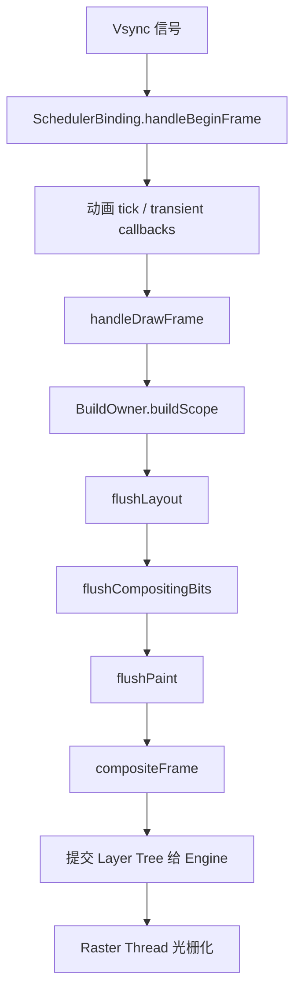

# 面试备战 Flutter 05：Build、Layout、Paint 渲染流水线

Flutter 性能问题不能靠“少 setState、多 const”这种口号解决。真正排查卡顿时，你必须先判断问题发生在哪个阶段：

```text
UI Thread: build / layout / paint
Raster Thread: layer raster / GPU
IO / Platform Thread: 图片、平台视图、插件
```

这篇文章拆一帧的完整链路。

## 1. 一帧从哪里开始？

屏幕刷新由 Vsync 驱动。Flutter 收到 Vsync 后，会调度一帧。

核心参与者：

- `SchedulerBinding`：调度帧。
- `WidgetsBinding`：驱动 Widget 构建。
- `BuildOwner`：管理 dirty Element。
- `PipelineOwner`：管理 layout、paint、semantics。
- `RendererBinding`：连接渲染管线。

简化链路：



其中 `buildScope` 由 `WidgetsBinding.drawFrame` 触发,`flushLayout`/`flushPaint` 由 `RendererBinding`(经 `PipelineOwner`)触发;最后 `compositeFrame` 通过 `SceneBuilder` 把 scene 交给 Engine `render`。

## 2. Build 阶段：更新 Element Tree

Build 阶段处理 dirty Element。

触发来源：

- `setState`
- `markNeedsBuild`
- InheritedWidget 通知。
- Listenable/Stream/状态管理通知。
- 父节点更新。

`setState` 本质上会调用：

```text
Element.markNeedsBuild()
```

然后 Element 进入 dirty list，等待下一帧统一 rebuild。

### Build 阶段为什么要排序？

dirty elements 会按深度排序，父节点先于子节点 rebuild。否则子节点可能刚 rebuild 完，又被父节点更新覆盖，造成重复工作。

## 3. Layout 阶段：约束向下，尺寸向上

Flutter 布局核心规则：

```text
Constraints go down.
Sizes go up.
Parent sets position.
```

父 RenderObject 给子 RenderObject 约束：

```dart
BoxConstraints(
  minWidth: 0,
  maxWidth: 300,
  minHeight: 0,
  maxHeight: double.infinity,
)
```

子节点在约束范围内选择自己的 size，再由父节点决定 child offset。

## 4. Layout 为什么有时很贵？

常见原因：

### 4.1 Intrinsic 测量

Intrinsic 需要问子节点“你理想尺寸是多少”。这可能导致额外 layout pass。

例如：

- `IntrinsicHeight`
- `IntrinsicWidth`
- 某些表格布局。

长列表里使用 Intrinsic 很危险。

### 4.2 shrinkWrap

`ListView(shrinkWrap: true)` 需要根据 children 计算自身大小，可能削弱懒加载优势。

如果列表在滚动容器里嵌套，应该重新审视布局结构，而不是直接 shrinkWrap。

### 4.3 复杂嵌套

过深 Row/Column/Flex、嵌套滚动、动态约束变化，都可能放大 layout 成本。

## 5. Paint 阶段：生成绘制指令，不一定立刻画像素

Paint 阶段由 RenderObject 生成绘制命令，记录到 Layer 中。

注意：

> Paint 不是 GPU 立刻把像素画到屏幕，而是生成一棵 Layer Tree 和绘制指令。

常见昂贵操作：

- saveLayer。
- clipPath。
- 模糊。
- 阴影。
- 透明合成。
- 大面积渐变。
- 复杂 CustomPaint。

## 6. Layer Tree 和 RepaintBoundary

`RepaintBoundary` 会让子树形成独立绘制边界，通常对应独立 Layer。

好处：

- 子树变化不污染父层。
- 父层变化不一定导致子树 repaint。
- 复杂静态内容可以缓存。

代价：

- Layer 数量增加。
- 内存增加。
- 合成成本增加。

所以 RepaintBoundary 不是越多越好。

## 7. Raster 阶段：为什么 UI 线程不高但还是卡？

Flutter 有 UI 线程和 Raster 线程。

UI 线程负责：

- Dart 执行。
- build。
- layout。
- paint。
- 生成 Layer Tree。

Raster 线程负责：

- 光栅化 Layer Tree。
- 执行 Skia/Impeller 绘制。
- 上传纹理。
- 和 GPU 协作。

如果 UI 线程耗时低，但 Raster 线程高，问题可能是：

- 图片太大。
- shader 编译。
- saveLayer 多。
- 图层复杂。
- PlatformView 合成。
- 大面积模糊和裁剪。

## 8. 16.67ms 的真正含义

60Hz 屏幕下一帧预算约 16.67ms。

但这不是说 build 可以用 16ms、raster 再用 16ms。UI 线程和 Raster 线程是**流水线并行**的——第 N 帧在 Raster 线程光栅化时,UI 线程已在算第 N+1 帧。所以两条线程各自都要 < 预算,任何一条超了都可能掉帧。

120Hz 下预算约 8.33ms，更严格。

所以高刷新率设备上，以前“看起来不卡”的页面可能暴露问题。

## 9. markNeedsBuild / markNeedsLayout / markNeedsPaint

### markNeedsBuild

Widget/Element 配置需要更新。

### markNeedsLayout

RenderObject 几何信息需要重新计算。

如果某节点 size 变化，可能影响父节点和兄弟节点。

### markNeedsPaint

RenderObject 外观需要重新绘制，但 layout 不一定变。

### markNeedsCompositingBitsUpdate

图层合成相关状态变化，例如是否需要 compositing。

## 10. 性能排查路径

不要盲目优化，按证据走：

1. 打开 Performance Overlay。
2. 看 UI thread 和 Raster thread 哪个高。
3. 用 DevTools Timeline 找长任务。
4. 如果 UI 高，看 build/layout/paint。
5. 如果 Raster 高，看图片、shader、saveLayer、PlatformView。
6. 用 repaint rainbow 看重绘范围。
7. 用 Widget rebuild stats 看重建范围。

## 11. 高频追问

### Q1：rebuild 一定导致 repaint 吗？

不一定。rebuild 只是 Widget/Element 层更新。如果最终 RenderObject 属性没变，可能不会 layout 或 paint。

### Q2：layout 一定从根节点开始吗？

不一定。RenderObject 有 relayout boundary。某些边界可以阻止 layout dirty 向上传播。

### Q3：RepaintBoundary 为什么能优化？

它隔离绘制脏区，让频繁变化的区域单独 repaint，避免带着大面积静态背景一起重绘。

### Q4：为什么 saveLayer 贵？

saveLayer 可能创建离屏缓冲区，先把内容绘制到中间纹理，再合成回去，增加 GPU 内存和带宽压力。

### Q5：Flutter 卡顿一定是 Dart 代码问题吗？

不是。Raster 线程、图片解码、GPU、PlatformView、Native 插件都可能导致卡顿。

## 12. 工程优化策略

### UI Thread 高

- 缩小 rebuild 范围。
- build 中不做重计算。
- 减少 Intrinsic。
- 避免 shrinkWrap 长列表。
- 使用 Selector/ValueListenableBuilder。
- 复杂计算丢到 isolate。

### Raster Thread 高

- 控制图片尺寸。
- 减少 saveLayer。
- 减少复杂 clip 和 blur。
- 合理使用 RepaintBoundary。
- 预热 shader（仅 Skia 时代需要，见下）。
- 谨慎使用 PlatformView。

> 渲染后端说明：Flutter 在 iOS 上已默认 **Impeller**（取代 Skia），Android 也在新版本逐步默认。Impeller 把 shader 提前离线编译，基本消除了首次动画时的 shader 编译卡顿，所以传统的 SkSL shader 预热（`--bundle-sksl-path`）在 Impeller 下已不再需要。回答渲染相关问题时要区分 Skia / Impeller。

### 混合工程

- Flutter 页面首帧要单独打点。
- Engine 预热和内存要平衡。
- PlatformView 页面要重点看 raster。
- Channel 高频通信可能阻塞 UI isolate。


## 深挖追问：一帧要能从 vsync 讲到 GPU

Flutter 一帧可以这样回答：

```text
Vsync 到来
  -> SchedulerBinding handleBeginFrame
  -> 执行动画/ticker
  -> handleDrawFrame
  -> build dirty elements
  -> layout dirty render objects
  -> paint 生成 display list/layer
  -> composite 生成 layer tree
  -> Engine raster
  -> GPU present
```

Build 阶段继续追问：

- dirty Element 会被收集。
- build scope 中按深度排序，父先于子。
- 同一帧内多次 mark dirty 通常会合并。
- build 里做 I/O、JSON、同步计算会阻塞 UI thread。

Layout 深挖：

> Flutter 约束向下，尺寸向上，父决定约束，子在约束内选择尺寸，父再决定子的位置。Intrinsic 测量贵，是因为它可能要求子在正式 layout 前回答“理想尺寸”，导致额外遍历。

Paint/Raster 深挖：

- Paint 只是记录绘制指令，不一定立即变成像素。
- RepaintBoundary 会形成独立 layer，隔离 repaint，但增加 layer/composite 成本。
- UI thread 正常但 raster 高，可能是图片太大、shader 编译、clip/blur/shadow、saveLayer 或纹理上传。
- Impeller 降低了部分 shader jank，但不代表 raster 成本消失。

16.67ms 追问：

> 60Hz 下每帧预算约 16.67ms，但不是 UI thread 可以独占 16.67ms。UI、raster、platform、GPU 都有流水线和同步点。120Hz 下预算更低，约 8.33ms。

验证方式：

- Performance Overlay 看 UI/Raster 两条柱。
- DevTools frame chart 定位阶段。
- `debugProfileBuildsEnabled`、repaint rainbow、checkerboard raster cache 辅助判断。

## 一句话总结

Flutter 一帧不是”setState 后重绘”这么简单，而是 Vsync 驱动 UI 线程完成 build/layout/paint，再把 Layer Tree 交给 Raster 线程光栅化；性能优化必须先定位卡在哪个阶段。

---

## 🔬 深度扩展：从 Vsync 到 GPU 的完整流水线

Flutter 渲染是面试中最容易被追问”一帧怎么生成”的点。只说”build/layout/paint”不够，要能讲清楚 **SchedulerBinding 调度、BuildOwner、PipelineOwner、Layer Tree、Skia vs Impeller、UI/Raster 线程协作**的完整链路。

### 扩展1：Vsync 信号与 SchedulerBinding 调度

**Vsync 来源：**

```text
Display 硬件
  → 操作系统（每 16.67ms 发送 Vsync 信号，60Hz）
  → Flutter Engine
  → Dart 层 SchedulerBinding
```

**SchedulerBinding 的核心方法：**

```dart
class SchedulerBinding {
  // Vsync 回调注册
  int scheduleFrameCallback(FrameCallback callback, {bool rescheduling = false}) {
    _transientCallbacks[_nextFrameCallbackId++] = _FrameCallbackEntry(callback);
    ensureFrameCallbacksRegistered();
    return _nextFrameCallbackId - 1;
  }
  
  // 处理 Vsync
  void handleBeginFrame(Duration timeStamp) {
    _hasScheduledFrame = false;
    
    // 1. 调用 transient callbacks（动画 ticker）
    final Map<int, _FrameCallbackEntry> callbacks = _transientCallbacks;
    _transientCallbacks = <int, _FrameCallbackEntry>{};
    
    callbacks.forEach((int id, _FrameCallbackEntry entry) {
      try {
        entry.callback(timeStamp);
      } catch (exception, stack) {
        // 错误处理
      }
    });
  }
  
  void handleDrawFrame() {
    // 2. 调用 persistent callbacks（Widget 构建）
    _persistentCallbacks.forEach((FrameCallback callback) {
      callback(_currentFrameTimeStamp!);
    });
    
    // 3. 调用 post-frame callbacks（一次性任务）
    final List<FrameCallback> localPostFrameCallbacks = _postFrameCallbacks.toList();
    _postFrameCallbacks.clear();
    
    localPostFrameCallbacks.forEach((FrameCallback callback) {
      callback(_currentFrameTimeStamp!);
    });
  }
}
```

**三种回调的区别：**

| 回调类型 | 触发时机 | 是否持久 | 典型用途 |
|---------|---------|---------|---------|
| Transient | handleBeginFrame | 一次性 | 动画 Ticker（AnimationController） |
| Persistent | handleDrawFrame | 持久 | Widget 构建（WidgetsBinding.drawFrame） |
| Post-frame | handleDrawFrame 后 | 一次性 | 获取渲染后的尺寸、截图 |

**完整时序：**

```text
Vsync 信号到来
  ↓
handleBeginFrame (timeStamp)
  ↓
执行 transient callbacks
  - AnimationController.tick()
  - 更新动画值
  - 触发 setState
  ↓
handleDrawFrame
  ↓
执行 persistent callbacks
  - WidgetsBinding.drawFrame()
    → BuildOwner.buildScope()
    → RendererBinding.drawFrame()
      → PipelineOwner.flushLayout()
      → PipelineOwner.flushCompositingBits()
      → PipelineOwner.flushPaint()
    → RenderView.compositeFrame()
  ↓
执行 post-frame callbacks
  - addPostFrameCallback() 注册的任务
  ↓
一帧结束
```

### 扩展2：BuildOwner 的 dirty Element 管理

**BuildOwner 核心字段：**

```dart
class BuildOwner {
  final List<Element> _dirtyElements = <Element>[];
  int _dirtyElementsNeedsResorting = 0;
  bool _scheduledFlushDirtyElements = false;
  
  // 标记 Element 为 dirty
  void scheduleBuildFor(Element element) {
    if (element._inDirtyList) {
      _dirtyElementsNeedsResorting++;
      return;
    }
    
    _dirtyElements.add(element);
    element._inDirtyList = true;
  }
  
  // 批量 rebuild
  void buildScope(Element context, [VoidCallback? callback]) {
    if (_dirtyElements.isEmpty) {
      callback?.call();
      return;
    }
    
    // 1. 按深度排序（父节点优先）
    _dirtyElements.sort((Element a, Element b) => a.depth - b.depth);
    _dirtyElementsNeedsResorting = 0;
    
    int dirtyCount = _dirtyElements.length;
    int index = 0;
    
    // 2. 遍历 rebuild
    while (index < dirtyCount) {
      final Element element = _dirtyElements[index];
      
      // 3. rebuild 前检查是否仍然 dirty
      if (element._inDirtyList) {
        element.rebuild();
      }
      
      index++;
      
      // 4. rebuild 过程中可能产生新的 dirty Element
      if (dirtyCount < _dirtyElements.length || _dirtyElementsNeedsResorting > 0) {
        _dirtyElements.sort((Element a, Element b) => a.depth - b.depth);
        _dirtyElementsNeedsResorting = 0;
        dirtyCount = _dirtyElements.length;
      }
    }
    
    // 5. 清空 dirty 列表
    for (final Element element in _dirtyElements) {
      element._inDirtyList = false;
    }
    _dirtyElements.clear();
    
    callback?.call();
  }
}
```

**关键点：**

1. **延迟 rebuild**  
   `setState` 只是标记 dirty，不立即 rebuild。

2. **批量处理**  
   一帧内所有 `setState` 的 Element 一起 rebuild。

3. **深度排序**  
   父节点先 rebuild，避免子节点被父节点更新覆盖。

4. **动态扩展**  
   rebuild 过程中可能产生新的 dirty Element，动态加入队列。

### 扩展3：PipelineOwner 的三个 flush 阶段

**PipelineOwner 核心字段：**

```dart
class PipelineOwner {
  final List<RenderObject> _nodesNeedingLayout = <RenderObject>[];
  final List<RenderObject> _nodesNeedingCompositingBitsUpdate = <RenderObject>[];
  final List<RenderObject> _nodesNeedingPaint = <RenderObject>[];
  
  // 标记需要 layout
  void _markNeedsLayout(RenderObject node) {
    if (node._needsLayout) return;
    
    node._needsLayout = true;
    
    if (node._relayoutBoundary != node) {
      // 向上传播到 relayout boundary
      _markNeedsLayout(node.parent!);
    } else {
      // 到达 boundary，加入 dirty 列表
      _nodesNeedingLayout.add(node);
    }
  }
  
  // flush layout
  void flushLayout() {
    while (_nodesNeedingLayout.isNotEmpty) {
      final List<RenderObject> dirtyNodes = _nodesNeedingLayout.toList()
        ..sort((RenderObject a, RenderObject b) => a.depth - b.depth);
      
      _nodesNeedingLayout.clear();
      
      for (final RenderObject node in dirtyNodes) {
        if (node._needsLayout && node.owner == this) {
          node._layoutWithoutResize();
        }
      }
    }
  }
  
  // flush compositing bits
  void flushCompositingBits() {
    _nodesNeedingCompositingBitsUpdate.sort((RenderObject a, RenderObject b) => a.depth - b.depth);
    
    for (final RenderObject node in _nodesNeedingCompositingBitsUpdate) {
      if (node._needsCompositingBitsUpdate && node.owner == this) {
        node._updateCompositingBits();
      }
    }
    
    _nodesNeedingCompositingBitsUpdate.clear();
  }
  
  // flush paint
  void flushPaint() {
    final List<RenderObject> dirtyNodes = _nodesNeedingPaint.toList()
      ..sort((RenderObject a, RenderObject b) => a.depth - b.depth);
    
    _nodesNeedingPaint.clear();
    
    for (final RenderObject node in dirtyNodes) {
      if (node._needsPaint && node.owner == this) {
        if (node._layerHandle.layer!.attached) {
          PaintingContext.repaintCompositedChild(node);
        } else {
          node._skippedPaintingOnLayer();
        }
      }
    }
  }
}
```

**三个阶段的作用：**

| 阶段 | 作用 | 输入 | 输出 |
|------|------|------|------|
| flushLayout | 计算 RenderObject 的尺寸和位置 | Constraints | Size, Offset |
| flushCompositingBits | 更新合成标记（是否需要独立 Layer） | 子节点状态 | needsCompositing 标记 |
| flushPaint | 生成绘制指令，构建 Layer Tree | RenderObject 状态 | DisplayList, Layer |

### 扩展4：Relayout Boundary 的优化机制

**什么是 Relayout Boundary？**

某些 RenderObject 可以阻止 layout dirty 向上传播，成为”布局边界”。

**判断条件（任一满足）：**

```dart
bool get sizedByParent => false;  // 尺寸只由 constraints 决定，不依赖子节点

bool get isRepaintBoundary => false;  // RepaintBoundary

// 或者满足以下条件：
// 1. 父 constraints 是 tight（固定尺寸）
// 2. 不依赖子节点计算尺寸
```

**优化效果：**

```text
无 boundary：
  child.markNeedsLayout()
    → parent.markNeedsLayout()
    → grandparent.markNeedsLayout()
    → ... 一直传播到根节点

有 boundary：
  child.markNeedsLayout()
    → parent（boundary）加入 dirty 列表
    → 停止向上传播
```

**典型 Relayout Boundary：**

- `RenderRepaintBoundary`
- 固定大小的 `Container`
- `SizedBox` 指定了宽高

### 扩展5：PaintingContext 与 Layer Tree 构建

**PaintingContext 的作用：**

```dart
class PaintingContext {
  final ContainerLayer _containerLayer;
  PictureLayer? _currentLayer;
  ui.PictureRecorder? _recorder;
  Canvas? _canvas;
  
  // 获取 Canvas
  Canvas get canvas {
    if (_canvas == null) {
      _startRecording();
    }
    return _canvas!;
  }
  
  void _startRecording() {
    _currentLayer = PictureLayer(estimatedBounds);
    _recorder = ui.PictureRecorder();
    _canvas = Canvas(_recorder!);
    _containerLayer.append(_currentLayer!);
  }
  
  void stopRecordingIfNeeded() {
    if (_recorder != null) {
      _currentLayer!.picture = _recorder!.endRecording();
      _recorder = null;
      _canvas = null;
      _currentLayer = null;
    }
  }
  
  // 创建子 Layer
  static void _repaintCompositedChild(
    RenderObject child, {
    bool debugAlsoPaintedParent = false,
  }) {
    if (child._layerHandle.layer == null) {
      child._layerHandle.layer = child.updateCompositedLayer(oldLayer: null);
    } else {
      child._layerHandle.layer = child.updateCompositedLayer(
        oldLayer: child._layerHandle.layer as OffsetLayer,
      );
    }
    
    final PaintingContext childContext = PaintingContext(
      child._layerHandle.layer as ContainerLayer,
      child.paintBounds,
    );
    
    child._paintWithContext(childContext, Offset.zero);
    childContext.stopRecordingIfNeeded();
  }
}
```

**Layer Tree 示例：**

```text
RenderView
  ├─ TransformLayer (root)
      ├─ PictureLayer (背景)
      ├─ OffsetLayer (RepaintBoundary)
      │   └─ PictureLayer (列表 item)
      ├─ PictureLayer (其他内容)
      └─ OpacityLayer (透明动画)
          └─ PictureLayer (淡入淡出的元素)
```

**关键概念：**

1. **PictureLayer**  
   存储绘制指令（DisplayList），最终交给 Skia/Impeller 光栅化。

2. **ContainerLayer**  
   可以包含子 Layer，例如 OffsetLayer、TransformLayer。

3. **RepaintBoundary**  
   创建独立 Layer，隔离重绘范围。

### 扩展6：compositeFrame 与 Scene 提交

**RenderView.compositeFrame：**

```dart
void compositeFrame() {
  final ui.SceneBuilder builder = ui.SceneBuilder();
  final ui.Scene scene = layer!.buildScene(builder);
  
  // 提交 Scene 给 Engine
  _window.render(scene);
  scene.dispose();
}
```

**Layer.buildScene：**

```dart
ui.Scene buildScene(ui.SceneBuilder builder) {
  updateSubtreeNeedsAddToScene();
  addToScene(builder);
  return builder.build();
}

void addToScene(ui.SceneBuilder builder) {
  // 递归添加所有 Layer
  visitChildren((Layer child) {
    child.addToScene(builder);
  });
}
```

**SceneBuilder 做了什么？**

```dart
// C++ 层（简化）
class SceneBuilder {
  std::vector<std::shared_ptr<Layer>> layers_;
  
  void pushOffset(double dx, double dy) {
    layers_.push_back(std::make_shared<OffsetLayer>(dx, dy));
  }
  
  void addPicture(Picture picture) {
    layers_.push_back(std::make_shared<PictureLayer>(picture));
  }
  
  Scene build() {
    // 构造 Layer Tree，提交给 Raster 线程
    return Scene(std::move(layers_));
  }
};
```

**UI 线程到 Raster 线程：**

```text
UI 线程：
  Layer Tree → SceneBuilder → Scene
  ↓（通过 MessageLoop 发送）
Raster 线程：
  接收 Scene
  → Skia/Impeller 光栅化
  → 生成 GPU 纹理
  → 提交给 GPU
```

### 扩展7：Skia vs Impeller 的关键差异

**Skia（旧渲染后端）：**

```text
优点：
  - 成熟稳定，跨平台
  - 丰富的绘制能力

缺点：
  - Shader 运行时编译，首次动画卡顿（shader jank）
  - OpenGL 有较多 CPU 开销
```

**Impeller（新渲染后端，iOS 默认，Android 逐步默认）：**

```text
优点：
  - Shader 离线预编译，消除 shader jank
  - 更现代的 Metal/Vulkan API
  - 减少 CPU 开销

缺点：
  - 仍在优化中，某些边缘特性可能不完整
```

**面试回答模板：**

> Flutter 在 iOS 上已默认使用 Impeller，Android 也在逐步切换。Impeller 最大改进是 Shader 离线预编译，解决了 Skia 时代首次动画的 shader 编译卡顿。传统的 SkSL shader 预热（`--bundle-sksl-path`）在 Impeller 下已不再需要。

### 扩展8：UI 线程和 Raster 线程的流水线并行

**关键：两个线程是流水线并行，不是顺序执行**

```text
时间 →

Frame N:
  UI 线程:   [Build/Layout/Paint] ━━━━━━━━━━━━━━━━━
  Raster 线程:                    [Raster N-1] ━━━━━━━━━━━━

Frame N+1:
  UI 线程:                         [Build/Layout/Paint] ━━━━━━
  Raster 线程:  [Raster N] ━━━━━━━━━━━━━━━━━
```

**启示：**

1. **UI 和 Raster 都要 < 16.67ms**  
   任何一个超时都会掉帧。

2. **UI 线程超时**  
   第 N 帧的 Scene 延迟提交，Raster 线程空等。

3. **Raster 线程超时**  
   第 N-1 帧还在光栅化，第 N 帧的 Scene 无法开始，UI 线程可能被阻塞。

**DevTools 查看方式：**

```text
Performance Overlay 显示两条柱：
  - 上柱（蓝色）：UI 线程耗时
  - 下柱（红色）：Raster 线程耗时

超过绿线（16.67ms）就是掉帧
```

### 扩展9：常见性能瓶颈的定位方法

**场景1：列表滚动卡顿**

```text
检查步骤：
1. DevTools Timeline → 看 UI/Raster 哪个高
2. UI 高 → Build 问题
   - item 的 build 太重
   - key 用错，Element 没复用
   - setState 范围过大
3. Raster 高 → Paint 问题
   - 图片太大，解码慢
   - 复杂 clip/blur
   - saveLayer 过多
```

**场景2：动画掉帧**

```text
检查步骤：
1. 是否首次动画卡顿？
   - Skia 时代：shader jank，需要预热
   - Impeller：理论上不应该有
2. 动画过程持续卡顿？
   - UI 高：rebuild 太频繁，用 AnimatedBuilder 缩小范围
   - Raster 高：动画元素太复杂，用 RepaintBoundary 隔离
```

**场景3：页面首帧慢**

```text
检查步骤：
1. Build 阶段慢
   - 减少初始 Widget 数量
   - 延迟加载非关键内容
2. Layout 阶段慢
   - 避免 Intrinsic 测量
   - 减少嵌套深度
3. Paint 阶段慢
   - 减少复杂绘制
   - 图片预加载
```

### 扩展10：RepaintBoundary 的使用时机

**什么时候用？**

1. **频繁重绘的局部区域**  
   ```dart
   RepaintBoundary(
     child: AnimatedWidget(...),  // 动画元素
   )
   ```

2. **复杂静态内容**  
   ```dart
   RepaintBoundary(
     child: ComplexChart(...),  // 复杂图表
   )
   ```

3. **长列表 item**  
   ```dart
   ListView.builder(
     itemBuilder: (context, index) {
       return RepaintBoundary(  // 隔离 item 重绘
         child: ListTile(...),
       );
     },
   )
   ```

**什么时候不用？**

1. **小 Widget**  
   创建 Layer 的成本 > 重绘成本。

2. **频繁变化的内容**  
   RepaintBoundary 内容变化，仍然要重绘整个 Layer。

3. **过度使用**  
   Layer 过多，合成成本增加，内存占用高。

**验证方法：**

```dart
// 1. 打开 repaint rainbow
debugRepaintRainbowEnabled = true;

// 2. 操作 UI，观察重绘范围
// 彩色闪烁区域 = 正在重绘

// 3. 加 RepaintBoundary 后，闪烁范围应该缩小
```

---

## 补充总结

Flutter 渲染流水线的深度记忆点：

1. **Vsync 驱动**：handleBeginFrame（动画）→ handleDrawFrame（构建）
2. **三种回调**：Transient（动画）、Persistent（构建）、Post-frame（一次性）
3. **BuildOwner**：收集 dirty Element，按深度排序，批量 rebuild
4. **PipelineOwner**：flushLayout → flushCompositingBits → flushPaint
5. **Relayout Boundary**：阻止 layout dirty 向上传播，优化性能
6. **Layer Tree**：PictureLayer 存绘制指令，ContainerLayer 可嵌套
7. **Skia vs Impeller**：Impeller 离线预编译 Shader，消除 jank
8. **流水线并行**：UI 线程算 N 帧，Raster 线程光栅化 N-1 帧

面试追问时要能讲出：
- Vsync 到 GPU 的完整链路（14 个步骤）
- BuildOwner 如何管理 dirty Element（深度排序、批量 rebuild）
- Relayout Boundary 的优化原理（阻止向上传播）
- Skia vs Impeller 的核心差异（Shader 预编译）
- UI/Raster 线程的流水线并行（两个都要 < 16.67ms）
- RepaintBoundary 的使用时机（频繁重绘局部、复杂静态、列表 item）
