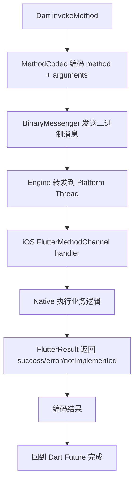

# 面试备战 Flutter 11：Native 通信与 Channel 协议设计

Flutter 和 Native 通信不是“会用 MethodChannel”就够了。中高级面试真正问的是：

- Channel 底层消息怎么走？
- MethodChannel、EventChannel、BasicMessageChannel 怎么选？
- 为什么 Channel 不适合传大图和高频帧？
- 多引擎下消息发给谁？
- 协议膨胀怎么治理？
- Native 回调 Flutter 时 Engine 不在了怎么办？

## 1. Channel 的本质

Flutter 与 Native 通信通过 Platform Channel，底层核心是：

```text
Dart -> BinaryMessenger -> Engine -> Platform Embedder -> Native
Native -> BinaryMessenger -> Engine -> Dart handler
```

Channel 不是魔法，它就是跨 Dart/Native 边界的消息通道。

消息需要：

- 编码。
- 传输。
- 解码。
- 分发到 handler。
- 返回结果或错误。

## 2. 三类 Channel 怎么选？

| 类型 | 模型 | 适合场景 |
|---|---|---|
| MethodChannel | request/response | 调 Native 方法、拿一次结果 |
| EventChannel | stream | Native 持续推事件给 Flutter |
| BasicMessageChannel | message | 双向自定义消息、持续状态同步 |

### MethodChannel

适合：

- 获取设备信息。
- 打开 Native 页面。
- 发起支付。
- 请求权限。
- 调用相册。

语义是“一次调用，一次返回”。

### EventChannel

适合：

- 定位变化。
- 下载进度。
- 传感器。
- 网络状态。
- 长连接消息。

语义是“Flutter 订阅，Native 持续推送”。

### BasicMessageChannel

适合：

- 双向协议。
- 自定义消息格式。
- Dart/Native 两边都可能主动发。

## 3. Codec：Map 不是无成本的

MethodChannel 默认常用 `StandardMethodCodec`，它会对 Dart 对象编码成二进制，再在 Native 侧解码。

支持类型包括：

- null。
- bool。
- int/double。
- String。
- Uint8List、Int32List、Int64List、Float32List、Float64List 等 typed-data。
- List。
- Map。

传数值数组用 `Float64List` 等 typed-data 比 `List<double>` 省很多编解码成本。

问题在于：

> Map 写起来灵活，但类型约束弱、协议不可见、序列化有成本。

大项目里如果所有通信都是：

```dart
channel.invokeMethod('doSomething', {
  'type': 'xxx',
  'data': {...},
});
```

后期会出现：

- 字段拼错。
- 类型不一致。
- 版本不兼容。
- 错误码混乱。
- 方法名失控。
- 调试困难。

## 4. 一次 MethodChannel 调用底层流程



注意：这里有跨语言、跨线程和编码解码成本。

## 5. 错误处理不能只 return null

Channel 协议必须定义错误结构。

建议包含：

```json
{
  "code": "permission_denied",
  "message": "相册权限未开启",
  "data": {
    "permission": "photo"
  }
}
```

Flutter 侧要区分：

- 参数错误。
- Native 未实现。
- 权限问题。
- 登录态问题。
- 业务失败。
- 超时。
- Engine 生命周期失效。

Native 侧 MethodChannel 对应：

```objc
result([FlutterError errorWithCode:@"permission_denied"
                           message:@"相册权限未开启"
                           details:@{@"permission": @"photo"}]);
```

## 6. 线程问题：handler 在哪里执行？

iOS 上 Engine 的 Platform 线程就是 App 主线程，Channel 的 **native handler 默认在 Platform 线程（即主线程）执行**；Dart 侧 handler 则在 **UI 线程（root isolate）**。这就是为什么 native handler 里做重活会直接卡住主线程/UI——不是“Channel 碰巧在主线程”，而是 Platform 线程本就是主线程。具体插件逻辑可以自己切后台线程。

原则：

- UI 操作必须主线程。
- IO、解码、数据库放后台。
- 返回 result 要保证只调用一次。
- 长任务不要阻塞平台线程。
- 高频回调要节流。

常见 bug：

- Native 异步回调时页面已销毁。
- result 被调用两次。
- 后台线程直接操作 UIKit。
- Flutter 侧 Future 永远不完成。

## 7. 高频通信为什么危险？

Channel 不适合每帧调用。

例如 60 FPS 下每帧 Native 发一次大 Map 给 Flutter：

```text
60 次/秒 * 编码 * 线程切换 * 解码 * Dart 分发
```

很容易造成 UI isolate 压力。

优化方式：

- 批量发送。

---

## 🔬 深度扩展：Channel的三种类型与Codec序列化

### 扩展1：三种Channel的区别

**MethodChannel（方法调用）：**
```dart
// Dart侧
final channel = MethodChannel('my_channel');
final result = await channel.invokeMethod('getUser', {'id': 123});

// iOS侧
[channel setMethodCallHandler:^(FlutterMethodCall *call, FlutterResult result) {
  if ([call.method isEqualToString:@"getUser"]) {
    NSDictionary *user = @{@"name": @"John", @"age": @30};
    result(user);
  }
}];
```

**EventChannel（事件流）：**
```dart
// Dart侧
final channel = EventChannel('sensor_channel');
channel.receiveBroadcastStream().listen((data) {
  print('Sensor: $data');
});

// iOS侧
[channel setStreamHandler:self];

- (FlutterError *)onListenWithArguments:(id)arguments
                             eventSink:(FlutterEventSink)events {
  self.eventSink = events;
  // 开始发送事件
  [self startSensor];
  return nil;
}

- (void)sendData:(NSDictionary *)data {
  if (self.eventSink) {
    self.eventSink(data);
  }
}
```

**BasicMessageChannel（双向消息）：**
```dart
// Dart侧
final channel = BasicMessageChannel('data_channel', StandardMethodCodec());
channel.setMessageHandler((message) async {
  print('Received: $message');
  return {'response': 'ok'};
});

// iOS侧
[channel sendMessage:@{@"action": @"sync"} reply:^(id reply) {
  NSLog(@"Reply: %@", reply);
}];
```

**选择标准：**
| 场景 | 推荐Channel |
|------|-------------|
| 单次调用获取结果 | MethodChannel |
| 持续接收事件流 | EventChannel |
| 双向自定义协议 | BasicMessageChannel |

### 扩展2：Codec的序列化机制

**StandardMessageCodec（默认）：**
```text
支持类型：
- null
- bool
- int (32位)
- int (64位)
- double
- String
- Uint8List
- Int32List等
- List
- Map
```

**编码格式：**
```text
[type_byte][data]

例如：
- null: 0x00
- true: 0x01
- false: 0x02
- int32: 0x03 [4 bytes]
- String: 0x07 [size][utf8_bytes]
- List: 0x0c [size][element1][element2]...
```

**JSONMessageCodec：**
```dart
// 适合简单JSON通信
final channel = BasicMessageChannel(
  'json_channel',
  JSONMessageCodec(),
);
```

**自定义Codec：**
```dart
class CustomCodec extends StandardMessageCodec {
  @override
  void writeValue(WriteBuffer buffer, dynamic value) {
    if (value is MyCustomClass) {
      buffer.putUint8(128);  // 自定义类型标记
      buffer.putString(value.name);
      buffer.putInt32(value.age);
    } else {
      super.writeValue(buffer, value);
    }
  }
  
  @override
  dynamic readValueOfType(int type, ReadBuffer buffer) {
    if (type == 128) {
      return MyCustomClass(
        name: buffer.getString(),
        age: buffer.getInt32(),
      );
    }
    return super.readValueOfType(type, buffer);
  }
}
```

### 扩展3：Channel的线程模型

**完整调用链：**
```text
Dart侧：
UI Isolate → invokeMethod
  ↓ (编码)
  ↓
Engine：
UI Task Runner → Platform Task Runner
  ↓ (消息队列)
  ↓
Native侧：
Platform Thread (iOS主线程) → handler执行
  ↓ (返回result)
  ↓
Engine：
Platform Task Runner → UI Task Runner
  ↓ (解码)
  ↓
Dart侧：
UI Isolate → Future.complete
```

**关键点：**
- Native handler默认在主线程
- 耗时操作要手动切后台
- result只能调用一次

**后台处理模板：**
```objc
[channel setMethodCallHandler:^(FlutterMethodCall *call, FlutterResult result) {
  dispatch_async(dispatch_get_global_queue(0, 0), ^{
    // 后台耗时操作
    NSData *data = [self heavyWork];
    
    dispatch_async(dispatch_get_main_queue(), ^{
      // 主线程返回结果
      result(data);
    });
  });
}];
```

### 扩展4：异常处理的完整流程

**Dart侧捕获：**
```dart
try {
  final result = await channel.invokeMethod('riskyMethod');
} on PlatformException catch (e) {
  print('Error: ${e.code}, ${e.message}, ${e.details}');
} catch (e) {
  print('Unknown error: $e');
}
```

**Native侧返回错误：**
```objc
// iOS
result([FlutterError errorWithCode:@"NETWORK_ERROR"
                           message:@"请求失败"
                           details:@{@"statusCode": @404}]);

// Android
result.error("NETWORK_ERROR", "请求失败", Map.of("statusCode", 404));
```

**常见错误码设计：**
```text
- INVALID_ARGUMENT：参数错误
- NOT_FOUND：资源不存在
- PERMISSION_DENIED：权限不足
- UNAVAILABLE：服务不可用
- TIMEOUT：超时
- INTERNAL：内部错误
```

### 扩展5：高频通信的优化策略

**问题：每帧发送导致卡顿**
```dart
// ❌ 60fps，每帧都调用
Timer.periodic(Duration(milliseconds: 16), (timer) {
  channel.invokeMethod('updateData', data);
});
```

**优化1：批量发送**
```dart
List<Data> buffer = [];

Timer.periodic(Duration(milliseconds: 100), (timer) {
  if (buffer.isNotEmpty) {
    channel.invokeMethod('batchUpdate', buffer);
    buffer.clear();
  }
});
```

**优化2：使用Texture**
```text
高频图像数据：
- Native生成Texture
- Flutter通过Texture Widget渲染
- 避免每帧通过Channel传输数据
```

**优化3：FFI替代Channel**
```dart
// dart:ffi直接调用C/C++
import 'dart:ffi';

final DynamicLibrary nativeLib = DynamicLibrary.open('libnative.so');
final int Function(int) nativeAdd = nativeLib
    .lookup<NativeFunction<Int32 Function(Int32)>>('native_add')
    .asFunction();

// 零拷贝，性能更高
int result = nativeAdd(42);
```

### 扩展6：生命周期问题

**问题场景：**
```dart
// Flutter页面退出，但Native异步操作还在进行
channel.invokeMethod('longTask');
// 立即pop返回
Navigator.pop(context);

// Native完成后调用result，但Flutter侧已销毁
```

**解决方案：**
```dart
class MyPage extends StatefulWidget {
  @override
  _MyPageState createState() => _MyPageState();
}

class _MyPageState extends State<MyPage> {
  bool _disposed = false;
  
  Future<void> callNative() async {
    try {
      final result = await channel.invokeMethod('longTask');
      if (!_disposed) {
        setState(() {
          // 安全更新UI
        });
      }
    } catch (e) {
      if (!_disposed) {
        // 处理错误
      }
    }
  }
  
  @override
  void dispose() {
    _disposed = true;
    super.dispose();
  }
}
```

---

## 补充总结

Channel协议的深度记忆点：

1. **三种Channel**：MethodChannel（方法调用）、EventChannel（事件流）、BasicMessageChannel（双向消息）
2. **Codec序列化**：StandardMessageCodec支持基本类型+List+Map，可自定义扩展
3. **线程模型**：Native handler默认主线程，耗时操作要手动切后台
4. **异常处理**：PlatformException，code/message/details三元组
5. **高频优化**：批量发送、Texture、FFI替代Channel
6. **生命周期**：页面销毁后检查_disposed，避免调用已销毁的State

面试追问时要能讲出：
- MethodChannel vs EventChannel的使用场景（单次调用vs持续事件）
- Codec的序列化格式（type_byte + data）
- Channel的线程模型（默认主线程，要手动切后台）
- 高频通信的优化方法（批量、Texture、FFI）
- 降频节流。
- 只发送 diff。
- 二进制 codec。
- 大数据传文件路径或缓存 key。
- 图像走 Texture，不走 Channel。

## 8. 大图为什么不能直接走 Channel？

大图如果通过 Channel 传 Uint8List：

- Dart Heap 占用。
- Native 内存占用。
- 编码/拷贝成本。
- GC 压力。
- 可能多份副本。

更好的方式：

- 传文件路径。
- 传资源 id。
- Native 下采样后给路径。
- 使用 Texture。
- 使用共享缓存 key。

## 9. 多引擎下消息发给谁？

单引擎时，一个 Channel 名基本对应一个 Dart handler。

多引擎时，每个 Engine 都有自己的 BinaryMessenger 和 Channel handler。

问题：

- Native 广播要发给所有 Engine 还是当前页面 Engine？
- 页面销毁后 handler 是否移除？
- 多个 Engine 使用同名 Channel 是否隔离？
- 回调是否发错页面？

工程上需要维护 Engine/session/pageId：

```text
engineId -> messenger -> channel -> page/session
```

不要只靠全局单例 Channel。

## 10. 协议膨胀怎么治理？

错误做法：

```text
app_channel.invoke("open")
app_channel.invoke("getUser")
app_channel.invoke("pay")
app_channel.invoke("track")
app_channel.invoke("image")
```

一个万能 Channel 承载所有业务，最后没人敢改。

建议：

### 按领域拆 Channel

```text
com.xxx.router
com.xxx.user
com.xxx.permission
com.xxx.analytics
com.xxx.image
com.xxx.payment
```

### 强定义协议

每个方法明确：

- method。
- request schema。
- response schema。
- error code。
- 版本。
- 是否主线程。
- 是否可取消。

### 建立兼容策略

- 新字段可选。
- 不随意改字段类型。
- 废弃字段保留一段时间。
- Native/Flutter 版本不一致时有降级。

## 11. 高频追问

### Q1：MethodChannel 和 EventChannel 区别？

MethodChannel 是一次请求一次响应。EventChannel 是 Flutter 订阅后，Native 持续推送事件流。

### Q2：Channel 底层是不是直接调用 Native 方法？

不是。它经过 BinaryMessenger、Codec 编解码、Engine 转发、Native handler 分发，本质是消息通信。

### Q3：怎么避免 Channel 膨胀？

按领域拆分 Channel，定义协议文档、错误码、版本兼容和 schema，不允许业务随意塞 Map。

### Q4：多引擎 Channel 如何管理？

每个 Engine 有自己的 messenger 和 handler。Native 需要明确消息目标，是当前 Engine、指定 Engine，还是广播所有活跃 Engine。

### Q5：Channel 性能瓶颈在哪里？

编码解码、线程切换、数据拷贝、Dart 分发、高频调用和大对象传输。

## 12. 项目回答模板

> 我设计 Flutter/Native 通信时，会把 Channel 当成跨端 API，而不是临时消息。协议按业务域拆分，参数和返回都有 schema，错误码统一。对于高频事件使用 EventChannel 或流式协议并节流；对于大图和视频帧，不通过 Channel 传内容，而是走文件、缓存 key 或 Texture。多引擎场景下，每个 Engine 的 messenger 独立管理，Native 发消息必须带 pageId 或 engineId。


## 深挖追问：Channel 是跨端 API，不是随手发 Map

Channel 调用链可以这样说：

```text
Dart MethodChannel.invokeMethod
  -> MethodCodec 编码 method + arguments
  -> BinaryMessenger 发送 ByteData
  -> Engine 转到平台侧 messenger
  -> iOS handler 解码
  -> 执行 native 逻辑
  -> result 回包或 error/notImplemented
```

继续追问 Codec：

- StandardMessageCodec 支持常见基础类型、List、Map、Uint8List。
- 编码需要序列化和拷贝，不适合高频大数据。
- 大图、视频帧、音频流不应该直接走 Channel 传 bytes。
- 可以传文件路径、资源 id、cache key、textureId。

协议治理：

1. 按领域拆 Channel，不要一个 global channel 塞所有方法。
2. 参数 schema 化，避免 dynamic Map 到处强转。
3. 错误码统一，区分业务错误、系统错误、协议错误、未实现。
4. 加版本字段，支持灰度和兼容。
5. 多引擎带 engineId/pageId，避免消息投错页面。
6. 高频事件要节流、合并或走 EventChannel/Native stream。

Pigeon 可以作为加分点：

> Pigeon 能生成 Dart/Native 双端类型安全代码，减少手写 method name 和 Map 强转错误。但它也增加生成流程和协议演进成本，适合稳定基础协议，不一定适合快速试验接口。

线程追问：

- iOS native handler 默认在 platform thread，也通常是主线程。
- 重活要切后台，回调 result 要注意线程和生命周期。
- Dart 侧 handler 在 root isolate，不能阻塞 UI。

背压问题：

> EventChannel 只是事件流，不自动解决生产快、消费慢的问题。高频传感器、日志、进度、滚动事件要设计采样、合并、丢弃策略和取消订阅清理。

## 一句话总结

Channel 的难点不是调用，而是跨端协议治理：类型、错误、线程、生命周期、性能和多引擎路由都要设计清楚。
