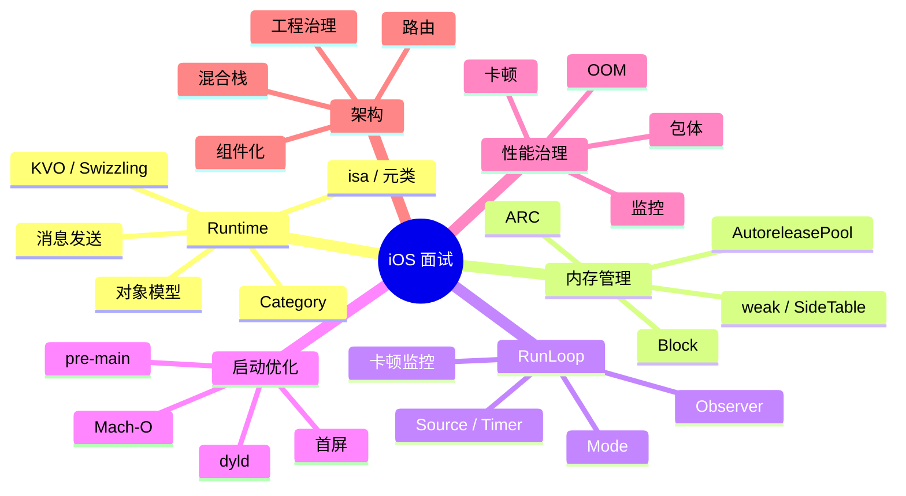

# 面试备战 iOS 01：底层总纲

iOS 高阶面试不是把 Runtime、RunLoop、内存管理、启动优化分别背一遍。真正的考察方式是交叉追问：

- Runtime 为什么影响 Category、KVO、Swizzling？
- RunLoop 为什么能解释 Timer、AutoreleasePool、卡顿监控？
- Mach-O、dyld、动态库为什么影响启动？
- ARC、weak、Block 为什么会产生循环引用和野指针？
- 架构设计怎么落到路由、组件化、混合栈和性能治理？

所以准备 iOS 面试，要建立的是知识网络，不是知识点列表。

## 1. 六条主线



## 2. Runtime 是底层主入口

Runtime 要回答的是：

> Objective-C 为什么能动态派发？

必须掌握：

- `objc_object`。
- `objc_class`。
- `isa`。
- 元类。
- `class_ro_t` / `class_rw_t`。
- `cache_t`。
- `objc_msgSend`。
- 消息转发。

它会延伸出：

- Category 为什么能加方法不能加 ivar。
- KVO 为什么能动态子类。
- Swizzling 为什么能替换实现。
- Associated Object 为什么是外部表。

## 3. 内存管理是生命周期主线

内存题不要只讲 ARC。

要讲：

```text
编译器插入 retain/release
-> Runtime 维护引用计数
-> isa extra_rc / SideTable 分层存储
-> weak_table 自动置 nil
-> AutoreleasePoolPage 延迟释放
-> dealloc 清理 weak 和关联对象
```

重点不是“对象什么时候释放”，而是“为什么这个时机释放，为什么有些对象不释放，为什么有些内存峰值很高”。

## 4. RunLoop 是主线程事件模型

RunLoop 负责解释：

- 主线程为什么不退出。
- Timer 为什么滚动时不触发。
- AutoreleasePool 为什么在 RunLoop 边界释放。
- 卡顿监控为什么能通过 Observer 做。

RunLoop 的核心不是 while 循环，而是 Mode 隔离下的事件源调度。

## 5. 启动优化要拆 pre-main 和 main 后

启动优化如果不拆阶段，就是泛泛而谈。

pre-main 看：

- Mach-O。
- dyld。
- 动态库。
- rebase/bind。
- ObjC 类注册。
- Category。
- `+load`。
- 静态初始化。

main 后看：

- AppDelegate。
- SDK 初始化。
- 首页创建。
- 首帧。
- 首次可交互。

## 6. 性能治理要闭环

性能优化不是“做了某某优化”，而是：

```text
指标 -> 采集 -> 聚合 -> 定位 -> 修复 -> 灰度 -> 验证 -> 防回退
```

卡顿要抓主线程堆栈，OOM 要看内存曲线和退出状态，包体要看 LinkMap，启动要看分阶段耗时。

## 7. 架构题要落到治理

架构不是 MVVM、组件化这些名词。

面试官想听：

- 为什么拆模块。
- 依赖方向怎么控制。
- 路由协议怎么设计。
- 组件边界怎么治理。
- Flutter 混合栈怎么统一。
- 性能指标怎么长期防劣化。

## 8. 面试回答公式

遇到复杂问题，用这个结构：

1. 先定义问题。
2. 拆底层机制。
3. 讲执行流程。
4. 讲工程场景。
5. 讲风险和取舍。
6. 讲监控和验证。

例如问启动优化：

> 我会先拆 pre-main 和 main 后。pre-main 看 dyld 加载、动态库、rebase/bind、ObjC 元数据、+load；main 后看 SDK 初始化、首页创建、首帧和可交互。优化前先埋点，优化后看线上分位数。

## 9. 高频交叉问题

### AutoreleasePool 为什么和 RunLoop 有关？

因为主线程 RunLoop 注册了 Observer，在进入和休眠边界 push/pop pool，批量释放 autorelease 对象。

### Category 为什么影响启动？

Category 元数据在 Mach-O 中，启动时 Runtime 要读取并合并到类结构中；Category 的 `+load` 还会直接增加 pre-main 时间。

### weak 为什么和 isa 有关？

weak 的反向索引（哪些 weak 变量指向某对象）存在 SideTable 的 `weak_table`,不在 isa 里。isa 的作用是优化:non-pointer isa 有 `weakly_referenced` 标记,对象释放时如果没被 weak 引用,可以跳过 weak_table 清理。

### 卡顿为什么和 RunLoop 有关？

主线程事件处理依赖 RunLoop 状态推进。长时间停在某个状态，可以说明主线程可能被耗时任务阻塞。


## 深挖追问：把底层知识串成一张因果图

总纲最怕被问成散点。你要把每个知识点都能接到同一条因果链上：

```text
Mach-O/dyld 决定代码如何进入进程
  -> Runtime realize class，整理方法表、Category、协议、类层级
  -> objc_msgSend 用 isa/cache/superclass 完成动态派发
  -> ARC/SideTable/weak 管对象生命周期
  -> RunLoop/GCD 决定任务何时在哪个线程执行
  -> UIKit/Flutter 渲染把状态变化转成一帧
  -> 性能监控把启动、卡顿、内存、包体纳入治理闭环
```

面试官继续追问时，常见的“穿透路径”是：

| 起点问题 | 继续追问 | 你要接住的底层 |
|---|---|---|
| Runtime 有什么用 | 消息发送为什么快 | `cache_t`、SEL 哈希、IMP 跳转 |
| Category 为什么不能加 ivar | 那关联对象为什么可以 | 对象内存布局 vs SideTable/Associations 外挂表 |
| weak 为什么自动置 nil | weak 表存的是什么 | 存 weak 变量地址，不是只存对象地址 |
| RunLoop 为什么能监控卡顿 | 卡在哪个状态说明什么 | `kCFRunLoopBeforeSources` 到 `kCFRunLoopBeforeWaiting` |
| 启动优化怎么做 | pre-main 到底谁耗时 | dyld fixup、ObjC setup、`+load`、page fault |
| 架构怎么设计 | 如何避免组件腐化 | 边界、依赖方向、协议、路由治理、监控 |

回答时不要说“我了解 Runtime/RunLoop/ARC”。要说“我会从一次消息调用、一次对象释放、一次主线程事件循环、一次冷启动分别拆链路”。这会把你从背八股的人区分出来。

再准备一个反问式回答：

> 这些底层点最终都不是为了炫技，而是为了定位工程问题。比如启动慢，我会先分 pre-main/main 后；pre-main 再拆 dyld、ObjC setup、`+load`；main 后再拆首屏链路。卡顿我会拆主线程任务、RunLoop 状态、渲染提交和锁等待。内存我会拆 Dart/ObjC 堆、图片解码、外部纹理和 autorelease 峰值。

这类回答能把知识点落到排障能力上。

## 一句话总结

iOS 面试的底层主线是：Runtime 解释动态性，内存解释生命周期，RunLoop 解释事件循环，dyld 解释启动，性能和架构把这些机制落到工程治理。
