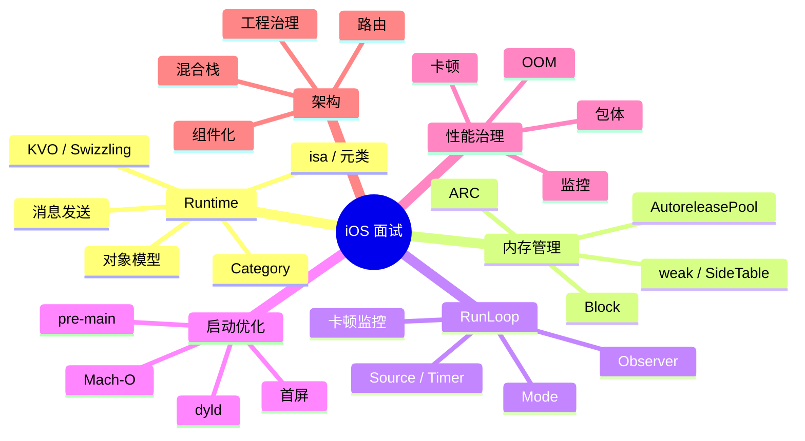

# 面试备战 iOS 01：底层总纲

iOS 高阶面试不是把 Runtime、RunLoop、内存管理、启动优化分别背一遍。真正的考察方式是交叉追问：

- Runtime 为什么影响 Category、KVO、Swizzling？
- RunLoop 为什么能解释 Timer、AutoreleasePool、卡顿监控？
- Mach-O、dyld、动态库为什么影响启动？
- ARC、weak、Block 为什么会产生循环引用和野指针？
- 架构设计怎么落到路由、组件化、混合栈和性能治理？

所以准备 iOS 面试，要建立的是知识网络，不是知识点列表。

## 1. 六条主线



## 2. Runtime 是底层主入口

Runtime 要回答的是：

> Objective-C 为什么能动态派发？

必须掌握：

- `objc_object`。
- `objc_class`。
- `isa`。
- 元类。
- `class_ro_t` / `class_rw_t`。
- `cache_t`。
- `objc_msgSend`。
- 消息转发。

它会延伸出：

- Category 为什么能加方法不能加 ivar。
- KVO 为什么能动态子类。
- Swizzling 为什么能替换实现。
- Associated Object 为什么是外部表。

## 3. 内存管理是生命周期主线

内存题不要只讲 ARC。

要讲：

```text
编译器插入 retain/release
-> Runtime 维护引用计数
-> isa extra_rc / SideTable 分层存储
-> weak_table 自动置 nil
-> AutoreleasePoolPage 延迟释放
-> dealloc 清理 weak 和关联对象
```

重点不是“对象什么时候释放”，而是“为什么这个时机释放，为什么有些对象不释放，为什么有些内存峰值很高”。

## 4. RunLoop 是主线程事件模型

RunLoop 负责解释：

- 主线程为什么不退出。
- Timer 为什么滚动时不触发。
- AutoreleasePool 为什么在 RunLoop 边界释放。
- 卡顿监控为什么能通过 Observer 做。

RunLoop 的核心不是 while 循环，而是 Mode 隔离下的事件源调度。

## 5. 启动优化要拆 pre-main 和 main 后

启动优化如果不拆阶段，就是泛泛而谈。

pre-main 看：

- Mach-O。
- dyld。
- 动态库。
- rebase/bind。
- ObjC 类注册。
- Category。
- `+load`。
- 静态初始化。

main 后看：

- AppDelegate。
- SDK 初始化。
- 首页创建。
- 首帧。
- 首次可交互。

## 6. 性能治理要闭环

性能优化不是“做了某某优化”，而是：

```text
指标 -> 采集 -> 聚合 -> 定位 -> 修复 -> 灰度 -> 验证 -> 防回退
```

卡顿要抓主线程堆栈，OOM 要看内存曲线和退出状态，包体要看 LinkMap，启动要看分阶段耗时。

## 7. 架构题要落到治理

架构不是 MVVM、组件化这些名词。

面试官想听：

- 为什么拆模块。
- 依赖方向怎么控制。
- 路由协议怎么设计。
- 组件边界怎么治理。
- Flutter 混合栈怎么统一。
- 性能指标怎么长期防劣化。

## 8. 面试回答公式

遇到复杂问题，用这个结构：

1. 先定义问题。
2. 拆底层机制。
3. 讲执行流程。
4. 讲工程场景。
5. 讲风险和取舍。
6. 讲监控和验证。

例如问启动优化：

> 我会先拆 pre-main 和 main 后。pre-main 看 dyld 加载、动态库、rebase/bind、ObjC 元数据、+load；main 后看 SDK 初始化、首页创建、首帧和可交互。优化前先埋点，优化后看线上分位数。

## 9. 高频交叉问题

### AutoreleasePool 为什么和 RunLoop 有关？

因为主线程 RunLoop 注册了 Observer，在进入和休眠边界 push/pop pool，批量释放 autorelease 对象。

### Category 为什么影响启动？

Category 元数据在 Mach-O 中，启动时 Runtime 要读取并合并到类结构中；Category 的 `+load` 还会直接增加 pre-main 时间。

### weak 为什么和 isa 有关？

weak 的反向索引（哪些 weak 变量指向某对象）存在 SideTable 的 `weak_table`,不在 isa 里。isa 的作用是优化:non-pointer isa 有 `weakly_referenced` 标记,对象释放时如果没被 weak 引用,可以跳过 weak_table 清理。

### 卡顿为什么和 RunLoop 有关？

主线程事件处理依赖 RunLoop 状态推进。长时间停在某个状态，可以说明主线程可能被耗时任务阻塞。


## 深挖追问：把底层知识串成一张因果图

总纲最怕被问成散点。你要把每个知识点都能接到同一条因果链上：

```text
Mach-O/dyld 决定代码如何进入进程
  -> Runtime realize class，整理方法表、Category、协议、类层级
  -> objc_msgSend 用 isa/cache/superclass 完成动态派发
  -> ARC/SideTable/weak 管对象生命周期
  -> RunLoop/GCD 决定任务何时在哪个线程执行

---

## 🔬 深度扩展：iOS底层知识的完整因果链

### 扩展1：从Mach-O到Runtime的完整链路

**加载链路：**
```text
1. Mach-O 存储 → __objc_classlist/__objc_catlist
2. dyld 加载 → map_images
3. Runtime _read_images → realize classes
4. attachCategories → 合并 Category 方法
5. objc_msgSend → 查找 IMP 并调用
```

**关键连接点：**
- Mach-O 定义了"什么需要加载"
- dyld 负责"怎么加载到内存"
- Runtime 负责"怎么组织成可用的类结构"
- objc_msgSend 负责"怎么找到并执行方法"

### 扩展2：isa指针的三重身份

**1. 类型标识**：指向对象的类
**2. 引用计数优化**：extra_rc 存储部分引用计数
**3. 状态标记**：weakly_referenced、has_assoc、deallocating 等

**为什么这样设计？**
- 64位指针只需要 33 位表示类地址（虚拟内存空间限制）
- 剩余 31 位用于存储高频访问的状态
- 避免每次都查 SideTable，提升性能

### 扩展3：方法查找的四级缓存

**查找顺序：**
```text
1. cache（单个类的方法缓存）
2. 当前类的方法列表
3. 父类链的 cache 和方法列表
4. 消息转发（动态解析、快速转发、完整转发）
```

**缓存策略：**
- cache 使用哈希表，$0 时间查找
- 命中率通常 > 90%
- cache_fill 时可能扩容，扩容会清空旧数据

### 扩展4：内存管理的分层设计

**三层结构：**
```text
1. isa.extra_rc（存储少量引用计数，快速路径）
2. SideTable.refcnts（溢出后的引用计数）
3. SideTable.weak_table（weak 引用表）
```

**为什么分层？**
- isa 访问最快（对象内部）
- SideTable 需要全局锁，但避免了每个对象都分配独立表
- 分段锁设计降低竞争

### 扩展5：RunLoop和其他机制的集成点

**RunLoop 是协调中心：**
```text
- AutoreleasePool：Observer 在 Entry/BeforeWaiting/Exit 管理
- NSTimer：添加到 RunLoop 的 Timer 源
- GCD main queue：dispatchPort 唤醒 RunLoop
- 事件响应：Source1（IOKit）→ Source0（UIEvent）
- 卡顿监控：Observer 记录状态变化
```

### 扩展6：多线程安全的代价对比

**无锁 < 自旋锁 < 互斥锁 < 条件锁 < 分布式锁**

| 场景 | 推荐方案 | 原因 |
|------|---------|------|
| 读多写少 | dispatch_barrier | 读并发，写串行 |
| 短临界区 | os_unfair_lock | 用户态快速路径 |
| 需要递归 | NSRecursiveLock | 记录持有线程 |
| 控制并发数 | dispatch_semaphore | 信号量控制 |

### 扩展7：性能优化的底层依据

**启动优化：**
- dyld3 闭包缓存 → 减少依赖解析
- 二进制重排 → 减少 Page Fault
- +load 延迟 → 减少 pre-main 时间

**卡顿优化：**
- RunLoop 监控 → 定位主线程阻塞
- Time Profiler → 找出 CPU 热点
- Instruments → 分析渲染瓶颈

**内存优化：**
- Memory Graph → 找循环引用
- Allocations → 找峰值原因
- VM Tracker → 找非堆内存

### 扩展8：面试追问的因果推理

**问：为什么 Category 能覆盖原方法？**
```text
因果链：
1. Category 方法在 attachCategories 时插到方法列表最前面
2. objc_msgSend 遍历方法列表，先命中 Category 的
3. 原方法仍在列表里，但不会被调用
```

**问：为什么 weak 比 strong 慢？**
```text
因果链：
1. weak 赋值要查 SideTable.weak_table
2. 需要全局锁保护
3. 需要在 weak_entry 中注册 referrer
4. 读取时要检查对象是否在 deallocating
```

**问：为什么 Block 容易循环引用？**
```text
因果链：
1. Block 捕获对象会 retain
2. self.block = ^{ self.xxx } → self 持有 block
3. block 持有 self → 形成环
4. 需要 __weak 打破持有链
```

---

## 补充总结

iOS底层的深度记忆点：

1. **Mach-O → dyld → Runtime**：加载和初始化的完整链路
2. **isa 三重身份**：类型、引用计数、状态标记
3. **方法查找四级**：cache → 类 → 父类 → 转发
4. **内存管理三层**：isa.extra_rc → SideTable.refcnts → weak_table
5. **RunLoop 集成点**：AutoreleasePool、Timer、GCD、事件、监控
6. **性能优化依据**：基于底层机制做针对性优化

面试追问时要能讲出：
- 各个机制之间的因果关系（不是孤立的知识点）
- 设计原因（为什么要分层、为什么要缓存）
- 性能代价（无锁 vs 有锁、快速路径 vs 慢速路径）
- 工程应用（理论如何指导实践）
  -> UIKit/Flutter 渲染把状态变化转成一帧
  -> 性能监控把启动、卡顿、内存、包体纳入治理闭环
```

面试官继续追问时，常见的“穿透路径”是：

| 起点问题 | 继续追问 | 你要接住的底层 |
|---|---|---|
| Runtime 有什么用 | 消息发送为什么快 | `cache_t`、SEL 哈希、IMP 跳转 |
| Category 为什么不能加 ivar | 那关联对象为什么可以 | 对象内存布局 vs SideTable/Associations 外挂表 |
| weak 为什么自动置 nil | weak 表存的是什么 | 存 weak 变量地址，不是只存对象地址 |
| RunLoop 为什么能监控卡顿 | 卡在哪个状态说明什么 | `kCFRunLoopBeforeSources` 到 `kCFRunLoopBeforeWaiting` |
| 启动优化怎么做 | pre-main 到底谁耗时 | dyld fixup、ObjC setup、`+load`、page fault |
| 架构怎么设计 | 如何避免组件腐化 | 边界、依赖方向、协议、路由治理、监控 |

回答时不要说“我了解 Runtime/RunLoop/ARC”。要说“我会从一次消息调用、一次对象释放、一次主线程事件循环、一次冷启动分别拆链路”。这会把你从背八股的人区分出来。

再准备一个反问式回答：

> 这些底层点最终都不是为了炫技，而是为了定位工程问题。比如启动慢，我会先分 pre-main/main 后；pre-main 再拆 dyld、ObjC setup、`+load`；main 后再拆首屏链路。卡顿我会拆主线程任务、RunLoop 状态、渲染提交和锁等待。内存我会拆 Dart/ObjC 堆、图片解码、外部纹理和 autorelease 峰值。

这类回答能把知识点落到排障能力上。

## 一句话总结

iOS 面试的底层主线是：Runtime 解释动态性，内存解释生命周期，RunLoop 解释事件循环，dyld 解释启动，性能和架构把这些机制落到工程治理。
