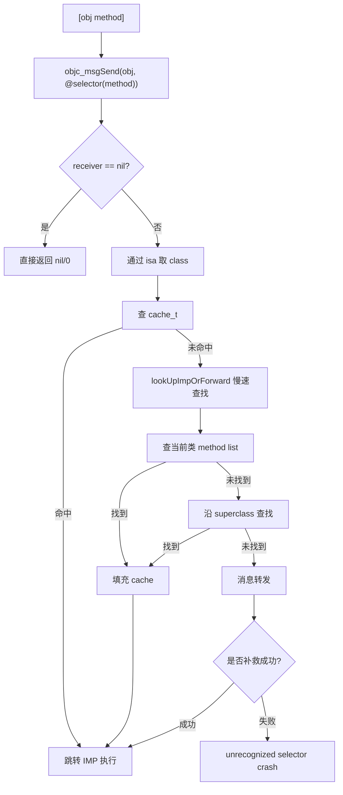

# 面试备战 iOS 02：Runtime 对象模型与消息发送

Runtime 不是“运行时 API 集合”这么简单。它是 Objective-C 语言动态性的执行系统：对象如何描述自己，类如何保存方法，消息如何找到 IMP，找不到时如何补救，Category 为什么能动态合并，Swizzling 为什么能替换实现，KVO 为什么能偷偷改 isa。

面试里如果只回答“Runtime 可以动态添加方法、交换方法、获取属性列表”，基本只能算 API 层。高分回答必须能讲清楚下面这条链：

```text
对象内存 -> isa -> class object -> cache_t -> method list -> superclass -> forwarding
```

也就是说，一次 `[obj doSomething]` 从语法糖变成机器执行，底层到底走了什么。

## 1. 先回答问题：Runtime 到底解决什么问题？

C 语言函数调用是静态的，函数地址在编译或链接阶段基本确定。Objective-C 要支持动态派发：

- 同一个 selector，不同对象可以有不同实现。
- 方法可以在运行时添加。
- Category 可以在运行时合并方法。
- 找不到方法时还有转发机会。
- KVO 可以动态生成子类拦截 setter。

所以 Objective-C 不能只靠普通函数表，它需要一套运行时数据结构和查找机制。

一句话：

> Runtime 的核心任务，是在运行时根据 receiver 和 selector 找到真正要执行的 IMP。

## 2. 对象的底层结构：实例对象只保存数据，不保存方法

Objective-C 对象可以简化理解成：

```cpp
struct objc_object {
    isa_t isa;
};
```

实例对象里主要有两类东西：

- `isa`：指向类对象。
- ivar：实例变量的真实值。

它不保存方法。方法保存在类对象里。

例如：

```objc
Person *p = [Person new];
[p sayHello];
```

`p` 这块内存里有 `isa` 和 `_name`、`_age` 等成员变量，但没有 `sayHello` 的实现。调用方法时，Runtime 通过 `p->isa` 找到 `Person` 类对象，再去类对象里找 `sayHello`。

这也是为什么实例对象很“薄”，类对象才是 Runtime 元数据中心。

## 3. 类对象结构：Runtime 真正的调度中心

类对象底层可以简化为：

```cpp
struct objc_class : objc_object {
    Class superclass;
    cache_t cache;
    class_data_bits_t bits;

    class_rw_t *data() {
        return bits.data();
    }
};
```

关键字段：

| 字段 | 作用 | 面试重点 |
|---|---|---|
| `isa` | 类对象的 isa 指向元类 | 类方法查找入口 |
| `superclass` | 指向父类 | 继承链查找 |
| `cache` | 方法缓存 | 消息发送快路径 |
| `bits` | 指向类数据 | ro/rw 方法、属性、协议 |

这里最容易被忽略的是 `cache_t`。很多人讲消息发送，只讲“先当前类，再父类”，但真实高频路径是先查缓存。

## 4. ro / rw：为什么 Category 能加方法，不能加 ivar？

类数据不是一坨普通结构，而是拆成编译期只读和运行时可写。

```text
class_ro_t：编译期确定，只读
class_rw_t：运行时生成，可写
```

### 4.1 class_ro_t：类的原始底稿

`class_ro_t` 里保存编译期确定的信息：

- 类名。
- 实例变量布局。
- 原始方法列表。
- 属性。
- 协议。

ivar 布局在这里已经确定。对象创建时需要按这个布局分配内存，所以它不能在运行时随便改变。

### 4.2 class_rw_t：运行时活页本

Runtime realize class 时，会创建或准备 `class_rw_t`。Category 加载时，会把 Category 的方法、属性、协议合并进运行时结构。

所以 Category 可以添加方法，因为方法查找依赖运行时方法列表；但不能直接添加 ivar，因为 ivar 涉及对象内存布局，编译期已经定死。

可以用一句面试话术：

> Category 添加方法改变的是类的方法表，方法表是运行时可扩展的；添加实例变量改变的是对象内存布局，而对象大小和 ivar offset 在编译期已经确定，运行时再改会破坏已有对象的内存访问。

## 5. cache_t：为什么消息发送能足够快？

Objective-C 是动态派发，如果每次都遍历方法列表，性能会很差。`cache_t` 就是 Runtime 为消息发送设计的一级缓存。

简化结构：

```cpp
struct cache_t {
    bucket_t *_buckets;
    mask_t _mask;
    mask_t _occupied;
};

struct bucket_t {
    SEL _sel;
    IMP _imp;
};
```

查找时通常用 selector 做哈希，定位 bucket：

```text
index = SEL & mask
```

命中后直接拿 IMP 调用。

> 这是简化模型。现代 arm64 的 `cache_t` 字段已经演进：buckets 指针和 mask 被打包进 `_bucketsAndMaybeMask`（不同版本还有把 mask 放高 16 位等变体），不再是独立的 `_mask` 字段。但“用 SEL 哈希定位 bucket、命中拿 IMP”的核心思路不变。被追问“`_mask` 字段在 arm64 上还在吗”时，要能讲清老结构和新布局的差异。

### 为什么 cache 不走复杂扩容迁移？

方法缓存追求极致速度。`objc_msgSend` 是全 App 调用最频繁的函数之一，Runtime 更愿意让缓存结构简单，冲突处理简单:扩容时直接分配新 buckets,旧 buckets 不立即 free,而是放进垃圾桶(`_garbage`)延迟回收——这样读路径可以无锁安全访问,不必为保留旧缓存付出复杂迁移成本。

这是典型的性能取舍：

> 消息发送快路径必须极致短，复杂性尽量放到慢路径。

## 6. objc_msgSend 完整链路

一次消息发送可以分成三级：



## 7. 快路径：为什么用汇编？

`objc_msgSend` 的快路径在 ARM64 上由汇编实现，原因很直接：

- 调用频率极高。
- 参数已经在寄存器里。
- 需要快速判断 nil。
- 需要快速从 isa 取 class。
- 需要快速查 cache。
- 命中后直接跳转 IMP。

如果每次消息都进入 C 函数、加锁、遍历列表，Objective-C 的动态性就会非常昂贵。

快路径关键点：

1. receiver 在寄存器里。
2. selector 在寄存器里。
3. receiver 为 nil 直接返回。
4. 从 isa 中取 class。
5. 从 class 中取 cache。
6. 哈希查 bucket。
7. 命中后 `br` 到 IMP。

## 8. 慢路径：lookUpImpOrForward 做什么？

cache miss 后进入 C/C++ 慢路径。慢路径会做更多安全和完整逻辑：

- 确保类已经 realize。
- 必要时初始化类。
- 查当前类方法列表。
- 查父类方法列表。
- 找到后填充 cache。
- 找不到进入动态决议和转发。

### 方法列表查找为什么可以慢一点？

因为它不是高频路径。只要方法第一次调用被找到并缓存，后续大概率走 cache。Runtime 的设计思想就是：

> 第一次调用允许慢，后续调用必须快。

## 9. 找到父类方法后，缓存写到哪里？

一个细节：如果子类没有实现方法，最终在父类找到了 IMP，缓存通常会写到“消息接收者所属的类”的 cache 中，而不是只依赖父类 cache。

例如：

```objc
@interface Animal : NSObject
- (void)run;
@end

@interface Dog : Animal
@end

Dog *dog = [Dog new];
[dog run];
```

`run` 在 `Animal` 找到，但后续 `Dog` 实例再调用 `run`，可以直接在 `Dog` 的 cache 命中。

这就是缓存“面向接收者类型优化”的体现。

## 10. 消息转发：找不到方法后的三次补救

如果继承链都找不到，Runtime 不会立刻崩，而是给三次机会。

### 10.1 动态方法解析

```objc
+ (BOOL)resolveInstanceMethod:(SEL)sel;
+ (BOOL)resolveClassMethod:(SEL)sel;
```

适合运行时补一个 IMP。

示例：

```objc
void dynamicRun(id self, SEL _cmd) {
    NSLog(@"dynamic run");
}

+ (BOOL)resolveInstanceMethod:(SEL)sel {
    if (sel == @selector(run)) {
        class_addMethod(self, sel, (IMP)dynamicRun, "v@:");
        return YES;
    }
    return [super resolveInstanceMethod:sel];
}
```

这一步成功后，Runtime 会重新走消息查找。

注意区分:`resolveInstanceMethod` 里 `self` 是类对象,`class_addMethod(self, ...)` 把方法加到类;而 `resolveClassMethod` 处理类方法,要 `class_addMethod(object_getClass(self), ...)` 加到元类。

### 10.2 快速转发

```objc
- (id)forwardingTargetForSelector:(SEL)aSelector;
```

把消息交给另一个对象处理。

```objc
- (id)forwardingTargetForSelector:(SEL)aSelector {
    if (aSelector == @selector(pay)) {
        return self.paymentProxy;
    }
    return [super forwardingTargetForSelector:aSelector];
}
```

它成本低，因为不创建 `NSInvocation`。

### 10.3 完整转发

```objc
- (NSMethodSignature *)methodSignatureForSelector:(SEL)aSelector;
- (void)forwardInvocation:(NSInvocation *)anInvocation;
```

完整转发最灵活，可以修改参数、改 selector、转发给多个对象，甚至做 RPC 风格调用。

但它成本也最高。


### 10.4 消息转发真实顺序：不是直接进 `forwardInvocation:`

被问到消息转发时，不要只背“三步”。要把 Runtime 的决策顺序说出来：

```text
objc_msgSend
  -> cache miss
  -> lookUpImpOrForward
  -> 当前类/父类方法列表都找不到
  -> _objc_msgForward / forwarding trampoline
  -> +resolveInstanceMethod: / +resolveClassMethod:
  -> -forwardingTargetForSelector:
  -> -methodSignatureForSelector:
  -> -forwardInvocation:
  -> doesNotRecognizeSelector:
```

这里有两个容易被追问的点。

第一，动态解析发生在“普通查找失败之后”，但成功后不是直接调用你新增的方法，而是把方法加入类的方法表，再重新走一次查找链路，最后可能进入 cache。也就是说它补的是类的能力，不是只补本次调用。

第二，`_objc_msgForward` 可以理解成一个转发入口。不同架构和返回值 ABI 下历史上有不同入口，例如老架构上结构体返回可能涉及 `_objc_msgForward_stret`。arm64 统一了很多 ABI 细节，面试时不必死背符号名，但要知道：Runtime 发现找不到 IMP 后，会把调用导入 Foundation 层的转发机制。

### 10.5 动态方法解析适合什么，不适合什么？

动态方法解析适合“类确实应该拥有这个方法，只是实现可以懒加载”的场景：

- Core Data 动态属性访问。
- `@dynamic` 属性的 getter/setter。
- DSL 或脚本桥接里按 selector 生成 IMP。
- 基础设施里为一类方法补通用实现。

不适合用它兜所有未知方法。原因是 `class_addMethod` 会改变类的方法表，一旦加进去，后续同类对象都会命中这个实现。如果你只是想把某一次消息交给另一个对象，用动态解析会污染类能力边界。

面试回答可以这么说：

> 动态解析是“给类补方法”，快速转发是“换接收者”，完整转发是“把调用对象化”。三者抽象层级完全不同。

### 10.6 `forwardingTargetForSelector:` 的限制

快速转发看起来像代理，但它有几个硬限制：

1. 不能返回 `self`，否则会形成无限循环。
2. 返回对象必须能响应这个 selector。
3. 它不能修改参数。
4. 它不能拿到 `NSInvocation`，所以不能多播、改 selector、缓存调用、做 RPC 编码。
5. 它更像“透明替身”，调用方通常感知不到接收者被换了。

典型使用是轻量代理：

```objc
- (id)forwardingTargetForSelector:(SEL)aSelector {
    if ([self.realTarget respondsToSelector:aSelector]) {
        return self.realTarget;
    }
    return [super forwardingTargetForSelector:aSelector];
}
```

但如果你要做多代理，例如一个事件通知多个 observer，快速转发不够，因为它只能返回一个目标。此时才需要完整转发。

### 10.7 `methodSignatureForSelector:` 为什么必须先返回签名？

完整转发的关键不是 `forwardInvocation:`，而是方法签名。

Runtime 要构造 `NSInvocation`，必须知道：

- 返回值类型。
- 参数个数。
- 每个参数类型和 ABI 编码。
- 隐藏参数 `self` 和 `_cmd`。

所以如果 `methodSignatureForSelector:` 返回 nil，Runtime 无法构造 invocation，会直接走 `doesNotRecognizeSelector:`。

示例：

```objc
- (NSMethodSignature *)methodSignatureForSelector:(SEL)aSelector {
    NSMethodSignature *signature = [super methodSignatureForSelector:aSelector];
    if (!signature) {
        signature = [self.proxy methodSignatureForSelector:aSelector];
    }
    return signature;
}

- (void)forwardInvocation:(NSInvocation *)invocation {
    if ([self.proxy respondsToSelector:invocation.selector]) {
        [invocation invokeWithTarget:self.proxy];
    } else {
        [super forwardInvocation:invocation];
    }
}
```

如果面试官追问类型编码，`v@:` 的意思是：返回 `void`，参数是 `self` 对象和 `_cmd` selector。对象方法至少都有这两个隐藏参数。

### 10.8 `NSInvocation` 到底保存了什么？

`NSInvocation` 是一次 ObjC 消息调用的对象化表示，里面可以保存：

- target。
- selector。
- method signature。
- 所有参数。
- 返回值缓冲区。

所以它可以做普通消息发送做不了的事：

- 延迟执行。
- 修改 target。
- 修改 selector。
- 修改参数。
- 读取返回值。
- 多播给多个 target。
- 把调用编码成网络/RPC 消息。

但它也有代价：

- 构造 invocation 比直接 `objc_msgSend` 慢很多。
- 参数要按 ABI 拷贝，基本类型、结构体、对象都要正确处理。
- ARC 下对象参数和返回值的生命周期要小心，必要时 `retainArguments`。
- block、C 指针、结构体跨边界转发时很容易出错。

所以完整转发适合基础设施，不适合高频热路径。

### 10.9 `respondsToSelector:`、`instancesRespondToSelector:` 和消息转发的关系

很多人防崩溃会先判断：

```objc
if ([obj respondsToSelector:@selector(foo)]) {
    [obj foo];
}
```

但 `respondsToSelector:` 默认主要查方法列表，不一定知道你后续会通过完整转发处理这个 selector。也就是说，一个对象可能 `respondsToSelector:` 返回 NO，但真正发送消息时能通过 `forwardInvocation:` 处理。

如果你做代理或转发基础设施，通常要同步重写：

```objc
- (BOOL)respondsToSelector:(SEL)aSelector {
    return [super respondsToSelector:aSelector] ||
           [self.proxy respondsToSelector:aSelector];
}
```

否则外部框架先用 `respondsToSelector:` 判断能力时，会误以为你不能处理。

### 10.10 消息转发和多继承的关系

Objective-C 没有多继承，但消息转发可以模拟一部分“组合式多继承”：

```text
UserServiceProxy
  -> AuthService 处理 login/logout
  -> ProfileService 处理 profile/update
  -> TrackingService 处理 track
```

对外看像一个对象响应很多方法，内部其实分发给多个对象。

但这不是语言级多继承。它缺少：

- 编译期类型检查。
- 明确方法来源。
- IDE 重构支持。
- 明确冲突解决规则。

所以工程上更推荐协议组合、组合对象、明确路由表，而不是让所有调用靠 `forwardInvocation:` 黑盒分发。

### 10.11 防崩溃兜底为什么危险？

`unrecognized selector` 防崩溃通常会利用消息转发，把未知 selector 吃掉。但它有明显风险：

1. 掩盖真实 bug。线上不崩了，但业务状态可能已经错了。
2. 返回值不确定。对象、整数、结构体返回都需要不同处理，随便返回 nil/0 可能造成二次问题。
3. 破坏调用方假设。调用方以为方法执行成功，实际没有任何副作用。
4. 调试困难。堆栈不再停在真实错误现场。

比较稳的策略是：

- 只对白名单类兜底。
- 只在线上兜底，debug 仍然 crash。
- 记录 selector、receiver class、调用栈和线程。
- 保证返回值按签名构造安全默认值。
- 把兜底视为监控手段，不视为修复手段。

这一段如果答出来，面试官通常会认为你不是只会背 Runtime，而是真的知道动态能力的工程边界。

## 11. 工程里怎么用 Runtime 才合理？

Runtime 能力强，但不能在业务层滥用。合理使用场景通常在基础设施层：

### 11.1 无侵入埋点

通过 Swizzling 页面生命周期方法，例如：

- `viewDidAppear:`
- `viewDidDisappear:`

但必须解决：

- 多次交换保护。
- 方法签名一致。
- 调用原实现。
- 黑白名单。
- 与其他 SDK 冲突。

### 11.2 防崩溃

例如拦截数组越界、字典插入 nil、unrecognized selector。

但防崩溃不能掩盖问题。正确姿势是：

- 线上兜底。
- 记录堆栈。
- 聚合分析。
- 推动业务修复。

### 11.3 模型解析

读取属性列表、ivar 列表做 JSON 映射。这类使用相对安全，但也要处理：

- 类型编码。
- 父类属性。
- 容器泛型。
- 缓存元数据。

## 12. 高频追问

### Q1：`objc_msgSend` 的执行流程？

高分结构：

1. 先判断 receiver 是否为 nil。
2. 从 receiver 的 isa 取 class。
3. 在 class 的 cache 中查 SEL 对应 IMP。
4. cache miss 后进入慢路径。
5. 慢路径查当前类方法列表，再沿 superclass 查找。
6. 找到后回填 cache。
7. 仍找不到进入三阶段消息转发。
8. 全部失败才抛 `unrecognized selector`。

### Q2：为什么给 nil 发消息不会崩？

因为 `objc_msgSend` 快路径会先判断 receiver。receiver 是 nil 时，不会继续解引用 isa，而是直接返回零值。

注意：这是历史上 i386/armv7 的 `objc_msgSend_stret`(返回结构体走专门入口)遗留问题,给 nil 发返回 struct 的消息返回值未定义。arm64 已统一不用 stret(结构体通过 x8 间接返回),常规对象和基础返回值可以按 nil/0 理解。

### Q3：Runtime 为什么不每次都查方法列表？

因为方法调用太高频。方法列表查找涉及遍历、锁、父类链，成本高。cache 把 SEL -> IMP 缓存起来，让后续调用走 O(1) 近似路径。

### Q4：消息转发能用来做什么？

可以做代理转发、AOP、防崩溃、动态 RPC、多播代理。但不适合隐藏正常业务逻辑，否则调用链不可读，调试困难。

## 13. 易错点

- 把 Runtime 等同于一组 API。
- 忽略 cache_t，直接说从方法列表查找。
- 认为 Category 覆盖方法是删除了原方法。
- 认为消息转发只有 `forwardInvocation:`。
- 在业务代码里滥用 Swizzling 和消息转发。


## 深挖追问：Runtime 题的防穿透清单

1. `objc_msgSend` 为什么不能直接写成普通 C 函数？
   因为它要遵守调用 ABI，不能破坏参数寄存器；命中 cache 后要直接跳到 IMP，让 IMP 像正常函数一样接收原始参数。普通 C 包一层会增加保存/恢复寄存器、栈帧和间接调用成本。

2. SEL 和 IMP 分别是什么？
   SEL 是方法名的唯一标识，可以理解为 intern 后的 selector；IMP 是函数指针。不同类可以用同一个 SEL 对应不同 IMP。

3. 为什么 cache 命中后不检查方法签名？
   Objective-C 的动态派发默认相信编译期和运行时元数据。签名检查放在每次调用热路径里成本太高。签名不匹配通常是 Swizzling、动态添加方法或强转导致的工程错误。

4. Category 同名方法为什么会“覆盖”原方法？
   不是删除原方法，而是方法列表组织和查找顺序导致后合并的方法更先被找到。原 IMP 可能仍在方法列表里，只是正常查找不会先命中。

5. `super` 调用是不是换了 receiver？
   不是。receiver 仍然是当前对象，只是从父类开始查方法。底层是 `objc_msgSendSuper` 携带 receiver 和 search class。

6. 消息转发为什么能模拟多播代理？
   因为完整转发把一次调用变成 `NSInvocation`，你可以遍历多个 target 执行。但要处理返回值冲突，所以更适合 void 型事件通知，不适合有明确返回值的查询。

7. Runtime API 应该放在哪里？
   放基础设施层，例如埋点、Crash 兜底、模型映射、插件注册。不要把业务分支隐藏在动态派发里，否则可读性和可测试性会迅速下降。

## 一句话总结

Runtime 的主线就是：实例对象通过 isa 找类，类用 cache 加速 selector 到 IMP 的映射，cache miss 后查方法列表和父类链，最后才进入消息转发补救。

---

## 🔬 深度扩展：消息转发要讲到工程陷阱

消息转发是面试中最容易被"继续追问"的点。只背三个方法名不够，要能讲清楚**每个阶段的使用场景、性能代价、相互关系和工程陷阱**。

### 扩展1：动态方法解析的正确理解

很多人以为 `resolveInstanceMethod:` 只是"补一个方法"，但它的语义是**给类永久添加方法**。

**核心流程（伪代码）：**

```text
lookUpImpOrForward 找不到方法
  -> 第一次进入动态解析
  -> 调用 +resolveInstanceMethod: / +resolveClassMethod:
  -> 如果返回 YES，重新走一次 lookUpImpOrForward
  -> 这次可能命中刚添加的方法，进入 cache
  -> 如果仍未找到，进入转发
```

**关键点：**

1. **只调用一次**  
   `resolveInstanceMethod:` 对同一个 selector 只会调用一次。如果你返回 YES 但没真正添加方法，第二次查找失败就直接进转发，不会再给你机会。

2. **方法会进入类的方法列表**  
   用 `class_addMethod` 添加的方法是**永久的**，不是"只为本次调用临时补"。后续所有该类实例调用这个方法都会命中。

3. **实例方法 vs 类方法的陷阱**  
   ```objc
   // 错误写法：实例方法解析里加到类对象
   + (BOOL)resolveInstanceMethod:(SEL)sel {
       class_addMethod(self, sel, (IMP)dynamicMethod, "v@:");
       return YES;
   }
   
   // 类方法解析要加到元类
   + (BOOL)resolveClassMethod:(SEL)sel {
       Class metaClass = object_getClass(self);  // 注意这里
       class_addMethod(metaClass, sel, (IMP)dynamicClassMethod, "v@:");
       return YES;
   }
   ```

**适用场景：**
- Core Data 的 `@dynamic` 属性
- JSON 模型的动态属性访问
- DSL/脚本桥接按规则生成方法
- 基础设施需要为一类方法补通用实现

**不适合：**
- 只想把本次调用转发给另一个对象 → 用快速转发
- 想要修改调用参数或多播 → 用完整转发
- 想要运行时决定是否响应 → 污染类能力边界

### 扩展2：快速转发的限制和正确用法

`forwardingTargetForSelector:` 看起来像简单代理，但有**硬限制**：

**核心限制：**

```objc
- (id)forwardingTargetForSelector:(SEL)aSelector {
    // ❌ 不能返回 self，否则无限循环
    if (aSelector == @selector(foo)) {
        return self;  // Runtime 检测到后会直接走完整转发或崩溃
    }
    
    // ❌ 返回的对象必须能响应这个方法
    if (![self.delegate respondsToSelector:aSelector]) {
        return nil;  // 不能随便返回对象
    }
    
    // ✅ 正确：返回能处理的对象
    return self.delegate;
}
```

**为什么不能返回 self？**

因为 `forwardingTargetForSelector:` 的调用时机是"在当前对象方法表找不到"之后。如果返回 self：

```text
[obj foo]
  -> obj 的方法表找不到 foo
  -> forwardingTargetForSelector: 返回 obj
  -> 重新给 obj 发 foo 消息
  -> 又找不到
  -> 又调用 forwardingTargetForSelector:
  -> 死循环
```

**不能修改调用：**

快速转发只是"换接收者"，不能：
- 修改参数
- 修改 selector
- 拿到 NSInvocation
- 多播给多个对象
- 记录调用日志
- 做权限检查

如果需要这些能力，必须用完整转发。

**性能对比（重要）：**

快速转发**不创建 NSInvocation**，这是它比完整转发快的根本原因：

```text
快速转发：重新 objc_msgSend(newTarget, selector, args...)
完整转发：构造 NSInvocation（涉及签名查找、参数拷贝、返回值缓冲）
```

典型场景：
- 轻量代理：把某一类消息转发给内部对象
- 组合模式：对外统一接口，内部分发给不同子服务
- 透明替身：对调用方隐藏真实接收者

### 扩展3：完整转发的复杂性和工程风险

完整转发是三阶段里最复杂、最强大、也最容易出错的。

**完整流程（伪代码）：**

```text
快速转发返回 nil
  -> 调用 -methodSignatureForSelector:
  -> 如果返回 nil，直接 doesNotRecognizeSelector:
  -> 如果返回签名，Runtime 用它构造 NSInvocation
  -> 调用 -forwardInvocation:
  -> 你可以修改 invocation、转发、多播、缓存等
  -> 调用 [invocation invoke]
```

**为什么必须先返回方法签名？**

`NSInvocation` 需要知道：
- 返回值类型和大小（决定返回值寄存器/栈布局）
- 参数个数和类型（决定如何从寄存器/栈读取参数）
- 是否是结构体返回（arm64 统一了但老架构有差异）

如果签名错误：
```objc
- (NSMethodSignature *)methodSignatureForSelector:(SEL)aSelector {
    // ❌ 错误：返回签名和真实方法不匹配
    return [NSMethodSignature signatureWithObjCTypes:"v@:"];  // void (id, SEL)
}

- (void)forwardInvocation:(NSInvocation *)invocation {
    // 实际被调用方法有参数，但签名里没有
    // Runtime 会按错误签名读取参数 → 寄存器/栈错位 → 崩溃或数据错乱
}
```

**NSInvocation 到底保存了什么？**

```objc
NSInvocation *invocation;
// 里面有：
invocation.target;           // 原始接收者
invocation.selector;         // 原始 selector
invocation.methodSignature;  // 签名
// 参数：getArgument:atIndex:
// 返回值：getReturnValue:
```

关键能力：
```objc
- (void)forwardInvocation:(NSInvocation *)invocation {
    // 1. 可以改 target
    invocation.target = self.backup;
    
    // 2. 可以改 selector
    invocation.selector = @selector(fallbackMethod);
    
    // 3. 可以改参数
    NSString *newArg = @"modified";
    [invocation setArgument:&newArg atIndex:2];  // index 0/1 是 self/_cmd
    
    // 4. 可以多播
    for (id observer in self.observers) {
        invocation.target = observer;
        [invocation invoke];
    }
    
    // 5. 可以读取返回值
    [invocation invoke];
    id returnValue;
    [invocation getReturnValue:&returnValue];
    NSLog(@"got return: %@", returnValue);
}
```

**工程陷阱1：对象参数的内存管理**

ARC 下，`NSInvocation` 不会自动 retain 参数对象：

```objc
- (void)forwardInvocation:(NSInvocation *)invocation {
    // ❌ 危险：参数对象可能已经释放
    dispatch_async(queue, ^{
        [invocation invoke];  // 参数可能是悬空指针
    });
    
    // ✅ 正确：显式 retain
    [invocation retainArguments];
    dispatch_async(queue, ^{
        [invocation invoke];
    });
}
```

**工程陷阱2：结构体/基本类型参数**

```objc
// 设置基本类型参数
int count = 10;
[invocation setArgument:&count atIndex:2];  // 注意取地址

// 设置结构体
CGRect frame = CGRectMake(0, 0, 100, 100);
[invocation setArgument:&frame atIndex:2];
```

**工程陷阱3：block 参数**

Block 作为参数传递时要特别小心：
```objc
void (^block)(void) = ^{ NSLog(@"block"); };
[invocation setArgument:&block atIndex:2];  // block 可能在栈上
[invocation retainArguments];  // 这会 copy block 到堆
```

**性能代价（量化）：**

在典型场景下，完整转发的成本是直接调用的 **10-50倍**：

```text
直接调用 objc_msgSend:       ~10-20 纳秒
快速转发:                      ~100-200 纳秒（多一次查找+一次消息发送）
完整转发:                      ~500-1000 纳秒（查签名+构造invocation+参数拷贝）
```

所以完整转发适合：
- 低频基础设施（RPC 代理、AOP 埋点）
- 多播代理（通知多个观察者）
- 调用记录和重放
- 权限拦截和审计

不适合：
- 高频业务调用
- 性能敏感热路径
- 简单的方法代理

### 扩展4：三阶段转发的决策树

面试时要能清晰说出什么场景用哪个阶段：

```text
需求：给类补一个通用方法实现
  → 动态方法解析

需求：把调用转给另一个对象，不修改参数
  → 快速转发

需求：多播、改参数、记录调用、RPC
  → 完整转发

需求：防崩溃兜底
  → 完整转发 + 返回安全默认值
  → 但要记录日志、聚合分析、推动修复
```

### 扩展5：防崩溃兜底的正确姿势

很多 SDK 用消息转发做 `unrecognized selector` 防崩溃：

```objc
- (NSMethodSignature *)methodSignatureForSelector:(SEL)aSelector {
    // 兜底：返回一个万能签名
    return [NSMethodSignature signatureWithObjCTypes:"v@:@"];
}

- (void)forwardInvocation:(NSInvocation *)invocation {
    // 记录崩溃信息
    NSLog(@"[防崩溃] %@ 调用了不存在的方法 %@", 
          NSStringFromClass([invocation.target class]),
          NSStringFromSelector(invocation.selector));
    
    // 上报到监控系统
    [CrashMonitor reportUnrecognizedSelector:invocation];
    
    // 静默返回（不做任何事）
}
```

**工程风险：**

1. **掩盖真实 bug**  
   线上不崩了，但业务逻辑可能已经错了

2. **返回值不确定**  
   调用方期望返回对象/整数/结构体，你返回什么？

3. **破坏调用方假设**  
   调用方以为方法执行了，实际什么都没发生

4. **调试困难**  
   堆栈不再停在真实错误现场

**稳定方案：**

```objc
// 1. 只对白名单类兜底
if (![self shouldPreventCrashForClass:[invocation.target class]]) {
    [super forwardInvocation:invocation];  // 让它正常崩
    return;
}

// 2. debug 模式仍然 crash
#if DEBUG
    [super forwardInvocation:invocation];
    return;
#endif

// 3. 记录完整上下文
NSMutableDictionary *context = @{
    @"class": NSStringFromClass([invocation.target class]),
    @"selector": NSStringFromSelector(invocation.selector),
    @"thread": [NSThread currentThread],
    @"stackSymbols": [NSThread callStackSymbols]
}.mutableCopy;

// 4. 按签名返回安全默认值
const char *returnType = invocation.methodSignature.methodReturnType;
if (strcmp(returnType, "@") == 0) {
    // 对象类型返回 nil
    id nilValue = nil;
    [invocation setReturnValue:&nilValue];
} else if (strcmp(returnType, "v") == 0) {
    // void 不用设返回值
} else {
    // 基本类型返回 0
    long long zero = 0;
    [invocation setReturnValue:&zero];
}

// 5. 聚合上报
[Monitoring aggregateUnrecognizedSelector:context];
```

### 扩展6：respondsToSelector: 和消息转发的协调

标准实现只查方法列表，不知道你后续会通过转发处理：

```objc
if ([obj respondsToSelector:@selector(foo)]) {
    [obj foo];  // 可能返回 NO，但实际 foo 能通过转发处理
}
```

**正确做法：同步重写**

```objc
- (BOOL)respondsToSelector:(SEL)aSelector {
    if ([super respondsToSelector:aSelector]) {
        return YES;
    }
    
    // 检查是否能通过转发处理
    if ([self.proxy respondsToSelector:aSelector]) {
        return YES;
    }
    
    return NO;
}

- (id)forwardingTargetForSelector:(SEL)aSelector {
    if ([self.proxy respondsToSelector:aSelector]) {
        return self.proxy;
    }
    return [super forwardingTargetForSelector:aSelector];
}
```

否则 KVO、Cocoa 框架、第三方库可能因为 `respondsToSelector:` 返回 NO 而跳过调用。

### 扩展7：实战案例 - 多播代理的标准实现

```objc
@interface MulticastDelegate : NSObject
@property (nonatomic, strong) NSHashTable *delegates;  // weak 引用
@end

@implementation MulticastDelegate

- (NSMethodSignature *)methodSignatureForSelector:(SEL)sel {
    // 从任意一个 delegate 获取签名
    for (id delegate in self.delegates) {
        if ([delegate respondsToSelector:sel]) {
            return [delegate methodSignatureForSelector:sel];
        }
    }
    
    // 兜底：避免崩溃
    return [NSMethodSignature signatureWithObjCTypes:"v@:"];
}

- (void)forwardInvocation:(NSInvocation *)invocation {
    SEL selector = invocation.selector;
    
    // 遍历所有 delegate
    for (id delegate in self.delegates) {
        if ([delegate respondsToSelector:selector]) {
            // 重置 target 并调用
            invocation.target = delegate;
            [invocation invoke];
        }
    }
}

- (BOOL)respondsToSelector:(SEL)aSelector {
    if ([super respondsToSelector:aSelector]) {
        return YES;
    }
    
    // 只要有一个 delegate 能响应就返回 YES
    for (id delegate in self.delegates) {
        if ([delegate respondsToSelector:aSelector]) {
            return YES;
        }
    }
    
    return NO;
}

@end
```

**使用：**
```objc
MulticastDelegate *multicast = [[MulticastDelegate alloc] init];
[multicast.delegates addObject:observerA];
[multicast.delegates addObject:observerB];

// 调用会通知所有观察者
[(id<SomeDelegate>)multicast didSomething];
```

### 扩展8：消息转发和方法缓存的关系

容易被忽略的细节：**动态解析添加的方法会进 cache，但转发不会**。

```text
动态解析成功：
  class_addMethod 把方法加入类
  -> 下次调用直接命中方法列表
  -> 后续可能进 cache

快速转发/完整转发：
  -> 每次都走转发流程
  -> 不进 cache
  -> 性能取决于转发逻辑
```

所以高频调用不要依赖转发，要么用动态解析，要么重新设计。

---

## 补充总结

消息转发三阶段的深度记忆点：

1. **动态解析**：永久改变类的能力，适合补通用方法
2. **快速转发**：换接收者，不创建 invocation，适合轻量代理
3. **完整转发**：万能但贵，适合多播、RPC、调用记录

面试追问时要能讲出：
- 每个阶段的调用时机和限制
- NSInvocation 的构造成本和内存管理
- 防崩溃兜底的工程陷阱
- respondsToSelector: 需要同步重写
- 性能代价的量级差异

工程上：动态解析和快速转发优先，完整转发只用在真正需要的地方。
