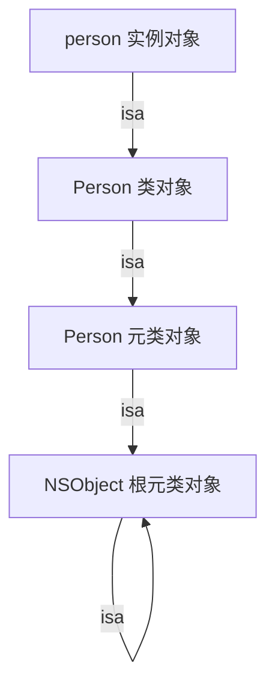
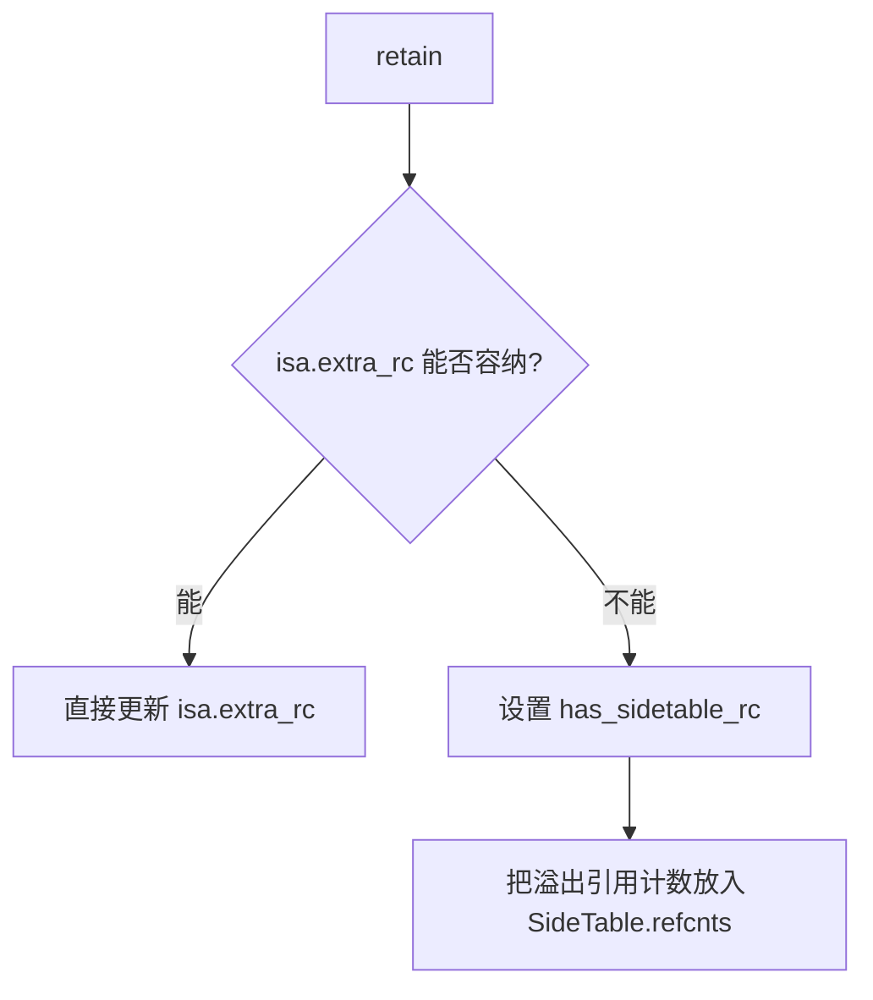
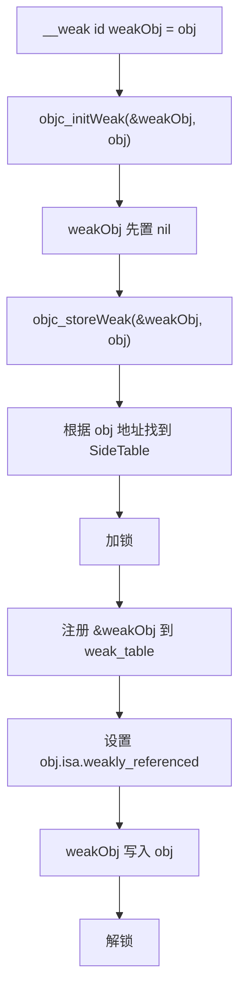
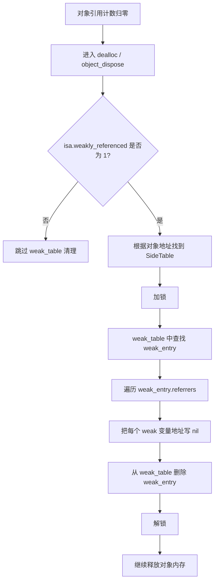

# 面试备战 iOS 03：isa、类对象、元类与方法缓存

如果 Runtime 是 Objective-C 的运行系统，那 `isa` 就是这套系统的入口。对象靠 `isa` 找到类，类靠 `isa` 找到元类，方法查找靠 `isa` 确定起点，KVO 靠修改 `isa` 改变行为，内存管理还把引用计数、weak 标记、关联对象标记塞进 non-pointer isa。

这篇文章解决三个问题：

1. `isa` 到底指向谁？
2. 类对象和元类为什么要存在？
3. `isa` 为什么不只是一个指针？

## 1. 三类对象：实例对象、类对象、元类对象

Objective-C 对象体系里有三类核心对象：

| 类型 | 作用 | 保存什么 |
|---|---|---|
| 实例对象 | 业务数据载体 | isa、成员变量值 |
| 类对象 | 描述实例对象 | 实例方法、属性、协议、ivar 布局、cache |
| 元类对象 | 描述类对象 | 类方法、类方法 cache |

实例对象是我们平时 alloc 出来的对象。

类对象和元类对象由 Runtime 管理，通常每个类各有一份类对象和元类对象。

## 2. isa 链：对象如何找到“自己的类”

最重要的规则：

```text
实例对象 isa -> 类对象
类对象 isa -> 元类对象
元类对象 isa -> 根元类对象
根元类对象 isa -> 根元类对象自己
```

用图表示：



为什么根元类 isa 指向自己？

因为 Runtime 需要让“类也是对象”这件事在消息发送模型里闭环。类对象接收类方法时，沿 isa 找到元类；元类继续作为对象存在，最终必须有一个稳定终点。

## 3. superclass 链：方法找不到时往哪里走

`isa` 决定查找入口，`superclass` 决定查找方向。

实例方法查找：

```text
实例对象 -> isa -> 当前类对象 -> superclass -> 父类对象 -> ... -> NSObject
```

类方法查找：

```text
类对象 -> isa -> 当前元类对象 -> superclass -> 父元类对象 -> ... -> 根元类
```

一个经典细节：

> 根元类的 superclass 指向根类 NSObject。

这样类对象也能响应某些 NSObject 实例方法，例如 `respondsToSelector:`。

## 4. 为什么要有元类？

如果没有元类，类方法要放在哪里？

你可能会说放在类对象里。但实例方法也在类对象里。那消息发送就要分两套逻辑：

- 实例对象调用实例方法：去类对象找。
- 类对象调用类方法：去类对象的另一个区域找。

Runtime 选择了更统一的设计：

> 类方法就是元类的实例方法。

这样 `[obj run]` 和 `[Person run]` 都可以复用同一套 `objc_msgSend`：

```text
receiver -> isa -> 查 cache -> 查方法列表 -> 查 superclass
```

只是 receiver 不同：

- receiver 是实例对象：isa 到类对象。
- receiver 是类对象：isa 到元类对象。

这就是元类存在的根本原因：统一消息发送模型。

## 5. `super` 不是换 receiver，而是换查找起点

面试高频坑：

```objc
[super viewDidLoad];
```

很多人说这是“给父类发消息”。不准确。

`super` 编译后会变成类似：

```cpp
struct objc_super {
    id receiver;
    Class super_class;
};
objc_msgSendSuper(&superInfo, @selector(viewDidLoad));
```

这里 receiver 仍然是当前对象，变化的是方法查找从 `super_class` 开始。

一句话：

> super 不改变消息接收者，只改变方法查找起点。

这个细节会影响你理解方法重写、父类调用和 Runtime 调试。

## 6. non-pointer isa：为什么 isa 不只是指针？

64 位架构下，指针并不会用满全部 64 位。对象地址通常有对齐要求，低位天然为 0，高位也有可利用空间。Apple 利用这些空位，把 isa 做成位域。

简化理解：

```text
isa = 类地址 + 状态标记 + 引用计数片段
```

常见位域含义：

| 位域 | 作用 | 为什么重要 |
|---|---|---|
| `nonpointer` | 标记是否为优化 isa | 区分纯指针和位域 |
| `has_assoc` | 是否有关联对象 | dealloc 时决定是否清理关联对象 |
| `has_cxx_dtor` | 是否有 C++ 析构 | 释放优化 |
| `shiftcls` | 类对象地址 | 真正的 class pointer |
| `weakly_referenced` | 是否被 weak 引用 | dealloc 时决定是否查 weak 表 |
| `deallocating` | 是否正在释放 | 防止重复释放 |
| `has_sidetable_rc` | 引用计数是否溢出到 SideTable | 分层引用计数 |
| `extra_rc` | 存储部分引用计数 | 避免频繁访问 SideTable |

这体现了 Runtime 的设计哲学：

> 高频信息尽量放在对象头里，只有复杂情况才访问外部表。

## 7. 引用计数为什么要放进 isa？

引用计数操作非常高频。如果每次 retain/release 都去全局 SideTable 加锁，会有明显性能问题。

所以 Runtime 用两层策略：

```text
普通引用计数 -> isa.extra_rc
溢出或复杂情况 -> SideTable
```

好处：

- 大多数对象引用计数很小，直接在 isa 里处理。
- 避免全局表锁竞争。
- dealloc 时通过标记位快速判断是否要清理 weak、关联对象等。

## 8. SideTable：isa 放不下时的外部仓库

先纠正一个常见写法：准确名称是 `SideTable`，不是 `SiteTable`。

non-pointer isa 已经尽量把高频状态塞进对象头，但对象头空间有限，不可能放下所有运行时状态。于是 Runtime 准备了一套外部表结构：`SideTable`。

它主要解决三类问题：

- 引用计数溢出。
- weak 引用登记和清理。
- 对象释放时复杂状态兜底。

可以把它理解成：

```text
对象头 isa：高频、轻量、快速判断
SideTable：低频、复杂、需要查表和加锁
```

### 8.1 SideTable 的核心结构

简化结构：

```cpp
struct SideTable {
    spinlock_t slock;
    RefcountMap refcnts;
    weak_table_t weak_table;
};
```

三个字段分别负责：

| 字段 | 作用 | 为什么需要 |
|---|---|---|
| `slock` | 保护 SideTable | weak 和引用计数表都是共享结构，多线程必须同步 |
| `refcnts` | 引用计数溢出表 | isa.extra_rc 放不下时，引用计数转移到这里 |
| `weak_table` | weak 引用表 | 记录某个对象被哪些 weak 指针变量指向 |

注意：`SideTable` 不是每个对象一张表。Runtime 会维护一组全局 SideTable 分片，对象通过地址哈希映射到某一个分片。

### 8.2 为什么要分片？

如果全 App 只有一张 SideTable，一把锁，那么所有对象的 retain/release、weak 注册、weak 清理都会抢同一把锁。

Runtime 的策略类似分段锁：

```text
object address -> hash -> 某一个 SideTable
```

好处：

- 不同对象大概率落到不同分片。
- 多线程 weak/引用计数操作可以降低锁竞争。
- 高频对象不会让全局唯一锁成为瓶颈。

这也是 Runtime 的一贯设计：常见路径尽量走 isa，复杂路径才进 SideTable，而且 SideTable 还要分片降低竞争。

### 8.3 RefcountMap 和 isa.extra_rc 如何配合？

引用计数优先存在 `isa.extra_rc` 中。只有当 isa 里存不下，或者进入复杂状态时，才使用 `SideTable.refcnts`。

简化流程：



释放时也类似：

```text
先尝试从 isa.extra_rc 扣减
如果 has_sidetable_rc = 1，再去 SideTable.refcnts 处理溢出部分
```

所以面试里不要说“引用计数存在 SideTable”。更准确是：

> 引用计数优先存在 non-pointer isa 的 extra_rc，溢出或复杂情况才进入 SideTable 的 RefcountMap。

## 9. weak_table_t：weak 自动置 nil 的核心表

weak 的底层不是“弱引用不持有对象”这么简单。真正让 weak 安全的是 `weak_table_t`。

当你写：

```objc
__weak id weakObj = obj;
```

Runtime 不是只把 `obj` 赋值给 `weakObj`，而是要登记：

```text
obj 这个对象，被 weakObj 这个弱指针变量指向
```

对象释放时，Runtime 才能反向找到所有 weak 指针变量，把它们置为 nil。

### 9.1 weak_table_t 结构

简化结构：

```cpp
struct weak_table_t {
    weak_entry_t *weak_entries;
    size_t num_entries;
    uintptr_t mask;
    uintptr_t max_hash_displacement;
};
```

字段含义：

| 字段 | 作用 |
|---|---|
| `weak_entries` | 哈希数组，存储每个对象对应的 weak_entry |
| `num_entries` | 当前 entry 数量 |
| `mask` | 哈希掩码，用于定位 bucket |
| `max_hash_displacement` | 最大哈希探测距离，用于开放寻址查找 |

它本质上是一个哈希表：

```text
referent object -> weak_entry_t
```

### 9.2 weak_entry_t 结构

`weak_entry_t` 记录的是“某一个对象被哪些 weak 变量指向”。

简化结构：

```cpp
struct weak_entry_t {
    DisguisedPtr<objc_object> referent;

    union {
        weak_referrer_t *referrers;
        weak_referrer_t inline_referrers[WEAK_INLINE_COUNT];
    };

    uintptr_t out_of_line_ness;
    uintptr_t num_refs;
    uintptr_t mask;
    uintptr_t max_hash_displacement;
};
```

关键概念：

| 字段 | 作用 |
|---|---|
| `referent` | 被 weak 指向的对象，也就是 `obj` |
| `inline_referrers` | 少量 weak 引用时，直接内联存储 |
| `referrers` | weak 引用多时，使用外部动态数组 |
| `num_refs` | weak 指针变量数量(仅 out-of-line 模式有效) |
| `mask` | 外部数组哈希掩码(仅 out-of-line 模式有效) |

注意 `inline_referrers` 和 `referrers` 是一个 union:referrer 数量 ≤ `WEAK_INLINE_COUNT`(4)时用内联数组,超过才切换到 out-of-line 哈希数组,此时 `num_refs`/`mask` 才有效。`out_of_line_ness` 就是判别当前处于哪种模式的标志位。

### 9.3 weak_referrer_t 到底是什么？

`weak_referrer_t` 不是 weak 指向的对象，而是 weak 指针变量自己的地址。

例如：

```objc
NSObject *obj = [NSObject new];
__weak NSObject *w1 = obj;
__weak NSObject *w2 = obj;
```

Runtime 记录的不是：

```text
obj -> [w1 指向的对象, w2 指向的对象]
```

而是：

```text
obj -> [&w1, &w2]
```

为什么要记录 weak 变量地址？

因为对象释放时，要执行的是：

```objc
w1 = nil;
w2 = nil;
```

Runtime 必须知道 `w1` 和 `w2` 这两个变量在内存中的位置，才能把它们写成 nil。

这是 weak 自动置 nil 的关键。

### 9.4 inline_referrers 优化

大多数对象不会被很多 weak 指针引用。为了避免每个 weak_entry 都额外分配数组，Runtime 在 `weak_entry_t` 内部放了一小块内联空间。

少量 weak 引用：

```text
weak_entry_t.inline_referrers 直接存
```

weak 引用变多：

```text
迁移到 out-of-line referrers 哈希数组
```

这是典型的小对象优化：

> 常见情况不分配额外内存，复杂情况再扩展结构。

## 10. weak 的注册、读取和释放清理流程

理解 weak，必须能讲出三条链路：

1. weak 赋值时怎么登记。
2. weak 重新赋值时怎么迁移。
3. 对象释放时怎么置 nil。

### 10.1 weak 初始化：objc_initWeak

代码：

```objc
__weak id weakObj = obj;
```

底层大致会进入：

```text
objc_initWeak(&weakObj, obj)
```

简化流程：



这里有两个重点：

- 登记的是 `&weakObj`，不是 weakObj 的值。
- 对象 isa 中会设置 `weakly_referenced` 标记，方便 dealloc 快速判断。

### 10.2 weak 赋新值：objc_storeWeak

代码：

```objc
weakObj = newObj;
```

这不是普通赋值。Runtime 要做两件事：

1. 从旧对象的 weak_entry 中移除 `&weakObj`。
2. 把 `&weakObj` 注册到新对象的 weak_entry。

简化流程：

```text
oldObj = weakObj 当前指向的对象
newObj = 新对象

从 oldObj 的 weak_table 中 unregister(&weakObj)
向 newObj 的 weak_table 中 register(&weakObj)
weakObj = newObj
```

为了线程安全，Runtime 会锁住 oldObj 和 newObj 对应的 SideTable。为了避免死锁，会按固定顺序加锁。

### 10.3 weak 指向正在 dealloc 的对象怎么办？

如果一个对象已经进入 deallocating 状态，再把 weak 指向它是不安全的。

Runtime 注册 weak 时会检查对象是否正在释放：

```text
如果对象正在 deallocating
    objc_initWeak / objc_storeWeak 直接 crash
    报错：Cannot form weak reference to instance ... being deallocated
```

注意区分两种语义：

- 普通 `__weak id w = obj;` 走 `objc_initWeak`，对正在 dealloc 的对象会**直接崩溃**，不会静默置 nil。
- 只有 `objc_initWeakOrNil` / `objc_storeWeakOrNil` 这类变体才会返回 nil 不崩。

这就是为什么 weak 不会安全地指向一个“正在死”的对象：它不是悄悄变 nil，而是会暴露问题。

### 10.4 对象释放时 weak 怎么置 nil？

对象引用计数归零后，进入释放流程。这里和 isa 的 `weakly_referenced` 标记有关。

简化流程：



更精确地说,用户重写的 `dealloc` 先执行,随后在 `object_dispose -> objc_destructInstance` 阶段才调用 `clearDeallocating` 清理 weak 表和关联对象,最后 free。所以“清 weak”发生在用户 `dealloc` 之后。

核心伪代码可以理解为：

```cpp
weak_entry_t *entry = weak_entry_for_referent(weak_table, obj);
for each referrer in entry->referrers {
    *referrer = nil;
}
remove_weak_entry(weak_table, entry);
```

这里的 `referrer` 就是 `&weakObj`。

所以最终执行的是：

```objc
weakObj = nil;
```

### 10.5 weak 清理为什么必须在对象内存回收前？

因为 weak 清理需要用对象地址去 weak_table 中查 entry。如果对象内存先被回收甚至复用，weak_table 就失去可靠 referent。

正确顺序必须是：

```text
标记对象正在释放
-> 清理 weak 引用
-> 清理关联对象 / ivar / C++ 析构等
-> 回收对象内存
```

具体顺序在 Runtime 内部有细节差异，但 weak 清理一定发生在对象真正不可追踪之前。

### 10.6 weak 为什么比 assign 安全？

`assign`：

```text
对象释放 -> assign 指针仍然是旧地址 -> 野指针
```

`weak`：

```text
对象释放 -> Runtime 找到所有 weak 变量地址 -> 写 nil
```

安全性来自 weak_table 的反向索引。

### 10.7 weak 的成本

weak 不是零成本：

- 初始化要注册 weak_table。
- 赋值要 unregister/register。
- 释放对象要遍历 referrers。
- 多线程要加锁。
- weak 多时要扩容 referrers 表。

所以一般业务代码可以放心用 weak，但要知道它不是普通指针赋值。

## 11. Tagged Pointer：连堆对象都省了

`NSNumber`、小字符串等对象在某些情况下可能使用 Tagged Pointer。

普通对象：

```text
指针 -> 堆内存对象 -> isa -> class
```

Tagged Pointer：

```text
指针值本身 = 类型标记 + payload 数据
```

也就是说，它看起来像对象指针，但实际数据直接编码在指针值里。

### Tagged Pointer 怎么发消息？

`objc_msgSend` 会识别 Tagged Pointer：

1. 判断指针标记位。
2. 提取 tag index。
3. 从全局 tagged class 表找到对应类。
4. 后续按普通对象消息发送流程查方法。

所以它没有传统 isa，但 Runtime 会“模拟”出类信息。

## 12. cache_t：类对象为什么要把 cache 放得很靠前？

类对象结构里有 `cache_t`。消息发送快路径会频繁访问：

```text
receiver -> isa -> class -> cache
```

`cache_t` 靠前有利于 CPU cache locality。Runtime 的目标是让最常用字段尽快被 CPU 读到。

方法缓存本质上是 SEL 到 IMP 的哈希表：

```text
SEL -> IMP
```

命中后不需要遍历方法列表，也不需要沿父类找。

## 13. cache 为什么不加锁读？

这是面试深水区。

`objc_msgSend` 快路径读 cache 通常不加普通锁。原因是：

1. 调用频率极高，加锁成本不可接受。
2. 快路径只做极短的读和跳转。
3. Runtime 在写 cache、扩容、回收时通过底层内存策略保证读路径尽量安全。
4. 即使命中失败，也可以进入慢路径重新查找。

这不是说 cache 没有并发问题，而是 Runtime 为了极致性能，把复杂同步控制放到了写路径和慢路径。

## 14. KVO 为什么能通过 isa-swizzling 实现？

KVO 注册后，系统会动态创建子类：

```text
Person -> NSKVONotifying_Person
```

然后把被观察对象的 isa 从 `Person` 改成 `NSKVONotifying_Person`。

setter 调用时：

```text
对象 isa -> KVO 子类 -> 重写 setter -> will/didChange -> super setter
```

所以 KVO 的核心不是“通知”，而是：

> 运行时改变对象的 isa，让方法查找进入动态子类。

## 15. 高频追问

### Q1：实例方法和类方法分别存在哪里？

实例方法存在类对象的方法列表中。

类方法存在元类对象的方法列表中。

原因是类方法本质上是“类对象作为 receiver 时，通过 isa 找到元类后执行的实例方法”。

### Q2：isa 和 superclass 区别？

`isa` 表示“我是谁的实例”，用于确定方法查找入口。

`superclass` 表示“我的父类是谁”，用于当前类找不到方法时继续向上查找。

### Q3：为什么 isa 可以存引用计数？

因为 64 位指针有冗余位，Runtime 利用这些位存储状态和小引用计数，减少 SideTable 访问，提高 retain/release 性能。

### Q4：SideTable 里到底有什么？

SideTable 里主要有锁、引用计数溢出表 `RefcountMap` 和 weak 引用表 `weak_table_t`。它是 isa 放不下复杂状态时的外部仓库。

### Q5：weak_table_t 保存的是什么？

它保存的是“对象 -> weak_entry_t”的映射。weak_entry_t 里记录某个对象被哪些 weak 指针变量引用，记录的是 weak 变量地址，例如 `&weakObj`。

### Q6：weak 自动置 nil 的完整逻辑？

weak 赋值时 Runtime 把 weak 变量地址注册到对象对应的 weak_entry。对象释放时，如果 isa 的 `weakly_referenced` 为 1，就查 SideTable 的 weak_table，找到 weak_entry，遍历所有 weak 变量地址并写 nil，最后删除 weak_entry。

### Q7：为什么 weak 指针变量要登记地址，而不是登记值？

因为对象释放时要修改 weak 变量本身，让它变成 nil。只有记录变量地址，Runtime 才能执行 `*referrer = nil`。

### Q8：Tagged Pointer 为什么能省内存？

它不分配堆对象，数据直接编码在指针值里。对于小 NSNumber、小字符串等高频小对象，可以减少堆分配和引用计数开销。

## 16. 工程意义

理解 isa 和类对象不是为了背结构，而是为了看懂这些问题：

- KVO 为什么会改变对象真实类型。
- weak 为什么能在对象释放时置 nil。
- weak 为什么比 assign 安全但成本更高。
- weak 大量使用时为什么会涉及锁和表结构。
- Category 为什么不能加 ivar。
- Swizzling 为什么影响全局方法行为。
- Tagged Pointer 为什么有些对象地址看起来很奇怪。
- `object_getClass(obj)` 和 `[obj class]` 为什么可能不同。


## 深挖追问：isa、cache、weak 被继续问到源码味时

`isa` 不是“指向类”这么简单。现代 Objective-C 的 `isa` 是 non-pointer isa，里面可能塞了：

- 真实 class 指针相关位。
- 引用计数相关位。
- 是否有关联对象。
- 是否有 weak 引用。
- 是否正在/已经 dealloc。
- 是否需要 C++ 析构。

这些位的意义不是让你背字段名，而是理解 Runtime 为什么能在对象头上做大量快速判断。比如对象释放时，如果 isa 里显示没有 weak、没有 associated object、没有 C++ destructor，dealloc 清理链路就能少走很多慢路径。

`cache_t` 继续追问时，要补三层：

1. 读路径必须极快，尽量无锁。
2. 写路径可以复杂一点，cache miss 后在慢路径填充。
3. 旧 buckets 不能立刻释放，因为可能有线程还在无锁读，所以需要延迟回收策略。

weak 的防穿透回答：

```text
__weak id x = obj;
  -> objc_initWeak / objc_storeWeak
  -> 根据 obj 地址定位 SideTable
  -> weak_table_t 里找到/创建 weak_entry_t
  -> 把 weak 变量本身的地址登记进去
obj dealloc
  -> 根据 obj 找到 weak_entry_t
  -> 遍历所有 referrer
  -> 把这些 weak 变量写成 nil
```

关键句：

> weak 表保存的是“哪些 weak 变量指向这个对象”，所以必须登记 weak 变量地址。对象释放时 Runtime 才能反向找到这些变量并置 nil。

容易被问穿的点：

- weak 读取不是简单读指针，Runtime 需要保证读到的对象不会正在释放。
- weak 注册和清理需要加锁，所以 weak 有成本。
- Tagged Pointer 通常不走普通堆对象生命周期，也不需要普通引用计数路径。
- KVO 的 isa-swizzling 能成立，是因为对象的方法查找入口由 isa 决定。

## 一句话总结

`isa` 是身份链，`superclass` 是继承链，元类统一了类方法派发；non-pointer isa 负责高频状态，SideTable 和 weak_table 负责复杂外部状态，weak 自动置 nil 的本质是 Runtime 保存 weak 变量地址并在对象释放时反向清理。

---

## 🔬 深度扩展：weak 的完整生命周期与性能代价

weak 不是"不 retain"那么简单。它的安全性来自 Runtime 的**注册→读取→迁移→清理**四个阶段，每个阶段都有成本和细节。

### 扩展1：weak 注册的完整流程（源码级）

```objc
__weak id weakObj = obj;
```

编译器转换为：
```c
id weakObj;
objc_initWeak(&weakObj, obj);
```

`objc_initWeak` 大致流程：

```cpp
id objc_initWeak(id *location, id newObj) {
    // location 是 weak 变量的地址，即 &weakObj
    
    // 1. 先把 weak 变量置 nil
    *location = nil;
    
    // 2. 如果新对象为 nil，直接返回
    if (!newObj) return nil;
    
    // 3. 调用 storeWeak 注册
    return storeWeak<DontHaveOld, DoHaveNew>(location, newObj);
}
```

`storeWeak` 的核心逻辑：

```cpp
template <HaveOld haveOld, HaveNew haveNew>
static id storeWeak(id *location, objc_object *newObj) {
    // 1. 根据对象地址哈希到某个 SideTable
    SideTable *newTable = &SideTables()[newObj];
    
    // 2. 加锁（可能涉及多个 SideTable 锁顺序）
    newTable->lock();
    
    // 3. 检查对象是否正在释放
    if (newObj->isTaggedPointerOrNil()) {
        // Tagged Pointer 不走 weak 表
        *location = (id)newObj;
        newTable->unlock();
        return (id)newObj;
    }
    
    if (newObj->isa.deallocating) {
        // 对象正在 dealloc，写 nil 或 crash（取决于 API 变体）
        *location = nil;
        newTable->unlock();
        return nil;
    }
    
    // 4. 在 weak_table 中查找或创建 weak_entry_t
    weak_entry_t *entry = weak_entry_for_referent(&newTable->weak_table, newObj);
    
    if (entry) {
        // 已有 entry，添加新 referrer
        append_referrer(entry, location);
    } else {
        // 创建新 entry
        weak_entry_t new_entry;
        new_entry.referent = newObj;
        new_entry.out_of_line_ness = 0;
        new_entry.inline_referrers[0] = location;
        weak_entry_insert(&newTable->weak_table, &new_entry);
    }
    
    // 5. 设置对象 isa 标记
    newObj->isa.weakly_referenced = 1;
    
    // 6. 把对象地址写入 weak 变量
    *location = (id)newObj;
    
    // 7. 解锁
    newTable->unlock();
    
    return (id)newObj;
}
```

**关键细节：**

1. **锁竞争**  
   weak 注册需要 SideTable 锁，多线程频繁创建 weak 会有锁竞争。

2. **哈希查找**  
   `weak_entry_for_referent` 在 weak_table 的哈希数组中查找，用开放寻址处理冲突。

3. **内联优化**  
   前 4 个 weak 引用直接存在 `weak_entry_t.inline_referrers` 数组，不分配额外内存。

4. **扩容**  
   超过内联容量后，切换到 out-of-line 哈希表，需要分配和迁移。

### 扩展2：weak 读取不是零成本

很多人以为 weak 读取就是普通指针读取，实际上 Runtime 要**保证读到的对象不在 dealloc 中**。

**老实现（objc4-723 之前）：**

```cpp
id objc_loadWeak(id *location) {
    id obj = *location;
    if (!obj) return nil;
    
    // 临时 retain
    objc_retain(obj);
    
    // 放入 autorelease pool
    objc_autorelease(obj);
    
    return obj;
}
```

为什么要 retain + autorelease？

因为读取瞬间对象可能正在另一个线程 dealloc。临时 retain 可以延长生命周期到当前作用域结束。

**新实现（objc4-723 之后）：**

引入了 `objc_loadWeakRetained`，在某些场景下避免 autorelease：

```cpp
id objc_loadWeakRetained(id *location) {
    id obj;
retry:
    obj = *location;
    if (!obj) return nil;
    
    if (obj->isa.nonpointer) {
        if (obj->isa.deallocating) {
            // 正在释放，返回 nil
            return nil;
        }
        
        // 尝试 retain
        if (obj->rootTryRetain()) {
            return obj;  // 成功 retain，调用方负责 release
        }
    }
    
    // 降级到加锁路径
    SideTable *table = &SideTables()[obj];
    table->lock();
    
    if (*location != obj) {
        // 对象已变化，重试
        table->unlock();
        goto retry;
    }
    
    if (obj->isa.deallocating) {
        table->unlock();
        return nil;
    }
    
    table->refcnt++;  // 引用计数 +1
    table->unlock();
    return obj;
}
```

**成本分析：**

| 操作 | 普通读取 | weak 读取（老） | weak 读取（新） |
|------|---------|----------------|----------------|
| 指令数 | ~1-2 | ~20-50 | ~10-30 |
| 是否加锁 | 否 | 可能 | 少数情况 |
| autorelease | 否 | 是 | 部分场景 |
| 相对成本 | 1x | 10-20x | 5-10x |

所以 weak 读取**不是零成本**。高频访问场景要注意：

```objc
// ❌ 差：每次循环都读 weak
for (int i = 0; i < 10000; i++) {
    [self.weakDelegate doSomething];  // 每次读 weak + retain + autorelease
}

// ✅ 好：转 strong 后批量访问
id<SomeDelegate> delegate = self.weakDelegate;
for (int i = 0; i < 10000; i++) {
    [delegate doSomething];
}
```

### 扩展3：weak 重新赋值的双向清理

```objc
weakObj = newObj;
```

不是简单覆盖指针，而是**从旧对象注销，向新对象注册**：

```cpp
template <HaveOld haveOld, HaveNew haveNew>
static id storeWeak(id *location, objc_object *newObj) {
    id oldObj = *location;
    
    // 1. 找到旧对象的 SideTable
    SideTable *oldTable = &SideTables()[oldObj];
    
    // 2. 找到新对象的 SideTable
    SideTable *newTable = &SideTables()[newObj];
    
    // 3. 按固定顺序加锁，避免死锁
    if (oldTable == newTable) {
        oldTable->lock();
    } else if (oldTable < newTable) {
        oldTable->lock();
        newTable->lock();
    } else {
        newTable->lock();
        oldTable->lock();
    }
    
    // 4. 从旧对象的 weak_entry 移除 location
    if (haveOld) {
        weak_unregister_no_lock(&oldTable->weak_table, oldObj, location);
    }
    
    // 5. 向新对象的 weak_entry 添加 location
    if (haveNew) {
        weak_register_no_lock(&newTable->weak_table, newObj, location);
        newObj->isa.weakly_referenced = 1;
    }
    
    // 6. 更新 weak 变量值
    *location = (id)newObj;
    
    // 7. 解锁
    oldTable->unlock();
    if (oldTable != newTable) {
        newTable->unlock();
    }
    
    return (id)newObj;
}
```

**关键点：**

1. **双表锁**  
   如果新旧对象映射到不同 SideTable，需要同时持有两个锁。

2. **锁顺序**  
   按 SideTable 地址排序加锁，避免 A→B、B→A 的死锁。

3. **原子性**  
   整个过程在锁保护下，保证 weak 变量、weak_table、isa 标记的一致性。

### 扩展4：weak 指向正在 dealloc 的对象会怎样？

**场景复现：**

```objc
// 线程 A
NSObject *obj = [NSObject new];
dispatch_async(queue, ^{
    // 线程 B
    __weak id weakObj = obj;  // 此时 obj 可能正在 dealloc
});
[obj release];  // 触发 dealloc
```

**Runtime 处理：**

```cpp
id objc_initWeak(id *location, id newObj) {
    // ...
    
    if (newObj->isa.deallocating) {
        // 对象正在释放
        
        // objc_initWeak / objc_storeWeak：直接 crash
        _objc_fatal("Cannot form weak reference to instance (%p) of class %s. "
                    "It is possible that this object was over-released, or is in the process of deallocation.",
                    newObj, object_getClassName(newObj));
        
        // objc_initWeakOrNil / objc_storeWeakOrNil：返回 nil
        *location = nil;
        return nil;
    }
}
```

**关键区分：**

| API | 对象正在 dealloc | 行为 |
|-----|-----------------|------|
| `objc_initWeak` | 是 | ❌ **Crash** |
| `objc_storeWeak` | 是 | ❌ **Crash** |
| `objc_initWeakOrNil` | 是 | ✅ 写 nil，返回 nil |
| `objc_storeWeakOrNil` | 是 | ✅ 写 nil，返回 nil |

**面试重点：**

> weak 不会"安全地指向正在死的对象"。标准 API 遇到 `deallocating` 会直接崩溃，不是悄悄置 nil。

这是故意设计，暴露时序问题，而不是掩盖错误。

### 扩展5：weak 清理的精确时机

对象引用计数归零后的释放链路：

```cpp
void _objc_rootDealloc(id obj) {
    obj->rootDealloc();
}

inline void objc_object::rootDealloc() {
    if (isTaggedPointerOrNil()) return;
    
    if (fastpath(isa.nonpointer                     &&
                 !isa.weakly_referenced             &&
                 !isa.has_assoc                     &&
                 !isa.has_cxx_dtor                  &&
                 !isa.has_sidetable_rc)) {
        // 快速路径：没有 weak、关联对象、C++ 析构、SideTable 引用计数
        free(this);
    } else {
        // 慢路径
        object_dispose((id)this);
    }
}
```

`object_dispose` 流程：

```cpp
id object_dispose(id obj) {
    if (!obj) return nil;
    
    // 1. 调用 objc_destructInstance
    objc_destructInstance(obj);
    
    // 2. 回收内存
    free(obj);
    
    return nil;
}

void *objc_destructInstance(id obj) {
    if (obj) {
        // 1. C++ 析构 / ARC ivar 清理
        if (obj->hasCxxDtor()) {
            object_cxxDestruct(obj);
        }
        
        // 2. 清理关联对象
        if (obj->hasAssociatedObjects()) {
            _object_remove_assocations(obj);
        }
        
        // 3. 清理 weak 引用
        if (obj->isa.weakly_referenced) {
            clearDeallocating(obj);
        }
        
        // 4. 清理 SideTable 引用计数（如果有溢出）
        if (obj->isa.has_sidetable_rc) {
            SideTable& table = SideTables()[obj];
            table.lock();
            table.refcnts.erase(obj);
            table.unlock();
        }
    }
    
    return obj;
}
```

`clearDeallocating` 清理 weak：

```cpp
void clearDeallocating(objc_object *obj) {
    SideTable& table = SideTables()[obj];
    
    // 1. 加锁
    table.lock();
    
    // 2. 查找 weak_entry
    weak_entry_t *entry = weak_entry_for_referent(&table.weak_table, obj);
    
    if (entry) {
        // 3. 遍历所有 weak 引用
        if (entry->out_of_line_ness == 0) {
            // inline 模式
            for (size_t i = 0; i < WEAK_INLINE_COUNT; i++) {
                id *referrer = entry->inline_referrers[i];
                if (referrer) {
                    if (*referrer == obj) {
                        *referrer = nil;  // 置 nil
                    }
                }
            }
        } else {
            // out-of-line 模式
            for (size_t i = 0; i < entry->num_refs; i++) {
                id *referrer = entry->referrers[i];
                if (referrer && *referrer == obj) {
                    *referrer = nil;
                }
            }
        }
        
        // 4. 从 weak_table 删除 entry
        weak_entry_remove(&table.weak_table, entry);
    }
    
    // 5. 解锁
    table.unlock();
    
    // 6. 清除 isa 标记（可选优化）
    obj->isa.weakly_referenced = 0;
}
```

**时序总结：**

```text
引用计数归零
  -> dealloc（用户重写的部分）
  -> object_dispose
  -> objc_destructInstance
    -> 1. C++ 析构 / .cxx_destruct（释放 strong ivar）
    -> 2. 清理关联对象
    -> 3. 清理 weak 引用（clearDeallocating）
    -> 4. 清理 SideTable 引用计数
  -> free 内存
```

**关键：weak 清理在内存回收前，但在用户 dealloc 后**。

### 扩展6：weak_entry 的内联优化细节

```cpp
#define WEAK_INLINE_COUNT 4

struct weak_entry_t {
    DisguisedPtr<objc_object> referent;  // 被 weak 引用的对象
    
    union {
        struct {
            weak_referrer_t *referrers;              // 动态数组
            uintptr_t out_of_line_ness : 2;         // 必须为 1（标记 out-of-line）
            uintptr_t num_refs : PTR_MINUS_2;       // referrer 数量
            uintptr_t mask;                          // 哈希表掩码
            uintptr_t max_hash_displacement;         // 最大探测距离
        };
        struct {
            weak_referrer_t inline_referrers[WEAK_INLINE_COUNT];  // 内联数组
        };
    };
};
```

**存储模式切换：**

```text
weak 引用数量 <= 4：
  - inline 模式
  - 直接存储在 weak_entry_t 内部
  - 不需要额外分配
  - 遍历 O(4)

weak 引用数量 > 4：
  - out-of-line 模式
  - 分配独立哈希表
  - referrers 指向动态数组
  - mask/num_refs 有效
  - 查找/插入走哈希
```

**为什么是 4？**

经验值：大多数对象的 weak 引用数量 <= 4。内联避免了：
- malloc/free 调用
- 指针追踪
- 缓存局部性更好

**切换时机：**

```cpp
void append_referrer(weak_entry_t *entry, id *new_referrer) {
    if (entry->out_of_line_ness == 0) {
        // 当前 inline 模式
        for (size_t i = 0; i < WEAK_INLINE_COUNT; i++) {
            if (entry->inline_referrers[i] == nil) {
                entry->inline_referrers[i] = new_referrer;
                return;
            }
        }
        
        // inline 满了，升级到 out-of-line
        grow_refs_and_insert(entry, new_referrer);
    } else {
        // 已经是 out-of-line，走哈希插入
        weak_referrer_t *referrers = entry->referrers;
        size_t begin = hash_pointer(new_referrer) & entry->mask;
        size_t index = begin;
        
        // 开放寻址
        do {
            if (referrers[index] == nil) {
                referrers[index] = new_referrer;
                entry->num_refs++;
                return;
            }
            index = (index + 1) & entry->mask;
        } while (index != begin);
        
        // 哈希表满了，扩容
        weak_grow_maybe(entry);
        append_referrer(entry, new_referrer);
    }
}
```

### 扩展7：weak 的实测性能成本

**场景1：创建 weak**

```objc
// 测试代码
NSObject *obj = [NSObject new];

// 普通 strong 赋值：~5 纳秒
__strong id strongRef = obj;

// weak 赋值：~100-200 纳秒
__weak id weakRef = obj;
```

**成本来源：**
- 哈希查找 SideTable：~20ns
- 加锁/解锁：~30ns
- 查找/创建 weak_entry：~30ns
- 插入 referrer：~20ns

**场景2：读取 weak**

```objc
__weak id weakObj = obj;

// 读取 weak（新实现）：~20-50 纳秒
id temp = weakObj;

// 读取 weak（老实现，有 autorelease）：~80-150 纳秒
```

**场景3：对象释放时的 weak 清理**

```objc
NSObject *obj = [NSObject new];
__weak id w1 = obj, w2 = obj, w3 = obj, w4 = obj;

// 释放 obj，清理 4 个 weak：~200-400 纳秒
obj = nil;
```

**工程建议：**

1. **正常业务不用担心**  
   weak 成本虽然比 strong 高，但在 UI、网络、数据库面前仍然很小。

2. **高频场景要注意**  
   - 每帧 60 次的渲染回调
   - 音视频数据流处理
   - 热路径算法

3. **批量访问转 strong**  
   循环里多次访问同一个 weak，先转 strong。

4. **不要过度设计**  
   不要"因为 weak 有成本"就回退到 unsafe_unretained + 手动管理。

### 扩展8：面试追问的完整回答模板

**Q: weak 自动置 nil 的底层原理？**

> weak 赋值时，Runtime 把 weak 变量的地址（例如 `&weakObj`）注册到对象对应的 weak_entry 里。对象释放时，如果 isa.weakly_referenced 为 1，Runtime 会查 SideTable 的 weak_table，找到 weak_entry，遍历所有 referrer（即 weak 变量地址），把它们写成 nil，然后删除 weak_entry。

**Q: 为什么 weak 比 assign 安全？**

> assign 只是指针赋值，对象释放后指针仍指向旧地址，变成野指针。weak 因为注册了 referrer，对象释放时 Runtime 会主动把 weak 变量置 nil，避免访问已回收内存。

**Q: weak 有性能成本吗？**

> 有。weak 赋值要哈希查表、加锁、注册 referrer，成本约是 strong 的 20-40 倍；weak 读取要保证对象不在 dealloc，可能临时 retain+autorelease，成本约是普通读取的 5-20 倍；对象释放时要遍历清理所有 weak。但在 UI/网络/数据库面前，weak 成本仍然很小，正常业务不用担心。

**Q: weak_table 和 SideTable 什么关系？**

> SideTable 是全局分段表，每个分段包含锁、引用计数溢出表和 weak_table。Runtime 通过对象地址哈希到某个 SideTable，然后在该 SideTable 的 weak_table 中查找 weak_entry。分段降低了锁竞争。

**Q: weak_entry 的 inline_referrers 是什么优化？**

> 大多数对象的 weak 引用数量 <= 4，inline_referrers 把前 4 个 referrer 直接存在 weak_entry 内部，不需要额外分配内存。超过 4 个才切换到 out-of-line 哈希表。这避免了小对象的 malloc/free 开销。

---

## 补充总结

weak 的深度记忆点：

1. **注册时**：记录的是 weak 变量地址 `&weakObj`，不是对象值
2. **读取时**：不是零成本，要临时 retain 或检查 deallocating
3. **重新赋值**：要从旧对象注销、向新对象注册，双向清理
4. **清理时**：发生在对象内存回收前，通过 referrer 地址写 nil
5. **优化**：前 4 个 weak 用 inline 存储，避免动态分配

面试追问时要能讲出：
- weak_entry 的 inline vs out-of-line 模式
- weak 读取的临时 retain 机制
- 指向正在 dealloc 的对象会 crash（不是悄悄置 nil）
- weak 清理的精确时序（在 C++ 析构后、内存回收前）
- 性能成本的量级差异（赋值 20-40x，读取 5-20x）
