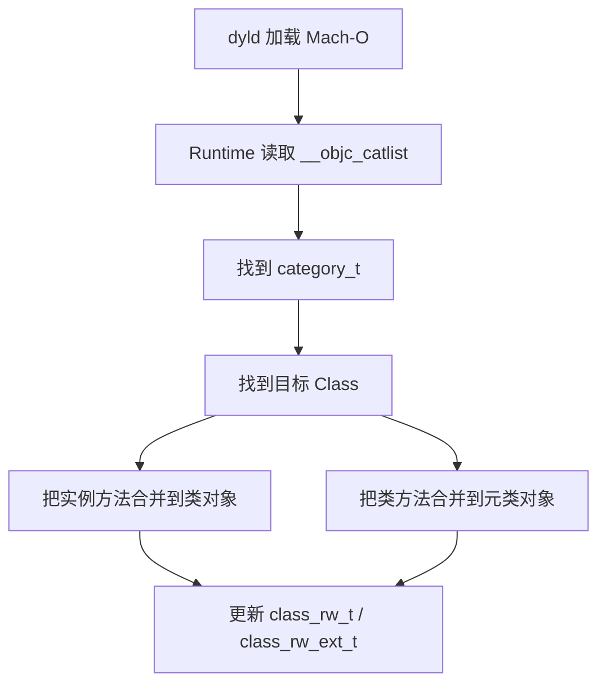

# 面试备战 iOS 04：Category、关联对象与方法覆盖

Category 是 Runtime 面试里最容易被低估的点。它表面上只是“给类加方法”，底层却牵扯到 Mach-O、Runtime 类加载、方法列表合并、对象内存布局、关联对象和方法覆盖风险。

这篇文章回答四个问题：

1. Category 编译后是什么？
2. Runtime 如何把 Category 合并进原类？
3. 为什么 Category 不能加实例变量？
4. 关联对象到底是不是“新增属性”？

## 1. Category 编译后是什么？

Category 编译后不会变成一个新类，而是生成类似 `category_t` 的结构，记录它要附加到哪个类上。

简化结构：

```cpp
struct category_t {
    const char *name;
    classref_t cls;
    WrappedPtr<method_list_t, method_list_t::Ptrauth> instanceMethods;
    WrappedPtr<method_list_t, method_list_t::Ptrauth> classMethods;
    struct protocol_list_t *protocols;
    struct property_list_t *instanceProperties;
    struct property_list_t *_classProperties; // 类属性(现代 runtime)
};
```

它包含：

- Category 名。
- 目标类。
- 实例方法列表。
- 类方法列表。
- 协议列表。
- 属性列表。

这些数据会放进 Mach-O 的 ObjC 相关 section，例如 `__objc_catlist`。

## 2. Runtime 如何加载 Category？

App 启动或动态库加载时，dyld 加载 Mach-O，ObjC Runtime 在 `map_images` / `_read_images` 阶段(即 pre-main)读取类、协议、Category 等元数据并合并。这也是“Category 影响启动”的根因——合并本身就在启动关键路径上。

Category 合并流程可以简化为：



关键点：

- 实例方法合并到类对象。
- 类方法合并到元类对象。
- 合并的是运行时可写结构，不是改编译期 ro 数据。

## 3. 方法为什么看起来会“覆盖”？

如果 Category 实现了和原类同名的方法：

```objc
@implementation Person (Log)
- (void)sayHello {
    NSLog(@"category hello");
}
@end
```

调用 `[person sayHello]` 可能先命中 Category 方法。

这不是把原方法删除，而是方法查找时先看到了 Category 合并进来的方法。

很多 Runtime 实现中，Category 方法列表会被插到方法列表前面。查找 selector 时，先找到前面的同名方法，就停止了。

所以更准确的说法是：

> Category 同名方法制造了方法查找优先级上的“覆盖效果”，不是替换掉原始方法结构。

## 4. 多个 Category 同名方法谁生效？

`attachCategories` 时多个 Category 按编译链接顺序的**逆序**附加(后编译的先 attach、优先级更高),且整体插在原类方法之前。所以同名时“后参与编译的 Category 覆盖先编译的”,但这依赖链接顺序,工程上不能依赖。

这也是为什么工程中禁止多个 Category 给同一个类添加同名方法。

风险：

- Debug 和 Release 行为不一致。
- 不同 target 链接顺序变化。
- 三方库冲突。
- 问题表现为随机覆盖。

工程规范：

- Category 方法加前缀。
- 不覆盖系统方法。
- 需要替换行为用可控 Swizzling。
- 基础库统一扫描同名 Category 方法。

## 5. 为什么 Category 不能添加实例变量？

对象内存布局在编译期就确定。

例如：

```objc
@interface Person : NSObject {
    NSString *_name;
    int _age;
}
@end
```

对象内存大致：

```text
isa | _name | _age
```

编译器已经确定：

- 对象大小。
- ivar offset。
- 内存对齐。
- 属性访问偏移。

如果 Category 在运行时再加一个 `_address`：

```text
isa | _name | _age | _address ?
```

已有对象已经按旧大小分配了内存，不能突然扩容。否则访问 `_address` 会越界，访问旧 ivar offset 也可能错乱。

所以：

> Category 不能添加 ivar 的根本原因是对象内存布局已在编译期固定，运行时改变会破坏 ABI 和已有对象内存。

## 6. Extension 为什么可以加 ivar？

Class Extension 通常写在 `.m` 里，是原类编译单元的一部分。

```objc
@interface Person ()
@property (nonatomic, copy) NSString *address;
@end
```

编译器能在编译原类时看到这些信息，因此可以把 ivar 编入 class_ro_t 的 ivar layout。

区别：

| 能力 | Category | Extension |
|---|---|---|
| 添加方法 | 可以 | 可以 |
| 添加属性声明 | 可以 | 可以 |
| 自动生成 ivar | 不可以 | 可以 |
| 改变对象布局 | 不可以 | 可以，编译期完成 |
| 加载时机 | 运行时合并 | 编译期属于原类 |

## 7. 关联对象是什么？

关联对象是 Runtime 维护的一张外部映射表。

API：

```objc
objc_setAssociatedObject(id object, const void *key, id value, objc_AssociationPolicy policy);
id value = objc_getAssociatedObject(id object, const void *key);
```

可以理解成：

```text
object pointer -> {
    key1 -> value1,
    key2 -> value2
}
```

它不是把字段塞进对象内存，而是在对象外部挂了一张表。

## 8. 关联对象底层结构

可以简化成三层 Map：

```text
AssociationsManager
    -> AssociationsHashMap
        object pointer -> ObjectAssociationMap
            key -> ObjcAssociation(policy, value)
```

对象释放时，如果 isa 的 `has_assoc` 标记为 1，Runtime 会清理关联对象。

这就是 non-pointer isa 中 `has_assoc` 的意义：

> 如果对象从未设置关联对象，dealloc 时无需进入关联对象表查找，减少释放成本。

## 9. 关联策略的真实含义

常见策略：

| 策略 | 语义 |
|---|---|
| `OBJC_ASSOCIATION_ASSIGN` | 不持有 |
| `OBJC_ASSOCIATION_RETAIN_NONATOMIC` | strong nonatomic |
| `OBJC_ASSOCIATION_COPY_NONATOMIC` | copy nonatomic |
| `OBJC_ASSOCIATION_RETAIN` | strong atomic |
| `OBJC_ASSOCIATION_COPY` | copy atomic |

atomic 只保证关联对象设置/读取操作本身的原子性，不等于业务线程安全。

## 10. 关联对象的坑

### 10.1 key 不能随便用字符串

推荐：

```objc
static void *kNameKey = &kNameKey;
```

或者：

```objc
static char kNameKey;
```

不建议用普通字符串常量，避免冲突。

### 10.2 block 循环引用

```objc
objc_setAssociatedObject(self, kBlockKey, block, OBJC_ASSOCIATION_COPY_NONATOMIC);
```

如果 block 捕获 self，而 self 通过关联对象持有 block，会循环引用。

### 10.3 关联对象不是高频存储方案

关联对象需要哈希表和锁，不适合极高频访问。它适合补状态，不适合替代正常 ivar。

## 11. 高频追问

### Q1：Category 为什么不能加成员变量？

因为成员变量影响对象内存布局，而对象大小和 ivar offset 在编译期已经确定。Category 是运行时合并的，不能改变已有对象布局。

### Q2：Category 的属性会自动生成 getter/setter 吗？

不会。Category 里的 `@property` 只生成方法声明，不自动生成 ivar 和方法实现。需要自己实现 getter/setter，通常用关联对象存储。

### Q3：Category 方法覆盖原类方法的原理？

Runtime 合并 Category 方法列表后，查找同名 selector 时可能先找到 Category 方法，形成覆盖效果。原方法没有被删除。

### Q4：关联对象会不会影响对象释放？

会。设置关联对象后，isa 标记 `has_assoc`。对象 dealloc 时 Runtime 会清理关联对象表，关联值也会按策略 release。

## 工程建议

- Category 方法命名加业务/库前缀。
- 不用 Category 随意覆盖系统方法。
- 关联对象只做轻量状态补充。
- 涉及生命周期的关联 block 必须检查循环引用。
- 基础库里可以加同名方法扫描。


## 深挖追问：Category 不是“编译期扩展”，而是运行时合并

Category 的核心要说成三句话：

1. Category 编译后会生成独立的 category_t 元数据。
2. dyld 加载镜像后，Runtime 会把 Category 的方法、协议、属性合并到目标类的运行时数据结构。
3. 它不能改变实例对象大小，所以不能直接加 ivar。

被追问加载顺序时，可以这样答：

> 多个 Category 有同名方法时，最终谁先被查到和镜像加载、编译链接顺序、Runtime 合并顺序有关。工程上不应该依赖这个顺序。Category 覆盖系统方法属于高风险行为，基础库如果必须做，要用明确的 Swizzling 机制、冲突检测和可观测日志。

关联对象继续深挖：

```text
objc_setAssociatedObject(obj, key, value, policy)
  -> 全局 AssociationsManager
  -> 根据 object 地址找到 ObjectAssociationMap
  -> 根据 key 找 ObjcAssociation
  -> 按 policy retain/copy/assign value
```

它不是把字段塞进对象内存，而是外挂哈希表。所以：

- 不改变对象布局。
- key 必须稳定，常用静态变量地址。
- value 生命周期由 policy 控制。
- 对象 dealloc 时 Runtime 会清理关联对象。

面试陷阱：

- `@property` 写在 Category 里只会声明 getter/setter，不会自动生成 ivar，也不会自动生成实现。
- 关联对象不是零成本，大量使用会增加哈希表、锁和生命周期管理成本。
- Category 的 `+load` 会增加启动成本，而且执行时机早于很多业务初始化。
- Category 适合补充通用行为，不适合承载强状态业务。

## 一句话总结

Category 改的是运行时方法表，不能改对象内存布局；关联对象是对象外部映射表，不是真正给对象增加 ivar。
