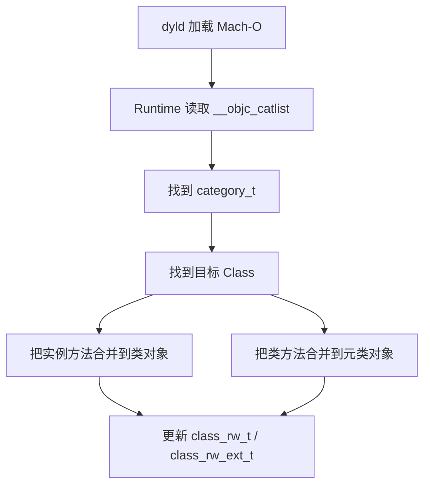

# 面试备战 iOS 04：Category、关联对象与方法覆盖

Category 是 Runtime 面试里最容易被低估的点。它表面上只是“给类加方法”，底层却牵扯到 Mach-O、Runtime 类加载、方法列表合并、对象内存布局、关联对象和方法覆盖风险。

这篇文章回答四个问题：

1. Category 编译后是什么？
2. Runtime 如何把 Category 合并进原类？
3. 为什么 Category 不能加实例变量？
4. 关联对象到底是不是“新增属性”？

## 1. Category 编译后是什么？

Category 编译后不会变成一个新类，而是生成类似 `category_t` 的结构，记录它要附加到哪个类上。

简化结构：

```cpp
struct category_t {
    const char *name;
    classref_t cls;
    WrappedPtr<method_list_t, method_list_t::Ptrauth> instanceMethods;
    WrappedPtr<method_list_t, method_list_t::Ptrauth> classMethods;
    struct protocol_list_t *protocols;
    struct property_list_t *instanceProperties;
    struct property_list_t *_classProperties; // 类属性(现代 runtime)
};
```

它包含：

- Category 名。
- 目标类。
- 实例方法列表。
- 类方法列表。
- 协议列表。
- 属性列表。

这些数据会放进 Mach-O 的 ObjC 相关 section，例如 `__objc_catlist`。

## 2. Runtime 如何加载 Category？

App 启动或动态库加载时，dyld 加载 Mach-O，ObjC Runtime 在 `map_images` / `_read_images` 阶段(即 pre-main)读取类、协议、Category 等元数据并合并。这也是“Category 影响启动”的根因——合并本身就在启动关键路径上。

Category 合并流程可以简化为：



关键点：

- 实例方法合并到类对象。
- 类方法合并到元类对象。
- 合并的是运行时可写结构，不是改编译期 ro 数据。

## 3. 方法为什么看起来会“覆盖”？

如果 Category 实现了和原类同名的方法：

```objc
@implementation Person (Log)
- (void)sayHello {
    NSLog(@"category hello");
}
@end
```

调用 `[person sayHello]` 可能先命中 Category 方法。

这不是把原方法删除，而是方法查找时先看到了 Category 合并进来的方法。

很多 Runtime 实现中，Category 方法列表会被插到方法列表前面。查找 selector 时，先找到前面的同名方法，就停止了。

所以更准确的说法是：

> Category 同名方法制造了方法查找优先级上的“覆盖效果”，不是替换掉原始方法结构。

## 4. 多个 Category 同名方法谁生效？

`attachCategories` 时多个 Category 按编译链接顺序的**逆序**附加(后编译的先 attach、优先级更高),且整体插在原类方法之前。所以同名时“后参与编译的 Category 覆盖先编译的”,但这依赖链接顺序,工程上不能依赖。

这也是为什么工程中禁止多个 Category 给同一个类添加同名方法。

风险：

- 方法查找优先级不确定。
- 难以调试和追踪。
- 产生隐式依赖。

## 5. 为什么 Category 不能加实例变量？

类的实例变量布局在编译期就确定了，保存在 `class_ro_t` 的 `ivar_layout` 里。

对象创建时，Runtime 根据这个布局分配内存：

```text
object = malloc(instance_size);
```

如果允许 Category 在运行时添加 ivar，已经创建的对象内存布局就不匹配：

```text
旧对象：isa + ivar1 + ivar2
新对象：isa + ivar1 + ivar2 + ivar3（Category 加的）
```

访问 ivar3 时，旧对象会读到错误内存位置，导致崩溃或数据错乱。

面试答案：

> Category 可以添加方法，因为方法保存在 `class_rw_t`，运行时可扩展；不能添加实例变量，因为 ivar 布局在编译期确定，运行时改变会破坏已有对象的内存访问。

## 6. 关联对象是什么？

关联对象允许运行时给对象"附加"额外数据，看起来像添加属性，但底层完全不同。

API：

```objc
// 设置关联对象
objc_setAssociatedObject(obj, key, value, policy);

// 获取关联对象
id value = objc_getAssociatedObject(obj, key);

// 移除所有关联对象
objc_removeAssociatedObjects(obj);
```

关联策略：

| 策略 | 对应属性修饰符 | 含义 |
|------|---------------|------|
| `OBJC_ASSOCIATION_ASSIGN` | `assign` | 弱引用，不持有 |
| `OBJC_ASSOCIATION_RETAIN_NONATOMIC` | `strong, nonatomic` | 强引用，非原子 |
| `OBJC_ASSOCIATION_COPY_NONATOMIC` | `copy, nonatomic` | 拷贝，非原子 |
| `OBJC_ASSOCIATION_RETAIN` | `strong, atomic` | 强引用，原子 |
| `OBJC_ASSOCIATION_COPY` | `copy, atomic` | 拷贝，原子 |

典型用法：

```objc
@implementation UIView (Badge)
static const void *kBadgeKey = &kBadgeKey;

- (void)setBadge:(NSString *)badge {
    objc_setAssociatedObject(self, kBadgeKey, badge, OBJC_ASSOCIATION_COPY_NONATOMIC);
}

- (NSString *)badge {
    return objc_getAssociatedObject(self, kBadgeKey);
}
@end
```

## 7. 关联对象的底层存储

关联对象**不存在对象内存里，也不在 SideTable 里**，而是在全局的 `AssociationsManager` 中。

简化结构：

```cpp
class AssociationsManager {
    static AssociationsHashMap *_map;  // 全局单例
};

// 结构：对象地址 -> 关联对象表
AssociationsHashMap: DisguisedPtr<objc_object> -> ObjectAssociationMap

// 结构：key -> 关联值和策略
ObjectAssociationMap: void *key -> ObjcAssociation

struct ObjcAssociation {
    uintptr_t _policy;  // 策略
    id _value;          // 值
};
```

查找路径：

```text
obj -> AssociationsHashMap[obj] -> ObjectAssociationMap -> ObjcAssociation(key) -> value
```

关键点：

- 全局只有一个 `AssociationsHashMap`。
- 每个对象的关联对象保存在一个 `ObjectAssociationMap` 里。
- key 通常用静态变量地址，保证唯一性。

## 8. 关联对象的生命周期

关联对象在对象 `dealloc` 时自动清理。

清理时机在 `objc_destructInstance` 中：

```cpp
void *objc_destructInstance(id obj) {
    if (obj) {
        // 1. C++ 析构 / .cxx_destruct
        object_cxxDestruct(obj);
        
        // 2. 清理关联对象
        if (obj->hasAssociatedObjects()) {
            _object_remove_assocations(obj);
        }
        
        // 3. 清理 weak 引用
        if (obj->isWeaklyReferenced()) {
            clearDeallocating(obj);
        }
    }
    return obj;
}
```

`_object_remove_assocations` 流程：

```cpp
void _object_remove_assocations(id obj) {
    AssociationsManager manager;
    AssociationsHashMap &associations(manager.get());
    
    // 查找对象的关联对象表
    ObjectAssociationMap *refs = associations.find(obj);
    if (refs) {
        // 遍历所有关联对象
        for (auto &pair : *refs) {
            ObjcAssociation &entry = pair.second;
            // 根据策略 release
            if (entry._policy & OBJC_ASSOCIATION_RETAIN) {
                [entry._value release];
            }
        }
        // 删除整个表
        associations.erase(obj);
    }
}
```

注意：

- 只在对象 `dealloc` 时清理，不会在运行时主动检查。
- 如果关联对象是 `ASSIGN`，对象释放后会变成悬空指针。

## 9. 高频追问

### Q1：Category 方法覆盖的本质？

不是删除原方法，而是方法列表中 Category 方法排在前面，查找时先命中。

### Q2：为什么 Category 能加方法不能加 ivar？

方法保存在运行时可写结构 `class_rw_t`；ivar 布局在编译期只读结构 `class_ro_t`，运行时改变会破坏对象内存。

### Q3：关联对象存在哪里？

全局 `AssociationsHashMap`，不在对象内存，也不在 SideTable。

### Q4：关联对象什么时候释放？

对象 `dealloc` 时，在 `objc_destructInstance` 中自动清理。

### Q5：Category 和 Extension 的区别？

Category 运行时加载，可以给任何类添加方法；Extension 编译期合并，只能在类实现前声明，可以添加私有属性和 ivar。

## 工程建议

- 禁止多个 Category 添加同名方法。
- 关联对象 key 用静态变量地址，不要用字符串。
- 关联对象不能替代真正的属性设计。
- Category 适合扩展，不适合修改核心逻辑。

---

## 🔬 深度扩展：Category 的编译与加载全流程

Category 是面试中容易被追问"底层加载时机"的点。只讲"运行时合并"不够，要能讲清楚**编译产物→Mach-O 结构→dyld 加载→Runtime 合并**的完整链路。

### 扩展1：Category 的编译产物

**源码：**

```objc
@interface Person (Log)
- (void)printLog;
@end

@implementation Person (Log)
- (void)printLog {
    NSLog(@"Log");
}
@end
```

**编译后生成 category_t 结构：**

```cpp
struct category_t {
    const char *name;                                      // "Log"
    classref_t cls;                                        // Person 类的引用
    WrappedPtr<method_list_t> instanceMethods;            // 实例方法列表
    WrappedPtr<method_list_t> classMethods;               // 类方法列表
    struct protocol_list_t *protocols;                     // 协议列表
    struct property_list_t *instanceProperties;            // 属性列表
    struct property_list_t *_classProperties;              // 类属性（iOS 10+）
    
    // 关联的类
    Class cls() const { return remapClass(cls); }
};
```

**method_list_t：**

```cpp
struct method_list_t {
    uint32_t entsizeAndFlags;
    uint32_t count;
    method_t first;  // 方法数组
};

struct method_t {
    SEL name;        // @selector(printLog)
    const char *types;  // 类型编码 "v@:"
    IMP imp;         // 函数指针
};
```

**存储位置：**

编译后，`category_t` 结构会放进 Mach-O 的特定 section：

```text
__DATA 段
  __objc_catlist section：存储所有 category_t 的指针数组
  __objc_nlcatlist section：存储 +load 方法的 category（non-lazy）
```

可以用 `otool` 查看：

```bash
otool -s __DATA __objc_catlist MyApp
```

### 扩展2：dyld 加载与 Runtime 读取流程

**App 启动流程：**

```text
1. dyld 加载可执行文件和动态库
2. dyld 调用 libobjc 的 map_images
3. map_images 调用 _read_images
4. _read_images 读取 __objc_catlist，加载 Category
5. attachCategories 把 Category 方法合并到类
```

**_read_images 简化流程（关键部分）：**

```cpp
void _read_images(header_info **hList, uint32_t hCount) {
    // 1. 加载所有类
    for (EACH_HEADER) {
        classref_t *classlist = _getObjc2ClassList(hi, &count);
        for (i = 0; i < count; i++) {
            Class cls = remapClass(classlist[i]);
            realizeClassWithoutSwift(cls);  // realize 类
        }
    }
    
    // 2. 加载所有 Category
    category_t **catlist = _getObjc2CategoryList(hi, &count);
    for (i = 0; i < count; i++) {
        category_t *cat = catlist[i];
        Class cls = remapClass(cat->cls);
        
        if (!cls) {
            // 类还没加载，记录到 pending 列表
            addUnattachedCategoryForClass(cat, cls);
            continue;
        }
        
        // 类已加载，立即合并
        attachCategories(cls, &cat, 1, ATTACH_EXISTING);
    }
    
    // 3. 处理 pending 的 Category
    for (Class cls in pendingClasses) {
        realizeClassWithoutSwift(cls);
        category_list cats = unattachedCategoriesForClass(cls);
        attachCategories(cls, cats.list, cats.count, ATTACH_EXISTING | ATTACH_CLASS);
    }
}
```

**关键点：**

1. **类必须先 realize，才能合并 Category**  
   如果 Category 对应的类还没加载，Category 会进入 pending 列表。

2. **多个 Category 一次性合并**  
   同一个类的多个 Category 会收集起来，调用一次 `attachCategories`。

3. **发生在 pre-main**  
   所有这些都发生在 `main()` 之前，影响启动时间。

### 扩展3：attachCategories 的完整逻辑

**核心源码（简化）：**

```cpp
static void attachCategories(Class cls, category_list *cats, bool flush_caches) {
    if (!cats) return;
    
    bool isMeta = cls->isMetaClass();
    
    // 准备方法、属性、协议数组
    method_list_t **mlists = (method_list_t **)malloc(cats->count * sizeof(*mlists));
    property_list_t **proplists = (property_list_t **)malloc(cats->count * sizeof(*proplists));
    protocol_list_t **protolists = (protocol_list_t **)malloc(cats->count * sizeof(*protolists));
    
    int mcount = 0;
    int propcount = 0;
    int protocount = 0;
    
    // 从后往前遍历 Category（注意顺序）
    int i = cats->count;
    while (i--) {
        auto& entry = cats->list[i];
        
        // 收集方法
        method_list_t *mlist = entry.cat->methodsForMeta(isMeta);
        if (mlist) {
            mlists[mcount++] = mlist;
        }
        
        // 收集属性
        property_list_t *proplist = entry.cat->propertiesForMeta(isMeta);
        if (proplist) {
            proplists[propcount++] = proplist;
        }
        
        // 收集协议
        protocol_list_t *protolist = entry.cat->protocols;
        if (protolist) {
            protolists[protocount++] = protolist;
        }
    }
    
    // 获取类的 rw 数据
    auto rw = cls->data();
    
    // 准备扩展方法数组
    prepareMethodLists(cls, mlists, mcount, NO, fromBundle);
    
    // 把 Category 方法插到前面
    rw->methods.attachLists(mlists, mcount);
    
    // 属性和协议类似
    rw->properties.attachLists(proplists, propcount);
    rw->protocols.attachLists(protolists, protocount);
    
    // 清理缓存
    if (flush_caches  &&  mcount > 0) {
        flushCaches(cls);
    }
}
```

**attachLists 的插入逻辑：**

```cpp
void attachLists(List* const * addedLists, uint32_t addedCount) {
    if (addedCount == 0) return;
    
    uint32_t oldCount = array()->count;
    uint32_t newCount = oldCount + addedCount;
    
    // 扩容
    setArray((array_t *)realloc(array(), array_t::byteSize(newCount)));
    array()->count = newCount;
    
    // 把旧数据往后移
    memmove(array()->lists + addedCount,
            array()->lists,
            oldCount * sizeof(array()->lists[0]));
    
    // 把新数据放到前面
    memcpy(array()->lists,
           addedLists,
           addedCount * sizeof(array()->lists[0]));
}
```

**关键：Category 方法插到最前面**

```text
原始方法列表：[method1, method2]
Category A 方法：[methodA]
Category B 方法：[methodB]

合并顺序（假设编译顺序 A -> B）：
1. 插入 B：[methodB, method1, method2]
2. 插入 A：[methodA, methodB, method1, method2]

最终查找顺序：A -> B -> 原始类
```

**为什么是逆序插入？**

`attachCategories` 从后往前遍历 cats 数组，所以**后编译的 Category 先被插入，排在前面，优先级更高**。

### 扩展4：Category 和 +load 的特殊处理

**Non-lazy Category：**

如果 Category 实现了 `+load` 方法，会被标记为 non-lazy，存储在 `__objc_nlcatlist` section。

**+load 的调用时机：**

```cpp
void load_images(const char *path, const struct mach_header *mh) {
    // 1. 准备 +load 方法
    prepare_load_methods((const headerType *)mh);
    
    // 2. 调用所有 +load
    call_load_methods();
}

void prepare_load_methods(const headerType *mhdr) {
    // 1. 添加类的 +load
    classref_t *classlist = _getObjc2NonlazyClassList(mhdr, &count);
    for (i = 0; i < count; i++) {
        schedule_class_load(remapClass(classlist[i]));
    }
    
    // 2. 添加 Category 的 +load
    category_t **categorylist = _getObjc2NonlazyCategoryList(mhdr, &count);
    for (i = 0; i < count; i++) {
        category_t *cat = categorylist[i];
        add_category_to_loadable_list(cat);
    }
}

void call_load_methods(void) {
    // 先调用类的 +load（父类 -> 子类）
    do {
        while (loadable_classes_used > 0) {
            call_class_loads();
        }
        
        // 再调用 Category 的 +load
        while (loadable_categories_used > 0) {
            call_category_loads();
        }
    } while (...);
}
```

**+load 调用顺序：**

```text
1. 父类 +load
2. 子类 +load
3. Category +load（按编译顺序）
```

**关键：**

- 类的 `+load` 在 Category 的 `+load` 之前
- Category 的 `+load` 按编译链接顺序调用
- 所有 `+load` 都会执行，不会覆盖

### 扩展5：关联对象的内存管理细节

**setAssociatedObject 流程：**

```cpp
void objc_setAssociatedObject(id object, const void *key, id value, objc_AssociationPolicy policy) {
    _object_set_associative_reference(object, key, value, policy);
}

void _object_set_associative_reference(id object, const void *key, id value, objc_AssociationPolicy policy) {
    // 1. 包装值和策略
    ObjcAssociation association{policy, value};
    
    // 2. 获取全局 AssociationsManager
    AssociationsManager manager;
    AssociationsHashMap &associations(manager.get());
    
    // 3. 查找对象的关联表
    disguised_ptr_t disguised_object = DISGUISE(object);
    AssociationsHashMap::iterator i = associations.find(disguised_object);
    
    if (i != associations.end()) {
        // 对象已有关联表
        ObjectAssociationMap *refs = i->second;
        
        if (value) {
            // 更新或插入
            (*refs)[key] = association;
        } else {
            // value 为 nil，移除
            refs->erase(key);
            if (refs->empty()) {
                // 表空了，删除整个表
                associations.erase(i);
            }
        }
    } else {
        // 对象还没有关联表
        if (value) {
            // 创建新表
            ObjectAssociationMap *refs = new ObjectAssociationMap;
            associations[disguised_object] = refs;
            (*refs)[key] = association;
            
            // 标记对象有关联对象
            object->setHasAssociatedObjects();
        }
    }
}
```

**getAssociatedObject 流程：**

```cpp
id objc_getAssociatedObject(id object, const void *key) {
    return _object_get_associative_reference(object, key);
}

id _object_get_associative_reference(id object, const void *key) {
    // 1. 快速检查
    if (!object->hasAssociatedObjects()) {
        return nil;
    }
    
    // 2. 查找全局表
    AssociationsManager manager;
    AssociationsHashMap &associations(manager.get());
    disguised_ptr_t disguised_object = DISGUISE(object);
    
    AssociationsHashMap::iterator i = associations.find(disguised_object);
    if (i != associations.end()) {
        ObjectAssociationMap *refs = i->second;
        ObjectAssociationMap::iterator j = refs->find(key);
        if (j != refs->end()) {
            ObjcAssociation &entry = j->second;
            return entry.value();
        }
    }
    
    return nil;
}
```

**关键优化：**

1. **hasAssociatedObjects 标记**  
   对象 isa 里的 `has_assoc` 位快速判断，避免每次都查全局表。

2. **延迟创建**  
   只有第一次设置关联对象时才创建 `ObjectAssociationMap`。

3. **全局锁保护**  
   `AssociationsManager` 内部有锁，保证线程安全。

### 扩展6：Category 影响启动时间的量化分析

**启动时间组成：**

```text
pre-main 时间
  = dyld 加载
  + Runtime 初始化
  + +load 执行
  + C++ 静态构造
```

**Category 的成本：**

1. **Mach-O 解析**：读取 `__objc_catlist`
2. **attachCategories**：内存分配、数组拷贝、方法插入
3. **+load 执行**：如果 Category 实现了 +load

**实测数据（假设）：**

| Category 数量 | attachCategories 耗时 | +load 耗时 | 总增加 |
|--------------|---------------------|-----------|--------|
| 10 个 | ~1-2 ms | ~5-10 ms | ~6-12 ms |
| 50 个 | ~5-10 ms | ~25-50 ms | ~30-60 ms |
| 100 个 | ~10-20 ms | ~50-100 ms | ~60-120 ms |

**优化建议：**

1. **减少 Category 数量**  
   合并功能相近的 Category。

2. **避免在 +load 做重活**  
   +load 里不要 IO、网络、大计算。

3. **延迟初始化**  
   用 `+initialize` 或显式初始化替代 +load。

4. **工具检测**  
   用 Instruments Time Profiler 看 pre-main 阶段。

---

## 补充总结

Category 加载的深度记忆点：

1. **编译产物**：生成 category_t 结构，存储在 Mach-O 的 __objc_catlist
2. **加载时机**：dyld 加载时，_read_images 读取并调用 attachCategories
3. **合并顺序**：Category 方法插到类方法列表最前面，后编译的优先级更高
4. **+load 调用**：父类 -> 子类 -> Category，所有 +load 都执行
5. **关联对象**：存储在全局 AssociationsHashMap，不在对象内存
6. **生命周期**：关联对象在对象 dealloc 时自动清理

面试追问时要能讲出：
- Category 编译后存储在 Mach-O 的哪个 section（__objc_catlist）
- attachCategories 的插入顺序（逆序，后编译的排前面）
- +load 的调用顺序（父类 -> 子类 -> Category）
- 关联对象的存储位置（全局 AssociationsHashMap）
- Category 如何影响启动时间（pre-main 合并 + +load 执行）

- Debug 和 Release 行为不一致。
- 不同 target 链接顺序变化。
- 三方库冲突。
- 问题表现为随机覆盖。

工程规范：

- Category 方法加前缀。
- 不覆盖系统方法。
- 需要替换行为用可控 Swizzling。
- 基础库统一扫描同名 Category 方法。

## 5. 为什么 Category 不能添加实例变量？

对象内存布局在编译期就确定。

例如：

```objc
@interface Person : NSObject {
    NSString *_name;
    int _age;
}
@end
```

对象内存大致：

```text
isa | _name | _age
```

编译器已经确定：

- 对象大小。
- ivar offset。
- 内存对齐。
- 属性访问偏移。

如果 Category 在运行时再加一个 `_address`：

```text
isa | _name | _age | _address ?
```

已有对象已经按旧大小分配了内存，不能突然扩容。否则访问 `_address` 会越界，访问旧 ivar offset 也可能错乱。

所以：

> Category 不能添加 ivar 的根本原因是对象内存布局已在编译期固定，运行时改变会破坏 ABI 和已有对象内存。

## 6. Extension 为什么可以加 ivar？

Class Extension 通常写在 `.m` 里，是原类编译单元的一部分。

```objc
@interface Person ()
@property (nonatomic, copy) NSString *address;
@end
```

编译器能在编译原类时看到这些信息，因此可以把 ivar 编入 class_ro_t 的 ivar layout。

区别：

| 能力 | Category | Extension |
|---|---|---|
| 添加方法 | 可以 | 可以 |
| 添加属性声明 | 可以 | 可以 |
| 自动生成 ivar | 不可以 | 可以 |
| 改变对象布局 | 不可以 | 可以，编译期完成 |
| 加载时机 | 运行时合并 | 编译期属于原类 |

## 7. 关联对象是什么？

关联对象是 Runtime 维护的一张外部映射表。

API：

```objc
objc_setAssociatedObject(id object, const void *key, id value, objc_AssociationPolicy policy);
id value = objc_getAssociatedObject(id object, const void *key);
```

可以理解成：

```text
object pointer -> {
    key1 -> value1,
    key2 -> value2
}
```

它不是把字段塞进对象内存，而是在对象外部挂了一张表。

## 8. 关联对象底层结构

可以简化成三层 Map：

```text
AssociationsManager
    -> AssociationsHashMap
        object pointer -> ObjectAssociationMap
            key -> ObjcAssociation(policy, value)
```

对象释放时，如果 isa 的 `has_assoc` 标记为 1，Runtime 会清理关联对象。

这就是 non-pointer isa 中 `has_assoc` 的意义：

> 如果对象从未设置关联对象，dealloc 时无需进入关联对象表查找，减少释放成本。

## 9. 关联策略的真实含义

常见策略：

| 策略 | 语义 |
|---|---|
| `OBJC_ASSOCIATION_ASSIGN` | 不持有 |
| `OBJC_ASSOCIATION_RETAIN_NONATOMIC` | strong nonatomic |
| `OBJC_ASSOCIATION_COPY_NONATOMIC` | copy nonatomic |
| `OBJC_ASSOCIATION_RETAIN` | strong atomic |
| `OBJC_ASSOCIATION_COPY` | copy atomic |

atomic 只保证关联对象设置/读取操作本身的原子性，不等于业务线程安全。

## 10. 关联对象的坑

### 10.1 key 不能随便用字符串

推荐：

```objc
static void *kNameKey = &kNameKey;
```

或者：

```objc
static char kNameKey;
```

不建议用普通字符串常量，避免冲突。

### 10.2 block 循环引用

```objc
objc_setAssociatedObject(self, kBlockKey, block, OBJC_ASSOCIATION_COPY_NONATOMIC);
```

如果 block 捕获 self，而 self 通过关联对象持有 block，会循环引用。

### 10.3 关联对象不是高频存储方案

关联对象需要哈希表和锁，不适合极高频访问。它适合补状态，不适合替代正常 ivar。

## 11. 高频追问

### Q1：Category 为什么不能加成员变量？

因为成员变量影响对象内存布局，而对象大小和 ivar offset 在编译期已经确定。Category 是运行时合并的，不能改变已有对象布局。

### Q2：Category 的属性会自动生成 getter/setter 吗？

不会。Category 里的 `@property` 只生成方法声明，不自动生成 ivar 和方法实现。需要自己实现 getter/setter，通常用关联对象存储。

### Q3：Category 方法覆盖原类方法的原理？

Runtime 合并 Category 方法列表后，查找同名 selector 时可能先找到 Category 方法，形成覆盖效果。原方法没有被删除。

### Q4：关联对象会不会影响对象释放？

会。设置关联对象后，isa 标记 `has_assoc`。对象 dealloc 时 Runtime 会清理关联对象表，关联值也会按策略 release。

## 工程建议

- Category 方法命名加业务/库前缀。
- 不用 Category 随意覆盖系统方法。
- 关联对象只做轻量状态补充。
- 涉及生命周期的关联 block 必须检查循环引用。
- 基础库里可以加同名方法扫描。


## 深挖追问：Category 不是“编译期扩展”，而是运行时合并

Category 的核心要说成三句话：

1. Category 编译后会生成独立的 category_t 元数据。
2. dyld 加载镜像后，Runtime 会把 Category 的方法、协议、属性合并到目标类的运行时数据结构。
3. 它不能改变实例对象大小，所以不能直接加 ivar。

被追问加载顺序时，可以这样答：

> 多个 Category 有同名方法时，最终谁先被查到和镜像加载、编译链接顺序、Runtime 合并顺序有关。工程上不应该依赖这个顺序。Category 覆盖系统方法属于高风险行为，基础库如果必须做，要用明确的 Swizzling 机制、冲突检测和可观测日志。

关联对象继续深挖：

```text
objc_setAssociatedObject(obj, key, value, policy)
  -> 全局 AssociationsManager
  -> 根据 object 地址找到 ObjectAssociationMap
  -> 根据 key 找 ObjcAssociation
  -> 按 policy retain/copy/assign value
```

它不是把字段塞进对象内存，而是外挂哈希表。所以：

- 不改变对象布局。
- key 必须稳定，常用静态变量地址。
- value 生命周期由 policy 控制。
- 对象 dealloc 时 Runtime 会清理关联对象。

面试陷阱：

- `@property` 写在 Category 里只会声明 getter/setter，不会自动生成 ivar，也不会自动生成实现。
- 关联对象不是零成本，大量使用会增加哈希表、锁和生命周期管理成本。
- Category 的 `+load` 会增加启动成本，而且执行时机早于很多业务初始化。
- Category 适合补充通用行为，不适合承载强状态业务。

## 一句话总结

Category 改的是运行时方法表，不能改对象内存布局；关联对象是对象外部映射表，不是真正给对象增加 ivar。
