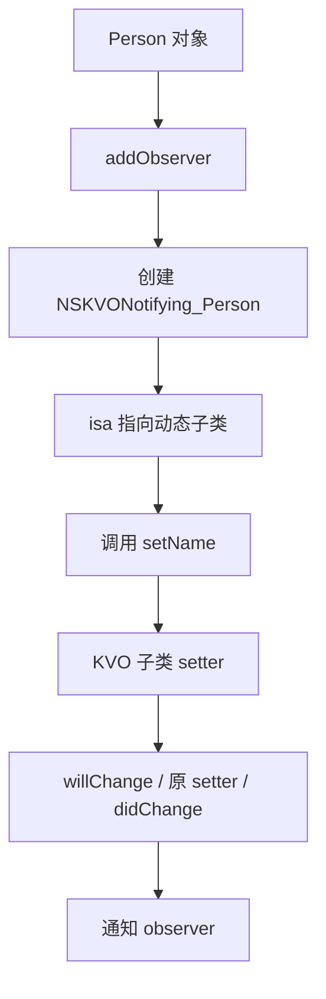

# 面试备战 iOS 05：Method Swizzling、KVO 与动态能力

Swizzling 和 KVO 都是 Runtime 动态能力的典型应用。它们不是炫技点，而是基础设施里非常锋利的工具。用得好可以做埋点、监控、兼容和观察；用不好会造成全局行为污染、随机崩溃和难以排查的问题。

## 1. Swizzling 的本质

Objective-C 方法调用最终是：

```text
SEL -> IMP
```

Swizzling 做的不是改 selector，而是交换两个 selector 对应的 IMP。

```objc
Method original = class_getInstanceMethod(cls, @selector(viewDidAppear:));
Method swizzled = class_getInstanceMethod(cls, @selector(xxx_viewDidAppear:));
method_exchangeImplementations(original, swizzled);
```

交换后：

```text
viewDidAppear:      -> xxx_viewDidAppear IMP
xxx_viewDidAppear:  -> original viewDidAppear IMP
```

所以在 swizzled 方法里调用：

```objc
[self xxx_viewDidAppear:animated];
```

实际是在调用原实现。

### 1.1 直接 exchange 有个经典坑：父类方法污染

上面的写法有生产级隐患：如果 `viewDidAppear:` 并没有在 `cls` 自己实现，而是继承自父类，那么 `class_getInstanceMethod` 拿到的是**父类的 Method**，`method_exchangeImplementations` 会直接改父类实现，污染所有兄弟类。

防御式写法是先尝试把原 selector 添加到当前类：

```objc
SEL originalSel = @selector(viewDidAppear:);
SEL swizzledSel = @selector(xxx_viewDidAppear:);
Method originalMethod = class_getInstanceMethod(cls, originalSel);
Method swizzledMethod = class_getInstanceMethod(cls, swizzledSel);

// 先尝试把原 selector 以 swizzled 的 IMP 添加到当前类
BOOL didAdd = class_addMethod(cls, originalSel,
                              method_getImplementation(swizzledMethod),
                              method_getTypeEncoding(swizzledMethod));
if (didAdd) {
    // 原方法来自父类：把 swizzled selector 指回父类原实现
    class_replaceMethod(cls, swizzledSel,
                        method_getImplementation(originalMethod),
                        method_getTypeEncoding(originalMethod));
} else {
    // 当前类自己实现了原方法：直接交换
    method_exchangeImplementations(originalMethod, swizzledMethod);
}
```

这样无论方法在当前类还是父类，hook 都只作用于当前类。

## 2. 为什么 Swizzling 有风险？

### 2.1 全局影响

你交换的是类的方法实现，影响所有实例。

对 `UIViewController viewDidAppear:` 做 Swizzling，影响全 App 页面。

### 2.2 多方交换顺序不确定

多个 SDK 都交换同一个方法：

```text
SDK A -> SDK B -> SDK C
```

如果都没正确调用原实现，调用链会断。

### 2.3 方法签名必须一致

IMP 调用依赖 ABI。参数和返回值不匹配，可能直接内存错乱。

### 2.4 cache 影响理解

方法调用有 cache。Runtime API 会处理常规方法替换，但如果你用非常规方式改 IMP，要考虑缓存一致性。

## 3. Swizzling 放在哪里执行？

常见在 `+load`：

优点：

- 足够早。
- 不需要手动调用。

缺点：

- 增加 pre-main。
- 顺序难控制。
- 不适合复杂逻辑。

更稳的做法：

- 在基础库显式初始化。
- 使用 dispatch_once 保证一次。
- 做黑白名单。
- 打日志和冲突检测。

## 4. KVO 底层原理

KVO 不是简单通知。它底层是动态子类 + isa-swizzling。

注册观察：

```objc
[person addObserver:self forKeyPath:@"name" options:0 context:nil];
```

Runtime 做的事：

1. 动态创建 `NSKVONotifying_Person`。
2. 重写 `setName:`(在 setter 中调用 will/didChangeValueForKey)。
3. 重写 `class`(隐藏子类,让外部看到的还是原类)。
4. 重写 `dealloc`(清理)、新增 `-_isKVOA` 标识。
5. 修改 person 的 isa 指向 KVO 子类。
6. setter 触发时通知 observer。

流程：



## 5. 为什么直接改 ivar 不触发 KVO？

因为自动 KVO 依赖 setter 拦截。

```objc
person->_name = @"Tom";
```

这绕过 setter，KVO 子类没有机会执行 will/didChange。

除非你手动调用：

```objc
[person willChangeValueForKey:@"name"];
person->_name = @"Tom";
[person didChangeValueForKey:@"name"];
```

## 6. KVO 为什么容易崩？

常见原因：

- add/remove 不匹配。
- 重复 remove。
- observer 提前释放。
- observed object 提前释放。
- keyPath 写错。
- context 不区分。
- 回调线程不符合预期。

现代工程建议封装 token：

```text
observer token 持有观察关系
token dealloc 自动移除
```

降低手动 remove 风险。

## 7. KVO 和 Swizzling 的共同点

它们都改变方法查找结果。

Swizzling：

```text
原类 method list 中 SEL -> IMP 关系变了
```

KVO：

```text
对象 isa 变了，方法查找入口变成动态子类
```

共同风险：

- 行为隐式。
- 调试困难。
- 影响范围大。
- 生命周期要求严。

## 8. 工程使用边界

适合放在基础设施：

- 页面埋点。
- 卡顿监控。
- 防崩溃兜底。
- 属性观察封装。
- SDK 兼容修复。

不适合：

- 普通业务逻辑。
- 随意替换系统行为。
- 隐藏核心流程。

## 高频追问

### Q1：Swizzling 是交换方法还是交换 IMP？

本质是交换 Method 中 selector 对应的 IMP。selector 名字没变，执行实现变了。

### Q2：KVO 为什么 `[obj class]` 还是原类？

KVO 动态子类通常重写 `class` 方法，让外部看起来仍然是原类，隐藏实现细节。用 `object_getClass(obj)` 更容易看到真实 isa 指向。

### Q3：Swizzling 为什么要 dispatch_once？

避免重复交换。`method_exchangeImplementations` 调用偶数次会还原成未交换状态,导致 hook 失效(而非“行为错乱”)。`+load` 在分类/继承场景可能被多次触发,所以用 dispatch_once 保证只交换一次。

### Q4：KVO 是线程安全的吗？

不能简单认为线程安全。属性变化在哪个线程发生，回调通常也在哪个线程触发。UI 更新要回主线程。


## 深挖追问：Swizzling 和 KVO 的共同风险是“改入口”

Swizzling 改的是 selector 到 IMP 的映射；KVO 改的是对象 isa 的方法查找入口。它们看起来不一样，本质上都是改变调用分发路径。

Swizzling 被继续追问时，要说清四个工程问题：

1. 父类污染：子类没有实现方法时，直接交换可能改到父类实现，影响所有兄弟类。稳妥做法是先 `class_addMethod` 给当前类补一份，再 replace/exchange。
2. 多方交换：A SDK 和 B SDK 都 swizzle 同一个方法，调用链顺序依赖加载时机。必须保证调用原实现，并尽量输出诊断日志。
3. 签名一致：IMP 是函数指针，签名错就是 ABI 错，可能造成寄存器/栈读取错乱。
4. 时机控制：`+load` 早但影响启动，业务可控的初始化点更利于治理；无论哪里执行都要 `dispatch_once`。

KVO 深挖要能说出这条链：

```text
addObserver
  -> Runtime 动态创建 NSKVONotifying_Class
  -> 重写 setter/class/dealloc/_isKVOA
  -> 修改被观察对象 isa
setter 调用
  -> willChangeValueForKey
  -> 调原 setter
  -> didChangeValueForKey
  -> 通知 observer
```

为什么直接改 ivar 不触发？因为自动 KVO 拦截的是 setter，不是内存写入。

线程安全怎么答：

> KVO 通知通常发生在属性变更的线程，不会自动切主线程；注册/移除和对象释放时机如果并发，很容易 crash。工程上要用 context 区分观察来源，用 token 或封装对象管理生命周期，UI 更新显式回主线程。

现代替代方案可以提：

- block token 封装 KVO，降低 remove 风险。
- Combine/Rx/自定义 observable，把生命周期显式化。
- Swift `KeyPath` 提升类型安全，但底层观察和线程问题仍要治理。

## 一句话总结

Swizzling 改 SEL 到 IMP 的映射，KVO 改对象 isa 的查找入口；两者都强大，但必须放在可控基础设施里治理。
