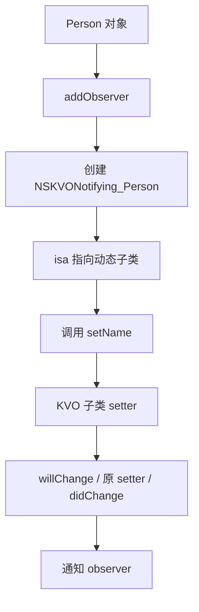

# 面试备战 iOS 05：Method Swizzling、KVO 与动态能力

Swizzling 和 KVO 都是 Runtime 动态能力的典型应用。它们不是炫技点，而是基础设施里非常锋利的工具。用得好可以做埋点、监控、兼容和观察；用不好会造成全局行为污染、随机崩溃和难以排查的问题。

## 1. Swizzling 的本质

Objective-C 方法调用最终是：

```text
SEL -> IMP
```

Swizzling 做的不是改 selector，而是交换两个 selector 对应的 IMP。

```objc
Method original = class_getInstanceMethod(cls, @selector(viewDidAppear:));
Method swizzled = class_getInstanceMethod(cls, @selector(xxx_viewDidAppear:));
method_exchangeImplementations(original, swizzled);
```

交换后：

```text
viewDidAppear:      -> xxx_viewDidAppear IMP
xxx_viewDidAppear:  -> original viewDidAppear IMP
```

所以在 swizzled 方法里调用：

```objc
[self xxx_viewDidAppear:animated];
```

实际是在调用原实现。

### 1.1 直接 exchange 有个经典坑：父类方法污染

上面的写法有生产级隐患：如果 `viewDidAppear:` 并没有在 `cls` 自己实现，而是继承自父类，那么 `class_getInstanceMethod` 拿到的是**父类的 Method**，`method_exchangeImplementations` 会直接改父类实现，污染所有兄弟类。

防御式写法是先尝试把原 selector 添加到当前类：

```objc
SEL originalSel = @selector(viewDidAppear:);
SEL swizzledSel = @selector(xxx_viewDidAppear:);
Method originalMethod = class_getInstanceMethod(cls, originalSel);
Method swizzledMethod = class_getInstanceMethod(cls, swizzledSel);

// 先尝试把原 selector 以 swizzled 的 IMP 添加到当前类
BOOL didAdd = class_addMethod(cls, originalSel,
                              method_getImplementation(swizzledMethod),
                              method_getTypeEncoding(swizzledMethod));
if (didAdd) {
    // 原方法来自父类：把 swizzled selector 指回父类原实现
    class_replaceMethod(cls, swizzledSel,
                        method_getImplementation(originalMethod),
                        method_getTypeEncoding(originalMethod));
} else {
    // 当前类自己实现了原方法：直接交换
    method_exchangeImplementations(originalMethod, swizzledMethod);
}
```

这样无论方法在当前类还是父类，hook 都只作用于当前类。

## 2. 为什么 Swizzling 有风险？

### 2.1 全局影响

你交换的是类的方法实现，影响所有实例。

对 `UIViewController viewDidAppear:` 做 Swizzling，影响全 App 页面。

### 2.2 多方交换顺序不确定

多个 SDK 都交换同一个方法：

```text
SDK A -> SDK B -> SDK C
```

如果都没正确调用原实现，调用链会断。

### 2.3 方法签名必须一致

IMP 调用依赖 ABI。参数和返回值不匹配，可能直接内存错乱。

### 2.4 cache 影响理解

方法调用有 cache。Runtime API 会处理常规方法替换，但如果你用非常规方式改 IMP，要考虑缓存一致性。

## 3. Swizzling 放在哪里执行？

常见在 `+load`：

优点：

- 足够早。
- 不需要手动调用。

缺点：

- 增加 pre-main。
- 顺序难控制。
- 不适合复杂逻辑。

更稳的做法：

- 在基础库显式初始化。
- 使用 dispatch_once 保证一次。
- 做黑白名单。
- 打日志和冲突检测。

## 4. KVO 底层原理

KVO 不是简单通知。它底层是动态子类 + isa-swizzling。

注册观察：

```objc
[person addObserver:self forKeyPath:@"name" options:0 context:nil];
```

Runtime 做的事：

1. 动态创建 `NSKVONotifying_Person`。
2. 重写 `setName:`(在 setter 中调用 will/didChangeValueForKey)。
3. 重写 `class`(隐藏子类,让外部看到的还是原类)。
4. 重写 `dealloc`(清理)、新增 `-_isKVOA` 标识。
5. 修改 person 的 isa 指向 KVO 子类。
6. setter 触发时通知 observer。

流程：



## 5. 为什么直接改 ivar 不触发 KVO？

因为自动 KVO 依赖 setter 拦截。

```objc
person->_name = @"Tom";
```

这绕过 setter，KVO 子类没有机会执行 will/didChange。

除非你手动调用：

```objc
[person willChangeValueForKey:@"name"];
person->_name = @"Tom";
[person didChangeValueForKey:@"name"];
```

## 6. KVO 为什么容易崩？

常见原因：

- add/remove 不匹配。
- 重复 remove。
- observer 提前释放。
- observed object 提前释放。
- keyPath 写错。
- context 不区分。
- 回调线程不符合预期。

现代工程建议封装 token：

```text
observer token 持有观察关系
token dealloc 自动移除
```

降低手动 remove 风险。

## 7. KVO 和 Swizzling 的共同点

它们都改变方法查找结果。

Swizzling：

```text
原类 method list 中 SEL -> IMP 关系变了
```

KVO：

```text
对象 isa 变了，方法查找入口变成动态子类
```

共同风险：

- 行为隐式。
- 调试困难。
- 影响范围大。
- 生命周期要求严。

## 8. 工程使用边界

适合放在基础设施：

- 页面埋点。
- 卡顿监控。
- 防崩溃兜底。
- 属性观察封装。
- SDK 兼容修复。

不适合：

- 普通业务逻辑。
- 随意替换系统行为。
- 隐藏核心流程。

## 高频追问

### Q1：Swizzling 是交换方法还是交换 IMP？

本质是交换 Method 中 selector 对应的 IMP。selector 名字没变，执行实现变了。

### Q2：KVO 为什么 `[obj class]` 还是原类？

KVO 动态子类通常重写 `class` 方法，让外部看起来仍然是原类，隐藏实现细节。用 `object_getClass(obj)` 更容易看到真实 isa 指向。

### Q3：Swizzling 为什么要 dispatch_once？

避免重复交换。`method_exchangeImplementations` 调用偶数次会还原成未交换状态,导致 hook 失效(而非“行为错乱”)。`+load` 在分类/继承场景可能被多次触发,所以用 dispatch_once 保证只交换一次。

### Q4：KVO 是线程安全的吗？

不能简单认为线程安全。属性变化在哪个线程发生，回调通常也在哪个线程触发。UI 更新要回主线程。


## 深挖追问：Swizzling 和 KVO 的共同风险是“改入口”

Swizzling 改的是 selector 到 IMP 的映射；KVO 改的是对象 isa 的方法查找入口。它们看起来不一样，本质上都是改变调用分发路径。

Swizzling 被继续追问时，要说清四个工程问题：

1. 父类污染：子类没有实现方法时，直接交换可能改到父类实现，影响所有兄弟类。稳妥做法是先 `class_addMethod` 给当前类补一份，再 replace/exchange。
2. 多方交换：A SDK 和 B SDK 都 swizzle 同一个方法，调用链顺序依赖加载时机。必须保证调用原实现，并尽量输出诊断日志。
3. 签名一致：IMP 是函数指针，签名错就是 ABI 错，可能造成寄存器/栈读取错乱。
4. 时机控制：`+load` 早但影响启动，业务可控的初始化点更利于治理；无论哪里执行都要 `dispatch_once`。

KVO 深挖要能说出这条链：

```text
addObserver
  -> Runtime 动态创建 NSKVONotifying_Class
  -> 重写 setter/class/dealloc/_isKVOA
  -> 修改被观察对象 isa
setter 调用
  -> willChangeValueForKey
  -> 调原 setter
  -> didChangeValueForKey
  -> 通知 observer
```

为什么直接改 ivar 不触发？因为自动 KVO 拦截的是 setter，不是内存写入。

线程安全怎么答：

> KVO 通知通常发生在属性变更的线程，不会自动切主线程；注册/移除和对象释放时机如果并发，很容易 crash。工程上要用 context 区分观察来源，用 token 或封装对象管理生命周期，UI 更新显式回主线程。

现代替代方案可以提：

- block token 封装 KVO，降低 remove 风险。
- Combine/Rx/自定义 observable，把生命周期显式化。
- Swift `KeyPath` 提升类型安全，但底层观察和线程问题仍要治理。

## 一句话总结

Swizzling 改 SEL 到 IMP 的映射，KVO 改对象 isa 的查找入口；两者都强大，但必须放在可控基础设施里治理。

---

## 🔬 深度扩展：Swizzling 的父类污染与多方冲突

Swizzling 是面试中最容易被追问"工程风险"的点。只讲 `method_exchangeImplementations` 不够，要能讲清楚**父类污染、多方冲突、签名不匹配**三大陷阱。

### 扩展1：父类污染问题的完整分析

**问题场景：**

```objc
@interface Animal : NSObject
- (void)run;
@end

@interface Dog : Animal
@end

@interface Cat : Animal
@end

@implementation Animal
- (void)run {
    NSLog(@"Animal run");
}
@end

// 在 Dog 的 Category 里 Swizzle
@implementation Dog (Hook)
+ (void)load {
    Method originalMethod = class_getInstanceMethod([Dog class], @selector(run));
    Method swizzledMethod = class_getInstanceMethod([Dog class], @selector(dog_run));
    method_exchangeImplementations(originalMethod, swizzledMethod);
}

- (void)dog_run {
    NSLog(@"Dog run");
    [self dog_run];  // 调用原实现
}
@end
```

**问题：**

`Dog` 类本身没有实现 `run` 方法，`class_getInstanceMethod` 会沿继承链找到 `Animal` 的 `run`。这时 `originalMethod` 指向的是 **Animal 的 Method 结构**，交换后：

```text
Animal.run -> dog_run IMP
Dog.dog_run -> Animal 原 run IMP
```

**后果：**

```objc
Dog *dog = [Dog new];
[dog run];  // ✅ 正确：调用 dog_run

Cat *cat = [Cat new];
[cat run];  // ❌ 错误：也调用了 dog_run！
```

所有 `Animal` 的子类都受影响，包括 `Cat`、`Bird` 等。

**根本原因：**

`class_getInstanceMethod` 会沿 `superclass` 链向上查找，如果当前类没有实现，返回的是**父类的 Method**。直接交换会改到父类的方法表。

**防御式写法：**

```objc
+ (void)load {
    static dispatch_once_t onceToken;
    dispatch_once(&onceToken, ^{
        Class cls = [self class];
        SEL originalSel = @selector(run);
        SEL swizzledSel = @selector(dog_run);
        
        Method originalMethod = class_getInstanceMethod(cls, originalSel);
        Method swizzledMethod = class_getInstanceMethod(cls, swizzledSel);
        
        // 关键：先尝试把原 selector 添加到当前类
        BOOL didAddMethod = class_addMethod(cls,
                                           originalSel,
                                           method_getImplementation(swizzledMethod),
                                           method_getTypeEncoding(swizzledMethod));
        
        if (didAddMethod) {
            // 添加成功，说明当前类原本没有这个方法（来自父类）
            // 把 swizzled selector 指向父类的原实现
            class_replaceMethod(cls,
                               swizzledSel,
                               method_getImplementation(originalMethod),
                               method_getTypeEncoding(originalMethod));
        } else {
            // 添加失败，说明当前类已经有这个方法
            // 直接交换
            method_exchangeImplementations(originalMethod, swizzledMethod);
        }
    });
}
```

**流程分析：**

**情况1：Dog 没有实现 run**

```text
1. class_addMethod(Dog, run, dog_run IMP)
   → 成功，Dog 现在有了 run 方法，指向 dog_run IMP
   
2. class_replaceMethod(Dog, dog_run, Animal 原 run IMP)
   → Dog.dog_run 指向 Animal 的原实现
   
最终：
Dog.run -> dog_run IMP
Dog.dog_run -> Animal 原 run IMP
Animal.run -> 不变

Cat 不受影响 ✅
```

**情况2：Dog 已经重写了 run**

```text
1. class_addMethod(Dog, run, dog_run IMP)
   → 失败，Dog 已经有 run
   
2. 直接 method_exchangeImplementations
   → 交换 Dog 自己的两个方法

最终：
Dog.run -> dog_run IMP
Dog.dog_run -> Dog 原 run IMP
Animal.run -> 不变

Cat 不受影响 ✅
```

### 扩展2：多方交换的冲突与调用链

**场景：SDK A 和 SDK B 都 Hook 了 `viewDidAppear:`**

```objc
// SDK A
@implementation UIViewController (SDKA)
+ (void)load {
    // 交换 viewDidAppear: 和 sdka_viewDidAppear:
}

- (void)sdka_viewDidAppear:(BOOL)animated {
    [self sdka_viewDidAppear:animated];  // 调用原实现
    // SDK A 的埋点
    [SDKAAnalytics trackPageView:self];
}
@end

// SDK B
@implementation UIViewController (SDKB)
+ (void)load {
    // 交换 viewDidAppear: 和 sdkb_viewDidAppear:
}

- (void)sdkb_viewDidAppear:(BOOL)animated {
    [self sdkb_viewDidAppear:animated];  // 调用原实现
    // SDK B 的埋点
    [SDKBAnalytics trackPageView:self];
}
@end
```

**问题：调用链断裂**

假设加载顺序是 SDK A → SDK B：

```text
初始状态：
viewDidAppear: -> 系统原实现

SDK A 交换后：
viewDidAppear: -> sdka_viewDidAppear:
sdka_viewDidAppear: -> 系统原实现

SDK B 交换后：
viewDidAppear: -> sdkb_viewDidAppear:
sdkb_viewDidAppear: -> sdka_viewDidAppear:（SDK B 以为这是原实现）
sdka_viewDidAppear: -> 系统原实现
```

如果 SDK B 里**忘记调用** `[self sdkb_viewDidAppear:animated]`：

```objc
- (void)sdkb_viewDidAppear:(BOOL)animated {
    // ❌ 忘记调用原实现
    [SDKBAnalytics trackPageView:self];
}
```

**后果：**

```text
调用 viewDidAppear:
  -> sdkb_viewDidAppear:
  -> 只执行 SDK B 的代码，没有调用 sdkb_viewDidAppear:
  -> SDK A 的 hook 和系统原实现都不会执行！
```

**工程规范：**

1. **必须调用原实现**  
   即使你的 hook 逻辑不需要原实现的返回值，也必须调用。

2. **先调用原实现，再执行自己的逻辑**  
   ```objc
   - (void)xxx_viewDidAppear:(BOOL)animated {
       [self xxx_viewDidAppear:animated];  // 先调用
       // 再执行自己的逻辑
   }
   ```

3. **加日志和检测**  
   ```objc
   - (void)xxx_viewDidAppear:(BOOL)animated {
       if (![self respondsToSelector:@selector(xxx_viewDidAppear:)]) {
           NSLog(@"[Hook冲突] xxx_viewDidAppear: 已被其他SDK修改");
       }
       [self xxx_viewDidAppear:animated];
   }
   ```

4. **黑白名单**  
   ```objc
   - (void)xxx_viewDidAppear:(BOOL)animated {
       [self xxx_viewDidAppear:animated];
       
       // 只 hook 白名单页面
       if ([self isKindOfClass:NSClassFromString(@"YourViewController")]) {
           // 执行 hook 逻辑
       }
   }
   ```

### 扩展3：方法签名不匹配的内存错乱

Swizzling 要求新旧方法**签名完全一致**，包括：
- 返回值类型
- 参数数量
- 参数类型
- ABI 调用约定

**错误示例：**

```objc
// 原方法
- (NSString *)getUserName;

// Hook 方法签名错误
- (void)xxx_getUserName {  // ❌ 返回值类型不同
    NSString *name = (NSString *)[self xxx_getUserName];
    return;  // void 不返回值
}
```

**后果：**

调用 `getUserName` 时：
1. 调用方期望在 `x0`（arm64）或 `eax`（x86_64）寄存器拿到返回值指针
2. 但 `xxx_getUserName` 是 void，不设置返回寄存器
3. 调用方读到的是**寄存器的随机值**
4. 当成对象指针使用 → 野指针崩溃

**正确写法：**

```objc
- (NSString *)xxx_getUserName {
    NSString *originalName = [self xxx_getUserName];  // 调用原实现
    // 可以修改返回值
    return [originalName stringByAppendingString:@"_hooked"];
}
```

**更危险的场景：结构体返回**

```objc
// 原方法
- (CGRect)getFrame;

// ❌ 错误：用 id 接收结构体
- (id)xxx_getFrame {
    CGRect frame = [(id)self xxx_getFrame];  // 类型转换错误
    return nil;
}
```

arm64 上结构体返回走 **x8 间接返回**：
- 调用方在 x8 传入一个内存地址
- 被调用方把结构体写到 x8 指向的内存
- 但 `xxx_getFrame` 返回 id，走对象返回路径（x0）
- 调用方在错误位置读取 → 内存错乱

**防御：**

1. **编译器检查**  
   用宏强制检查签名：
   ```objc
   #define SWIZZLE_INSTANCE_METHOD(cls, original, swizzled) \
       do { \
           _Pragma("clang diagnostic push") \
           _Pragma("clang diagnostic ignored \"-Wundeclared-selector\"") \
           SEL originalSel = @selector(original); \
           SEL swizzledSel = @selector(swizzled); \
           _Pragma("clang diagnostic pop") \
           Method originalMethod = class_getInstanceMethod(cls, originalSel); \
           Method swizzledMethod = class_getInstanceMethod(cls, swizzledSel); \
           NSAssert(strcmp(method_getTypeEncoding(originalMethod), \
                          method_getTypeEncoding(swizzledMethod)) == 0, \
                   @"方法签名不匹配"); \
           method_exchangeImplementations(originalMethod, swizzledMethod); \
       } while(0)
   ```

2. **Runtime 检查**  
   ```objc
   const char *originalEncoding = method_getTypeEncoding(originalMethod);
   const char *swizzledEncoding = method_getTypeEncoding(swizzledMethod);
   
   if (strcmp(originalEncoding, swizzledEncoding) != 0) {
       NSLog(@"[Swizzle错误] 签名不匹配:\n原始: %s\n新的: %s",
             originalEncoding, swizzledEncoding);
       return;
   }
   ```

### 扩展4：+load vs +initialize 的时机选择

**+load 的特点：**

```text
调用时机：镜像加载时（pre-main）
调用顺序：父类 -> 子类 -> Category
并发性：串行调用
是否覆盖：不覆盖，所有 +load 都会执行
是否需要 super：不需要
```

**+load 的问题：**

1. **影响启动时间**  
   每个 +load 都会阻塞 pre-main，累加起来可能显著影响启动。

2. **顺序不可控**  
   多个 Category 的 +load 调用顺序依赖编译链接顺序，不稳定。

3. **依赖环境未就绪**  
   此时很多系统服务可能还没初始化完成。

**+initialize 的特点：**

```text
调用时机：类首次收到消息时（懒加载）
调用顺序：父类 -> 子类
并发性：可能并发（多线程同时首次访问）
是否覆盖：会覆盖，子类不调用 super 会丢失父类的 +initialize
是否需要 super：需要（如果父类有逻辑）
```

**+initialize 的问题：**

1. **可能被调用多次**  
   ```objc
   @implementation Parent
   + (void)initialize {
       NSLog(@"Parent initialize");
   }
   @end
   
   @implementation Child : Parent
   @end
   
   // 使用
   [Parent class];  // 输出：Parent initialize
   [Child class];   // 输出：Parent initialize（Child 没重写，会调用父类的）
   ```
   
   解决：
   ```objc
   + (void)initialize {
       if (self == [Parent class]) {  // 只执行一次
           // 初始化逻辑
       }
   }
   ```

2. **并发问题**  
   Runtime 会加锁保证同一个类的 `+initialize` 只执行一次，但不同类可能并发执行。

**Swizzling 的推荐方案：**

```objc
// 方案1：+load + dispatch_once（推荐）
+ (void)load {
    static dispatch_once_t onceToken;
    dispatch_once(&onceToken, ^{
        // Swizzling 逻辑
    });
}

// 方案2：显式初始化（更推荐）
+ (void)setupHook {
    static dispatch_once_t onceToken;
    dispatch_once(&onceToken, ^{
        // Swizzling 逻辑
    });
}

// 在 App 启动后某个可控时机调用
[HookManager setupHook];
```

**为什么需要 dispatch_once？**

即使在 `+load` 里，某些边缘情况下仍可能被多次调用：
- 动态库被多次加载（罕见）
- Category 和主类都实现了 +load
- 继承链中多个类都 swizzle 同一个方法

`dispatch_once` 保证 Swizzling 只执行一次。如果执行偶数次，等于没 hook：

```text
第1次交换：A <-> B
第2次交换：A <-> B（换回来了！）
```

### 扩展5：KVO 动态子类的完整实现细节

**KVO 不是简单改 setter，而是完整的动态子类方案。**

**创建动态子类的时机：**

```objc
[person addObserver:self forKeyPath:@"name" options:0 context:NULL];
```

Runtime 做的事（简化）：

```objc
// 1. 检查是否已经是 KVO 子类
if (object_getClass(person) == [Person class]) {
    // 2. 动态创建子类
    NSString *newClassName = [@"NSKVONotifying_" stringByAppendingString:@"Person"];
    Class newClass = objc_allocateClassPair([Person class], [newClassName UTF8String], 0);
    
    // 3. 重写 setter
    class_addMethod(newClass,
                   @selector(setName:),
                   (IMP)kvo_setter_impl,
                   "v@:@");
    
    // 4. 重写 class 方法，隐藏动态子类
    class_addMethod(newClass,
                   @selector(class),
                   (IMP)kvo_class_impl,
                   "#@:");
    
    // 5. 重写 dealloc（清理）
    class_addMethod(newClass,
                   @selector(dealloc),
                   (IMP)kvo_dealloc_impl,
                   "v@:");
    
    // 6. 添加 _isKVOA 标识
    class_addMethod(newClass,
                   @selector(_isKVOA),
                   (IMP)kvo_isKVOA_impl,
                   "B@:");
    
    // 7. 注册类
    objc_registerClassPair(newClass);
    
    // 8. 修改对象 isa
    object_setClass(person, newClass);
}
```

**KVO Setter 的实现（伪代码）：**

```c
void kvo_setter_impl(id self, SEL _cmd, id newValue) {
    // 1. 获取原类
    Class originalClass = class_getSuperclass(object_getClass(self));
    
    // 2. 获取原 setter
    SEL originalSetter = _cmd;
    Method method = class_getInstanceMethod(originalClass, originalSetter);
    IMP originalIMP = method_getImplementation(method);
    
    // 3. willChange
    NSString *key = keyFromSetter(_cmd);  // setName: -> name
    [self willChangeValueForKey:key];
    
    // 4. 调用原 setter
    ((void(*)(id, SEL, id))originalIMP)(self, originalSetter, newValue);
    
    // 5. didChange（通知观察者）
    [self didChangeValueForKey:key];
}
```

**为什么重写 -class？**

```objc
Person *person = [Person new];
NSLog(@"%@", [person class]);  // Person

[person addObserver:...];
NSLog(@"%@", [person class]);  // 仍然是 Person（不是 NSKVONotifying_Person）

NSLog(@"%@", object_getClass(person));  // NSKVONotifying_Person（真实类）
```

**隐藏实现的 class 方法：**

```objc
Class kvo_class_impl(id self, SEL _cmd) {
    // 返回原类，不是 KVO 子类
    return class_getSuperclass(object_getClass(self));
}
```

**为什么要隐藏？**

1. 对外透明，调用方感知不到 KVO 机制
2. `isKindOfClass:` 等判断仍然正确
3. 减少对第三方代码的影响

**_isKVOA 标识：**

```objc
BOOL kvo_isKVOA_impl(id self, SEL _cmd) {
    return YES;
}

// 判断是否是 KVO 对象
if ([obj respondsToSelector:@selector(_isKVOA)] && [obj _isKVOA]) {
    NSLog(@"这是 KVO 对象");
}
```

### 扩展6：KVO 的线程安全陷阱

**KVO 通知在哪个线程？**

> KVO 通知通常发生在**属性变更的线程**，不会自动切主线程。

```objc
// 在子线程修改
dispatch_async(dispatch_get_global_queue(0, 0), ^{
    person.name = @"New";  // KVO 通知在子线程
});

// 观察者回调
- (void)observeValueForKeyPath:(NSString *)keyPath
                       ofObject:(id)object
                         change:(NSDictionary *)change
                        context:(void *)context {
    // ❌ 危险：可能在子线程
    self.label.text = change[NSKeyValueChangeNewKey];  // UI 更新必须在主线程
    
    // ✅ 正确
    dispatch_async(dispatch_main_queue(), ^{
        self.label.text = change[NSKeyValueChangeNewKey];
    });
}
```

**多线程同时修改的问题：**

```objc
// 线程 A
person.name = @"A";

// 线程 B
person.name = @"B";
```

KVO 会发出两次通知，但顺序不确定。观察者要处理并发通知。

**注册/移除的线程安全：**

```objc
// ❌ 危险：并发注册/移除
[person addObserver:self forKeyPath:@"name" ...];    // 线程 A
[person removeObserver:self forKeyPath:@"name" ...]; // 线程 B
```

可能导致：
- 重复 remove 崩溃
- 观察者提前释放，通知时崩溃
- 内部数据结构损坏

**工程方案：**

1. **用 token 管理**  
   ```objc
   @interface KVOToken : NSObject
   @property (weak, nonatomic) id observer;
   @property (weak, nonatomic) id observed;
   @property (copy, nonatomic) NSString *keyPath;
   @end
   
   @implementation KVOToken
   - (void)dealloc {
       [self.observed removeObserver:self.observer forKeyPath:self.keyPath];
   }
   @end
   ```

2. **context 区分来源**  
   ```objc
   static void *MyContext = &MyContext;
   
   [person addObserver:self forKeyPath:@"name" options:0 context:MyContext];
   
   - (void)observeValueForKeyPath:(NSString *)keyPath
                          ofObject:(id)object
                            change:(NSDictionary *)change
                           context:(void *)context {
       if (context == MyContext) {
           // 处理自己的观察
       } else {
           [super observeValueForKeyPath:keyPath ofObject:object change:change context:context];
       }
   }
   ```

3. **UI 更新回主线程**  
   永远不假设 KVO 在主线程。

---

## 补充总结

Swizzling 和 KVO 的深度记忆点：

1. **父类污染**：先 `class_addMethod` 确保方法在当前类，避免改到父类
2. **多方冲突**：必须调用原实现，否则调用链断裂
3. **签名匹配**：返回值、参数类型必须完全一致，否则 ABI 错乱
4. **+load 时机**：影响启动，需要 dispatch_once 保证执行一次
5. **KVO 动态子类**：重写 setter/class/dealloc/_isKVOA，修改 isa
6. **KVO 线程**：通知在属性变更的线程，UI 更新要回主线程

面试追问时要能讲出：
- 如何避免父类污染（class_addMethod + class_replaceMethod）
- 多方 Swizzling 为什么必须调用原实现
- KVO 动态子类重写了哪些方法（setter/class/dealloc/_isKVOA）
- KVO 为什么要重写 -class（隐藏实现，保持透明）
- KVO 的线程安全问题（通知线程、并发注册移除）
