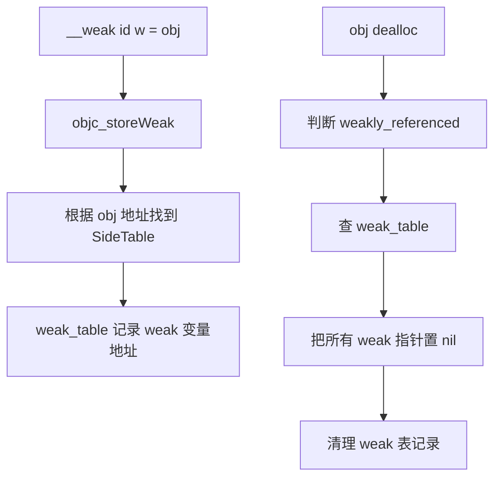

# 面试备战 iOS 07：ARC、weak、SideTable 与 AutoreleasePool

iOS 内存管理面试最容易答浅。很多人只会说“ARC 自动管理内存，weak 自动置 nil，autorelease pool 延迟释放”。这远远不够。

高分回答要能把这条链讲完整：

```text
编译器插入 retain/release -> Runtime 维护引用计数 -> isa/SideTable 分层存储 -> weak 表记录弱引用地址 -> dealloc 清理 weak 和关联对象 -> AutoreleasePoolPage 批量 release
```

## 1. ARC 到底是什么？

ARC 不是垃圾回收，也不是 Runtime 后台线程帮你扫描对象。

ARC 是编译器特性。编译器根据所有权规则，在合适的位置插入内存管理调用。

例如：

```objc
- (void)test {
    NSObject *obj = [[NSObject alloc] init];
    self.item = obj;
}
```

编译后可以粗略理解为：

```objc
NSObject *obj = objc_msgSend(NSObject, @selector(alloc));
obj = objc_msgSend(obj, @selector(init));
objc_storeStrong(&_item, obj);
objc_storeStrong(&obj, nil);
```

真实编译产物更复杂，但核心思想是：

> ARC 把 retain、release、autorelease、storeStrong 等操作前移到编译期决定，Runtime 负责执行这些操作背后的引用计数和弱引用维护。

## 2. strong 赋值底层：objc_storeStrong 做了什么？

strong 属性赋值不是简单指针替换。

```objc
self.name = newName;
```

底层语义接近：

```objc
id old = self->_name;
id new = [newName retain];
self->_name = new;
[old release];
```

真实实现要处理原子性、相同对象、内存屏障等细节。

为什么要先 retain 新值，再 release 旧值？

考虑这种场景：

```objc
self.name = self.name;
```

如果先 release 旧值，可能把对象释放掉，再 retain 就危险了。先 retain 新值可以保证赋值过程对象活着。

## 3. 引用计数存在哪里？

引用计数不是简单存在对象旁边的一个 int。

现代 Runtime 采用分层策略：

```text
第一层：non-pointer isa 的 extra_rc
第二层：SideTable 的 RefcountMap
```

### 3.1 为什么不全部放 SideTable？

SideTable 是全局表，需要哈希、查表、加锁。retain/release 极其高频，如果每次都访问 SideTable，会有锁竞争和性能损耗。

所以常见对象的小引用计数直接放在 isa 位域里。

### 3.2 什么时候用 SideTable？

- isa 中 extra_rc 溢出，引用计数存不下。
- 对象被 weak 引用（存到 SideTable 的 weak_table）。
- 某些复杂 Runtime 状态。

SideTable 是 Runtime 的“外部仓库”，只在对象头装不下或需要全局映射时使用。

> 注意：关联对象（Associated Object）**不在 SideTable**，它存在全局独立的 `AssociationsManager`（内部是 `AssociationsHashMap`）。SideTable 里只有引用计数表 `refcnts` 和弱引用表 `weak_table`，不含关联对象。

## 4. SideTable 是什么？

可以简化理解：

```cpp
struct SideTable {
    spinlock_t slock;
    RefcountMap refcnts;
    weak_table_t weak_table;
};
```

它包含三类能力：

- 锁：保护表结构。
- 引用计数溢出表。
- weak 引用表。

### 为什么 SideTable 要分段？

如果全 App 所有对象共用一张表和一把锁，多线程 retain/release/weak 操作会严重竞争。

Runtime 使用类似 StripedMap 的分段策略，根据对象地址哈希到不同 SideTable，降低锁竞争。

这和 ConcurrentHashMap 分段锁思想类似：不是完全无锁，而是降低同一把锁的争用概率。

## 5. weak 为什么能自动置 nil？

weak 的本质不是“不 retain”这么简单。

weak 赋值时，Runtime 会把“weak 指针变量的地址”登记到 weak 表里。

例如：

```objc
__weak id weakObj = obj;
```

Runtime 需要记录：

```text
obj -> [&weakObj1, &weakObj2, &weakObj3]
```

对象释放时，Runtime 根据对象地址找到所有 weak 指针变量地址，然后逐个写 nil。

流程：



所以 weak 的成本包括：

- 注册 weak。
- 查 SideTable。
- 加锁。
- 对象释放时清理 weak 表。

这也是为什么 Runtime 会在 isa 里放 `weakly_referenced` 标记：如果对象从没被 weak 引用，dealloc 时可以跳过 weak 表清理。

## 6. weak 和 unsafe_unretained 的区别

`weak`：

- 不持有对象。
- 对象释放后自动置 nil。
- Runtime 维护 weak 表。

`unsafe_unretained`：

- 不持有对象。
- 对象释放后不置 nil。
- 可能变成野指针。

所以 unsafe_unretained 没有 weak 的注册、查表和清理开销，成本更低，但失去自动置 nil 保护，风险高。现代业务代码很少需要它。

## 7. AutoreleasePool 底层不是一个普通数组

AutoreleasePool 底层由 `AutoreleasePoolPage` 组成。

可以理解成双向链表页：

```text
AutoreleasePoolPage <-> AutoreleasePoolPage <-> AutoreleasePoolPage
```

关键量化细节（高频追问点）：

- 每个 page 大小是一个虚拟内存页，即 **4096 字节**。
- page 头部约 **56 字节**，存 magic、next（下一个可用位置）、thread、parent、child 等。
- 剩余空间按指针顺序存 autorelease 对象。
- `hotPage` 指当前正在使用的 page。

当执行：

```objc
@autoreleasepool {
    id obj = [[[NSObject alloc] init] autorelease];
}
```

大致发生：

1. push 一个边界哨兵 `POOL_BOUNDARY`（值为 nil，旧称 POOL_SENTINEL），返回它的地址作为 pool token。
2. autorelease 对象指针不断压入当前 page，存满了就新建 page 链到链表后面。
3. pool 结束时拿 token 做 pop，从栈顶一直 release 到该 `POOL_BOUNDARY`。
4. 对边界内所有对象发送 release。

## 8. autorelease 对象为什么不立即释放？

典型场景：

```objc
- (NSString *)name {
    return [NSString stringWithFormat:@"user-%@", self.userId];
}
```

调用方拿到返回值后还要继续用。如果方法内部创建完就立刻 release，返回值就悬空了。

autorelease 解决的是：

> 让对象跨过当前方法作用域继续存活一小段时间，同时不要求调用方手动 release。

它是在生命周期正确性和性能之间的折中。

## 9. AutoreleasePool 和 RunLoop 的关系

主线程 RunLoop 会自动管理 autorelease pool。

可以简化理解：

```text
RunLoop 进入 -> push pool
处理事件 -> 产生 autorelease 对象
RunLoop 即将休眠/退出 -> pop pool，批量 release
```

所以很多 autorelease 对象会在一次 RunLoop 迭代后释放。

但注意：不是所有 autorelease 都一定等到 RunLoop 后才释放。你手动写：

```objc
@autoreleasepool {
    // 临时对象
}
```

作用域结束就会 drain。

## 10. 为什么循环里要手动加 autoreleasepool？

例如：

```objc
for (int i = 0; i < 100000; i++) {
    NSString *s = [NSString stringWithFormat:@"%d", i];
    // do something
}
```

如果这些临时对象都进入外层 pool，它们会堆到本轮 RunLoop 结束才释放，内存峰值会很高。

优化：

```objc
for (int i = 0; i < 100000; i++) {
    @autoreleasepool {
        NSString *s = [NSString stringWithFormat:@"%d", i];
        // do something
    }
}
```

这不是为了防泄漏，而是降低内存峰值。

## 11. 对象 dealloc 时发生什么？

对象释放不是简单 free。

大致流程：

1. 引用计数归零。
2. 标记 deallocating。
3. 调用 `dealloc`。
4. 调用 C++ 析构或 `.cxx_destruct`，释放强引用 ivar。
5. 如果有关联对象，清理关联对象表。
6. 如果被 weak 引用，清理 weak 表并置 nil。
7. 回收对象内存。

isa 里的标记位可以帮助 Runtime 快速跳过不需要的步骤。

例如：

- `has_assoc == 0`：不用查关联对象。
- `weakly_referenced == 0`：不用查 weak 表。
- `has_cxx_dtor == 0`：不用走 C++ 析构路径。

## 12. 高频追问

### Q1：ARC 和 GC 的区别？

ARC 是编译期插入引用计数管理代码，释放时机相对确定。GC 是运行时扫描对象图，判断哪些对象不可达再回收。

iOS 使用 ARC，不使用传统 GC。

### Q2：weak 自动置 nil 的底层？

weak 赋值时 Runtime 把 weak 变量地址注册到 weak_table。对象 dealloc 时根据对象地址找到所有 weak 变量地址，逐个置 nil 并清理表。

### Q3：autoreleasepool 解决什么问题？

解决返回值跨作用域存活和临时对象批量释放问题。它不是泄漏修复工具，而是延迟释放和控制内存峰值的机制。

### Q4：为什么 `__block` 不能替代 weak？

`__block` 解决 Block 内修改外部变量的问题。ARC 下 `__block` 对对象仍可能强持有，不能自动打破循环引用。打破循环引用要用 `__weak` 或重新设计持有关系。

### Q5：weak 有性能成本吗？

有。weak 需要 Runtime 注册、查表、加锁和 dealloc 清理。一般业务不用过度担心，但在极高频对象上要知道它不是零成本。

## 13. 工程排查方法

### 泄漏排查

重点看：

- Block 捕获 self。
- Timer / CADisplayLink。
- Notification。
- delegate 是否 strong。
- 单例缓存。
- 异步回调持有页面。

工具：

- Xcode Memory Graph。
- Instruments Leaks。
- Allocations。
- 自定义 dealloc 日志。

### 内存峰值排查

重点看：

- 大图解码。
- 循环临时对象。
- JSON 大对象。
- autorelease 对象堆积。
- WebView / PDF / 视频。

泄漏和峰值不是一回事。泄漏是对象不释放，峰值是对象晚释放或一次性占用太高。

## 易错点

- 把 ARC 说成 Runtime 自动回收。
- 认为 weak 只是 assign。
- 认为 autorelease 一定在函数结束释放。
- 忽略 autoreleasepool 对内存峰值的控制价值。
- 用 `__block` 解决循环引用。


## 深挖追问：ARC 不是魔法，是编译器插 retain/release

ARC 的高分回答要避免“自动管理内存”这种空话。更准确：

> ARC 是 Clang 在编译期根据所有权规则插入 retain、release、autorelease、storeStrong、storeWeak 等调用；Runtime 提供引用计数、weak 表和 autoreleasepool 支撑。

被问到优化时，可以提两个 Runtime/编译器协作点：

1. `objc_retainAutoreleasedReturnValue` / `objc_autoreleaseReturnValue`：调用方和被调方配合，避免返回值先 autorelease 再 retain 的无谓开销。
2. `objc_storeStrong`：strong 赋值不是简单指针替换，而是 retain 新值、release 旧值，并处理自赋值和异常边界。

weak 深挖：

```text
storeWeak
  -> 加 SideTable 锁
  -> 如果旧对象存在，从旧对象 weak_entry 移除 referrer
  -> 如果新对象可 weak 引用，登记当前 weak 变量地址
  -> 如果新对象正在 dealloc，写 nil 或触发安全处理
```

weak 读也不是裸读。Runtime 要避免你读到一个正在释放的对象，所以 weak load 往往会临时 retain/autorelease 或走安全读取路径。这就是 weak 比 unsafe_unretained 贵的原因。

AutoreleasePool 深挖：

- 它不是一个普通数组，而是按 page 链接的栈式结构。
- push 时放哨兵 token。
- autorelease 对象把指针压入当前 page。
- pop 到 token 时，对 token 之后的对象逐个 release。
- 主线程 RunLoop 在进入和休眠前后维护 pool，保证一次事件循环产生的临时对象能被释放。

面试陷阱：

- autorelease 不等于泄漏，只是延迟 release。
- 循环里大量临时对象需要局部 `@autoreleasepool` 降峰值。
- weak 自动置 nil 发生在对象内存回收前，否则 referrer 地址就无法安全写 nil。
- dealloc 里不要让对象“复活”，也不要做复杂异步逻辑。

## 一句话总结

ARC 是编译器负责插入内存管理语义，Runtime 用 isa 和 SideTable 管引用计数与 weak，AutoreleasePoolPage 负责延迟批量释放对象。

---

## 🔬 深度扩展：AutoreleasePoolPage 的 4096 字节结构与批量释放

AutoreleasePool 是面试中最容易被追问"底层结构"的点。只说"延迟释放"不够，要能讲清楚 **AutoreleasePoolPage 的内存布局、双向链表、POOL_BOUNDARY 哨兵、push/pop 机制**。

### 扩展1：AutoreleasePoolPage 的精确内存布局

**核心结构（源码）：**

```cpp
class AutoreleasePoolPage {
    // 魔数，用于校验
    static const uint32_t MAGIC = 0xA1A1A1A1;
    
    // 实例变量（共 56 字节）
    magic_t const magic;                    // 4 字节：校验魔数
    __unsafe_unretained id *next;           // 8 字节：下一个可用位置
    pthread_t const thread;                 // 8 字节：所属线程
    AutoreleasePoolPage * const parent;     // 8 字节：父节点
    AutoreleasePoolPage *child;             // 8 字节：子节点
    uint32_t const depth;                   // 4 字节：深度
    uint32_t hiwat;                         // 4 字节：高水位标记
    
    // 剩余空间（4096 - 56 = 4040 字节）
    // 用于存储 autorelease 对象指针
    id objects[0];  // 柔性数组
};
```

**内存布局可视化：**

```text
Page 大小：4096 字节（一个虚拟内存页）

┌────────────────────────────────────┐ 0
│ magic (4 bytes)                    │
├────────────────────────────────────┤ 4
│ next (8 bytes)                     │
├────────────────────────────────────┤ 12
│ thread (8 bytes)                   │
├────────────────────────────────────┤ 20
│ parent (8 bytes)                   │
├────────────────────────────────────┤ 28
│ child (8 bytes)                    │
├────────────────────────────────────┤ 36
│ depth (4 bytes)                    │
├────────────────────────────────────┤ 40
│ hiwat (4 bytes)                    │
├────────────────────────────────────┤ 44
│ 未使用 (12 bytes，对齐填充)        │
├────────────────────────────────────┤ 56
│                                    │
│  autorelease 对象指针区域          │
│  (4096 - 56 = 4040 bytes)         │
│                                    │
│  可存储：4040 / 8 = 505 个指针     │
│                                    │
└────────────────────────────────────┘ 4096
```

**关键量化数据：**

- **Page 大小**：4096 字节（= 4KB，一个虚拟内存页）
- **头部大小**：56 字节（实际对齐到 64 字节）
- **对象区域**：4040 字节
- **最多存储**：505 个 autorelease 对象指针（4040 / 8）

### 扩展2：双向链表的完整结构

**多个 Page 形成双向链表：**

```text
┌──────────────┐
│   hotPage    │ ← 当前正在使用的 page
└──────────────┘
       ↓ child
┌──────────────┐
│   Page 3     │
│   depth=2    │
│   next -> X  │ ← next 指向下一个可用位置
└──────────────┘
       ↑ parent
       ↓ child
┌──────────────┐
│   Page 2     │
│   depth=1    │
│   next -> end│ ← 已满
└──────────────┘
       ↑ parent
       ↓ child
┌──────────────┐
│   Page 1     │
│   depth=0    │
│   next -> end│ ← 已满
└──────────────┘
```

**关键概念：**

1. **hotPage**  
   全局指针，指向当前线程正在使用的 page。

2. **parent/child**  
   双向链表，child 指向更新的 page。

3. **next 指针**  
   指向当前 page 中下一个可以存放对象的位置。

4. **depth**  
   Page 在链表中的深度，用于调试和统计。

### 扩展3：POOL_BOUNDARY 哨兵的完整机制

**@autoreleasepool 展开：**

```objc
@autoreleasepool {
    id obj = [[[NSObject alloc] init] autorelease];
}
```

**编译器转换：**

```cpp
void *pool = objc_autoreleasePoolPush();
{
    id obj = objc_autorelease([[NSObject alloc] init]);
}
objc_autoreleasePoolPop(pool);
```

**push 的实现：**

```cpp
void *objc_autoreleasePoolPush(void) {
    return AutoreleasePoolPage::push();
}

static inline void *push() {
    // 获取当前线程的 hotPage
    AutoreleasePoolPage *page = hotPage();
    
    if (!page) {
        // 第一次使用，创建第一个 page
        page = new AutoreleasePoolPage(NULL);
        setHotPage(page);
    } else if (page->full()) {
        // 当前 page 满了，创建新 page
        AutoreleasePoolPage *newPage = new AutoreleasePoolPage(page);
        page->child = newPage;
        setHotPage(newPage);
        page = newPage;
    }
    
    // 压入哨兵（POOL_BOUNDARY）
    return page->add(POOL_BOUNDARY);
}

#define POOL_BOUNDARY  nil  // 哨兵是 nil
```

**add 方法：**

```cpp
id *add(id obj) {
    // 检查是否满
    assert(!full());
    
    // 存储对象
    *next = obj;
    
    // 返回当前位置（作为 token）
    id *ret = next;
    
    // next 指针前进
    next++;
    
    return ret;
}
```

**关键：push 返回的 token 是哨兵的地址**

```text
push 之前：
┌──────────────┐
│ obj1         │
│ obj2         │
│ next -> here │
└──────────────┘

push 之后：
┌──────────────┐
│ obj1         │
│ obj2         │
│ BOUNDARY (nil)│ ← token 指向这里
│ next -> here │
└──────────────┘
```

### 扩展4：autorelease 对象的压栈

**autorelease 调用：**

```objc
id obj = [[NSObject alloc] init];
[obj autorelease];
```

**底层实现：**

```cpp
- (id)autorelease {
    return objc_autorelease(self);
}

id objc_autorelease(id obj) {
    return obj->rootAutorelease();
}

inline id objc_object::rootAutorelease() {
    // Tagged Pointer 直接返回
    if (isTaggedPointer()) return (id)this;
    
    // 尝试快速路径（TLS 优化）
    if (prepareOptimizedReturn(ReturnAtPlus1)) return (id)this;
    
    // 普通路径：加入 AutoreleasePool
    return rootAutorelease2();
}

__attribute__((noinline,used))
id objc_object::rootAutorelease2() {
    return AutoreleasePoolPage::autorelease((id)this);
}
```

**AutoreleasePoolPage::autorelease：**

```cpp
static inline id autorelease(id obj) {
    // 获取 hotPage
    AutoreleasePoolPage *page = hotPage();
    
    if (!page) {
        // 没有 page，创建第一个
        page = new AutoreleasePoolPage(NULL);
        setHotPage(page);
        
        // 自动 push 一个哨兵
        page->add(POOL_BOUNDARY);
    } else if (page->full()) {
        // 满了，创建新 page
        AutoreleasePoolPage *newPage = new AutoreleasePoolPage(page);
        page->child = newPage;
        setHotPage(newPage);
        page = newPage;
    }
    
    // 添加对象
    page->add(obj);
    
    return obj;
}
```

**压栈过程可视化：**

```text
初始：
┌──────────────┐
│ BOUNDARY     │ ← token1
│ next -> here │
└──────────────┘

autorelease(obj1)：
┌──────────────┐
│ BOUNDARY     │
│ obj1         │
│ next -> here │
└──────────────┘

autorelease(obj2)：
┌──────────────┐
│ BOUNDARY     │
│ obj1         │
│ obj2         │
│ next -> here │
└──────────────┘
```

### 扩展5：pop 的批量释放机制

**pop 调用：**

```cpp
void objc_autoreleasePoolPop(void *ctxt) {
    AutoreleasePoolPage::pop(ctxt);
}

static inline void pop(void *token) {
    AutoreleasePoolPage *page = pageForPointer(token);
    
    // 从 next 开始，往回 release，直到 token
    page->releaseUntil(token);
    
    // 清理多余的 page
    if (page->child) {
        page->kill();
    }
    
    // 更新 hotPage
    setHotPage(page);
}
```

**releaseUntil 实现：**

```cpp
void releaseUntil(id *stop) {
    // 从当前位置往回遍历
    while (this->next != stop) {
        // 获取最后一个对象
        AutoreleasePoolPage *page = hotPage();
        
        // next 回退
        page->next--;
        
        // 读取对象
        id obj = *page->next;
        
        // 如果是 BOUNDARY，跨越它
        if (obj == POOL_BOUNDARY) {
            continue;
        }
        
        // release 对象
        objc_release(obj);
        
        // 如果回退到 page 开头，切换到父 page
        if (page->next == page->begin()  &&  page->parent) {
            AutoreleasePoolPage *parent = page->parent;
            setHotPage(parent);
            // 注意：不立即释放 page，延迟回收
        }
    }
}
```

**批量释放可视化：**

```text
pop 前：
┌──────────────┐
│ BOUNDARY     │ ← token（stop）
│ obj1         │
│ obj2         │
│ obj3         │
│ next -> here │
└──────────────┘

pop 过程：
1. next--，读取 obj3，release(obj3)
2. next--，读取 obj2，release(obj2)
3. next--，读取 obj1，release(obj1)
4. next--，读取 BOUNDARY，停止

pop 后：
┌──────────────┐
│ BOUNDARY     │ ← next 回到 token
│ (obj1)       │ ← 位置可复用
│ (obj2)       │
│ (obj3)       │
└──────────────┘
```

**关键：对象指针不会清零**

pop 后，对象指针仍在内存中，只是 next 指针回退了。这些位置会在下次 autorelease 时被复用。

### 扩展6：Page 的延迟回收机制

**为什么不立即释放空 page？**

频繁创建/销毁 page 有成本。Runtime 采用延迟回收策略：

```cpp
void kill() {
    // 递归销毁所有 child
    AutoreleasePoolPage *page = this;
    while (page->child) {
        AutoreleasePoolPage *child = page->child;
        page->child = NULL;
        child->kill();
    }
    
    // 但保留一定数量的空 page
    if (canRetain()) {
        // 标记为可复用，不释放
        this->next = begin();
    } else {
        // 真正释放内存
        delete this;
    }
}
```

**保留策略：**

- 保留最近使用的 1-2 个空 page
- 超过阈值才真正释放
- 减少 malloc/free 调用

### 扩展7：AutoreleasePool 和 RunLoop 的精确协调

**主线程 RunLoop 管理 pool：**

```cpp
// RunLoop 注册两个 Observer

// Observer 1：监听 Entry，优先级最高
CFRunLoopObserverRef observer1 = CFRunLoopObserverCreate(
    kCFAllocatorDefault,
    kCFRunLoopEntry,  // 进入 RunLoop
    true,  // 重复
    INT_MIN,  // 优先级最高
    &_runLoopObserverCallout,
    NULL
);

// Observer 2：监听 BeforeWaiting 和 Exit
CFRunLoopObserverRef observer2 = CFRunLoopObserverCreate(
    kCFAllocatorDefault,
    kCFRunLoopBeforeWaiting | kCFRunLoopExit,
    true,
    INT_MAX,  // 优先级最低
    &_runLoopObserverCallout,
    NULL
);

// 回调函数
void _runLoopObserverCallout(CFRunLoopObserverRef observer,
                              CFRunLoopActivity activity,
                              void *info) {
    switch (activity) {
        case kCFRunLoopEntry:
            // RunLoop 进入，push pool
            _objc_autoreleasePoolPush();
            break;
            
        case kCFRunLoopBeforeWaiting:
            // 即将休眠，release 旧 pool，push 新 pool
            _objc_autoreleasePoolPop(pool);
            pool = _objc_autoreleasePoolPush();
            break;
            
        case kCFRunLoopExit:
            // 退出，pop pool
            _objc_autoreleasePoolPop(pool);
            break;
    }
}
```

**完整时序：**

```text
App 启动
  -> 主线程 RunLoop 创建
  -> 注册 Observer
  
第一次 RunLoop 迭代：
  -> Entry：push pool (token1)
  -> 处理事件：产生 autorelease 对象
  -> BeforeWaiting：
     pop(token1)，释放对象
     push pool (token2)
  -> 休眠
  
第二次 RunLoop 迭代：
  -> 被唤醒
  -> 处理事件：产生 autorelease 对象
  -> BeforeWaiting：
     pop(token2)，释放对象
     push pool (token3)
  -> 休眠

App 退出：
  -> Exit：pop(token3)
```

**为什么 BeforeWaiting 要 pop + push？**

1. **释放本轮产生的对象**  
   避免内存累积。

2. **push 新 pool 为下一轮准备**  
   保证每轮都有 pool 可用。

### 扩展8：手动 @autoreleasepool 的优化场景

**场景1：大循环降内存峰值**

```objc
// ❌ 差：所有临时对象累积到 RunLoop 结束
for (int i = 0; i < 100000; i++) {
    NSString *s = [NSString stringWithFormat:@"%d", i];
    // do something
}

// ✅ 好：每次循环都释放
for (int i = 0; i < 100000; i++) {
    @autoreleasepool {
        NSString *s = [NSString stringWithFormat:@"%d", i];
        // do something
    }
}
```

**内存峰值对比（假设每个字符串 100 字节）：**

| 方式 | 峰值内存 | 说明 |
|------|---------|------|
| 无 pool | ~10 MB | 100000 * 100 字节 |
| 有 pool | ~100 KB | 最多 ~1000 个对象（取决于循环体） |

**场景2：子线程手动管理**

```objc
pthread_create(&thread, NULL, threadFunc, NULL);

void *threadFunc(void *arg) {
    @autoreleasepool {
        // 子线程没有默认 RunLoop
        // 必须手动包 autoreleasepool
        
        NSString *s = [NSString stringWithFormat:@"test"];
        // s 会在这个 pool 结束时释放
    }
    
    return NULL;
}
```

**场景3：性能敏感路径**

```objc
- (void)processHugeData:(NSArray *)data {
    // 每处理 100 条数据，释放一次
    for (int i = 0; i < data.count; i++) {
        if (i % 100 == 0) {
            @autoreleasepool {
                [self processChunk:[data subarrayWithRange:NSMakeRange(i, MIN(100, data.count - i))]];
            }
        }
    }
}
```

### 扩展9：objc_autoreleaseReturnValue 的编译器优化

**返回值优化（ARC）：**

```objc
- (NSString *)getName {
    return [[NSString alloc] init];
}

NSString *name = [obj getName];
```

**未优化的流程：**

```text
1. getName 内部：autorelease 返回值
2. 调用方：retain 返回值
3. RunLoop 结束：release autorelease pool 中的对象
```

**优化后的流程（编译器协作）：**

```cpp
// 被调用方
- (NSString *)getName {
    NSString *result = [[NSString alloc] init];
    return objc_autoreleaseReturnValue(result);
}

// objc_autoreleaseReturnValue 做了什么？
id objc_autoreleaseReturnValue(id obj) {
    // 检查调用方是否会立即 retain
    if (callerAcceptsOptimizedReturn()) {
        // 调用方会 retain，跳过 autorelease
        return obj;
    } else {
        // 正常 autorelease
        return objc_autorelease(obj);
    }
}

// 调用方
NSString *name = objc_retainAutoreleasedReturnValue([obj getName]);

// objc_retainAutoreleasedReturnValue 做了什么？
id objc_retainAutoreleasedReturnValue(id obj) {
    // 检查被调用方是否跳过了 autorelease
    if (acceptOptimizedReturn() == obj) {
        // 跳过了，直接返回（已经 +1）
        return obj;
    } else {
        // 正常 retain
        return objc_retain(obj);
    }
}
```

**优化效果：**

```text
未优化：alloc (+1) -> autorelease -> retain (+2) -> pool release (-1) = +1
优化后：alloc (+1) = +1

省掉了：autorelease + retain + pool release
```

**编译器如何协作？**

通过 TLS（线程局部存储）传递标记：

```text
被调用方：写入 TLS，表示"我跳过了 autorelease"
调用方：  读取 TLS，检查"返回值是否优化"
```

---

## 补充总结

AutoreleasePoolPage 的深度记忆点：

1. **4096 字节结构**：56 字节头部，4040 字节对象区域，最多 505 个指针
2. **双向链表**：parent/child 连接，hotPage 指向当前页
3. **POOL_BOUNDARY**：哨兵是 nil，push 返回其地址作为 token
4. **批量释放**：pop 从 next 回退到 token，逐个 release
5. **延迟回收**：空 page 不立即释放，保留 1-2 个复用
6. **RunLoop 协调**：Entry push，BeforeWaiting pop+push，Exit pop
7. **编译器优化**：objc_autoreleaseReturnValue 跳过不必要的 autorelease

面试追问时要能讲出：
- AutoreleasePoolPage 的精确大小和布局（4096 字节，56 字节头部）
- POOL_BOUNDARY 哨兵的作用（标记 pool 边界，pop 的终止点）
- 为什么 pop 是批量释放（从 next 回退到 token，逐个 release）
- RunLoop 的三个时机（Entry push，BeforeWaiting pop+push，Exit pop）
- 手动 pool 的优化场景（大循环降峰值，子线程管理）
- objc_autoreleaseReturnValue 优化（跳过 autorelease+retain）
