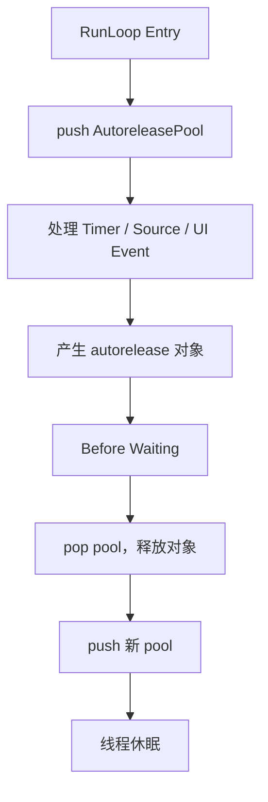
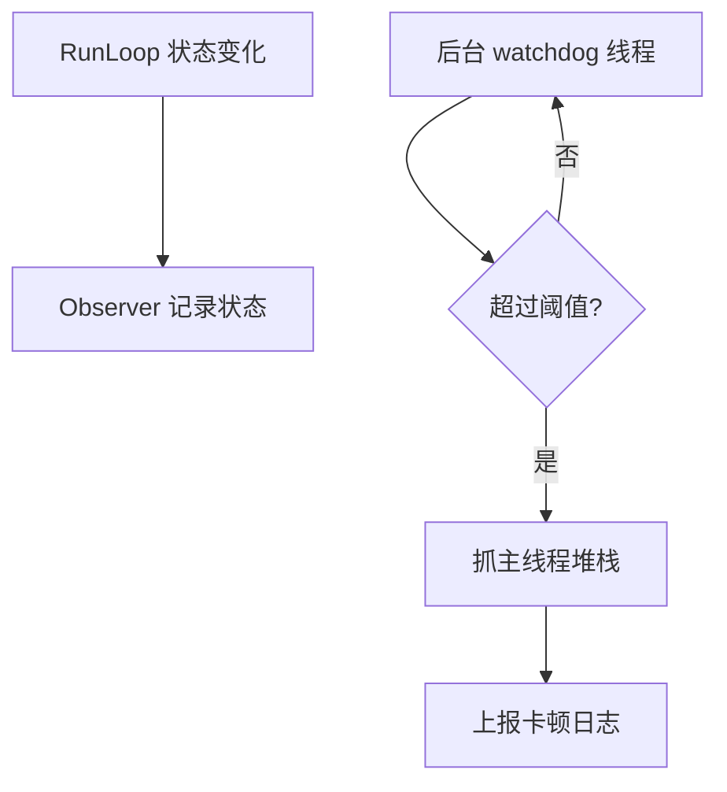

# 面试备战 iOS 08：RunLoop 事件循环与线程保活

RunLoop 是 iOS 面试里最容易背成概念的专题。只说“RunLoop 是事件循环，让线程不退出”不够。要讲清楚它为什么存在、内部有哪些事件源、Mode 为什么影响 Timer、AutoreleasePool 为什么和它有关、卡顿监控为什么能基于它做。

## 1. RunLoop 解决什么问题？

普通线程执行完函数就退出：

```objc
pthread_create(..., start, ...);
// start 执行结束，线程退出
```

但主线程不能这样。App 需要一直等待用户触摸、Timer、系统事件、端口消息。没有事件时不能空转浪费 CPU，有事件时又要及时醒来处理。

RunLoop 解决的是：

> 线程如何在“没事休眠”和“有事处理”之间循环切换。

它不是简单 while true，而是事件驱动循环。

## 2. RunLoop 和线程的关系

每个线程最多对应一个 RunLoop。

主线程 RunLoop 系统自动创建并运行。子线程 RunLoop 默认不会自动跑，需要你主动获取并运行。

```objc
NSRunLoop *runLoop = [NSRunLoop currentRunLoop];
```

这会为当前线程创建 RunLoop，但只是创建，不代表它会一直运行。

如果子线程 RunLoop 没有 Source 或 Timer，运行后也会立刻退出。

## 3. CFRunLoop 底层结构

RunLoop 核心结构可以简化理解：

```cpp
struct __CFRunLoop {
    pthread_t _pthread;
    CFMutableSetRef _commonModes;
    CFMutableSetRef _commonModeItems;
    CFRunLoopModeRef _currentMode;
    CFMutableSetRef _modes;
};
```

Mode 结构：

```cpp
struct __CFRunLoopMode {
    CFStringRef _name;
    CFMutableSetRef _sources0;
    CFMutableSetRef _sources1;
    CFMutableArrayRef _observers;
    CFMutableArrayRef _timers;
};
```

也就是说，Source、Timer、Observer 都是挂在 Mode 下面的。

这解释了一个关键问题：

> RunLoop 每次只能运行在某一个 Mode 中，只会处理这个 Mode 下的 Source、Timer、Observer。

## 4. Mode 为什么重要？

常见 Mode：

- `kCFRunLoopDefaultMode`
- `UITrackingRunLoopMode`
- `kCFRunLoopCommonModes`

当用户滚动 ScrollView 时，主线程 RunLoop 会切到 `UITrackingRunLoopMode`，保证滚动事件优先处理。

如果 Timer 只注册在 Default Mode：

```objc
[NSTimer scheduledTimerWithTimeInterval:1 target:self selector:@selector(tick) userInfo:nil repeats:YES];
```

滚动时 RunLoop 不在 Default Mode，这个 Timer 就不会触发。

解决：

```objc
[[NSRunLoop mainRunLoop] addTimer:timer forMode:NSRunLoopCommonModes];
```

注意 CommonModes 不是一个真实 Mode，而是一组 Mode 的标记。添加到 CommonModes 的 item 会被同步到被标记为 common 的 Mode 中。

## 5. Source0 和 Source1 的区别

### Source0

非基于端口的事件源，需要两步:先 `CFRunLoopSourceSignal` 标记为待处理,再 `CFRunLoopWakeUp` 唤醒 RunLoop。

常见理解：

- App 内部手动触发。
- performSelector。
- Source1 则由 mach port 收到内核消息直接唤醒,不需手动这两步。

### Source1

基于 Mach Port，由内核消息触发。

常见理解：

- 系统事件。
- 进程间通信。
- 端口消息。

区别重点：

> Source0 偏用户态，需要手动唤醒；Source1 基于内核端口，可以由内核唤醒线程。

## 6. Timer 为什么不准？

Timer 不是实时系统。

它依赖 RunLoop 被唤醒并运行到对应 Mode。如果主线程正在执行耗时任务，Timer 到点也不能立刻执行。

影响因素：

- RunLoop 当前 Mode 不匹配。
- 主线程被长任务阻塞。
- Timer tolerance。
- 系统调度。
- 低电量和后台策略。

所以 Timer 适合普通定时，不适合高精度计时。

## 7. Observer：RunLoop 状态观察

RunLoop Observer 可以监听状态：

- entry。
- before timers。
- before sources。
- before waiting。
- after waiting。
- exit。

典型应用：

- AutoreleasePool。
- 卡顿监控。
- 主线程任务调度。

## 8. AutoreleasePool 和 RunLoop

主线程中，系统会注册 Observer 管理 AutoreleasePool。准确说是**两个 Observer、三个时机**:一个监听 Entry(优先级最高)做 push;另一个监听 BeforeWaiting(release 旧 pool + push 新 pool)和 Exit(优先级最低,做最后一次 release)。

简化流程：



为什么不每个 autorelease 对象立即释放？

因为对象可能需要跨方法返回给调用方使用。RunLoop 边界提供了一个天然批处理时机。

## 9. 子线程保活怎么做？

错误写法：

```objc
dispatch_async(queue, ^{
    [[NSRunLoop currentRunLoop] run];
});
```

如果没有任何 input source，RunLoop 可能直接退出。

常见做法是添加 Port：

```objc
- (void)threadMain {
    @autoreleasepool {
        NSRunLoop *runLoop = [NSRunLoop currentRunLoop];
        [runLoop addPort:[NSMachPort port] forMode:NSDefaultRunLoopMode];
        [runLoop run];
    }
}
```

但工程上要注意：

- 如何退出线程。
- 如何避免常驻线程浪费资源。
- 是否真的需要手动线程，而不是 GCD/Operation。

## 10. RunLoop 卡顿监控原理

主线程卡顿的本质是 RunLoop 长时间不能进入下一个状态。

常见方案：

1. 在主线程注册 RunLoop Observer。
2. 记录当前状态和时间。
3. 后台线程定期检查。
4. 盯 `BeforeSources` 到下一次 `BeforeWaiting` 之间(即正在处理 source/timer/block 的区间)——这段就是主线程真正在干活的时间,停留过久即认为卡顿。
5. 抓取主线程堆栈。
6. 上报聚合分析。

简化流程：



### 局限性

RunLoop 卡顿监控不是万能：

- 阈值不好设会误报。
- 只能说明主线程卡住，不直接说明原因。
- 需要堆栈聚合才能定位。
- 对短时间掉帧不一定敏感。

更完整的性能体系应结合 FPS、主线程耗时埋点、MetricKit、线上堆栈聚合。

## 11. RunLoop 和 GCD 的关系

主队列任务最终也要在主线程执行。主线程 RunLoop 会在合适时机处理主队列相关 Source。

所以：

```objc
dispatch_async(dispatch_get_main_queue(), ^{
    // UI update
});
```

这段 block 不会凭空执行，它需要主线程有机会从事件循环中取出并执行。

如果主线程被死循环阻塞，主队列任务也无法执行。

## 12. 高频追问

### Q1：主线程为什么不会退出？

因为 UIApplication 启动后，主线程 RunLoop 持续运行。没有事件时休眠，有事件时被唤醒处理。

### Q2：Timer 滚动时为什么停？

Timer 注册在 Default Mode，滚动时 RunLoop 切到 Tracking Mode。当前 Mode 不处理 Default Mode 下的 Timer。

### Q3：CommonModes 是什么？

CommonModes 不是一个实际 Mode，而是一个标记集合。加入 CommonModes 的 Source/Timer 会被同步到所有 common mode。

### Q4：RunLoop 能保证线程安全吗？

不能。RunLoop 是事件调度机制，不是同步机制。线程安全还是要靠锁、串行队列、不可变数据等。

### Q5：为什么卡顿监控可以用 RunLoop？

因为主线程处理事件依赖 RunLoop 状态推进。如果长时间停留在某个状态，说明主线程可能被耗时任务阻塞。

## 13. 工程建议

- 不要在主线程做 IO、JSON 大解析、大图解码。
- Timer 要明确 Mode。
- 子线程保活要有退出机制。
- 卡顿监控要抓堆栈，不要只记录“卡了”。
- RunLoop 适合解释机制，不要把它当成业务调度万能工具。


## 深挖追问：RunLoop 要讲到“等待”和“被唤醒”

RunLoop 的本质不是 while 循环，而是“处理事件，没事睡眠，有事被内核或用户态唤醒”的机制。

可以把一次 `CFRunLoopRunSpecific` 简化成：

```text
通知 Entry
处理 blocks
处理 Source0
如果有 Source1 就处理
通知 BeforeTimers
通知 BeforeSources
处理 timers/sources
通知 BeforeWaiting
进入 mach_msg 等待
被 port/timer/dispatch 唤醒
通知 AfterWaiting
处理唤醒原因
通知 Exit
```

Source0 和 Source1 的区别要答成“谁负责唤醒”：

- Source0 是用户态事件源，不自带内核唤醒能力，需要手动 signal + wakeup。
- Source1 基于 Mach port，可以由内核消息唤醒 RunLoop，例如系统事件、端口消息。

RunLoop 和 GCD 的关系：

- 主队列任务会和主线程 RunLoop 协作，在合适时机被 drain。
- `dispatch_async(dispatch_get_main_queue())` 不是立刻执行，而是排进主队列，等待主线程有机会处理。
- 子线程没有默认活跃 RunLoop，除非你显式 run。

Timer 不准的深层原因：

1. Timer 依赖 RunLoop 运行，线程忙就无法按时处理。
2. 当前 Mode 不包含 Timer 时不会触发。
3. 系统有 tolerance/coalescing，可能合并定时器降低功耗。
4. Timer 回调本身在 RunLoop 线程执行，重活会影响后续事件。

卡顿监控被追问时：

> 如果主线程长时间停在 AfterWaiting 到 BeforeWaiting 之间，说明它醒来后一直在处理任务，没有及时回到睡眠，可能有主线程耗时、锁等待、同步 I/O 或布局绘制过重。RunLoop 监控只能定位“主线程没回到某个状态”，具体原因还要结合堆栈采样。

## 一句话总结

RunLoop 是线程的事件调度器，Mode 决定当前处理哪些事件，Observer 暴露状态边界，AutoreleasePool 和卡顿监控都建立在这些边界之上。

---

## 🔬 深度扩展：mach_msg 与 RunLoop 的休眠唤醒机制

RunLoop 面试最容易被追问的是"线程怎么休眠"和"怎么被唤醒"。只说"没事休眠"不够，要能讲清楚 **mach_msg、port、内核唤醒、Source0/Source1 的本质差异**。

### 扩展1：CFRunLoopRunSpecific 的完整流程（源码级）

**简化源码：**

```c
int32_t CFRunLoopRunSpecific(CFRunLoopRef rl, CFStringRef modeName, 
                             CFTimeInterval seconds, Boolean returnAfterSourceHandled) {
    // 1. 通知 Observer：即将进入 RunLoop
    __CFRunLoopDoObservers(rl, currentMode, kCFRunLoopEntry);
    
    int32_t result;
    do {
        // 2. 通知 Observer：即将处理 Timers
        __CFRunLoopDoObservers(rl, currentMode, kCFRunLoopBeforeTimers);
        
        // 3. 通知 Observer：即将处理 Sources
        __CFRunLoopDoObservers(rl, currentMode, kCFRunLoopBeforeSources);
        
        // 4. 处理 Blocks
        __CFRunLoopDoBlocks(rl, currentMode);
        
        // 5. 处理 Source0（需要手动唤醒的事件）
        Boolean sourceHandledThisLoop = __CFRunLoopDoSources0(rl, currentMode, &stopAfterHandle);
        
        // 6. 如果有 Source0 处理了事件，处理 Blocks
        if (sourceHandledThisLoop) {
            __CFRunLoopDoBlocks(rl, currentMode);
        }
        
        // 7. 检查是否有 Source1（基于 port 的事件）就绪
        Boolean poll = sourceHandledThisLoop || (0ULL == timeout_context->termTSR);
        
        if (MACH_PORT_NULL != dispatchPort && !didDispatchPortLastTime) {
            // GCD main queue 有任务
            msg = (mach_msg_header_t *)msg_buffer;
            if (__CFRunLoopServiceMachPort(dispatchPort, &msg, sizeof(msg_buffer), &livePort, 0, &voucherState, NULL)) {
                // 处理 GCD 任务
                goto handle_msg;
            }
        }
        
        // 8. 通知 Observer：即将休眠
        __CFRunLoopDoObservers(rl, currentMode, kCFRunLoopBeforeWaiting);
        
        // 9. 进入休眠，等待以下事件之一：
        //    - Port 消息（Source1）
        //    - Timer 到期
        //    - RunLoop 超时
        //    - 手动唤醒
        __CFRunLoopServiceMachPort(waitSet, &msg, sizeof(msg_buffer), &livePort, poll ? 0 : TIMEOUT_INFINITY, &voucherState, &voucherCopy);
        
        // 10. 被唤醒，通知 Observer
        __CFRunLoopDoObservers(rl, currentMode, kCFRunLoopAfterWaiting);
        
    handle_msg:
        // 11. 处理唤醒原因
        if (modeQueuePort != MACH_PORT_NULL && livePort == modeQueuePort) {
            // Timer 到期
            __CFRunLoopDoTimers(rl, currentMode, mach_absolute_time());
        }
        else if (livePort == dispatchPort) {
            // GCD main queue
            __CFRUNLOOP_IS_SERVICING_THE_MAIN_DISPATCH_QUEUE__(msg);
        }
        else {
            // Source1 事件
            __CFRunLoopDoSource1(rl, currentMode, source1);
        }
        
        // 12. 处理 Blocks
        __CFRunLoopDoBlocks(rl, currentMode);
        
        // 13. 检查退出条件
        if (sourceHandledThisLoop && stopAfterHandle) {
            result = kCFRunLoopRunHandledSource;
        } else if (timeout_context->termTSR < mach_absolute_time()) {
            result = kCFRunLoopRunTimedOut;
        } else if (__CFRunLoopIsStopped(rl)) {
            result = kCFRunLoopRunStopped;
        } else if (rl->_perRunData->stopped) {
            result = kCFRunLoopRunStopped;
        } else {
            result = kCFRunLoopRunFinished;
        }
        
    } while (result == 0);
    
    // 14. 通知 Observer：即将退出
    __CFRunLoopDoObservers(rl, currentMode, kCFRunLoopExit);
    
    return result;
}
```

**关键点：第9步的 mach_msg 是休眠的关键**

### 扩展2：mach_msg 的休眠与唤醒机制

**mach_msg 调用：**

```c
mach_msg_return_t mach_msg(
    mach_msg_header_t *msg,    // 消息缓冲区
    mach_msg_option_t option,  // SEND/RECEIVE 选项
    mach_msg_size_t send_size,
    mach_msg_size_t rcv_size,
    mach_port_t rcv_name,      // 接收端口
    mach_msg_timeout_t timeout, // 超时时间
    mach_port_t notify
);
```

**RunLoop 使用：**

```c
__CFRunLoopServiceMachPort(
    mach_port_t port,          // 等待的端口集合
    mach_msg_header_t **buffer,
    size_t buffer_size,
    mach_port_t *livePort,     // 输出：哪个端口有消息
    mach_msg_timeout_t timeout, // TIMEOUT_INFINITY = 永久等待
    voucher_mach_msg_state_t *voucherState,
    voucher_t *voucherCopy
) {
    // 调用 mach_msg 等待消息
    ret = mach_msg(
        msg,
        MACH_RCV_MSG | MACH_RCV_LARGE | (timeout ? MACH_RCV_TIMEOUT : 0),
        0,
        buffer_size,
        port,
        timeout,
        MACH_PORT_NULL
    );
    
    if (ret == MACH_MSG_SUCCESS) {
        *livePort = msg->msgh_local_port;  // 记录哪个端口有消息
        return true;
    }
    
    return false;
}
```

**休眠过程：**

```text
1. 用户态：调用 mach_msg，传入 MACH_RCV_MSG 标志
2. 系统调用：陷入内核
3. 内核：检查端口是否有消息
   - 有消息：立即返回
   - 无消息：线程进入等待队列，让出 CPU
4. 线程状态：THREAD_STATE_WAITING（等待状态）
5. CPU 调度器：调度其他线程运行
```

**唤醒过程：**

```text
1. 事件发生：
   - Timer 到期（内核定时器）
   - 其他线程/进程发送 mach 消息到 port
   - 手动调用 CFRunLoopWakeUp

2. 内核：
   - 把消息放入 port 的消息队列
   - 从等待队列取出线程
   - 标记为 THREAD_STATE_RUNNABLE

3. CPU 调度器：
   - 线程重新可运行
   - 等待 CPU 时间片

4. 线程恢复：
   - 从 mach_msg 返回
   - RunLoop 继续执行
```

**关键：真正的休眠发生在内核**

用户态的 `mach_msg` 只是入口，真正的休眠和唤醒由 Mach 内核管理。

### 扩展3：Source0 和 Source1 的本质差异

**Source1：基于 port 的事件源**

```c
struct __CFRunLoopSource {
    CFRuntimeBase _base;
    uint32_t _bits;
    pthread_mutex_t _lock;
    CFIndex _order;  // 优先级
    
    union {
        // Source0 的回调
        CFRunLoopSourceContext context;
        
        // Source1 的回调和 port
        CFRunLoopSourceContext1 context1;
    } _context;
};

typedef struct {
    CFIndex version;
    void *info;
    // Source1 关键：mach_port_t
    mach_port_t (*getPort)(void *info);
    void (*perform)(void *info);
} CFRunLoopSourceContext1;
```

**Source1 的工作流程：**

```text
1. Source1 注册到 RunLoop
   -> 获取 mach_port_t
   -> 添加到 waitSet（等待的端口集合）

2. RunLoop 休眠：
   -> mach_msg 等待 waitSet 中的任意 port

3. 消息到达：
   -> 内核唤醒线程
   -> mach_msg 返回，livePort 标识哪个 port 有消息

4. RunLoop 处理：
   -> 找到对应的 Source1
   -> 调用 perform 回调
```

**Source0：非 port 事件源**

```c
typedef struct {
    CFIndex version;
    void *info;
    // Source0 没有 port
    void (*schedule)(void *info, CFRunLoopRef rl, CFStringRef mode);
    void (*cancel)(void *info, CFRunLoopRef rl, CFStringRef mode);
    void (*perform)(void *info);
} CFRunLoopSourceContext;
```

**Source0 的工作流程：**

```text
1. 标记 Source0 为待处理：
   CFRunLoopSourceSignal(source);
   // 仅标记，不唤醒

2. 手动唤醒 RunLoop：
   CFRunLoopWakeUp(runloop);
   // 发送消息到 RunLoop 的唤醒 port

3. RunLoop 被唤醒：
   -> 检查是否有 Source0 被标记
   -> 调用 __CFRunLoopDoSources0
   -> 执行 perform 回调
```

**核心差异对比：**

| 特性 | Source0 | Source1 |
|------|---------|---------|
| 基于 | 非 port | mach_port |
| 唤醒能力 | 不能自己唤醒 RunLoop | 可以由内核唤醒 |
| 使用场景 | 用户态事件（触摸、手势） | 系统事件（port 消息、CFMachPort） |
| 处理时机 | BeforeSources 阶段 | AfterWaiting 阶段 |
| 标记方式 | CFRunLoopSourceSignal | 消息发送到 port |

**面试回答模板：**

> Source0 是用户态事件源，需要手动标记（Signal）和唤醒（WakeUp）；Source1 基于 mach port，可以由内核直接唤醒线程。触摸事件最初由 IOKit 通过 Source1 发送，后续转成 Source0 处理。

### 扩展4：CFRunLoopWakeUp 的实现

**手动唤醒：**

```c
void CFRunLoopWakeUp(CFRunLoopRef rl) {
    // 获取 RunLoop 的唤醒 port
    mach_port_t wakeUpPort = rl->_wakeUpPort;
    
    if (wakeUpPort == MACH_PORT_NULL) return;
    
    // 发送空消息到唤醒 port
    mach_msg_header_t msg;
    msg.msgh_bits = MACH_MSGH_BITS(MACH_MSG_TYPE_COPY_SEND, 0);
    msg.msgh_size = sizeof(msg);
    msg.msgh_remote_port = wakeUpPort;
    msg.msgh_local_port = MACH_PORT_NULL;
    msg.msgh_id = 0;
    
    mach_msg(&msg, MACH_SEND_MSG | MACH_SEND_TIMEOUT, 
             msg.msgh_size, 0, MACH_PORT_NULL, 0, MACH_PORT_NULL);
}
```

**流程：**

```text
线程 A：
  CFRunLoopSourceSignal(source)  // 标记 Source0
  CFRunLoopWakeUp(runloop)       // 发送消息到唤醒 port

RunLoop 线程（休眠中）：
  mach_msg 等待...
  -> 收到唤醒 port 的消息
  -> 内核唤醒线程
  -> 检查 Source0 标记
  -> 处理 Source0
```

### 扩展5：Timer 的底层实现与不准确性

**CFRunLoopTimer 结构：**

```c
struct __CFRunLoopTimer {
    CFRuntimeBase _base;
    pthread_mutex_t _lock;
    CFRunLoopRef _runLoop;
    CFMutableSetRef _rlModes;  // 所在的 Mode
    CFAbsoluteTime _nextFireDate;  // 下次触发时间
    CFTimeInterval _interval;      // 间隔
    CFTimeInterval _tolerance;     // 容差
    uint64_t _fireTSR;  // Mach 绝对时间
    CFIndex _order;     // 优先级
    CFRunLoopTimerCallBack _callout;
    CFRunLoopTimerContext _context;
};
```

**Timer 触发机制：**

```text
1. Timer 添加到 RunLoop：
   -> 计算 _nextFireDate
   -> 按触发时间排序插入 Mode 的 Timer 数组

2. RunLoop 每次循环：
   -> __CFRunLoopDoTimers 检查是否有到期 Timer
   -> 执行回调
   -> 更新 _nextFireDate（repeats 时）

3. RunLoop 休眠时：
   -> 计算最近 Timer 的触发时间
   -> 设置 mach_msg 的 timeout
   -> 内核定时器唤醒线程
```

**为什么 Timer 不准？**

1. **线程被阻塞**  
   ```text
   Timer 到期 -> 内核唤醒线程
   但主线程正在执行耗时任务 -> Timer 回调延迟
   ```

2. **Mode 不匹配**  
   ```text
   Timer 在 Default Mode
   用户滚动 -> RunLoop 切到 Tracking Mode
   Timer 暂停触发
   ```

3. **Tolerance 合并**  
   ```objc
   timer.tolerance = 0.1;  // 容差 100ms
   // 系统可能把多个 Timer 合并到同一时间触发，节省功耗
   ```

4. **系统调度**  
   ```text
   低电量模式 -> 延长 Timer 间隔
   后台运行 -> Timer 可能被暂停或降频
   ```

### 扩展6：RunLoop 卡顿监控的完整实现

**监控原理：**

主线程卡顿 = BeforeSources 到 AfterWaiting 之间停留时间过长

```text
正常：
BeforeSources -> 处理事件（10ms）-> BeforeWaiting

卡顿：
BeforeSources -> 处理事件（2000ms）-> BeforeWaiting
```

**实现代码：**

```objc
@interface RunLoopMonitor : NSObject
@property (nonatomic, assign) CFRunLoopObserverRef observer;
@property (nonatomic, assign) CFRunLoopActivity currentActivity;
@property (nonatomic, strong) dispatch_semaphore_t semaphore;
@end

@implementation RunLoopMonitor

- (void)start {
    // 1. 创建 Observer
    CFRunLoopObserverContext context = {0, (__bridge void *)self, NULL, NULL, NULL};
    self.observer = CFRunLoopObserverCreate(
        kCFAllocatorDefault,
        kCFRunLoopAllActivities,  // 监听所有状态
        YES,  // 重复
        0,    // 优先级
        &runLoopObserverCallBack,
        &context
    );
    
    // 2. 添加到主线程 RunLoop
    CFRunLoopAddObserver(CFRunLoopGetMain(), self.observer, kCFRunLoopCommonModes);
    
    // 3. 创建信号量
    self.semaphore = dispatch_semaphore_create(0);
    
    // 4. 启动监控线程
    dispatch_async(dispatch_get_global_queue(0, 0), ^{
        while (YES) {
            // 等待信号，超时 50ms
            long result = dispatch_semaphore_wait(self.semaphore, dispatch_time(DISPATCH_TIME_NOW, 50 * NSEC_PER_MSEC));
            
            if (result != 0) {
                // 超时了，检查 RunLoop 状态
                CFRunLoopActivity activity = self.currentActivity;
                
                if (activity == kCFRunLoopBeforeSources || activity == kCFRunLoopAfterWaiting) {
                    // 主线程正在处理事件，且超过 50ms
                    
                    // 连续超时多次才判定为卡顿
                    static NSInteger timeoutCount = 0;
                    timeoutCount++;
                    
                    if (timeoutCount >= 3) {  // 连续 3 次，共 150ms
                        // 确认卡顿，抓取堆栈
                        [self recordStutterWithActivity:activity];
                        timeoutCount = 0;
                    }
                } else {
                    // 其他状态，重置计数
                    timeoutCount = 0;
                }
            }
        }
    });
}

static void runLoopObserverCallBack(CFRunLoopObserverRef observer,
                                    CFRunLoopActivity activity,
                                    void *info) {
    RunLoopMonitor *monitor = (__bridge RunLoopMonitor *)info;
    
    // 记录当前状态
    monitor.currentActivity = activity;
    
    // 发信号通知监控线程
    dispatch_semaphore_signal(monitor.semaphore);
}

- (void)recordStutterWithActivity:(CFRunLoopActivity)activity {
    // 1. 抓取主线程堆栈
    NSArray *callStack = [NSThread callStackSymbols];
    
    // 2. 记录状态
    NSString *activityName = [self nameForActivity:activity];
    
    // 3. 构造上报数据
    NSDictionary *stutterInfo = @{
        @"activity": activityName,
        @"timestamp": @([[NSDate date] timeIntervalSince1970]),
        @"callStack": callStack
    };
    
    // 4. 上报
    [CrashMonitor reportStutter:stutterInfo];
    
    NSLog(@"[卡顿监控] 检测到卡顿 - 状态: %@", activityName);
}

- (NSString *)nameForActivity:(CFRunLoopActivity)activity {
    switch (activity) {
        case kCFRunLoopEntry: return @"Entry";
        case kCFRunLoopBeforeTimers: return @"BeforeTimers";
        case kCFRunLoopBeforeSources: return @"BeforeSources";
        case kCFRunLoopBeforeWaiting: return @"BeforeWaiting";
        case kCFRunLoopAfterWaiting: return @"AfterWaiting";
        case kCFRunLoopExit: return @"Exit";
        default: return @"Unknown";
    }
}

@end
```

**关键点：**

1. **双线程配合**  
   - 主线程：RunLoop Observer 记录状态
   - 监控线程：定时检查，超时则判断卡顿

2. **信号量同步**  
   - Observer 回调发信号
   - 监控线程等待信号（带超时）

3. **连续超时判定**  
   避免误报，连续多次超时才确认卡顿。

4. **只监控关键状态**  
   BeforeSources 和 AfterWaiting 是主线程真正干活的区间。

**误报场景：**

1. **断点调试**  
   断点暂停 → 超时 → 误报卡顿

2. **系统弹窗**  
   系统权限弹窗 → RunLoop 被挂起 → 误报

3. **阈值设置**  
   50ms 太短会大量误报，200ms+ 更合理。

### 扩展7：performSelector 的 RunLoop 依赖

**performSelector: afterDelay:**

```objc
[self performSelector:@selector(delayMethod) withObject:nil afterDelay:2.0];
```

**底层实现：**

```text
创建一个 Timer
  -> 添加到当前线程的 RunLoop
  -> delay 秒后触发
  -> 调用 selector
```

**关键：依赖 RunLoop**

```objc
// ❌ 子线程无 RunLoop，永远不会执行
dispatch_async(dispatch_get_global_queue(0, 0), ^{
    [self performSelector:@selector(test) withObject:nil afterDelay:1.0];
    // 子线程没有 RunLoop，Timer 无法触发
});

// ✅ 子线程手动启动 RunLoop
dispatch_async(dispatch_get_global_queue(0, 0), ^{
    [self performSelector:@selector(test) withObject:nil afterDelay:1.0];
    [[NSRunLoop currentRunLoop] run];  // 手动运行 RunLoop
});
```

---

## 补充总结

RunLoop 休眠唤醒的深度记忆点：

1. **mach_msg 休眠**：调用 mach_msg 进入内核等待，线程让出 CPU
2. **port 唤醒**：Timer/Source1/WakeUp 通过 mach 消息唤醒线程
3. **Source0 vs Source1**：Source0 需要手动 Signal+WakeUp，Source1 由内核唤醒
4. **CFRunLoopWakeUp**：发送消息到 RunLoop 的唤醒 port
5. **Timer 不准**：线程阻塞、Mode 不匹配、tolerance 合并、系统调度
6. **卡顿监控**：双线程 + 信号量，监控 BeforeSources/AfterWaiting 停留时间
7. **performSelector**：创建 Timer 依赖 RunLoop，子线程要手动 run

面试追问时要能讲出：
- RunLoop 休眠的本质（mach_msg 陷入内核，线程进入 WAITING 状态）
- Source0 和 Source1 的唤醒差异（手动 vs 内核）
- Timer 为什么不准（4 个原因：阻塞、Mode、tolerance、系统）
- 卡顿监控的原理（Observer 记录状态，监控线程信号量超时检测）
- performSelector:afterDelay: 为什么依赖 RunLoop（底层是 Timer）
