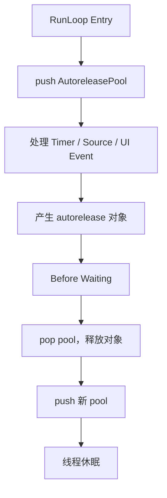
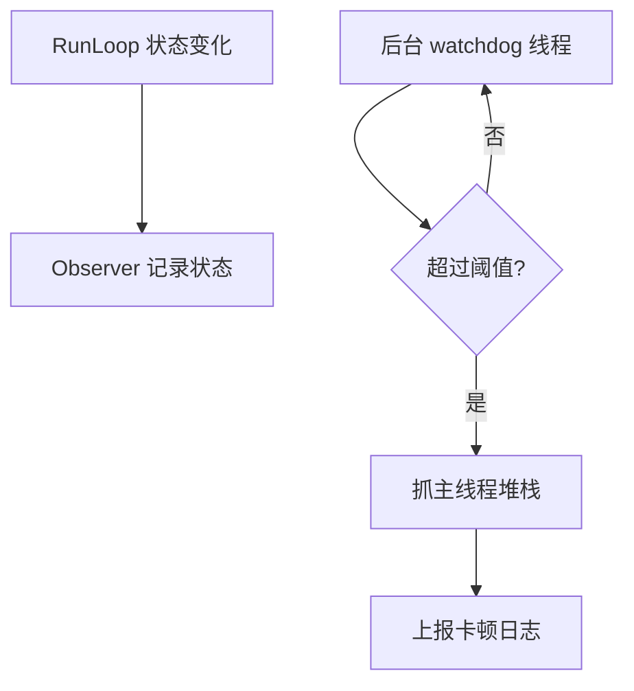

# 面试备战 iOS 08：RunLoop 事件循环与线程保活

RunLoop 是 iOS 面试里最容易背成概念的专题。只说“RunLoop 是事件循环，让线程不退出”不够。要讲清楚它为什么存在、内部有哪些事件源、Mode 为什么影响 Timer、AutoreleasePool 为什么和它有关、卡顿监控为什么能基于它做。

## 1. RunLoop 解决什么问题？

普通线程执行完函数就退出：

```objc
pthread_create(..., start, ...);
// start 执行结束，线程退出
```

但主线程不能这样。App 需要一直等待用户触摸、Timer、系统事件、端口消息。没有事件时不能空转浪费 CPU，有事件时又要及时醒来处理。

RunLoop 解决的是：

> 线程如何在“没事休眠”和“有事处理”之间循环切换。

它不是简单 while true，而是事件驱动循环。

## 2. RunLoop 和线程的关系

每个线程最多对应一个 RunLoop。

主线程 RunLoop 系统自动创建并运行。子线程 RunLoop 默认不会自动跑，需要你主动获取并运行。

```objc
NSRunLoop *runLoop = [NSRunLoop currentRunLoop];
```

这会为当前线程创建 RunLoop，但只是创建，不代表它会一直运行。

如果子线程 RunLoop 没有 Source 或 Timer，运行后也会立刻退出。

## 3. CFRunLoop 底层结构

RunLoop 核心结构可以简化理解：

```cpp
struct __CFRunLoop {
    pthread_t _pthread;
    CFMutableSetRef _commonModes;
    CFMutableSetRef _commonModeItems;
    CFRunLoopModeRef _currentMode;
    CFMutableSetRef _modes;
};
```

Mode 结构：

```cpp
struct __CFRunLoopMode {
    CFStringRef _name;
    CFMutableSetRef _sources0;
    CFMutableSetRef _sources1;
    CFMutableArrayRef _observers;
    CFMutableArrayRef _timers;
};
```

也就是说，Source、Timer、Observer 都是挂在 Mode 下面的。

这解释了一个关键问题：

> RunLoop 每次只能运行在某一个 Mode 中，只会处理这个 Mode 下的 Source、Timer、Observer。

## 4. Mode 为什么重要？

常见 Mode：

- `kCFRunLoopDefaultMode`
- `UITrackingRunLoopMode`
- `kCFRunLoopCommonModes`

当用户滚动 ScrollView 时，主线程 RunLoop 会切到 `UITrackingRunLoopMode`，保证滚动事件优先处理。

如果 Timer 只注册在 Default Mode：

```objc
[NSTimer scheduledTimerWithTimeInterval:1 target:self selector:@selector(tick) userInfo:nil repeats:YES];
```

滚动时 RunLoop 不在 Default Mode，这个 Timer 就不会触发。

解决：

```objc
[[NSRunLoop mainRunLoop] addTimer:timer forMode:NSRunLoopCommonModes];
```

注意 CommonModes 不是一个真实 Mode，而是一组 Mode 的标记。添加到 CommonModes 的 item 会被同步到被标记为 common 的 Mode 中。

## 5. Source0 和 Source1 的区别

### Source0

非基于端口的事件源，需要两步:先 `CFRunLoopSourceSignal` 标记为待处理,再 `CFRunLoopWakeUp` 唤醒 RunLoop。

常见理解：

- App 内部手动触发。
- performSelector。
- Source1 则由 mach port 收到内核消息直接唤醒,不需手动这两步。

### Source1

基于 Mach Port，由内核消息触发。

常见理解：

- 系统事件。
- 进程间通信。
- 端口消息。

区别重点：

> Source0 偏用户态，需要手动唤醒；Source1 基于内核端口，可以由内核唤醒线程。

## 6. Timer 为什么不准？

Timer 不是实时系统。

它依赖 RunLoop 被唤醒并运行到对应 Mode。如果主线程正在执行耗时任务，Timer 到点也不能立刻执行。

影响因素：

- RunLoop 当前 Mode 不匹配。
- 主线程被长任务阻塞。
- Timer tolerance。
- 系统调度。
- 低电量和后台策略。

所以 Timer 适合普通定时，不适合高精度计时。

## 7. Observer：RunLoop 状态观察

RunLoop Observer 可以监听状态：

- entry。
- before timers。
- before sources。
- before waiting。
- after waiting。
- exit。

典型应用：

- AutoreleasePool。
- 卡顿监控。
- 主线程任务调度。

## 8. AutoreleasePool 和 RunLoop

主线程中，系统会注册 Observer 管理 AutoreleasePool。准确说是**两个 Observer、三个时机**:一个监听 Entry(优先级最高)做 push;另一个监听 BeforeWaiting(release 旧 pool + push 新 pool)和 Exit(优先级最低,做最后一次 release)。

简化流程：



为什么不每个 autorelease 对象立即释放？

因为对象可能需要跨方法返回给调用方使用。RunLoop 边界提供了一个天然批处理时机。

## 9. 子线程保活怎么做？

错误写法：

```objc
dispatch_async(queue, ^{
    [[NSRunLoop currentRunLoop] run];
});
```

如果没有任何 input source，RunLoop 可能直接退出。

常见做法是添加 Port：

```objc
- (void)threadMain {
    @autoreleasepool {
        NSRunLoop *runLoop = [NSRunLoop currentRunLoop];
        [runLoop addPort:[NSMachPort port] forMode:NSDefaultRunLoopMode];
        [runLoop run];
    }
}
```

但工程上要注意：

- 如何退出线程。
- 如何避免常驻线程浪费资源。
- 是否真的需要手动线程，而不是 GCD/Operation。

## 10. RunLoop 卡顿监控原理

主线程卡顿的本质是 RunLoop 长时间不能进入下一个状态。

常见方案：

1. 在主线程注册 RunLoop Observer。
2. 记录当前状态和时间。
3. 后台线程定期检查。
4. 盯 `BeforeSources` 到下一次 `BeforeWaiting` 之间(即正在处理 source/timer/block 的区间)——这段就是主线程真正在干活的时间,停留过久即认为卡顿。
5. 抓取主线程堆栈。
6. 上报聚合分析。

简化流程：



### 局限性

RunLoop 卡顿监控不是万能：

- 阈值不好设会误报。
- 只能说明主线程卡住，不直接说明原因。
- 需要堆栈聚合才能定位。
- 对短时间掉帧不一定敏感。

更完整的性能体系应结合 FPS、主线程耗时埋点、MetricKit、线上堆栈聚合。

## 11. RunLoop 和 GCD 的关系

主队列任务最终也要在主线程执行。主线程 RunLoop 会在合适时机处理主队列相关 Source。

所以：

```objc
dispatch_async(dispatch_get_main_queue(), ^{
    // UI update
});
```

这段 block 不会凭空执行，它需要主线程有机会从事件循环中取出并执行。

如果主线程被死循环阻塞，主队列任务也无法执行。

## 12. 高频追问

### Q1：主线程为什么不会退出？

因为 UIApplication 启动后，主线程 RunLoop 持续运行。没有事件时休眠，有事件时被唤醒处理。

### Q2：Timer 滚动时为什么停？

Timer 注册在 Default Mode，滚动时 RunLoop 切到 Tracking Mode。当前 Mode 不处理 Default Mode 下的 Timer。

### Q3：CommonModes 是什么？

CommonModes 不是一个实际 Mode，而是一个标记集合。加入 CommonModes 的 Source/Timer 会被同步到所有 common mode。

### Q4：RunLoop 能保证线程安全吗？

不能。RunLoop 是事件调度机制，不是同步机制。线程安全还是要靠锁、串行队列、不可变数据等。

### Q5：为什么卡顿监控可以用 RunLoop？

因为主线程处理事件依赖 RunLoop 状态推进。如果长时间停留在某个状态，说明主线程可能被耗时任务阻塞。

## 13. 工程建议

- 不要在主线程做 IO、JSON 大解析、大图解码。
- Timer 要明确 Mode。
- 子线程保活要有退出机制。
- 卡顿监控要抓堆栈，不要只记录“卡了”。
- RunLoop 适合解释机制，不要把它当成业务调度万能工具。


## 深挖追问：RunLoop 要讲到“等待”和“被唤醒”

RunLoop 的本质不是 while 循环，而是“处理事件，没事睡眠，有事被内核或用户态唤醒”的机制。

可以把一次 `CFRunLoopRunSpecific` 简化成：

```text
通知 Entry
处理 blocks
处理 Source0
如果有 Source1 就处理
通知 BeforeTimers
通知 BeforeSources
处理 timers/sources
通知 BeforeWaiting
进入 mach_msg 等待
被 port/timer/dispatch 唤醒
通知 AfterWaiting
处理唤醒原因
通知 Exit
```

Source0 和 Source1 的区别要答成“谁负责唤醒”：

- Source0 是用户态事件源，不自带内核唤醒能力，需要手动 signal + wakeup。
- Source1 基于 Mach port，可以由内核消息唤醒 RunLoop，例如系统事件、端口消息。

RunLoop 和 GCD 的关系：

- 主队列任务会和主线程 RunLoop 协作，在合适时机被 drain。
- `dispatch_async(dispatch_get_main_queue())` 不是立刻执行，而是排进主队列，等待主线程有机会处理。
- 子线程没有默认活跃 RunLoop，除非你显式 run。

Timer 不准的深层原因：

1. Timer 依赖 RunLoop 运行，线程忙就无法按时处理。
2. 当前 Mode 不包含 Timer 时不会触发。
3. 系统有 tolerance/coalescing，可能合并定时器降低功耗。
4. Timer 回调本身在 RunLoop 线程执行，重活会影响后续事件。

卡顿监控被追问时：

> 如果主线程长时间停在 AfterWaiting 到 BeforeWaiting 之间，说明它醒来后一直在处理任务，没有及时回到睡眠，可能有主线程耗时、锁等待、同步 I/O 或布局绘制过重。RunLoop 监控只能定位“主线程没回到某个状态”，具体原因还要结合堆栈采样。

## 一句话总结

RunLoop 是线程的事件调度器，Mode 决定当前处理哪些事件，Observer 暴露状态边界，AutoreleasePool 和卡顿监控都建立在这些边界之上。
