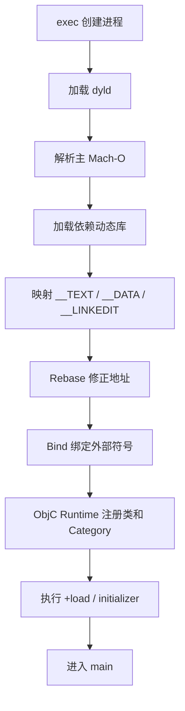

# 面试备战 iOS 10：启动优化、dyld、pre-main 与 main 后

启动优化是综合题。它同时考 Mach-O、dyld、Runtime、动态库、`+load`、主线程、首屏渲染、埋点和工程治理。

如果只说“懒加载、异步初始化、减少 SDK”，答案太浅。

高分回答必须先拆阶段：

```text
进程创建 -> dyld 加载 -> Runtime 初始化 -> main -> AppDelegate -> 首页创建 -> 首帧 -> 可交互
```

## 1. 启动优化先分阶段

iOS 启动通常分两大段：

```text
pre-main：main 函数之前
main 后：main 函数之后到首屏可交互
```

### pre-main 主要是谁负责？

主要是系统和 dyld：

- 加载主 Mach-O。
- 加载依赖动态库。
- 映射内存页。
- rebase。
- bind / lazy bind。
- ObjC Runtime 初始化。
- 类和 Category 注册。
- 执行 `+load`。
- 执行 C/C++ 静态初始化。

### main 后主要是谁负责？

主要是 App 自己：

- `UIApplicationMain`。
- AppDelegate / SceneDelegate。
- 三方 SDK 初始化。
- 业务服务启动。
- 首页路由。
- 首屏 ViewController 创建。
- 数据请求和缓存读取。
- 首帧渲染。

## 2. pre-main 底层发生了什么？

简化流程：



## 3. Mach-O 和启动有什么关系？

Mach-O 里有 dyld 启动需要的信息：

- Load Commands：告诉 dyld 依赖哪些库、segment 怎么映射。
- `__TEXT`：代码和只读数据。
- `__DATA`：可写数据、指针、ObjC 元数据。
- `__LINKEDIT`：符号表、字符串表、重定位信息。
- `__objc_classlist`：类列表。
- `__objc_catlist`：Category 列表。

dyld 必须根据这些信息把程序装配起来。

Mach-O 越复杂、动态库越多、ObjC 元数据越多，pre-main 成本通常越高。

## 4. Rebase 和 Bind 是什么？

### Rebase

因为 ASLR，Mach-O 映射到内存的实际地址可能和编译期预期地址不同。

Rebase 要修正内部指针：

```text
真实地址 = 编译期地址 + slide
```

rebase 主要发生在 `__DATA`(含 `__DATA_CONST`):修改指针会让原本可共享的页变成脏页(写时复制),增加内存和启动成本。这也是“动态库多→脏页多→启动慢”的底层一环。

### Bind

Bind 是绑定外部符号。

例如主工程调用某个动态库函数，启动时 dyld 要把符号引用绑定到真实地址。

动态库越多、符号越多，bind 成本越明显。

## 5. 动态库为什么影响启动？

每个动态库都可能带来：

- 文件加载。
- 依赖解析。
- segment 映射。
- rebase/bind。
- ObjC 类注册。
- initializer。

所以启动敏感工程会控制动态库数量。

但不是说动态库一定不好。动态库有模块边界、共享和部署价值。优化要看数据，不是粗暴全改静态库。

## 6. ObjC Runtime 初始化成本

ObjC 在启动时要处理：

- 类注册。
- Category 合并。
- selector 注册。
- protocol 注册。
- `+load` 调用。

Category 多、类多、`+load` 多，都会影响启动。

### `+load` 为什么危险？

`+load` 特点：

- main 前执行。
- 类和 Category 加载时自动调用。
- 不懒。
- 顺序复杂。
- 在启动关键路径上。

所以 `+load` 里不能做：

- 网络。
- 文件 IO。
- 大量计算。
- 锁等待。
- 业务初始化。
- Swizzling 之外的重逻辑。

### `+initialize` 呢？

`+initialize` 是类第一次收到消息前调用，懒触发。

但也不能滥用，因为第一次触发可能发生在用户操作关键路径上，导致局部卡顿。

## 7. C++ 静态初始化

全局 C++ 对象构造、`__attribute__((constructor))` 函数也可能在 main 前执行。

排查启动慢时要搜索：

```text
+load
__attribute__((constructor))
static object
global initializer
```

## 8. main 后优化：目标不是“初始化完”，而是“首屏可交互”

main 后优化要围绕首屏路径。

典型拆分：

```text
main
-> UIApplicationMain
-> didFinishLaunching
-> 创建 window
-> 创建 rootViewController
-> 首页 viewDidLoad
-> viewDidAppear
-> 首帧渲染
-> 用户可交互
```

优化目标不是让所有 SDK 都准备好，而是让首屏尽快展示并响应。

## 9. 初始化分级

把启动任务分成四类：

| 类型 | 例子 | 策略 |
|---|---|---|
| 启动必须 | 崩溃采集、基础配置 | 保留但压缩耗时 |
| 首屏必须 | 首页依赖服务 | 优先执行 |
| 首屏后必须 | 埋点补充、非首屏 SDK | 延后 |
| 按需 | 分享、支付、地图 | 使用时初始化 |

## 10. 主线程减负

main 后启动慢常见原因：

- 同步读取大文件。
- 数据库迁移。
- JSON 大解析。
- 图片解码。
- SDK 串行初始化。
- 首页复杂布局。
- 首屏发起太多同步依赖。

优化：

- IO 异步化。
- 缓存预计算。
- SDK 分阶段。
- 首页骨架屏。
- 数据请求和 UI 创建并行。
- 非首屏模块按需加载。

注意：异步不是万能。如果异步任务抢 CPU 或锁，也会影响首屏。

## 11. 二进制重排为什么能优化冷启动？

冷启动时，启动路径上的函数如果分散在很多内存页，会产生更多 page fault。

二进制重排通过 order file 把启动阶段高频函数排列到更集中的位置：

```text
收集启动符号 -> 生成 order file -> 链接重排 -> 减少启动页错误
```

怎么“收集启动符号”是关键追问点：主流做法是用 clang 的 `-fsanitize-coverage=func,trace-pc-guard` 在每个函数入口插桩，记录启动期函数的真实调用顺序，导出成 order file，再通过链接器 `-order_file` 参数让链接时按这个顺序排列符号。

它主要优化冷启动代码页加载，不解决业务初始化过重。

## 12. 怎么做启动埋点？

至少要拆：

- 进程开始到 main。
- main 到 didFinishLaunching。
- didFinishLaunching 内各 SDK。
- rootVC 创建。
- 首页 viewDidLoad。
- 首页 viewDidAppear。
- 首帧。
- 可交互。

线上指标要区分：

- 冷启动。
- 热启动。
- 后台恢复。
- 首次安装后启动。
- 不同设备和系统版本。

并且看分位数：

- P50。
- P90。
- P95。
- P99。

平均值意义有限。

## 13. 高频追问

### Q1：pre-main 包括哪些阶段？

dyld 加载 Mach-O 和动态库，完成 rebase/bind，初始化 ObjC Runtime，注册类和 Category，执行 `+load` 和静态初始化，然后进入 main。

### Q2：动态库多为什么慢？

每个动态库都要被 dyld 加载、映射、链接、初始化，还可能注册 ObjC 元数据。库多会增加 pre-main 工作量。

### Q3：`+load` 和 `+initialize` 区别？

`+load` 在类加载时自动执行，发生在 main 前，不懒。`+initialize` 在类第一次收到消息前懒执行。

### Q4：启动优化怎么证明有效？

用同口径埋点对比优化前后的冷启动 P50/P90/P95/P99，最好灰度验证，并按设备、系统、版本拆分。

### Q5：异步初始化有什么坑？

可能导致首次使用卡顿、依赖未准备好、线程竞争、初始化顺序错乱。需要明确任务依赖和兜底策略。

### Q6：dyld3、dyld4 做了什么优化？

传统 dyld2 每次启动都要重新解析依赖、查找符号。dyld3（iOS 13）引入**启动闭包（launch closure）**，把依赖图、符号地址、ObjC 初始化信息等解析结果缓存下来，二次启动直接读闭包，跳过大量解析。dyld4（iOS 15）进一步统一 dyld2/3，闭包内建到 dyld_shared_cache 里。

配套的还有 **chained fixups**（iOS 15+ / 新工具链默认）：把原来分开的 rebase 和 bind 合并成 `__LINKEDIT` 里的一条 fixup chain，减少启动时要处理的元数据。所以“先 rebase 再 bind”是对老二进制的描述，新二进制上两者已经合并。

## 14. 工程治理

启动优化不是一次性活动，要有长期机制：

- 新增 SDK 必须说明初始化时机。
- 禁止业务随意写 `+load`。
- CI 检查动态库数量和 LinkMap 变化。
- 启动耗时线上告警。
- 版本间启动指标对比。
- 首页关键路径代码 owner 明确。


## 深挖追问：启动优化要拆“装载成本”和“首屏路径”

pre-main 不只是“main 前”。可以按 dyld 和 Runtime 拆：

```text
加载主程序和动态库
  -> 解析 Mach-O load commands
  -> 映射 __TEXT/__DATA
  -> rebase/bind/lazy bind/weak bind
  -> ObjC class/category/protocol 注册
  -> 调用 +load、C++ static initializer
  -> 进入 main
```

继续追问 dyld3/dyld4：

> 新 dyld 的核心方向是把很多解析工作前移或缓存化，例如 closure/fixup 信息，让启动时少做重复解析。但 App 自己的动态库数量、ObjC 元数据、`+load`、page fault 和首屏主线程任务仍然会影响启动。

Page Fault 要会接：

- Mach-O 只是文件，启动时按需映射到虚拟内存。
- 首次访问某页会触发 page fault。
- iOS 上代码签名校验、解压/解密、物理页映射都可能带来成本。
- 二进制重排的目标是让启动路径函数更集中，减少冷启动早期访问的页数。

测量陷阱：

1. Debug 包不能代表 Release。
2. 热启动不能代表冷启动。
3. 模拟器不能代表真机。
4. 平均值不够，要看 P50/P90/P99。
5. 只看 main 前不够，用户感知是首屏可交互。

工程治理可以这样答：

> 我会把启动任务分成 must before first frame、before interaction、idle、background 四级。同步 I/O、数据库迁移、SDK 初始化、图片解码、Flutter Engine 预热都要按收益和风险分级。每个优化必须有埋点口径、AB 或版本对比、异常回滚策略。

`+load` 被追问：

- 类和 Category 的 `+load` 都可能执行。
- 执行早，顺序复杂，影响 pre-main。
- 里面做 I/O、锁、网络、复杂注册都危险。
- 可延迟的注册应迁到显式初始化或懒加载。

## 一句话总结

iOS 启动优化的核心是拆阶段：pre-main 看 dyld、Mach-O、动态库、ObjC 元数据和 `+load`，main 后看首屏关键路径、主线程任务和业务初始化治理。
