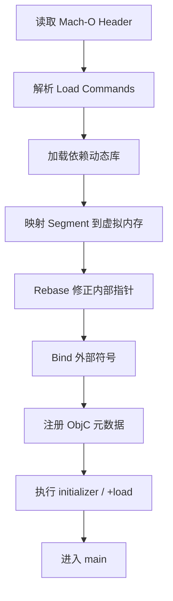

# 面试备战 iOS 11：Mach-O、静态库动态库与二进制重排

Mach-O 是 iOS App 的二进制载体。启动优化、动态库治理、符号化、包体分析、二进制重排，都绕不开它。

如果面试只说“Mach-O 是可执行文件格式”，不够。要能讲清楚：

```text
Mach-O 里有什么 -> dyld 如何加载 -> 静态库/动态库影响什么 -> 二进制重排为什么能减少 page fault
```

## 1. Mach-O 三层结构

Mach-O 可以从三层看：

```text
Header
Load Commands
Segment / Section Data
```

### Header

描述文件基本信息：

- CPU 架构。
- 文件类型。
- Load Commands 数量。
- flags。

常见文件类型：

- executable。
- dylib。
- bundle。
- object file。

### Load Commands

告诉 dyld 怎么加载这个文件。

常见信息：

- 依赖哪些动态库。
- 入口点在哪里。
- Segment 如何映射。
- 符号表在哪里。
- dyld info 在哪里。

### Segment / Section

Segment 是内存映射单位，Section 是更细的数据分类。

常见 Segment：

| Segment | 内容 |
|---|---|
| `__PAGEZERO` | 起始的不可访问页，用来捕获空指针/野指针访问 |
| `__TEXT` | 代码、只读常量，只读且可跨进程共享 |
| `__DATA_CONST` | rebase 后即只读的指针（如部分 ObjC 元数据、`__got`），用 mprotect 标只读以减少脏页 |
| `__DATA` | 可写数据、指针 |
| `__LINKEDIT` | 符号表、字符串表、重定位信息 |

常见 Section：

| Section | 内容 |
|---|---|
| `__text` | 机器指令 |
| `__cstring` | C 字符串 |
| `__objc_classlist` | ObjC 类列表 |
| `__objc_catlist` | Category 列表 |
| `__objc_selrefs` | selector 引用 |

## 2. dyld 怎么使用 Mach-O？

启动时，dyld 根据 Mach-O 做这些事：



这就是 Mach-O 和启动优化的直接关系。

## 3. 静态库是什么？

静态库本质是一堆目标文件的归档，链接时会被合进最终 Mach-O。

特点：

- 运行时不需要单独加载这个库。
- 代码进入主二进制。
- 启动时少一个动态库加载成本。
- 可能增加主包体和链接产物体积。

## 4. 动态库是什么？

动态库是运行时由 dyld 加载的 Mach-O。

特点：

- 有独立 Mach-O。
- 启动时需要加载、映射、链接。
- 模块边界清晰。
- 可共享部分代码页。
- 过多会增加 pre-main 成本。

## 5. 静态库一定比动态库好吗？

不是。

对启动：

- 静态库通常减少动态加载成本。
- 动态库过多会拖慢 dyld。

对工程：

- 动态库模块边界更清晰。
- 静态库可能让主二进制膨胀。
- 多 target 共享、插件化、发布方式都会影响选择。

架构回答要讲取舍：

> 启动敏感路径上要控制动态库数量，但大型工程不能只为启动把所有边界打平，需要结合包体、编译、团队协作和发布策略。

## 6. 符号和 LinkMap

LinkMap 记录链接产物中：

- object file。
- section。
- symbol。
- 地址。
- 大小。

用途：

- 分析包体大头。
- 找重复依赖。
- 找大符号。
- 分析某个库贡献体积。

包体治理不能只靠“删图片”，代码段、三方库、静态链接重复都要看。

## 7. 二进制重排为什么有效？

冷启动时，不是整个 Mach-O 一次性读入物理内存。系统按页加载。启动路径函数如果分散在很多页，会造成更多 page fault。

二进制重排目标：

> 把启动阶段高频访问函数排在一起，让冷启动访问更少内存页。

流程：

```text
采集启动符号顺序 -> 生成 order file -> 链接时按顺序排列 -> 减少 page fault
```

采集手段常用 clang 插桩 `-fsanitize-coverage=func,trace-pc-guard` 记录启动期函数调用顺序，再用链接器 `-order_file` 应用。减少的主要是 `__TEXT` 代码页从磁盘/共享缓存换入（page-in）的次数。

## 8. 二进制重排不能解决什么？

它主要优化代码页局部性，不能解决：

- SDK 初始化太重。
- 主线程 IO。
- 首页布局复杂。
- 网络慢。
- 动态库数量过多。
- `+load` 做重活。

所以它是启动优化的一环，不是万能药。

## 9. 高频追问

### Q1：Mach-O 里和 ObjC 有关的 section？

常见有 `__objc_classlist`、`__objc_catlist`、`__objc_selrefs`、`__objc_protolist`、`__objc_const` 等，Runtime 会读取这些元数据注册类、Category、selector。

### Q2：动态库为什么影响 pre-main？

dyld 要加载每个动态库，映射 segment，处理 rebase/bind，执行初始化，还要注册 ObjC 元数据。库越多，依赖越复杂，pre-main 成本越高。

### Q3：二进制重排的本质？

改善启动路径代码的内存局部性，减少冷启动 page fault。

### Q4：LinkMap 怎么用于包体优化？

通过 symbol 和 object file 大小定位包体贡献，再判断是业务代码、三方库、模板膨胀、重复链接还是资源问题。

## 工程建议

- 启动优化先看动态库数量和 `+load`。
- 包体优化要看 LinkMap。
- 二进制重排只针对冷启动验证。
- 静态/动态库选择要结合工程边界。
- ObjC Category 过多也会增加 Runtime 元数据处理。


## 深挖追问：Mach-O 不是文件格式题，是启动、链接和包体题

Mach-O 三件事要连起来：

1. Header 告诉系统这是什么架构、文件类型、load command 数量。
2. Load Commands 告诉 dyld 如何映射、依赖哪些库、入口在哪里、符号表在哪里。
3. Segment/Section 承载真实代码和数据，例如 `__TEXT,__text`、`__DATA,__objc_classlist`、`__DATA,__objc_selrefs`。

ObjC 相关 section 被追问时，可以说：

- `__objc_classlist`：类列表。
- `__objc_catlist`：Category 列表。
- `__objc_protolist`：协议列表。
- `__objc_selrefs`：selector 引用。
- `__objc_classrefs`：类引用。

dyld/Runtime 会利用这些元数据完成类注册、Category 合并、selector uniquing 等工作。

静态库 vs 动态库不要绝对化：

| 维度 | 静态库 | 动态库 |
|---|---|---|
| 链接 | 编译链接进主二进制 | 运行时加载 |
| 启动 | 少一份动态加载成本 | 依赖加载、符号绑定有成本 |
| 复用 | 多 App/Extension 复用弱 | 可共享，但 iOS App 内仍受签名和包结构约束 |
| 包体 | 可能重复链接 | 可能增加 framework 结构成本 |
| 隔离 | 编译期合并 | 边界更清晰 |

二进制重排继续追问：

> 它不是让代码更快执行，而是减少冷启动早期触达的 page 数和 page fault 成本。通过采集启动路径函数顺序，生成 order file，让 linker 把热点函数排在相邻页面。

风险：

- 采集样本不准会优化错路径。

---

## 🔬 深度扩展：Mach-O Header与Segment的完整结构

### 扩展1：Mach-O Header详解

**结构体定义：**
```c
struct mach_header_64 {
    uint32_t magic;        // 0xfeedfacf (64位)
    cpu_type_t cputype;    // CPU类型 (ARM64)
    cpu_subtype_t cpusubtype;
    uint32_t filetype;     // MH_EXECUTE/MH_DYLIB/MH_BUNDLE
    uint32_t ncmds;        // Load Commands数量
    uint32_t sizeofcmds;   // Load Commands总大小
    uint32_t flags;        // 标志位
    uint32_t reserved;
};
```

**filetype类型：**
- `MH_EXECUTE`：可执行文件
- `MH_DYLIB`：动态库
- `MH_BUNDLE`：插件
- `MH_OBJECT`：.o目标文件

### 扩展2：Load Commands的关键命令

**LC_SEGMENT_64：段加载**
```c
struct segment_command_64 {
    uint32_t cmd;          // LC_SEGMENT_64
    uint32_t cmdsize;
    char segname[16];      // __TEXT, __DATA
    uint64_t vmaddr;       // 虚拟内存地址
    uint64_t vmsize;       // 虚拟内存大小
    uint64_t fileoff;      // 文件偏移
    uint64_t filesize;     // 文件大小
    // ...
};
```

**LC_LOAD_DYLIB：依赖库**
```c
struct dylib_command {
    uint32_t cmd;          // LC_LOAD_DYLIB
    uint32_t cmdsize;
    struct dylib {
        uint32_t name;     // 库路径
        uint32_t timestamp;
        uint32_t current_version;
        uint32_t compatibility_version;
    } dylib;
};
```

### 扩展3：__TEXT和__DATA段的Section

**__TEXT段（只读）：**
- `__text`：机器码
- `__stubs`：符号桩
- `__stub_helper`：桩辅助
- `__cstring`：C字符串
- `__objc_methname`：ObjC方法名
- `__objc_classname`：ObjC类名

**__DATA段（可写）：**
- `__data`：已初始化全局变量
- `__bss`：未初始化全局变量
- `__objc_classlist`：类列表
- `__objc_catlist`：Category列表
- `__objc_selrefs`：selector引用
- `__objc_classrefs`：类引用

### 扩展4：符号表与动态链接

**符号表结构：**
```c
struct nlist_64 {
    uint32_t n_strx;    // 符号名在字符串表的偏移
    uint8_t n_type;     // 符号类型
    uint8_t n_sect;     // section索引
    uint16_t n_desc;    // 描述
    uint64_t n_value;   // 符号地址/值
};
```

**Bind操作：**
```text
外部符号引用（如printf）：
1. __DATA段保留占位符
2. dyld读取bind info
3. 查找符号在动态库中的地址
4. 写入占位符位置
```

### 扩展5：静态库vs动态库的链接差异

**静态库（.a）：**
```text
编译时：
1. 提取.a中需要的.o文件
2. 合并到主二进制
3. 符号直接解析

结果：
- 包体变大（所有.o都打进去）
- 启动快（无dyld加载）
- 无法共享（多target重复）
```

**动态库（.dylib/.framework）：**
```text
编译时：
1. 记录依赖关系（LC_LOAD_DYLIB）
2. 符号标记为外部引用

运行时：
1. dyld加载动态库
2. Rebase修正地址
3. Bind绑定符号

结果：
- 包体小（不合并代码）
- 启动慢（dyld加载+绑定）
- 可共享（Extension共用）
```

### 扩展6：dyld的符号查找顺序

**Flat Namespace（扁平命名空间）：**
```text
查找顺序：
1. 主二进制
2. 按依赖顺序查找所有动态库
3. 找到第一个匹配的符号
```

**Two-Level Namespace（两级命名空间，默认）：**
```text
查找顺序：
1. 符号记录了来自哪个库
2. 直接在该库中查找
3. 更快、更安全
```

### 扩展7：LinkMap的实战分析

**LinkMap包含：**
```text
# Object files:
[0] linker synthesized
[1] /path/to/main.o
[2] /path/to/MyClass.o

# Sections:
# Address    Size       Segment  Section
0x100001000  0x1234    __TEXT   __text
0x100002234  0x5678    __DATA   __data

# Symbols:
# Address    Size       File     Name
0x100001000  0x100     [1]      _main
0x100001100  0x200     [2]      -[MyClass method]
```

**优化用法：**
```bash
# 按Size排序，找最大的符号
grep "^0x" LinkMap.txt | awk '{print $2, $4}' | sort -rn | head -20

# 统计各.o文件贡献
grep "\.o" LinkMap.txt | awk '{sum[$4]+=$2} END {for(i in sum) print sum[i], i}' | sort -rn
```

### 扩展8：Mach-O工具链

**otool（查看结构）：**
```bash
otool -h MyApp        # Header
otool -l MyApp        # Load Commands
otool -L MyApp        # 依赖库
otool -tV MyApp       # 反汇编
```

**nm（查看符号）：**
```bash
nm -nm MyApp          # 符号表
nm -u MyApp           # 未定义符号（外部引用）
nm -A MyApp           # 显示来源文件
```

**size（查看大小）：**
```bash
size -m -x MyApp      # 各段大小
```

---

## 补充总结

Mach-O结构的深度记忆点：

1. **Header**：magic、cputype、filetype、ncmds标识文件基本信息
2. **Load Commands**：LC_SEGMENT_64加载段、LC_LOAD_DYLIB依赖库
3. **__TEXT段**：只读，包含代码、字符串、ObjC元数据名称
4. **__DATA段**：可写，包含全局变量、ObjC类列表、selector引用
5. **符号表**：nlist_64结构，记录符号名、类型、地址
6. **静态vs动态**：静态合并进主二进制，动态运行时加载
7. **LinkMap**：分析包体贡献、优化大小
8. **工具链**：otool查结构、nm查符号、size查大小

面试追问时要能讲出：
- Mach-O的三层结构（Header → Load Commands → Segments/Sections）
- __TEXT和__DATA的Section列表（__text、__objc_classlist等）
- 静态库和动态库的链接差异（编译时合并vs运行时加载）
- LinkMap的分析方法（按Size排序、统计.o贡献）
- 版本迭代后 order file 会过期。
- Swift/ObjC/C++ 符号混合时要保证符号名匹配。
- 只优化冷启动早期路径，不解决 `+load` 重活、主线程 I/O 和 SDK 初始化。

包体优化回答：

> LinkMap 可以定位目标文件和符号贡献，结合 `otool`、`nm`、App Thinning、资源扫描，拆代码、图片、字体、动态库、重复依赖几个维度治理。

## 一句话总结

Mach-O 是 dyld 的启动地图；静态库、动态库和二进制重排，本质都在影响二进制如何被加载、链接和分页访问。
