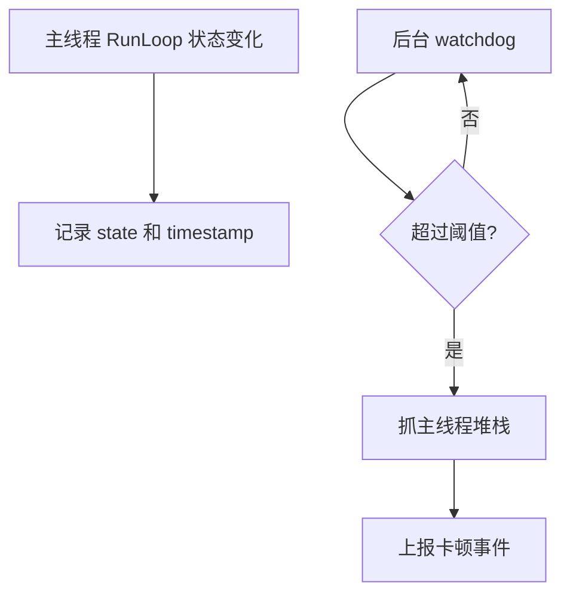

# 面试备战 iOS 12：性能优化、卡顿、内存、包体与监控

性能优化不是“我做过启动优化、卡顿优化、内存优化”。面试官真正要听的是：

- 你怎么定义问题？
- 怎么采集指标？
- 怎么定位根因？
- 怎么验证收益？
- 怎么防止下个版本劣化？

性能优化的核心不是技巧，而是闭环。

## 1. 先建立指标体系

常见指标：

| 类型 | 指标 |
|---|---|
| 启动 | 冷启动、热启动、首屏、首帧 |
| 卡顿 | 卡顿次数、卡顿时长、主线程堆栈 |
| 内存 | 峰值、均值、OOM 率、泄漏 |
| 崩溃 | crash rate、top crash |
| 包体 | 安装包、下载包、解压后体积 |
| 网络 | DNS、TCP、TLS、TTFB、总耗时 |
| 耗电 | CPU、定位、后台任务、网络唤醒 |

必须看分位数：

- P50：普通用户。
- P90/P95：较差体验。
- P99：长尾问题。

平均值会掩盖长尾。

## 2. 卡顿的底层定义

屏幕 60Hz 时，每帧约 16.67ms。主线程如果长时间被占用，无法及时处理输入、布局、绘制提交，就会掉帧或卡顿。

注意 ProMotion 设备（iPhone 13 Pro 起）支持最高 120Hz，每帧预算收紧到约 8.3ms，且是 10–120Hz 自适应刷新。所以帧预算不要写死 16.67ms，读 `CADisplayLink` 的 `maximumFramesPerSecond` / `targetTimestamp` 更可靠。

常见主线程阻塞：

- 同步 IO。
- JSON 大解析。
- 图片解码。
- 数据库操作。
- 锁等待。
- 大量 Auto Layout。
- 文本排版。
- WebView 初始化。
- 三方 SDK 同步任务。

## 3. RunLoop 卡顿监控

利用 RunLoop Observer 监听主线程状态：

- before sources。
- before waiting。
- after waiting。

后台 watchdog 定期检查主线程是否长时间停留在某个状态。

简化模型：



关键不是发现“卡了”，而是抓到当时主线程在干什么。

## 4. 卡顿堆栈如何分析？

单条堆栈价值有限，要做聚合。

聚合维度：

- 栈顶函数。
- 页面。
- 业务场景。
- 设备型号。
- 系统版本。
- App 版本。
- 卡顿时长。

例如发现 P95 卡顿集中在：

```text
HomeViewController viewDidAppear
 -> loadLocalCache
 -> NSJSONSerialization JSONObjectWithData
```

就能定位到首页主线程 JSON 解析。

## 5. 内存问题分两类

### 泄漏

对象不再需要，但仍被持有。

常见来源：

- Block 循环引用。
- Timer/CADisplayLink。
- Notification。
- delegate strong。
- 单例缓存。
- 异步任务持有页面。

### 峰值过高

对象最终会释放，但短时间占用太高。

常见来源：

- 大图解码。
- 批量 JSON。
- 循环 autorelease 对象。
- 视频/PDF/WebView。
- 列表预加载过多。

泄漏和峰值处理方式不同。

## 6. OOM 怎么监控？

OOM 通常不是普通 crash，进程可能直接被系统杀死，无法像 NSException 一样捕获。

常见判断：

1. App 启动时读取上次退出信息。
2. 如果上次没有正常退出标记。
3. 排除 crash、用户主动杀、系统升级等情况。
4. 结合前台状态、内存曲线、页面路径判断疑似 OOM。

更高阶可以结合 MetricKit：iOS 14+ 的 `MXAppExitMetric` 能直接拿到进程退出原因分类（含前台/后台 OOM、watchdog 终止、正常退出等），比纯靠“上次没正常退出”的排除法更准。

OOM 分析重点：

- 发生前页面。
- 内存峰值。
- 图片/视频/WebView。
- 设备内存等级。
- 是否后台转前台。

## 7. 包体治理

包体不是只删图片。

拆分：

- Mach-O 代码段。
- Swift/ObjC 符号。
- 静态库重复链接。
- 动态库。
- 图片资源。
- 音视频。
- 字体。
- 无用 bundle。

工具：

- LinkMap。
- `otool`。
- `nm`。
- 资源扫描。
- 重复文件 hash。
- App Thinning 分析。

## 8. 性能优化闭环

标准流程：

```text
定义指标 -> 采集数据 -> 聚合分析 -> 定位根因 -> 制定方案 -> 灰度验证 -> 全量发布 -> 告警防回退
```

没有线上验证的优化，只是本地感觉。

## 9. 高频追问

### Q1：怎么监控卡顿？

RunLoop Observer 记录主线程状态，后台线程检测超时，超时抓主线程堆栈并上报。结合 FPS、耗时埋点和线上聚合分析。

### Q2：OOM 能不能 try-catch？

不能。OOM 多数是系统 Jetsam 杀进程，不是 Objective-C 异常。要通过上次退出状态、内存曲线和 MetricKit 间接判断。

### Q3：内存泄漏和内存峰值区别？

泄漏是对象不释放，峰值是短时间占用过高但之后可能释放。泄漏用持有关系分析，峰值看大对象、批处理和 autoreleasepool。

### Q4：如何证明性能优化有效？

看同口径线上指标，按版本和灰度对比 P50/P90/P95/P99，同时确认没有引入 crash、业务失败或体验副作用。

## 工程建议

- 性能指标要版本化。
- 每个优化要有 before/after。
- 不要只看本地 Debug。
- 卡顿必须抓堆栈。
- OOM 要结合页面路径和内存曲线。
- 包体治理要自动化进 CI。


## 深挖追问：性能题一定要形成闭环

性能优化不能只说“用了 Instruments”。要按闭环回答：

```text
定义指标
  -> 采集数据
  -> 定位瓶颈
  -> 制定方案
  -> 灰度上线
  -> 监控回归
  -> 固化规范
```

卡顿题要区分：

- CPU 主线程耗时：布局、JSON、同步 I/O、锁等待。
- GPU/Raster 压力：离屏渲染、复杂阴影、模糊、大图纹理。
- RunLoop 长时间不休眠：可以采样主线程堆栈。
- 帧率低但主线程不高：可能是渲染服务、GPU、纹理上传或 Flutter raster 线程。

内存题要拆：

| 类型 | 例子 | 工具 |
|---|---|---|
| 泄漏 | VC 退出不释放、Block 环 | Leaks、Memory Graph |
| 峰值 | 大图解码、批量 JSON、autorelease | Allocations、VM Tracker |
| Native 外部内存 | CVPixelBuffer、Metal texture | VM Tracker、Jetsam 日志 |
| 缓存过大 | 图片、WebView、数据库 | 自定义水位监控 |

包体题不要只说删除图片：

- LinkMap 找代码贡献。
- `nm`/`otool` 看符号和动态库。
- 资源去重、WebP/HEIF、按需下载。
- 字体子集化。
- 移除无用架构和重复依赖。
- Swift 泛型/模板膨胀、调试符号、dSYM 分离。

面试官问“怎么证明优化有效”：

> 我会先定义同一口径，比如冷启动 P90、首屏可交互、单页面峰值 RSS、卡顿率、OOM 率。优化前后用同机型、同版本、同数据集对比，并在灰度中看线上分位数，而不是只看本地一次 Instruments。

最容易加分的是主动说副作用：

- 降内存可能增加 CPU 或 I/O。
- 降包体可能增加首次下载资源成本。
- 异步化可能引入时序问题。
- 缓存变小可能降低命中率。

## 一句话总结

iOS 性能优化的核心不是“会几个技巧”，而是用指标发现问题，用底层机制定位根因，用工程闭环保证收益不回退。
